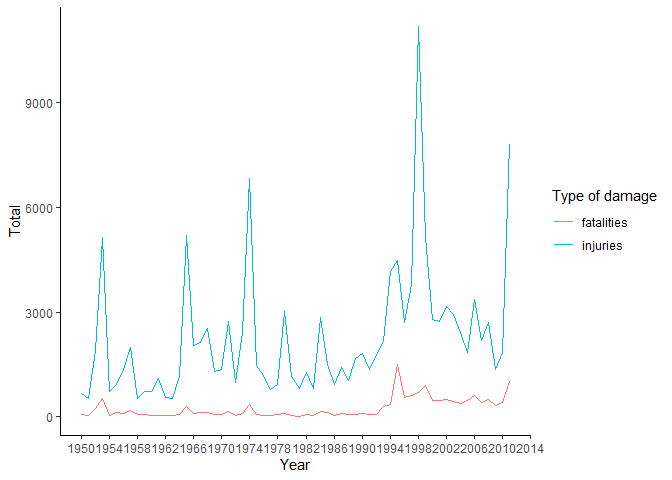
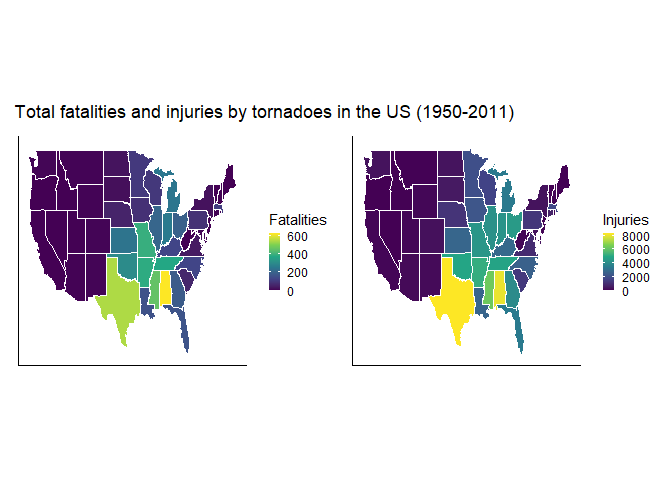

## Synopsis

## Packages and configurations


```r
Sys.setlocale("LC_ALL","English")
```

```
## [1] "LC_COLLATE=English_United States.1252;LC_CTYPE=English_United States.1252;LC_MONETARY=English_United States.1252;LC_NUMERIC=C;LC_TIME=English_United States.1252"
```

```r
library(tidyverse)
library(janitor)
library(lubridate)
require(maps)
require(viridis)
library(patchwork)
```

## Data Processing
### Importing
Initially, we downloaded the data from the link indicated on the Coursera website and then save it in a tibble called noaa_data. We use the clean_names function from the janitor package, so we don't have to deal with capitalized words.


```r
if(!file.exists("./data")){dir.create("./data")}

url <- 
  "https://d396qusza40orc.cloudfront.net/repdata%2Fdata%2FStormData.csv.bz2"

destfile <- "./data/StormData.csv.bz2"

download.file(url = url,
              destfile = destfile)

noaa_data <- 
  read_csv("./data/StormData.csv.bz2") %>% 
  clean_names()
```

### Wrangling
We took an initial look at the data to see which variables would help answer the questions posed in this Assignment. We decided to select the variables indicated in the code below. In addition to the obvious variables to deal with the theme, we kept those that could help localize the events along the US and allow us to make a time series. 

We prepared the variables for analysis, particularly evtype, whose encoding was messy. From the website of the National Severe Storms Laboratory - NOAA (https://www.nssl.noaa.gov/education/svrwx101/), we gather information to try to make a better encoding. To do so, we use the text patterns in the existing categories and check others categories with high fatalities or injuries that were not cataloged as severe weather. To one can be able to evaluate the new encoding, we kept the evtype variable and created a new one called evtype_rcd. We also made the cleaned exponent variables and calculated new variables for property and crop damage. Finally, we assessed missing values in the variables of interest.

- bgn_date - date the event occurred  
- state_2 - State where the event occurred
- evtype - The type of extreme weather event
- injuries - The number of injuries associated with the event
- fatalities - The number of fatalities associated with the event
- propdmg - Significant digits for the amount of proprety damage
- propdmgexp - Magnitude of the property damage (dollars)
- cropdmg - Significant figures for the amount of crop damage
- cropdmgexp - Magnitude of the crop damage (dollars)


```r
noaa_data %>% 
  glimpse()
```

```
## Rows: 902,297
## Columns: 37
## $ state       <dbl> 1, 1, 1, 1, 1, 1, 1, 1, 1, 1, 1, 1, 1, 1, 1, 1, 1, 1, 1, 1~
## $ bgn_date    <chr> "4/18/1950 0:00:00", "4/18/1950 0:00:00", "2/20/1951 0:00:~
## $ bgn_time    <chr> "0130", "0145", "1600", "0900", "1500", "2000", "0100", "0~
## $ time_zone   <chr> "CST", "CST", "CST", "CST", "CST", "CST", "CST", "CST", "C~
## $ county      <dbl> 97, 3, 57, 89, 43, 77, 9, 123, 125, 57, 43, 9, 73, 49, 107~
## $ countyname  <chr> "MOBILE", "BALDWIN", "FAYETTE", "MADISON", "CULLMAN", "LAU~
## $ state_2     <chr> "AL", "AL", "AL", "AL", "AL", "AL", "AL", "AL", "AL", "AL"~
## $ evtype      <chr> "TORNADO", "TORNADO", "TORNADO", "TORNADO", "TORNADO", "TO~
## $ bgn_range   <dbl> 0, 0, 0, 0, 0, 0, 0, 0, 0, 0, 0, 0, 0, 0, 0, 0, 0, 0, 0, 0~
## $ bgn_azi     <chr> NA, NA, NA, NA, NA, NA, NA, NA, NA, NA, NA, NA, NA, NA, NA~
## $ bgn_locati  <chr> NA, NA, NA, NA, NA, NA, NA, NA, NA, NA, NA, NA, NA, NA, NA~
## $ end_date    <chr> NA, NA, NA, NA, NA, NA, NA, NA, NA, NA, NA, NA, NA, NA, NA~
## $ end_time    <chr> NA, NA, NA, NA, NA, NA, NA, NA, NA, NA, NA, NA, NA, NA, NA~
## $ county_end  <dbl> 0, 0, 0, 0, 0, 0, 0, 0, 0, 0, 0, 0, 0, 0, 0, 0, 0, 0, 0, 0~
## $ countyendn  <lgl> NA, NA, NA, NA, NA, NA, NA, NA, NA, NA, NA, NA, NA, NA, NA~
## $ end_range   <dbl> 0, 0, 0, 0, 0, 0, 0, 0, 0, 0, 0, 0, 0, 0, 0, 0, 0, 0, 0, 0~
## $ end_azi     <chr> NA, NA, NA, NA, NA, NA, NA, NA, NA, NA, NA, NA, NA, NA, NA~
## $ end_locati  <chr> NA, NA, NA, NA, NA, NA, NA, NA, NA, NA, NA, NA, NA, NA, NA~
## $ length      <dbl> 14.0, 2.0, 0.1, 0.0, 0.0, 1.5, 1.5, 0.0, 3.3, 2.3, 1.3, 4.~
## $ width       <dbl> 100, 150, 123, 100, 150, 177, 33, 33, 100, 100, 400, 400, ~
## $ f           <dbl> 3, 2, 2, 2, 2, 2, 2, 1, 3, 3, 1, 1, 3, 3, 3, 4, 1, 1, 1, 1~
## $ mag         <dbl> 0, 0, 0, 0, 0, 0, 0, 0, 0, 0, 0, 0, 0, 0, 0, 0, 0, 0, 0, 0~
## $ fatalities  <dbl> 0, 0, 0, 0, 0, 0, 0, 0, 1, 0, 0, 0, 1, 0, 0, 4, 0, 0, 0, 0~
## $ injuries    <dbl> 15, 0, 2, 2, 2, 6, 1, 0, 14, 0, 3, 3, 26, 12, 6, 50, 2, 0,~
## $ propdmg     <dbl> 25.0, 2.5, 25.0, 2.5, 2.5, 2.5, 2.5, 2.5, 25.0, 25.0, 2.5,~
## $ propdmgexp  <chr> "K", "K", "K", "K", "K", "K", "K", "K", "K", "K", "M", "M"~
## $ cropdmg     <dbl> 0, 0, 0, 0, 0, 0, 0, 0, 0, 0, 0, 0, 0, 0, 0, 0, 0, 0, 0, 0~
## $ cropdmgexp  <chr> NA, NA, NA, NA, NA, NA, NA, NA, NA, NA, NA, NA, NA, NA, NA~
## $ wfo         <chr> NA, NA, NA, NA, NA, NA, NA, NA, NA, NA, NA, NA, NA, NA, NA~
## $ stateoffic  <chr> NA, NA, NA, NA, NA, NA, NA, NA, NA, NA, NA, NA, NA, NA, NA~
## $ zonenames   <chr> NA, NA, NA, NA, NA, NA, NA, NA, NA, NA, NA, NA, NA, NA, NA~
## $ latitude    <dbl> 3040, 3042, 3340, 3458, 3412, 3450, 3405, 3255, 3334, 3336~
## $ longitude   <dbl> 8812, 8755, 8742, 8626, 8642, 8748, 8631, 8558, 8740, 8738~
## $ latitude_e  <dbl> 3051, 0, 0, 0, 0, 0, 0, 0, 3336, 3337, 3402, 3404, 0, 3432~
## $ longitude_2 <dbl> 8806, 0, 0, 0, 0, 0, 0, 0, 8738, 8737, 8644, 8640, 0, 8540~
## $ remarks     <chr> NA, NA, NA, NA, NA, NA, NA, NA, NA, NA, NA, NA, NA, NA, NA~
## $ refnum      <dbl> 1, 2, 3, 4, 5, 6, 7, 8, 9, 10, 11, 12, 13, 14, 15, 16, 17,~
```

```r
noaa_data %>% 
  group_by(evtype) %>% 
  summarise(total = sum(fatalities)) %>% 
  arrange(desc(total))
```

```
## # A tibble: 977 x 2
##    evtype         total
##    <chr>          <dbl>
##  1 TORNADO         5633
##  2 EXCESSIVE HEAT  1903
##  3 FLASH FLOOD      978
##  4 HEAT             937
##  5 LIGHTNING        816
##  6 TSTM WIND        504
##  7 FLOOD            470
##  8 RIP CURRENT      368
##  9 HIGH WIND        248
## 10 AVALANCHE        224
## # ... with 967 more rows
```

```r
noaa_data %>% 
  group_by(evtype) %>% 
  summarise(total = sum(injuries)) %>% 
  arrange(desc(total))
```

```
## # A tibble: 977 x 2
##    evtype            total
##    <chr>             <dbl>
##  1 TORNADO           91346
##  2 TSTM WIND          6957
##  3 FLOOD              6789
##  4 EXCESSIVE HEAT     6525
##  5 LIGHTNING          5230
##  6 HEAT               2100
##  7 ICE STORM          1975
##  8 FLASH FLOOD        1777
##  9 THUNDERSTORM WIND  1488
## 10 HAIL               1361
## # ... with 967 more rows
```

```r
unique(noaa_data$propdmgexp)
```

```
##  [1] "K" "M" NA  "B" "m" "+" "0" "5" "6" "?" "4" "2" "3" "h" "7" "H" "-" "1" "8"
```

```r
unique(noaa_data$propdmgexp)
```

```
##  [1] "K" "M" NA  "B" "m" "+" "0" "5" "6" "?" "4" "2" "3" "h" "7" "H" "-" "1" "8"
```

```r
noaa_data_health_damage <- 
  noaa_data %>%
  select(bgn_date,
         state_2,
         evtype,
         fatalities,
         injuries,
         propdmg,
         propdmgexp,
         cropdmg,
         cropdmgexp) %>%
  mutate(bgn_date = mdy_hms(bgn_date),
         year = year(bgn_date),
         state_2 = as_factor(state_2),
         evtype = as_factor(evtype),
         evtype_rcd = case_when(str_detect(evtype,"STORM") ~ "Thunderstorm",
                          str_detect(evtype,"TSTM") ~ "Thunderstorm",
                          str_detect(evtype,"TORNADO") ~ "Tornado",
                          str_detect(evtype, "FLOOD") ~ "Flood",
                          str_detect(evtype, "LIGHTNING") ~ "Lightning",
                          str_detect(evtype, "HAIL") ~ "Hail",
                          str_detect(evtype, "WINDS") ~ "Damaging winds",
                          str_detect(evtype, "SNOW") ~ "Winter weather",
                          str_detect(evtype, "COLD") ~ "Winter weather",
                          str_detect(evtype, "ICE") ~ "Winter weather",
                          str_detect(evtype, "BLIZZARD") ~ "Winter weather",
                          str_detect(evtype, "COLD") ~ "Winter weather",
                          str_detect(evtype, "Cold") ~ "Winter weather",
                          str_detect(evtype, "ICY") ~ "Winter weather",
                          str_detect(evtype, "WINTER WEATHER") ~ "Winter weather",
                          str_detect(evtype, "HEAT") ~ "Excessive heat",
                          str_detect(evtype, "AVALANCHE") ~ "Avalanche",
                          str_detect(evtype, "CURRENT") ~ "Rip current",
                          str_detect(evtype, "HURRICANE") ~ "Hurricane",
                          str_detect(evtype, "FIRE") ~ "Wild Fire",
                          str_detect(evtype, "FOG") ~ "Fog",
                          TRUE ~ "Others"),
         evtype_rcd = as_factor(evtype_rcd),
         propdmgexp_num = case_when(propdmgexp %in% c("+", "-","0") ~ 1,
                                propdmgexp %in% "1" ~ 10,
                                propdmgexp %in% c("2", "H","h") ~ 100,
                                propdmgexp %in% c("3", "K") ~ 1000,
                                propdmgexp %in% "4" ~ 10000,
                                propdmgexp %in% "5" ~ 100000,
                                propdmgexp %in% c("6", "M", "m") ~ 1000000,
                                propdmgexp %in% "7" ~ 10000000,
                                propdmgexp %in% "8" ~ 100000000,
                                propdmgexp %in% "?" ~ 0,
                                propdmgexp %in% "B" ~ 1000000000,
                                TRUE ~ 1),
         cropdmgexp_num = case_when(cropdmgexp %in% "0" ~ 1,
                                cropdmgexp %in% "2" ~ 100,
                                cropdmgexp %in% "?" ~ 0,
                                cropdmgexp %in% "B" ~ 1000000000,
                                cropdmgexp %in% "K" ~ 1000,
                                cropdmgexp %in% "k" ~ 1000,
                                cropdmgexp %in% "M" ~ 1000000,
                                cropdmgexp %in% "m" ~ 1000000,
                                TRUE ~ 1),
         propdmg_calc = propdmg*propdmgexp_num,
         cropdmg_calc = cropdmg*cropdmgexp_num,
         region  = case_when(state_2 %in% "AL" ~ "alabama",
                             state_2 %in% "AZ" ~ "arizona",
                             state_2 %in% "AR" ~ "arkansas",
                             state_2 %in% "CA" ~ "california",
                             state_2 %in% "CO" ~ "colorado",
                             state_2 %in% "CT" ~ "connecticut",
                             state_2 %in% "DE" ~ "delaware",
                             state_2 %in% "DC" ~ "district of columbia",
                             state_2 %in% "FL" ~ "florida",
                             state_2 %in% "GA" ~ "georgia",
                             state_2 %in% "ID" ~ "idaho",
                             state_2 %in% "IL" ~ "illinois",
                             state_2 %in% "IN" ~ "indiana",
                             state_2 %in% "IA" ~ "iowa",
                             state_2 %in% "KS" ~ "kansas",
                             state_2 %in% "KY" ~ "kentucky",
                             state_2 %in% "LA" ~ "louisiana",
                             state_2 %in% "ME" ~ "maine",
                             state_2 %in% "MD" ~ "maryland",
                             state_2 %in% "MA" ~ "massachusetts",
                             state_2 %in% "MI" ~"michigan",
                             state_2 %in% "MN" ~ "minnesota",
                             state_2 %in% "MS" ~ "mississippi",
                             state_2 %in% "MO" ~ "missouri",
                             state_2 %in% "MT" ~ "montana",
                             state_2 %in% "NE" ~ "nebraska",
                             state_2 %in% "NV" ~ "nevada",
                             state_2 %in% "NH" ~ "new hampshire",
                             state_2 %in% "NJ" ~ "new jersey",
                             state_2 %in% "NM" ~"new mexico",
                             state_2 %in% "NY" ~ "new york",
                             state_2 %in% "NC" ~ "north carolina",
                             state_2 %in% "ND" ~ "north dakota",
                             state_2 %in% "OH" ~ "ohio",
                             state_2 %in% "OK" ~ "oklahoma",
                             state_2 %in% "OR" ~ "oregon",
                             state_2 %in% "PA" ~ "pennsylvania",
                             state_2 %in% "RI" ~ "rhode island",
                             state_2 %in% "SC" ~  "south carolina",
                             state_2 %in% "SD" ~ "south dakota",
                             state_2 %in% "TN" ~ "tennessee",
                             state_2 %in% "TX" ~ "texas",
                             state_2 %in% "UT" ~ "utah",
                             state_2 %in% "VT" ~ "vermont",
                             state_2 %in% "VA" ~ "virginia",
                             state_2 %in% "WA" ~ "washington",
                             state_2 %in% "WV" ~ "west virginia",
                             state_2 %in% "WI" ~ "wisconsin",
                             state_2 %in% "WY" ~ "wyoming")) %>% 
  relocate(year, .after = bgn_date) %>%
  relocate(evtype_rcd, .after = evtype)

noaa_data_health_damage %>% 
  summarise(across(.cols = everything(),
                   ~ sum(is.na(.x))))
```

```
## # A tibble: 1 x 16
##   bgn_date  year state_2 evtype evtype~1 fatal~2 injur~3 propdmg propd~4 cropdmg
##      <int> <int>   <int>  <int>    <int>   <int>   <int>   <int>   <int>   <int>
## 1        0     0       0      0        0       0       0       0  465934       0
## # ... with 6 more variables: cropdmgexp <int>, propdmgexp_num <int>,
## #   cropdmgexp_num <int>, propdmg_calc <int>, cropdmg_calc <int>, region <int>,
## #   and abbreviated variable names 1: evtype_rcd, 2: fatalities, 3: injuries,
## #   4: propdmgexp
```


## Results
Initially, we can look at total fatalities and injuries in a time series.


```r
noaa_data_health_damage %>% 
  group_by(year) %>% 
  summarise(across(fatalities:injuries,
                  ~ sum(.x))) %>% 
  pivot_longer(!year, 
               names_to = "damage",
               values_to = "total") %>%
  mutate(year = ymd(year, truncated = 2L)) %>%
  ggplot(aes(year, total, colour = as_factor(damage))) +
  geom_line()+
  scale_x_date()+
  labs(x = "Year",
       y = "Total",
       color = "Type of damage")+
  scale_x_date(breaks = "4 years",
               date_labels = "%Y")+
  theme_classic()
```


Around 1995 there was a peak in fatalities. That year there were a large number of deaths from excessive heat. 


```r
noaa_data_health_damage %>% 
  filter(year >= 1994 & year <= 1996) %>%
  group_by(evtype_rcd, 
           year) %>% 
  summarise(total = sum(fatalities)) %>% 
  arrange(desc(total)) %>% 
  pivot_wider(names_from = evtype_rcd,
              values_from = total) %>% 
  rename("Year" = year)
```

```
## # A tibble: 3 x 15
##    Year Excessive~1 Flood Winte~2 Others Light~3 Thund~4 Tornado Hurri~5 Rip c~6
##   <dbl>       <dbl> <dbl>   <dbl>  <dbl>   <dbl>   <dbl>   <dbl>   <dbl>   <dbl>
## 1  1995        1051    77      50     86      79      58      34       8      27
## 2  1996          36   125     105     67      53      60      26      36      25
## 3  1994          44    86      42     16      65      27      48       0       8
## # ... with 5 more variables: `Damaging winds` <dbl>, Avalanche <dbl>,
## #   Fog <dbl>, Hail <dbl>, `Wild Fire` <dbl>, and abbreviated variable names
## #   1: `Excessive heat`, 2: `Winter weather`, 3: Lightning, 4: Thunderstorm,
## #   5: Hurricane, 6: `Rip current`
```

There was a peak in injuries between 1997 and 1999. When analyzing data from this period, we see many injuries due to floods in 1998. 


```r
noaa_data_health_damage %>% 
  filter(year >= 1997 & year <= 1999) %>% 
  group_by(evtype_rcd,
           year) %>% 
  summarise(total = sum(injuries)) %>% 
  arrange(desc(total)) %>% 
  pivot_wider(names_from = evtype_rcd,
              values_from = total) %>% 
  rename("Year" = year)
```

```
## # A tibble: 3 x 15
##    Year Flood Tornado Exces~1 Thund~2 Winte~3 Others Light~4   Fog Wild ~5  Hail
##   <dbl> <dbl>   <dbl>   <dbl>   <dbl>   <dbl>  <dbl>   <dbl> <dbl>   <dbl> <dbl>
## 1  1998  6439    1874     633    1122     139    346     283   152      92    45
## 2  1999   290    1842    1461     636     109    257     243    84     127    46
## 3  1997   519    1033     530     739     351    192     307   103       7     5
## # ... with 4 more variables: `Rip current` <dbl>, Avalanche <dbl>,
## #   `Damaging winds` <dbl>, Hurricane <dbl>, and abbreviated variable names
## #   1: `Excessive heat`, 2: Thunderstorm, 3: `Winter weather`, 4: Lightning,
## #   5: `Wild Fire`
```

### Across the United States, which types of events are most harmful with respect to population health?
As indicated below, tornadoes caused the majority of fatalities and injuries across the United States in the analyzed period.


```r
noaa_data_health_damage %>% 
  group_by(evtype_rcd) %>% 
  summarise(across(fatalities:
                   injuries,
                   ~ sum(.x))) %>% 
  arrange(desc(fatalities)) %>% 
  rename("Event type" = evtype_rcd,
         "Total fatalities" = fatalities,
         "Total injuries" = injuries)
```

```
## # A tibble: 14 x 3
##    `Event type`   `Total fatalities` `Total injuries`
##    <fct>                       <dbl>            <dbl>
##  1 Tornado                      5636            91407
##  2 Excessive heat               3138             9154
##  3 Flood                        1523             8601
##  4 Thunderstorm                 1177            13756
##  5 Others                        907             2949
##  6 Lightning                     817             5231
##  7 Winter weather                772             2971
##  8 Rip current                   577              529
##  9 Avalanche                     224              170
## 10 Hurricane                     133             1326
## 11 Wild Fire                      90             1608
## 12 Fog                            80             1076
## 13 Damaging winds                 56              379
## 14 Hail                           15             1371
```

Texas, Kansas, Oklahoma, Florida, and Nebraska are the five states with the most tornadoes.


```r
noaa_data_health_damage %>%
  filter(evtype_rcd == "Tornado") %>% 
  group_by(evtype_rcd, 
           state_2) %>% 
  count() %>%
  arrange(desc(n)) %>%
  pivot_wider(names_from = state_2,
              values_from = n)
```

```
## # A tibble: 1 x 53
## # Groups:   evtype_rcd [1]
##   evtype_rcd    TX    KS    OK    FL    NE    IA    IL    MO    MS    AL    AR
##   <fct>      <int> <int> <int> <int> <int> <int> <int> <int> <int> <int> <int>
## 1 Tornado     8292  3973  3709  3100  2694  2465  2352  2282  2168  2102  1987
## # ... with 41 more variables: LA <int>, CO <int>, MN <int>, SD <int>, GA <int>,
## #   IN <int>, ND <int>, WI <int>, NC <int>, TN <int>, MI <int>, OH <int>,
## #   SC <int>, KY <int>, PA <int>, VA <int>, WY <int>, NM <int>, NY <int>,
## #   CA <int>, MT <int>, MD <int>, AZ <int>, ID <int>, MA <int>, NJ <int>,
## #   WV <int>, UT <int>, ME <int>, WA <int>, OR <int>, CT <int>, NH <int>,
## #   NV <int>, DE <int>, VT <int>, HI <int>, PR <int>, RI <int>, AK <int>,
## #   DC <int>
```
Texas has the most injuries from tornadoes, followed by Alabama and Mississippi.


```r
noaa_data_health_damage %>%
  filter(evtype_rcd == "Tornado") %>% 
  group_by(evtype_rcd, 
           state_2) %>%
  summarise(total = sum(injuries)) %>% 
  arrange(desc(total)) %>%
  pivot_wider(names_from = state_2,
              values_from = total) %>% 
  rename("Event type" = evtype_rcd)
```

```
## # A tibble: 1 x 53
## # Groups:   Event type [1]
##   `Event type`    TX    AL    MS    AR    OK    TN    OH    MO    IN    IL    GA
##   <fct>        <dbl> <dbl> <dbl> <dbl> <dbl> <dbl> <dbl> <dbl> <dbl> <dbl> <dbl>
## 1 Tornado       8207  7929  6246  5116  4829  4748  4442  4330  4224  4145  3926
## # ... with 41 more variables: MI <dbl>, FL <dbl>, KY <dbl>, KS <dbl>, LA <dbl>,
## #   NC <dbl>, IA <dbl>, MN <dbl>, MA <dbl>, WI <dbl>, SC <dbl>, PA <dbl>,
## #   NE <dbl>, VA <dbl>, CT <dbl>, SD <dbl>, ND <dbl>, NY <dbl>, MD <dbl>,
## #   WA <dbl>, CO <dbl>, NM <dbl>, AZ <dbl>, WV <dbl>, WY <dbl>, UT <dbl>,
## #   CA <dbl>, DE <dbl>, NJ <dbl>, NH <dbl>, RI <dbl>, MT <dbl>, ME <dbl>,
## #   VT <dbl>, ID <dbl>, HI <dbl>, OR <dbl>, NV <dbl>, DC <dbl>, PR <dbl>,
## #   AK <dbl>
```

Alabama has the most fatalities from tornadoes. Texas and Mississippi come next.


```r
noaa_data_health_damage %>% 
  filter(evtype_rcd == "Tornado") %>% 
  group_by(evtype_rcd,
           state_2) %>% 
  summarise(total = sum(fatalities)) %>% 
  arrange(desc(total)) %>% 
  pivot_wider(names_from = state_2,
              values_from = total) %>% 
  rename("Event type" = evtype_rcd)
```

```
## # A tibble: 1 x 53
## # Groups:   Event type [1]
##   `Event type`    AL    TX    MS    MO    AR    TN    OK    IN    MI    KS    IL
##   <fct>        <dbl> <dbl> <dbl> <dbl> <dbl> <dbl> <dbl> <dbl> <dbl> <dbl> <dbl>
## 1 Tornado        617   538   450   388   379   368   296   252   243   236   203
## # ... with 41 more variables: OH <dbl>, GA <dbl>, FL <dbl>, LA <dbl>, NC <dbl>,
## #   KY <dbl>, MA <dbl>, MN <dbl>, WI <dbl>, PA <dbl>, IA <dbl>, SC <dbl>,
## #   NE <dbl>, VA <dbl>, ND <dbl>, NY <dbl>, SD <dbl>, MD <dbl>, WA <dbl>,
## #   CO <dbl>, NM <dbl>, CT <dbl>, MT <dbl>, WY <dbl>, AZ <dbl>, WV <dbl>,
## #   DE <dbl>, ME <dbl>, NH <dbl>, NJ <dbl>, UT <dbl>, CA <dbl>, DC <dbl>,
## #   HI <dbl>, ID <dbl>, NV <dbl>, OR <dbl>, RI <dbl>, VT <dbl>, PR <dbl>,
## #   AK <dbl>
```
On the maps below, the states are colored by total fatalities and injuries by tornadoes in the period.

```r
states_map <- map_data("state")

tornado_fatalities <- 
  noaa_data_health_damage %>%
  filter(evtype_rcd == "Tornado") %>% 
  group_by(region) %>% 
  summarise(total = sum(fatalities)) %>% 
  arrange(desc(total))

tornado_fatalities_map <-
  left_join(states_map,
            tornado_fatalities,
            by = "region")

tornado_fatalities_plot <- 
  tornado_fatalities_map %>%
  ggplot(aes(long, 
             lat, 
             group = group,
             fill = NA))+
  geom_polygon(aes(fill = total), 
               color = "white")+
  scale_fill_viridis_c(option = "D")+
  labs(x = NULL,
       y = NULL,
       fill = "Fatalities")+
  theme_classic()+
  theme(axis.text.x = element_blank(),
        axis.text.y = element_blank(),
        axis.ticks.x = element_blank(),
        axis.ticks.y = element_blank(),
        legend.key.size = unit(0.3, "cm"),
        aspect.ratio = 1)

tornado_injuries <- 
  noaa_data_health_damage %>%
  filter(evtype_rcd == "Tornado") %>% 
  group_by(region) %>% 
  summarise(total = sum(injuries)) %>% 
  arrange(desc(total))

tornado_injuries_map <-
  left_join(states_map,
            tornado_injuries,
            by = "region")

tornado_injuries_plot <- 
  tornado_injuries_map %>%
  ggplot(aes(long, 
             lat, 
             group = group,
             fill = NA))+
  geom_polygon(aes(fill = total), 
               color = "white")+
  scale_fill_viridis_c(option = "D")+
  labs(x = NULL,
       y = NULL,
       fill = "Injuries")+
  theme_classic()+
  theme(axis.text.x = element_blank(),
        axis.text.y = element_blank(),
        axis.ticks.x = element_blank(),
        axis.ticks.y = element_blank(),
        legend.key.size = unit(0.3, "cm"),
        aspect.ratio = 1)

join_maps <- tornado_fatalities_plot|tornado_injuries_plot 

join_maps + plot_annotation(title = "Total fatalities and injuries by tornadoes in the US (1950-2011)") 
```


On the other hand, we can analyze which type of event causes, on average, the highest number of fatalities and injuries. Let us take a look at injuries first. As one can see below, hurricanes and excessive heat are the events that, on average, cause the most injuries.


```r
noaa_data_health_damage %>% 
  group_by(evtype_rcd) %>% 
  summarise(m = mean(injuries) %>% 
              round(2)) %>%
  arrange(desc(m)) %>% 
  rename("Event type" = evtype_rcd,
        "Average injuries" = m)
```

```
## # A tibble: 14 x 2
##    `Event type`   `Average injuries`
##    <fct>                       <dbl>
##  1 Hurricane                    4.65
##  2 Excessive heat               3.46
##  3 Tornado                      1.51
##  4 Rip current                  0.68
##  5 Fog                          0.57
##  6 Avalanche                    0.44
##  7 Wild Fire                    0.38
##  8 Lightning                    0.33
##  9 Damaging winds               0.2 
## 10 Winter weather               0.1 
## 11 Flood                        0.1 
## 12 Others                       0.05
## 13 Thunderstorm                 0.04
## 14 Hail                         0
```

Excessive heat is the type of event that causes the highest number of fatalities on average


```r
noaa_data_health_damage %>% 
  group_by(evtype_rcd) %>% 
  summarise(m = mean(fatalities) %>% 
              round(2)) %>% 
  arrange(desc(m)) %>% 
  rename("Event type" = evtype_rcd,
        "Average fatalities" = m)
```

```
## # A tibble: 14 x 2
##    `Event type`   `Average fatalities`
##    <fct>                         <dbl>
##  1 Excessive heat                 1.19
##  2 Rip current                    0.74
##  3 Avalanche                      0.58
##  4 Hurricane                      0.47
##  5 Tornado                        0.09
##  6 Lightning                      0.05
##  7 Fog                            0.04
##  8 Damaging winds                 0.03
##  9 Others                         0.02
## 10 Winter weather                 0.02
## 11 Flood                          0.02
## 12 Wild Fire                      0.02
## 13 Thunderstorm                   0   
## 14 Hail                           0
```

### Across the United States, which types of events have the greatest economic consequences?
As shown in the following table, on average, hurricanes are the events that cause the most damage to properties and crops.

```r
noaa_data_health_damage %>% 
  group_by(evtype_rcd) %>% 
  summarise(across(propdmg_calc:cropdmg_calc,
                   ~ mean(.x) %>% 
                     round(2))) %>% 
  arrange(desc(propdmg_calc)) %>% 
  rename("Event type" = evtype_rcd,
         "Proprety damage" = propdmg_calc,
         "Crop damage" = cropdmg_calc)
```

```
## # A tibble: 14 x 3
##    `Event type`   `Proprety damage` `Crop damage`
##    <fct>                      <dbl>         <dbl>
##  1 Hurricane             297039228.     19316817.
##  2 Flood                   2033210.       149436.
##  3 Wild Fire               2004395.        95136.
##  4 Tornado                  939115.         6836.
##  5 Damaging winds           444783.        33742.
##  6 Thunderstorm             225683.        19975.
##  7 Others                   189650.       300275.
##  8 Winter weather            59907.        53903.
##  9 Lightning                 59658.          767.
## 10 Hail                      54401.        10533.
## 11 Fog                       13311.            0 
## 12 Avalanche                  9642.            0 
## 13 Excessive heat             7685.       341954.
## 14 Rip current                 210.            0
```

On average, the state of Louisiana has the highest property damage losses.


```r
noaa_data_health_damage %>% 
  group_by(evtype_rcd,
           state_2) %>% 
  summarise(total = mean(propdmg_calc) %>% 
              round(2)) %>% 
  arrange(-total) %>% 
  pivot_wider(names_from = state_2,
              values_from = total) %>% 
  rename("Event type" = evtype_rcd)
```

```
## # A tibble: 14 x 73
## # Groups:   Event type [14]
##    `Event type`       LA      MS      FL      AL      TX      NC      PR      CA
##    <fct>           <dbl>   <dbl>   <dbl>   <dbl>   <dbl>   <dbl>   <dbl>   <dbl>
##  1 Hurricane      7.90e8  7.88e8  4.61e8  2.82e8  2.18e8  1.30e8  8.69e7 NA     
##  2 Flood          7.01e5  8.87e5  1.73e6  9.07e5  2.26e5  4.47e5  2.36e5  7.71e7
##  3 Wild Fire      9.82e4  0       1.48e6  2.06e4  7.80e5  1.18e5  3.91e5  5.96e6
##  4 Damaging win~  1.67e5  1.33e4  2.80e5  9.15e6  6.57e4  4.35e5  0       4.51e6
##  5 Tornado        6.40e5  1.13e6  5.65e5  3.01e6  4.49e5  1.22e6  2.94e4  2.94e5
##  6 Others         5.85e6  2.82e4  1.02e6  1.69e5  1.57e5  9.63e4  1.13e4  1.94e5
##  7 Thunderstorm   3.91e6  1.05e6  3.14e5  4.80e5  5.33e5  4.30e4  5.21e5  1.23e5
##  8 Hail           3.60e4  1.40e4  7.63e3  3.64e3  7.59e4  5.37e3  2.41e2  1.02e4
##  9 Winter weath~  1.34e5  4.41e4  0       3.39e1  8.31e4  6.54e3 NA       5.50e3
## 10 Fog            2.11e4  0       1.90e4  1.88e5  2.08e4  3.46e3 NA       4.98e4
## 11 Excessive he~  1.96e3  0       0       0       1.27e3  0       0       1.22e3
## 12 Lightning      9.72e4  5.57e4  6.52e4  5.24e4  7.42e4  7.19e4  1.71e4  4.36e4
## 13 Avalanche     NA      NA      NA      NA      NA      NA      NA       1   e4
## 14 Rip current    0      NA       0       0       0       0       0       1.54e3
## # ... with 64 more variables: VA <dbl>, NM <dbl>, GU <dbl>, AS <dbl>, CT <dbl>,
## #   GA <dbl>, VI <dbl>, MH <dbl>, HI <dbl>, SC <dbl>, MA <dbl>, ND <dbl>,
## #   AZ <dbl>, VT <dbl>, NV <dbl>, PA <dbl>, TN <dbl>, OH <dbl>, MO <dbl>,
## #   IL <dbl>, NJ <dbl>, OR <dbl>, IN <dbl>, UT <dbl>, AR <dbl>, MN <dbl>,
## #   NY <dbl>, CO <dbl>, MD <dbl>, DE <dbl>, MI <dbl>, WI <dbl>, KY <dbl>,
## #   IA <dbl>, OK <dbl>, DC <dbl>, RI <dbl>, WA <dbl>, AK <dbl>, KS <dbl>,
## #   NE <dbl>, WV <dbl>, ID <dbl>, MT <dbl>, SD <dbl>, ME <dbl>, NH <dbl>, ...
```

Regarding crop damages, the state of Mississippi has the highest losses.


```r
noaa_data_health_damage %>% 
  group_by(evtype_rcd,
           state_2) %>% 
  summarise(total = mean(cropdmg_calc) %>% 
              round(2)) %>% 
  arrange(-total) %>% 
  pivot_wider(names_from = state_2,
              values_from = total) %>% 
  rename("Event type" = evtype_rcd)
```

```
## # A tibble: 14 x 73
## # Groups:   Event type [14]
##    `Event type`       MS      NC      PR      FL      LA      VA      GU      AR
##    <fct>           <dbl>   <dbl>   <dbl>   <dbl>   <dbl>   <dbl>   <dbl>   <dbl>
##  1 Hurricane      8.42e7  3.39e7  2.15e7  2.10e7  1.40e7  6.67e6  6.16e6  3.85e6
##  2 Winter weath~  0       1.01e3 NA       5.82e6  3.14e5  1.52e3 NA       2.78e3
##  3 Excessive he~  1.42e3  0       0       0       0       1.05e4 NA       0     
##  4 Others         7.63e3  1.37e5  7.15e1  3.15e5  1.49e6  2.13e5  6.25e3  7.00e3
##  5 Flood          7.77e3  1.16e5  4.55e4  1.12e6  8.32e3  2.27e4  3.59e4  5.74e4
##  6 Wild Fire      0       0       6.85e4  0       1.78e5  3.78e4  0       1.05e4
##  7 Damaging win~  0       0       0       0       0       9.15e1 NA       0     
##  8 Hail           1.69e3  5.10e3  0       4.60e3  1.28e3  3.88e2 NA       9.93e2
##  9 Thunderstorm   4.52e5  9.33e3  5.92e5  1.24e4  1.84e4  2.21e3  3.64e4  2.6 e1
## 10 Tornado        2.50e4  3.49e3  6.25e1  4.95e1  2.00e3  3.06e3 NA       7.58e2
## 11 Lightning      3.69e1  3.08e3  0       6.29e1  9.62e1  7.55e1  0       0     
## 12 Fog            0       0      NA       0       0       0      NA       0     
## 13 Rip current   NA       0       0       0       0       0       0      NA     
## 14 Avalanche     NA      NA      NA      NA      NA      NA      NA      NA     
## # ... with 64 more variables: AL <dbl>, CA <dbl>, TX <dbl>, IL <dbl>, IA <dbl>,
## #   SC <dbl>, OK <dbl>, NE <dbl>, GA <dbl>, WI <dbl>, WA <dbl>, ND <dbl>,
## #   PA <dbl>, MI <dbl>, OH <dbl>, IN <dbl>, KY <dbl>, MD <dbl>, MO <dbl>,
## #   AS <dbl>, KS <dbl>, MN <dbl>, AZ <dbl>, NY <dbl>, SD <dbl>, OR <dbl>,
## #   DE <dbl>, WV <dbl>, NJ <dbl>, VT <dbl>, UT <dbl>, ID <dbl>, NV <dbl>,
## #   HI <dbl>, CO <dbl>, MT <dbl>, NM <dbl>, WY <dbl>, TN <dbl>, ME <dbl>,
## #   VI <dbl>, MA <dbl>, NH <dbl>, AK <dbl>, DC <dbl>, CT <dbl>, AM <dbl>, ...
```

We can also evaluate the type of event that caused the most significant damage in the period available in the data. Adding up all the losses, floods are the most economically catastrophic event, followed by hurricanes.


```r
noaa_data_health_damage %>% 
  group_by(evtype_rcd) %>%
  summarise(across(propdmg_calc:cropdmg_calc,
                   ~ sum(.x))) %>% 
  arrange(desc(propdmg_calc)) %>% 
  rename("Event type" = evtype_rcd,
         "Proprety damage" = propdmg_calc,
         "Crop damage" = cropdmg_calc)
```

```
## # A tibble: 14 x 3
##    `Event type`   `Proprety damage` `Crop damage`
##    <fct>                      <dbl>         <dbl>
##  1 Flood              168061094835.   12352059100
##  2 Hurricane           84656180010     5505292800
##  3 Thunderstorm        79407144361.    7028122488
##  4 Tornado             57003317926.     414961520
##  5 Hail                15736564513.    3046887623
##  6 Others              11180428805    17702100650
##  7 Wild Fire            8496628500      403281630
##  8 Winter weather       1857653800     1671489400
##  9 Lightning             940442430.      12092090
## 10 Damaging winds        836191538       63435600
## 11 Fog                    25011500              0
## 12 Excessive heat         20325750      904469280
## 13 Avalanche               3721800              0
## 14 Rip current              163000              0
```


```r
noaa_data_health_damage %>% 
  group_by(evtype_rcd) %>% 
  summarise(across(propdmg_calc:cropdmg_calc,
                   ~ sum(.x))) %>%
  arrange(desc(propdmg_calc)) %>% 
  pivot_longer(!evtype_rcd,
               names_to = "damage",
               values_to = "total") %>% 
  filter(total >= median(total)) %>% 
  ggplot(aes(evtype_rcd,
             total,
             fill = damage))+
  geom_bar(stat = "identity",
           position ="dodge")+
  theme_classic()+
  labs(x = "Event type",
       y = "Total damage",
       fill = "Damage type",
      title = "Proprety and Crop damage (1950 -2011) ")+
  scale_y_continuous(breaks = c(0, 
                                5.00E+10,
                                1.00E+11,
                                1.50E+11),
                     labels = c("0",
                                "50 billion",
                                "100 billion",
                                "150 billion"))+
  scale_fill_discrete(labels = c("Crop damage",
                                 "Proprety damage"))+
  coord_flip()
```


