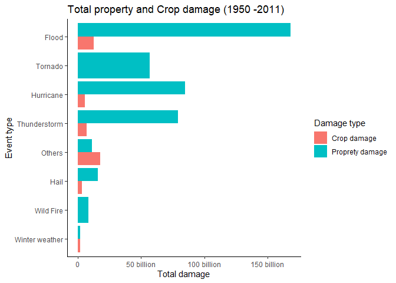

## Synopsis
This assignment is part of the reproducible research course from Coursera and was supposed to be written in English. As English is not my native language, I apologize in advance for any mistakes.  

From the U.S. National Oceanic and Atmospheric Administration’s (NOAA) data, we analyzed the impact of catastrophic events on population health, property, and crops. Initially, we recoded the data related to the variable “evtype” (the type of extreme weather event) so that there was greater accuracy concerning the events studied. Then, we made a time series to evaluate the occurrence of injuries and fatalities over the period available in the data. Finally, we assessed the most harmful events to the health of the U.S. population and those that caused the most significant economic damage.

## Packages and configurations

```r
Sys.setlocale("LC_ALL","English")
```

```
## [1] "LC_COLLATE=English_United States.1252;LC_CTYPE=English_United States.1252;LC_MONETARY=English_United States.1252;LC_NUMERIC=C;LC_TIME=English_United States.1252"
```

```r
library(tidyverse)
library(janitor)
library(lubridate)
require(maps)
require(viridis)
library(patchwork)
library(kableExtra)
```
## Data Processing
### Importing
Initially, we downloaded the data from the link indicated on the Coursera website and then save it in a tibble called noaa_data. We use the clean_names function from the janitor package, so we don't have to deal with capitalized words.

```r
if(!file.exists("./data")){dir.create("./data")}

url <- 
  "https://d396qusza40orc.cloudfront.net/repdata%2Fdata%2FStormData.csv.bz2"

destfile <- "./data/StormData.csv.bz2"

download.file(url = url,
              destfile = destfile)

noaa_data <- 
  read_csv("./data/StormData.csv.bz2") %>% 
  clean_names()
```
We took an initial look at the data to see which variables would help answer the questions posed in this assignment. We decided to select the variables indicated below. In addition to the obvious variables to deal with the theme, we kept those that could help localize the events along the U.S. and allow us to make a time series. 
We prepared the variables for analysis, particularly evtype, whose encoding was messy. From the website of the National Severe Storms Laboratory - NOAA (https://www.nssl.noaa.gov/education/svrwx101/), we gather information to try to make a better encoding. To do so, we use the text patterns in the existing categories and check others categories with high fatalities or injuries that were not cataloged as severe weather. To one can be able to evaluate the new encoding, we kept the evtype variable and created a new one called evtype_rcd. We also made the cleaned exponent variables and calculated new variables for property and crop damage. Finally, we assessed missing values in the variables of interest.

- bgn_date - date the event occurred;  
- state_2 - State where the event occurred;
- evtype - The type of extreme weather event;
- injuries - The number of injuries associated with the event;
- fatalities - The number of fatalities associated with the event;
- propdmg - Significant digits for the amount of proprety damage;
- propdmgexp - Magnitude of the property damage (dollars);
- cropdmg - Significant figures for the amount of crop damage;
- cropdmgexp - Magnitude of the crop damage (dollars).


```r
noaa_data %>% 
  glimpse()
```

```
## Rows: 902,297
## Columns: 37
## $ state       <dbl> 1, 1, 1, 1, 1, 1, 1, 1, 1, 1, 1, 1, 1, 1, 1, 1, 1, 1, 1, 1~
## $ bgn_date    <chr> "4/18/1950 0:00:00", "4/18/1950 0:00:00", "2/20/1951 0:00:~
## $ bgn_time    <chr> "0130", "0145", "1600", "0900", "1500", "2000", "0100", "0~
## $ time_zone   <chr> "CST", "CST", "CST", "CST", "CST", "CST", "CST", "CST", "C~
## $ county      <dbl> 97, 3, 57, 89, 43, 77, 9, 123, 125, 57, 43, 9, 73, 49, 107~
## $ countyname  <chr> "MOBILE", "BALDWIN", "FAYETTE", "MADISON", "CULLMAN", "LAU~
## $ state_2     <chr> "AL", "AL", "AL", "AL", "AL", "AL", "AL", "AL", "AL", "AL"~
## $ evtype      <chr> "TORNADO", "TORNADO", "TORNADO", "TORNADO", "TORNADO", "TO~
## $ bgn_range   <dbl> 0, 0, 0, 0, 0, 0, 0, 0, 0, 0, 0, 0, 0, 0, 0, 0, 0, 0, 0, 0~
## $ bgn_azi     <chr> NA, NA, NA, NA, NA, NA, NA, NA, NA, NA, NA, NA, NA, NA, NA~
## $ bgn_locati  <chr> NA, NA, NA, NA, NA, NA, NA, NA, NA, NA, NA, NA, NA, NA, NA~
## $ end_date    <chr> NA, NA, NA, NA, NA, NA, NA, NA, NA, NA, NA, NA, NA, NA, NA~
## $ end_time    <chr> NA, NA, NA, NA, NA, NA, NA, NA, NA, NA, NA, NA, NA, NA, NA~
## $ county_end  <dbl> 0, 0, 0, 0, 0, 0, 0, 0, 0, 0, 0, 0, 0, 0, 0, 0, 0, 0, 0, 0~
## $ countyendn  <lgl> NA, NA, NA, NA, NA, NA, NA, NA, NA, NA, NA, NA, NA, NA, NA~
## $ end_range   <dbl> 0, 0, 0, 0, 0, 0, 0, 0, 0, 0, 0, 0, 0, 0, 0, 0, 0, 0, 0, 0~
## $ end_azi     <chr> NA, NA, NA, NA, NA, NA, NA, NA, NA, NA, NA, NA, NA, NA, NA~
## $ end_locati  <chr> NA, NA, NA, NA, NA, NA, NA, NA, NA, NA, NA, NA, NA, NA, NA~
## $ length      <dbl> 14.0, 2.0, 0.1, 0.0, 0.0, 1.5, 1.5, 0.0, 3.3, 2.3, 1.3, 4.~
## $ width       <dbl> 100, 150, 123, 100, 150, 177, 33, 33, 100, 100, 400, 400, ~
## $ f           <dbl> 3, 2, 2, 2, 2, 2, 2, 1, 3, 3, 1, 1, 3, 3, 3, 4, 1, 1, 1, 1~
## $ mag         <dbl> 0, 0, 0, 0, 0, 0, 0, 0, 0, 0, 0, 0, 0, 0, 0, 0, 0, 0, 0, 0~
## $ fatalities  <dbl> 0, 0, 0, 0, 0, 0, 0, 0, 1, 0, 0, 0, 1, 0, 0, 4, 0, 0, 0, 0~
## $ injuries    <dbl> 15, 0, 2, 2, 2, 6, 1, 0, 14, 0, 3, 3, 26, 12, 6, 50, 2, 0,~
## $ propdmg     <dbl> 25.0, 2.5, 25.0, 2.5, 2.5, 2.5, 2.5, 2.5, 25.0, 25.0, 2.5,~
## $ propdmgexp  <chr> "K", "K", "K", "K", "K", "K", "K", "K", "K", "K", "M", "M"~
## $ cropdmg     <dbl> 0, 0, 0, 0, 0, 0, 0, 0, 0, 0, 0, 0, 0, 0, 0, 0, 0, 0, 0, 0~
## $ cropdmgexp  <chr> NA, NA, NA, NA, NA, NA, NA, NA, NA, NA, NA, NA, NA, NA, NA~
## $ wfo         <chr> NA, NA, NA, NA, NA, NA, NA, NA, NA, NA, NA, NA, NA, NA, NA~
## $ stateoffic  <chr> NA, NA, NA, NA, NA, NA, NA, NA, NA, NA, NA, NA, NA, NA, NA~
## $ zonenames   <chr> NA, NA, NA, NA, NA, NA, NA, NA, NA, NA, NA, NA, NA, NA, NA~
## $ latitude    <dbl> 3040, 3042, 3340, 3458, 3412, 3450, 3405, 3255, 3334, 3336~
## $ longitude   <dbl> 8812, 8755, 8742, 8626, 8642, 8748, 8631, 8558, 8740, 8738~
## $ latitude_e  <dbl> 3051, 0, 0, 0, 0, 0, 0, 0, 3336, 3337, 3402, 3404, 0, 3432~
## $ longitude_2 <dbl> 8806, 0, 0, 0, 0, 0, 0, 0, 8738, 8737, 8644, 8640, 0, 8540~
## $ remarks     <chr> NA, NA, NA, NA, NA, NA, NA, NA, NA, NA, NA, NA, NA, NA, NA~
## $ refnum      <dbl> 1, 2, 3, 4, 5, 6, 7, 8, 9, 10, 11, 12, 13, 14, 15, 16, 17,~
```


```r
noaa_data %>% 
  group_by(evtype) %>% 
  summarise(total = sum(fatalities)) %>% 
  arrange(desc(total))%>%
  kable() %>% 
  kable_styling(latex_options = "striped",
                full_width = F,
                position = "left") %>% 
  scroll_box(width = "50%", height = "200px")
```

<div style="border: 1px solid #ddd; padding: 0px; overflow-y: scroll; height:200px; overflow-x: scroll; width:50%; "><table class="table" style="width: auto !important; ">
 <thead>
  <tr>
   <th style="text-align:left;position: sticky; top:0; background-color: #FFFFFF;"> evtype </th>
   <th style="text-align:right;position: sticky; top:0; background-color: #FFFFFF;"> total </th>
  </tr>
 </thead>
<tbody>
  <tr>
   <td style="text-align:left;"> TORNADO </td>
   <td style="text-align:right;"> 5633 </td>
  </tr>
  <tr>
   <td style="text-align:left;"> EXCESSIVE HEAT </td>
   <td style="text-align:right;"> 1903 </td>
  </tr>
  <tr>
   <td style="text-align:left;"> FLASH FLOOD </td>
   <td style="text-align:right;"> 978 </td>
  </tr>
  <tr>
   <td style="text-align:left;"> HEAT </td>
   <td style="text-align:right;"> 937 </td>
  </tr>
  <tr>
   <td style="text-align:left;"> LIGHTNING </td>
   <td style="text-align:right;"> 816 </td>
  </tr>
  <tr>
   <td style="text-align:left;"> TSTM WIND </td>
   <td style="text-align:right;"> 504 </td>
  </tr>
  <tr>
   <td style="text-align:left;"> FLOOD </td>
   <td style="text-align:right;"> 470 </td>
  </tr>
  <tr>
   <td style="text-align:left;"> RIP CURRENT </td>
   <td style="text-align:right;"> 368 </td>
  </tr>
  <tr>
   <td style="text-align:left;"> HIGH WIND </td>
   <td style="text-align:right;"> 248 </td>
  </tr>
  <tr>
   <td style="text-align:left;"> AVALANCHE </td>
   <td style="text-align:right;"> 224 </td>
  </tr>
  <tr>
   <td style="text-align:left;"> WINTER STORM </td>
   <td style="text-align:right;"> 206 </td>
  </tr>
  <tr>
   <td style="text-align:left;"> RIP CURRENTS </td>
   <td style="text-align:right;"> 204 </td>
  </tr>
  <tr>
   <td style="text-align:left;"> HEAT WAVE </td>
   <td style="text-align:right;"> 172 </td>
  </tr>
  <tr>
   <td style="text-align:left;"> EXTREME COLD </td>
   <td style="text-align:right;"> 160 </td>
  </tr>
  <tr>
   <td style="text-align:left;"> THUNDERSTORM WIND </td>
   <td style="text-align:right;"> 133 </td>
  </tr>
  <tr>
   <td style="text-align:left;"> HEAVY SNOW </td>
   <td style="text-align:right;"> 127 </td>
  </tr>
  <tr>
   <td style="text-align:left;"> EXTREME COLD/WIND CHILL </td>
   <td style="text-align:right;"> 125 </td>
  </tr>
  <tr>
   <td style="text-align:left;"> STRONG WIND </td>
   <td style="text-align:right;"> 103 </td>
  </tr>
  <tr>
   <td style="text-align:left;"> BLIZZARD </td>
   <td style="text-align:right;"> 101 </td>
  </tr>
  <tr>
   <td style="text-align:left;"> HIGH SURF </td>
   <td style="text-align:right;"> 101 </td>
  </tr>
  <tr>
   <td style="text-align:left;"> HEAVY RAIN </td>
   <td style="text-align:right;"> 98 </td>
  </tr>
  <tr>
   <td style="text-align:left;"> EXTREME HEAT </td>
   <td style="text-align:right;"> 96 </td>
  </tr>
  <tr>
   <td style="text-align:left;"> COLD/WIND CHILL </td>
   <td style="text-align:right;"> 95 </td>
  </tr>
  <tr>
   <td style="text-align:left;"> ICE STORM </td>
   <td style="text-align:right;"> 89 </td>
  </tr>
  <tr>
   <td style="text-align:left;"> WILDFIRE </td>
   <td style="text-align:right;"> 75 </td>
  </tr>
  <tr>
   <td style="text-align:left;"> HURRICANE/TYPHOON </td>
   <td style="text-align:right;"> 64 </td>
  </tr>
  <tr>
   <td style="text-align:left;"> THUNDERSTORM WINDS </td>
   <td style="text-align:right;"> 64 </td>
  </tr>
  <tr>
   <td style="text-align:left;"> FOG </td>
   <td style="text-align:right;"> 62 </td>
  </tr>
  <tr>
   <td style="text-align:left;"> HURRICANE </td>
   <td style="text-align:right;"> 61 </td>
  </tr>
  <tr>
   <td style="text-align:left;"> TROPICAL STORM </td>
   <td style="text-align:right;"> 58 </td>
  </tr>
  <tr>
   <td style="text-align:left;"> HEAVY SURF/HIGH SURF </td>
   <td style="text-align:right;"> 42 </td>
  </tr>
  <tr>
   <td style="text-align:left;"> LANDSLIDE </td>
   <td style="text-align:right;"> 38 </td>
  </tr>
  <tr>
   <td style="text-align:left;"> COLD </td>
   <td style="text-align:right;"> 35 </td>
  </tr>
  <tr>
   <td style="text-align:left;"> HIGH WINDS </td>
   <td style="text-align:right;"> 35 </td>
  </tr>
  <tr>
   <td style="text-align:left;"> TSUNAMI </td>
   <td style="text-align:right;"> 33 </td>
  </tr>
  <tr>
   <td style="text-align:left;"> WINTER WEATHER </td>
   <td style="text-align:right;"> 33 </td>
  </tr>
  <tr>
   <td style="text-align:left;"> UNSEASONABLY WARM AND DRY </td>
   <td style="text-align:right;"> 29 </td>
  </tr>
  <tr>
   <td style="text-align:left;"> URBAN/SML STREAM FLD </td>
   <td style="text-align:right;"> 28 </td>
  </tr>
  <tr>
   <td style="text-align:left;"> WINTER WEATHER/MIX </td>
   <td style="text-align:right;"> 28 </td>
  </tr>
  <tr>
   <td style="text-align:left;"> TORNADOES, TSTM WIND, HAIL </td>
   <td style="text-align:right;"> 25 </td>
  </tr>
  <tr>
   <td style="text-align:left;"> WIND </td>
   <td style="text-align:right;"> 23 </td>
  </tr>
  <tr>
   <td style="text-align:left;"> DUST STORM </td>
   <td style="text-align:right;"> 22 </td>
  </tr>
  <tr>
   <td style="text-align:left;"> FLASH FLOODING </td>
   <td style="text-align:right;"> 19 </td>
  </tr>
  <tr>
   <td style="text-align:left;"> DENSE FOG </td>
   <td style="text-align:right;"> 18 </td>
  </tr>
  <tr>
   <td style="text-align:left;"> EXTREME WINDCHILL </td>
   <td style="text-align:right;"> 17 </td>
  </tr>
  <tr>
   <td style="text-align:left;"> FLOOD/FLASH FLOOD </td>
   <td style="text-align:right;"> 17 </td>
  </tr>
  <tr>
   <td style="text-align:left;"> RECORD/EXCESSIVE HEAT </td>
   <td style="text-align:right;"> 17 </td>
  </tr>
  <tr>
   <td style="text-align:left;"> HAIL </td>
   <td style="text-align:right;"> 15 </td>
  </tr>
  <tr>
   <td style="text-align:left;"> COLD AND SNOW </td>
   <td style="text-align:right;"> 14 </td>
  </tr>
  <tr>
   <td style="text-align:left;"> FLASH FLOOD/FLOOD </td>
   <td style="text-align:right;"> 14 </td>
  </tr>
  <tr>
   <td style="text-align:left;"> MARINE STRONG WIND </td>
   <td style="text-align:right;"> 14 </td>
  </tr>
  <tr>
   <td style="text-align:left;"> STORM SURGE </td>
   <td style="text-align:right;"> 13 </td>
  </tr>
  <tr>
   <td style="text-align:left;"> WILD/FOREST FIRE </td>
   <td style="text-align:right;"> 12 </td>
  </tr>
  <tr>
   <td style="text-align:left;"> STORM SURGE/TIDE </td>
   <td style="text-align:right;"> 11 </td>
  </tr>
  <tr>
   <td style="text-align:left;"> UNSEASONABLY WARM </td>
   <td style="text-align:right;"> 11 </td>
  </tr>
  <tr>
   <td style="text-align:left;"> MARINE THUNDERSTORM WIND </td>
   <td style="text-align:right;"> 10 </td>
  </tr>
  <tr>
   <td style="text-align:left;"> WINTER STORMS </td>
   <td style="text-align:right;"> 10 </td>
  </tr>
  <tr>
   <td style="text-align:left;"> MARINE TSTM WIND </td>
   <td style="text-align:right;"> 9 </td>
  </tr>
  <tr>
   <td style="text-align:left;"> ROUGH SEAS </td>
   <td style="text-align:right;"> 8 </td>
  </tr>
  <tr>
   <td style="text-align:left;"> TROPICAL STORM GORDON </td>
   <td style="text-align:right;"> 8 </td>
  </tr>
  <tr>
   <td style="text-align:left;"> FREEZING RAIN </td>
   <td style="text-align:right;"> 7 </td>
  </tr>
  <tr>
   <td style="text-align:left;"> GLAZE </td>
   <td style="text-align:right;"> 7 </td>
  </tr>
  <tr>
   <td style="text-align:left;"> HEAVY SURF </td>
   <td style="text-align:right;"> 7 </td>
  </tr>
  <tr>
   <td style="text-align:left;"> LOW TEMPERATURE </td>
   <td style="text-align:right;"> 7 </td>
  </tr>
  <tr>
   <td style="text-align:left;"> MARINE MISHAP </td>
   <td style="text-align:right;"> 7 </td>
  </tr>
  <tr>
   <td style="text-align:left;"> STRONG WINDS </td>
   <td style="text-align:right;"> 7 </td>
  </tr>
  <tr>
   <td style="text-align:left;"> FLOODING </td>
   <td style="text-align:right;"> 6 </td>
  </tr>
  <tr>
   <td style="text-align:left;"> HURRICANE ERIN </td>
   <td style="text-align:right;"> 6 </td>
  </tr>
  <tr>
   <td style="text-align:left;"> ICE </td>
   <td style="text-align:right;"> 6 </td>
  </tr>
  <tr>
   <td style="text-align:left;"> COLD WEATHER </td>
   <td style="text-align:right;"> 5 </td>
  </tr>
  <tr>
   <td style="text-align:left;"> FLASH FLOODING/FLOOD </td>
   <td style="text-align:right;"> 5 </td>
  </tr>
  <tr>
   <td style="text-align:left;"> HEAT WAVES </td>
   <td style="text-align:right;"> 5 </td>
  </tr>
  <tr>
   <td style="text-align:left;"> HIGH SEAS </td>
   <td style="text-align:right;"> 5 </td>
  </tr>
  <tr>
   <td style="text-align:left;"> ICY ROADS </td>
   <td style="text-align:right;"> 5 </td>
  </tr>
  <tr>
   <td style="text-align:left;"> RIP CURRENTS/HEAVY SURF </td>
   <td style="text-align:right;"> 5 </td>
  </tr>
  <tr>
   <td style="text-align:left;"> SNOW </td>
   <td style="text-align:right;"> 5 </td>
  </tr>
  <tr>
   <td style="text-align:left;"> TSTM WIND/HAIL </td>
   <td style="text-align:right;"> 5 </td>
  </tr>
  <tr>
   <td style="text-align:left;"> GUSTY WINDS </td>
   <td style="text-align:right;"> 4 </td>
  </tr>
  <tr>
   <td style="text-align:left;"> HEAT WAVE DROUGHT </td>
   <td style="text-align:right;"> 4 </td>
  </tr>
  <tr>
   <td style="text-align:left;"> HIGH WIND/SEAS </td>
   <td style="text-align:right;"> 4 </td>
  </tr>
  <tr>
   <td style="text-align:left;"> Hypothermia/Exposure </td>
   <td style="text-align:right;"> 4 </td>
  </tr>
  <tr>
   <td style="text-align:left;"> Mudslide </td>
   <td style="text-align:right;"> 4 </td>
  </tr>
  <tr>
   <td style="text-align:left;"> RAIN/SNOW </td>
   <td style="text-align:right;"> 4 </td>
  </tr>
  <tr>
   <td style="text-align:left;"> ROUGH SURF </td>
   <td style="text-align:right;"> 4 </td>
  </tr>
  <tr>
   <td style="text-align:left;"> SNOW AND ICE </td>
   <td style="text-align:right;"> 4 </td>
  </tr>
  <tr>
   <td style="text-align:left;"> COASTAL FLOOD </td>
   <td style="text-align:right;"> 3 </td>
  </tr>
  <tr>
   <td style="text-align:left;"> COASTAL STORM </td>
   <td style="text-align:right;"> 3 </td>
  </tr>
  <tr>
   <td style="text-align:left;"> Cold </td>
   <td style="text-align:right;"> 3 </td>
  </tr>
  <tr>
   <td style="text-align:left;"> COLD WAVE </td>
   <td style="text-align:right;"> 3 </td>
  </tr>
  <tr>
   <td style="text-align:left;"> DRY MICROBURST </td>
   <td style="text-align:right;"> 3 </td>
  </tr>
  <tr>
   <td style="text-align:left;"> HEAVY SEAS </td>
   <td style="text-align:right;"> 3 </td>
  </tr>
  <tr>
   <td style="text-align:left;"> Heavy surf and wind </td>
   <td style="text-align:right;"> 3 </td>
  </tr>
  <tr>
   <td style="text-align:left;"> High Surf </td>
   <td style="text-align:right;"> 3 </td>
  </tr>
  <tr>
   <td style="text-align:left;"> HIGH WATER </td>
   <td style="text-align:right;"> 3 </td>
  </tr>
  <tr>
   <td style="text-align:left;"> HIGH WIND AND SEAS </td>
   <td style="text-align:right;"> 3 </td>
  </tr>
  <tr>
   <td style="text-align:left;"> HIGH WINDS/SNOW </td>
   <td style="text-align:right;"> 3 </td>
  </tr>
  <tr>
   <td style="text-align:left;"> HYPOTHERMIA/EXPOSURE </td>
   <td style="text-align:right;"> 3 </td>
  </tr>
  <tr>
   <td style="text-align:left;"> WATERSPOUT </td>
   <td style="text-align:right;"> 3 </td>
  </tr>
  <tr>
   <td style="text-align:left;"> WATERSPOUT/TORNADO </td>
   <td style="text-align:right;"> 3 </td>
  </tr>
  <tr>
   <td style="text-align:left;"> WILD FIRES </td>
   <td style="text-align:right;"> 3 </td>
  </tr>
  <tr>
   <td style="text-align:left;"> Coastal Flooding </td>
   <td style="text-align:right;"> 2 </td>
  </tr>
  <tr>
   <td style="text-align:left;"> Cold Temperature </td>
   <td style="text-align:right;"> 2 </td>
  </tr>
  <tr>
   <td style="text-align:left;"> DROUGHT/EXCESSIVE HEAT </td>
   <td style="text-align:right;"> 2 </td>
  </tr>
  <tr>
   <td style="text-align:left;"> DUST DEVIL </td>
   <td style="text-align:right;"> 2 </td>
  </tr>
  <tr>
   <td style="text-align:left;"> EXCESSIVE RAINFALL </td>
   <td style="text-align:right;"> 2 </td>
  </tr>
  <tr>
   <td style="text-align:left;"> Extreme Cold </td>
   <td style="text-align:right;"> 2 </td>
  </tr>
  <tr>
   <td style="text-align:left;"> FLASH FLOODS </td>
   <td style="text-align:right;"> 2 </td>
  </tr>
  <tr>
   <td style="text-align:left;"> FREEZING DRIZZLE </td>
   <td style="text-align:right;"> 2 </td>
  </tr>
  <tr>
   <td style="text-align:left;"> HEAVY SNOW AND HIGH WINDS </td>
   <td style="text-align:right;"> 2 </td>
  </tr>
  <tr>
   <td style="text-align:left;"> HURRICANE OPAL/HIGH WINDS </td>
   <td style="text-align:right;"> 2 </td>
  </tr>
  <tr>
   <td style="text-align:left;"> MIXED PRECIP </td>
   <td style="text-align:right;"> 2 </td>
  </tr>
  <tr>
   <td style="text-align:left;"> RECORD HEAT </td>
   <td style="text-align:right;"> 2 </td>
  </tr>
  <tr>
   <td style="text-align:left;"> RIVER FLOOD </td>
   <td style="text-align:right;"> 2 </td>
  </tr>
  <tr>
   <td style="text-align:left;"> RIVER FLOODING </td>
   <td style="text-align:right;"> 2 </td>
  </tr>
  <tr>
   <td style="text-align:left;"> SLEET </td>
   <td style="text-align:right;"> 2 </td>
  </tr>
  <tr>
   <td style="text-align:left;"> SNOW SQUALL </td>
   <td style="text-align:right;"> 2 </td>
  </tr>
  <tr>
   <td style="text-align:left;"> UNSEASONABLY COLD </td>
   <td style="text-align:right;"> 2 </td>
  </tr>
  <tr>
   <td style="text-align:left;"> AVALANCE </td>
   <td style="text-align:right;"> 1 </td>
  </tr>
  <tr>
   <td style="text-align:left;"> BLACK ICE </td>
   <td style="text-align:right;"> 1 </td>
  </tr>
  <tr>
   <td style="text-align:left;"> blowing snow </td>
   <td style="text-align:right;"> 1 </td>
  </tr>
  <tr>
   <td style="text-align:left;"> BLOWING SNOW </td>
   <td style="text-align:right;"> 1 </td>
  </tr>
  <tr>
   <td style="text-align:left;"> COASTAL FLOODING </td>
   <td style="text-align:right;"> 1 </td>
  </tr>
  <tr>
   <td style="text-align:left;"> COASTALSTORM </td>
   <td style="text-align:right;"> 1 </td>
  </tr>
  <tr>
   <td style="text-align:left;"> COLD/WINDS </td>
   <td style="text-align:right;"> 1 </td>
  </tr>
  <tr>
   <td style="text-align:left;"> DROWNING </td>
   <td style="text-align:right;"> 1 </td>
  </tr>
  <tr>
   <td style="text-align:left;"> Extended Cold </td>
   <td style="text-align:right;"> 1 </td>
  </tr>
  <tr>
   <td style="text-align:left;"> FALLING SNOW/ICE </td>
   <td style="text-align:right;"> 1 </td>
  </tr>
  <tr>
   <td style="text-align:left;"> FLOOD &amp; HEAVY RAIN </td>
   <td style="text-align:right;"> 1 </td>
  </tr>
  <tr>
   <td style="text-align:left;"> FLOOD/RIVER FLOOD </td>
   <td style="text-align:right;"> 1 </td>
  </tr>
  <tr>
   <td style="text-align:left;"> FOG AND COLD TEMPERATURES </td>
   <td style="text-align:right;"> 1 </td>
  </tr>
  <tr>
   <td style="text-align:left;"> FREEZE </td>
   <td style="text-align:right;"> 1 </td>
  </tr>
  <tr>
   <td style="text-align:left;"> FREEZING RAIN/SNOW </td>
   <td style="text-align:right;"> 1 </td>
  </tr>
  <tr>
   <td style="text-align:left;"> Freezing Spray </td>
   <td style="text-align:right;"> 1 </td>
  </tr>
  <tr>
   <td style="text-align:left;"> FROST </td>
   <td style="text-align:right;"> 1 </td>
  </tr>
  <tr>
   <td style="text-align:left;"> GUSTY WIND </td>
   <td style="text-align:right;"> 1 </td>
  </tr>
  <tr>
   <td style="text-align:left;"> Heavy Surf </td>
   <td style="text-align:right;"> 1 </td>
  </tr>
  <tr>
   <td style="text-align:left;"> HIGH SWELLS </td>
   <td style="text-align:right;"> 1 </td>
  </tr>
  <tr>
   <td style="text-align:left;"> HIGH WAVES </td>
   <td style="text-align:right;"> 1 </td>
  </tr>
  <tr>
   <td style="text-align:left;"> HURRICANE FELIX </td>
   <td style="text-align:right;"> 1 </td>
  </tr>
  <tr>
   <td style="text-align:left;"> HURRICANE OPAL </td>
   <td style="text-align:right;"> 1 </td>
  </tr>
  <tr>
   <td style="text-align:left;"> HYPERTHERMIA/EXPOSURE </td>
   <td style="text-align:right;"> 1 </td>
  </tr>
  <tr>
   <td style="text-align:left;"> HYPOTHERMIA </td>
   <td style="text-align:right;"> 1 </td>
  </tr>
  <tr>
   <td style="text-align:left;"> ICE ON ROAD </td>
   <td style="text-align:right;"> 1 </td>
  </tr>
  <tr>
   <td style="text-align:left;"> LANDSLIDES </td>
   <td style="text-align:right;"> 1 </td>
  </tr>
  <tr>
   <td style="text-align:left;"> LIGHT SNOW </td>
   <td style="text-align:right;"> 1 </td>
  </tr>
  <tr>
   <td style="text-align:left;"> LIGHTNING. </td>
   <td style="text-align:right;"> 1 </td>
  </tr>
  <tr>
   <td style="text-align:left;"> Marine Accident </td>
   <td style="text-align:right;"> 1 </td>
  </tr>
  <tr>
   <td style="text-align:left;"> MARINE HIGH WIND </td>
   <td style="text-align:right;"> 1 </td>
  </tr>
  <tr>
   <td style="text-align:left;"> MINOR FLOODING </td>
   <td style="text-align:right;"> 1 </td>
  </tr>
  <tr>
   <td style="text-align:left;"> Mudslides </td>
   <td style="text-align:right;"> 1 </td>
  </tr>
  <tr>
   <td style="text-align:left;"> RAIN/WIND </td>
   <td style="text-align:right;"> 1 </td>
  </tr>
  <tr>
   <td style="text-align:left;"> RAPIDLY RISING WATER </td>
   <td style="text-align:right;"> 1 </td>
  </tr>
  <tr>
   <td style="text-align:left;"> RECORD COLD </td>
   <td style="text-align:right;"> 1 </td>
  </tr>
  <tr>
   <td style="text-align:left;"> Snow Squalls </td>
   <td style="text-align:right;"> 1 </td>
  </tr>
  <tr>
   <td style="text-align:left;"> SNOW/ BITTER COLD </td>
   <td style="text-align:right;"> 1 </td>
  </tr>
  <tr>
   <td style="text-align:left;"> Strong Winds </td>
   <td style="text-align:right;"> 1 </td>
  </tr>
  <tr>
   <td style="text-align:left;"> THUNDERSNOW </td>
   <td style="text-align:right;"> 1 </td>
  </tr>
  <tr>
   <td style="text-align:left;"> THUNDERSTORM </td>
   <td style="text-align:right;"> 1 </td>
  </tr>
  <tr>
   <td style="text-align:left;"> THUNDERSTORM WIND (G40) </td>
   <td style="text-align:right;"> 1 </td>
  </tr>
  <tr>
   <td style="text-align:left;"> THUNDERSTORM WIND G52 </td>
   <td style="text-align:right;"> 1 </td>
  </tr>
  <tr>
   <td style="text-align:left;"> THUNDERTORM WINDS </td>
   <td style="text-align:right;"> 1 </td>
  </tr>
  <tr>
   <td style="text-align:left;"> TSTM WIND (G35) </td>
   <td style="text-align:right;"> 1 </td>
  </tr>
  <tr>
   <td style="text-align:left;"> URBAN AND SMALL STREAM FLOODIN </td>
   <td style="text-align:right;"> 1 </td>
  </tr>
  <tr>
   <td style="text-align:left;"> Whirlwind </td>
   <td style="text-align:right;"> 1 </td>
  </tr>
  <tr>
   <td style="text-align:left;"> WIND STORM </td>
   <td style="text-align:right;"> 1 </td>
  </tr>
  <tr>
   <td style="text-align:left;"> WINDS </td>
   <td style="text-align:right;"> 1 </td>
  </tr>
  <tr>
   <td style="text-align:left;"> WINTER STORM HIGH WINDS </td>
   <td style="text-align:right;"> 1 </td>
  </tr>
  <tr>
   <td style="text-align:left;"> WINTRY MIX </td>
   <td style="text-align:right;"> 1 </td>
  </tr>
  <tr>
   <td style="text-align:left;"> ? </td>
   <td style="text-align:right;"> 0 </td>
  </tr>
  <tr>
   <td style="text-align:left;"> ABNORMAL WARMTH </td>
   <td style="text-align:right;"> 0 </td>
  </tr>
  <tr>
   <td style="text-align:left;"> ABNORMALLY DRY </td>
   <td style="text-align:right;"> 0 </td>
  </tr>
  <tr>
   <td style="text-align:left;"> ABNORMALLY WET </td>
   <td style="text-align:right;"> 0 </td>
  </tr>
  <tr>
   <td style="text-align:left;"> ACCUMULATED SNOWFALL </td>
   <td style="text-align:right;"> 0 </td>
  </tr>
  <tr>
   <td style="text-align:left;"> AGRICULTURAL FREEZE </td>
   <td style="text-align:right;"> 0 </td>
  </tr>
  <tr>
   <td style="text-align:left;"> APACHE COUNTY </td>
   <td style="text-align:right;"> 0 </td>
  </tr>
  <tr>
   <td style="text-align:left;"> ASTRONOMICAL HIGH TIDE </td>
   <td style="text-align:right;"> 0 </td>
  </tr>
  <tr>
   <td style="text-align:left;"> ASTRONOMICAL LOW TIDE </td>
   <td style="text-align:right;"> 0 </td>
  </tr>
  <tr>
   <td style="text-align:left;"> BEACH EROSIN </td>
   <td style="text-align:right;"> 0 </td>
  </tr>
  <tr>
   <td style="text-align:left;"> Beach Erosion </td>
   <td style="text-align:right;"> 0 </td>
  </tr>
  <tr>
   <td style="text-align:left;"> BEACH EROSION </td>
   <td style="text-align:right;"> 0 </td>
  </tr>
  <tr>
   <td style="text-align:left;"> BEACH EROSION/COASTAL FLOOD </td>
   <td style="text-align:right;"> 0 </td>
  </tr>
  <tr>
   <td style="text-align:left;"> BEACH FLOOD </td>
   <td style="text-align:right;"> 0 </td>
  </tr>
  <tr>
   <td style="text-align:left;"> BELOW NORMAL PRECIPITATION </td>
   <td style="text-align:right;"> 0 </td>
  </tr>
  <tr>
   <td style="text-align:left;"> BITTER WIND CHILL </td>
   <td style="text-align:right;"> 0 </td>
  </tr>
  <tr>
   <td style="text-align:left;"> BITTER WIND CHILL TEMPERATURES </td>
   <td style="text-align:right;"> 0 </td>
  </tr>
  <tr>
   <td style="text-align:left;"> Black Ice </td>
   <td style="text-align:right;"> 0 </td>
  </tr>
  <tr>
   <td style="text-align:left;"> BLIZZARD AND EXTREME WIND CHIL </td>
   <td style="text-align:right;"> 0 </td>
  </tr>
  <tr>
   <td style="text-align:left;"> BLIZZARD AND HEAVY SNOW </td>
   <td style="text-align:right;"> 0 </td>
  </tr>
  <tr>
   <td style="text-align:left;"> Blizzard Summary </td>
   <td style="text-align:right;"> 0 </td>
  </tr>
  <tr>
   <td style="text-align:left;"> BLIZZARD WEATHER </td>
   <td style="text-align:right;"> 0 </td>
  </tr>
  <tr>
   <td style="text-align:left;"> BLIZZARD/FREEZING RAIN </td>
   <td style="text-align:right;"> 0 </td>
  </tr>
  <tr>
   <td style="text-align:left;"> BLIZZARD/HEAVY SNOW </td>
   <td style="text-align:right;"> 0 </td>
  </tr>
  <tr>
   <td style="text-align:left;"> BLIZZARD/HIGH WIND </td>
   <td style="text-align:right;"> 0 </td>
  </tr>
  <tr>
   <td style="text-align:left;"> BLIZZARD/WINTER STORM </td>
   <td style="text-align:right;"> 0 </td>
  </tr>
  <tr>
   <td style="text-align:left;"> BLOW-OUT TIDE </td>
   <td style="text-align:right;"> 0 </td>
  </tr>
  <tr>
   <td style="text-align:left;"> BLOW-OUT TIDES </td>
   <td style="text-align:right;"> 0 </td>
  </tr>
  <tr>
   <td style="text-align:left;"> BLOWING DUST </td>
   <td style="text-align:right;"> 0 </td>
  </tr>
  <tr>
   <td style="text-align:left;"> Blowing Snow </td>
   <td style="text-align:right;"> 0 </td>
  </tr>
  <tr>
   <td style="text-align:left;"> BLOWING SNOW- EXTREME WIND CHI </td>
   <td style="text-align:right;"> 0 </td>
  </tr>
  <tr>
   <td style="text-align:left;"> BLOWING SNOW &amp; EXTREME WIND CH </td>
   <td style="text-align:right;"> 0 </td>
  </tr>
  <tr>
   <td style="text-align:left;"> BLOWING SNOW/EXTREME WIND CHIL </td>
   <td style="text-align:right;"> 0 </td>
  </tr>
  <tr>
   <td style="text-align:left;"> BREAKUP FLOODING </td>
   <td style="text-align:right;"> 0 </td>
  </tr>
  <tr>
   <td style="text-align:left;"> BRUSH FIRE </td>
   <td style="text-align:right;"> 0 </td>
  </tr>
  <tr>
   <td style="text-align:left;"> BRUSH FIRES </td>
   <td style="text-align:right;"> 0 </td>
  </tr>
  <tr>
   <td style="text-align:left;"> COASTAL  FLOODING/EROSION </td>
   <td style="text-align:right;"> 0 </td>
  </tr>
  <tr>
   <td style="text-align:left;"> COASTAL EROSION </td>
   <td style="text-align:right;"> 0 </td>
  </tr>
  <tr>
   <td style="text-align:left;"> Coastal Flood </td>
   <td style="text-align:right;"> 0 </td>
  </tr>
  <tr>
   <td style="text-align:left;"> coastal flooding </td>
   <td style="text-align:right;"> 0 </td>
  </tr>
  <tr>
   <td style="text-align:left;"> COASTAL FLOODING/EROSION </td>
   <td style="text-align:right;"> 0 </td>
  </tr>
  <tr>
   <td style="text-align:left;"> Coastal Storm </td>
   <td style="text-align:right;"> 0 </td>
  </tr>
  <tr>
   <td style="text-align:left;"> COASTAL SURGE </td>
   <td style="text-align:right;"> 0 </td>
  </tr>
  <tr>
   <td style="text-align:left;"> COASTAL/TIDAL FLOOD </td>
   <td style="text-align:right;"> 0 </td>
  </tr>
  <tr>
   <td style="text-align:left;"> COASTALFLOOD </td>
   <td style="text-align:right;"> 0 </td>
  </tr>
  <tr>
   <td style="text-align:left;"> COLD AIR FUNNEL </td>
   <td style="text-align:right;"> 0 </td>
  </tr>
  <tr>
   <td style="text-align:left;"> COLD AIR FUNNELS </td>
   <td style="text-align:right;"> 0 </td>
  </tr>
  <tr>
   <td style="text-align:left;"> COLD AIR TORNADO </td>
   <td style="text-align:right;"> 0 </td>
  </tr>
  <tr>
   <td style="text-align:left;"> Cold and Frost </td>
   <td style="text-align:right;"> 0 </td>
  </tr>
  <tr>
   <td style="text-align:left;"> COLD AND FROST </td>
   <td style="text-align:right;"> 0 </td>
  </tr>
  <tr>
   <td style="text-align:left;"> COLD AND WET CONDITIONS </td>
   <td style="text-align:right;"> 0 </td>
  </tr>
  <tr>
   <td style="text-align:left;"> COLD TEMPERATURES </td>
   <td style="text-align:right;"> 0 </td>
  </tr>
  <tr>
   <td style="text-align:left;"> COLD WIND CHILL TEMPERATURES </td>
   <td style="text-align:right;"> 0 </td>
  </tr>
  <tr>
   <td style="text-align:left;"> COOL AND WET </td>
   <td style="text-align:right;"> 0 </td>
  </tr>
  <tr>
   <td style="text-align:left;"> COOL SPELL </td>
   <td style="text-align:right;"> 0 </td>
  </tr>
  <tr>
   <td style="text-align:left;"> CSTL FLOODING/EROSION </td>
   <td style="text-align:right;"> 0 </td>
  </tr>
  <tr>
   <td style="text-align:left;"> DAM BREAK </td>
   <td style="text-align:right;"> 0 </td>
  </tr>
  <tr>
   <td style="text-align:left;"> DAM FAILURE </td>
   <td style="text-align:right;"> 0 </td>
  </tr>
  <tr>
   <td style="text-align:left;"> Damaging Freeze </td>
   <td style="text-align:right;"> 0 </td>
  </tr>
  <tr>
   <td style="text-align:left;"> DAMAGING FREEZE </td>
   <td style="text-align:right;"> 0 </td>
  </tr>
  <tr>
   <td style="text-align:left;"> DEEP HAIL </td>
   <td style="text-align:right;"> 0 </td>
  </tr>
  <tr>
   <td style="text-align:left;"> DENSE SMOKE </td>
   <td style="text-align:right;"> 0 </td>
  </tr>
  <tr>
   <td style="text-align:left;"> DOWNBURST </td>
   <td style="text-align:right;"> 0 </td>
  </tr>
  <tr>
   <td style="text-align:left;"> DOWNBURST WINDS </td>
   <td style="text-align:right;"> 0 </td>
  </tr>
  <tr>
   <td style="text-align:left;"> DRIEST MONTH </td>
   <td style="text-align:right;"> 0 </td>
  </tr>
  <tr>
   <td style="text-align:left;"> Drifting Snow </td>
   <td style="text-align:right;"> 0 </td>
  </tr>
  <tr>
   <td style="text-align:left;"> DROUGHT </td>
   <td style="text-align:right;"> 0 </td>
  </tr>
  <tr>
   <td style="text-align:left;"> DRY </td>
   <td style="text-align:right;"> 0 </td>
  </tr>
  <tr>
   <td style="text-align:left;"> DRY CONDITIONS </td>
   <td style="text-align:right;"> 0 </td>
  </tr>
  <tr>
   <td style="text-align:left;"> DRY HOT WEATHER </td>
   <td style="text-align:right;"> 0 </td>
  </tr>
  <tr>
   <td style="text-align:left;"> DRY MICROBURST 50 </td>
   <td style="text-align:right;"> 0 </td>
  </tr>
  <tr>
   <td style="text-align:left;"> DRY MICROBURST 53 </td>
   <td style="text-align:right;"> 0 </td>
  </tr>
  <tr>
   <td style="text-align:left;"> DRY MICROBURST 58 </td>
   <td style="text-align:right;"> 0 </td>
  </tr>
  <tr>
   <td style="text-align:left;"> DRY MICROBURST 61 </td>
   <td style="text-align:right;"> 0 </td>
  </tr>
  <tr>
   <td style="text-align:left;"> DRY MICROBURST 84 </td>
   <td style="text-align:right;"> 0 </td>
  </tr>
  <tr>
   <td style="text-align:left;"> DRY MICROBURST WINDS </td>
   <td style="text-align:right;"> 0 </td>
  </tr>
  <tr>
   <td style="text-align:left;"> DRY MIRCOBURST WINDS </td>
   <td style="text-align:right;"> 0 </td>
  </tr>
  <tr>
   <td style="text-align:left;"> DRY PATTERN </td>
   <td style="text-align:right;"> 0 </td>
  </tr>
  <tr>
   <td style="text-align:left;"> DRY SPELL </td>
   <td style="text-align:right;"> 0 </td>
  </tr>
  <tr>
   <td style="text-align:left;"> DRY WEATHER </td>
   <td style="text-align:right;"> 0 </td>
  </tr>
  <tr>
   <td style="text-align:left;"> DRYNESS </td>
   <td style="text-align:right;"> 0 </td>
  </tr>
  <tr>
   <td style="text-align:left;"> DUST DEVEL </td>
   <td style="text-align:right;"> 0 </td>
  </tr>
  <tr>
   <td style="text-align:left;"> Dust Devil </td>
   <td style="text-align:right;"> 0 </td>
  </tr>
  <tr>
   <td style="text-align:left;"> DUST DEVIL WATERSPOUT </td>
   <td style="text-align:right;"> 0 </td>
  </tr>
  <tr>
   <td style="text-align:left;"> DUST STORM/HIGH WINDS </td>
   <td style="text-align:right;"> 0 </td>
  </tr>
  <tr>
   <td style="text-align:left;"> DUSTSTORM </td>
   <td style="text-align:right;"> 0 </td>
  </tr>
  <tr>
   <td style="text-align:left;"> EARLY FREEZE </td>
   <td style="text-align:right;"> 0 </td>
  </tr>
  <tr>
   <td style="text-align:left;"> Early Frost </td>
   <td style="text-align:right;"> 0 </td>
  </tr>
  <tr>
   <td style="text-align:left;"> EARLY FROST </td>
   <td style="text-align:right;"> 0 </td>
  </tr>
  <tr>
   <td style="text-align:left;"> EARLY RAIN </td>
   <td style="text-align:right;"> 0 </td>
  </tr>
  <tr>
   <td style="text-align:left;"> EARLY SNOW </td>
   <td style="text-align:right;"> 0 </td>
  </tr>
  <tr>
   <td style="text-align:left;"> Early snowfall </td>
   <td style="text-align:right;"> 0 </td>
  </tr>
  <tr>
   <td style="text-align:left;"> EARLY SNOWFALL </td>
   <td style="text-align:right;"> 0 </td>
  </tr>
  <tr>
   <td style="text-align:left;"> Erosion/Cstl Flood </td>
   <td style="text-align:right;"> 0 </td>
  </tr>
  <tr>
   <td style="text-align:left;"> EXCESSIVE </td>
   <td style="text-align:right;"> 0 </td>
  </tr>
  <tr>
   <td style="text-align:left;"> Excessive Cold </td>
   <td style="text-align:right;"> 0 </td>
  </tr>
  <tr>
   <td style="text-align:left;"> EXCESSIVE HEAT/DROUGHT </td>
   <td style="text-align:right;"> 0 </td>
  </tr>
  <tr>
   <td style="text-align:left;"> EXCESSIVE PRECIPITATION </td>
   <td style="text-align:right;"> 0 </td>
  </tr>
  <tr>
   <td style="text-align:left;"> EXCESSIVE RAIN </td>
   <td style="text-align:right;"> 0 </td>
  </tr>
  <tr>
   <td style="text-align:left;"> EXCESSIVE SNOW </td>
   <td style="text-align:right;"> 0 </td>
  </tr>
  <tr>
   <td style="text-align:left;"> EXCESSIVE WETNESS </td>
   <td style="text-align:right;"> 0 </td>
  </tr>
  <tr>
   <td style="text-align:left;"> EXCESSIVELY DRY </td>
   <td style="text-align:right;"> 0 </td>
  </tr>
  <tr>
   <td style="text-align:left;"> EXTREME WIND CHILL </td>
   <td style="text-align:right;"> 0 </td>
  </tr>
  <tr>
   <td style="text-align:left;"> EXTREME WIND CHILL/BLOWING SNO </td>
   <td style="text-align:right;"> 0 </td>
  </tr>
  <tr>
   <td style="text-align:left;"> EXTREME WIND CHILLS </td>
   <td style="text-align:right;"> 0 </td>
  </tr>
  <tr>
   <td style="text-align:left;"> EXTREME WINDCHILL TEMPERATURES </td>
   <td style="text-align:right;"> 0 </td>
  </tr>
  <tr>
   <td style="text-align:left;"> EXTREME/RECORD COLD </td>
   <td style="text-align:right;"> 0 </td>
  </tr>
  <tr>
   <td style="text-align:left;"> EXTREMELY WET </td>
   <td style="text-align:right;"> 0 </td>
  </tr>
  <tr>
   <td style="text-align:left;"> FIRST FROST </td>
   <td style="text-align:right;"> 0 </td>
  </tr>
  <tr>
   <td style="text-align:left;"> FIRST SNOW </td>
   <td style="text-align:right;"> 0 </td>
  </tr>
  <tr>
   <td style="text-align:left;"> FLASH FLOOD - HEAVY RAIN </td>
   <td style="text-align:right;"> 0 </td>
  </tr>
  <tr>
   <td style="text-align:left;"> FLASH FLOOD FROM ICE JAMS </td>
   <td style="text-align:right;"> 0 </td>
  </tr>
  <tr>
   <td style="text-align:left;"> FLASH FLOOD LANDSLIDES </td>
   <td style="text-align:right;"> 0 </td>
  </tr>
  <tr>
   <td style="text-align:left;"> FLASH FLOOD WINDS </td>
   <td style="text-align:right;"> 0 </td>
  </tr>
  <tr>
   <td style="text-align:left;"> FLASH FLOOD/ </td>
   <td style="text-align:right;"> 0 </td>
  </tr>
  <tr>
   <td style="text-align:left;"> FLASH FLOOD/ FLOOD </td>
   <td style="text-align:right;"> 0 </td>
  </tr>
  <tr>
   <td style="text-align:left;"> FLASH FLOOD/ STREET </td>
   <td style="text-align:right;"> 0 </td>
  </tr>
  <tr>
   <td style="text-align:left;"> FLASH FLOOD/HEAVY RAIN </td>
   <td style="text-align:right;"> 0 </td>
  </tr>
  <tr>
   <td style="text-align:left;"> FLASH FLOOD/LANDSLIDE </td>
   <td style="text-align:right;"> 0 </td>
  </tr>
  <tr>
   <td style="text-align:left;"> FLASH FLOODING/THUNDERSTORM WI </td>
   <td style="text-align:right;"> 0 </td>
  </tr>
  <tr>
   <td style="text-align:left;"> FLASH FLOOODING </td>
   <td style="text-align:right;"> 0 </td>
  </tr>
  <tr>
   <td style="text-align:left;"> Flood </td>
   <td style="text-align:right;"> 0 </td>
  </tr>
  <tr>
   <td style="text-align:left;"> FLOOD FLASH </td>
   <td style="text-align:right;"> 0 </td>
  </tr>
  <tr>
   <td style="text-align:left;"> FLOOD FLOOD/FLASH </td>
   <td style="text-align:right;"> 0 </td>
  </tr>
  <tr>
   <td style="text-align:left;"> FLOOD WATCH/ </td>
   <td style="text-align:right;"> 0 </td>
  </tr>
  <tr>
   <td style="text-align:left;"> FLOOD/FLASH </td>
   <td style="text-align:right;"> 0 </td>
  </tr>
  <tr>
   <td style="text-align:left;"> Flood/Flash Flood </td>
   <td style="text-align:right;"> 0 </td>
  </tr>
  <tr>
   <td style="text-align:left;"> FLOOD/FLASH FLOODING </td>
   <td style="text-align:right;"> 0 </td>
  </tr>
  <tr>
   <td style="text-align:left;"> FLOOD/FLASH/FLOOD </td>
   <td style="text-align:right;"> 0 </td>
  </tr>
  <tr>
   <td style="text-align:left;"> FLOOD/FLASHFLOOD </td>
   <td style="text-align:right;"> 0 </td>
  </tr>
  <tr>
   <td style="text-align:left;"> FLOOD/RAIN/WIND </td>
   <td style="text-align:right;"> 0 </td>
  </tr>
  <tr>
   <td style="text-align:left;"> FLOOD/RAIN/WINDS </td>
   <td style="text-align:right;"> 0 </td>
  </tr>
  <tr>
   <td style="text-align:left;"> Flood/Strong Wind </td>
   <td style="text-align:right;"> 0 </td>
  </tr>
  <tr>
   <td style="text-align:left;"> FLOODING/HEAVY RAIN </td>
   <td style="text-align:right;"> 0 </td>
  </tr>
  <tr>
   <td style="text-align:left;"> FLOODS </td>
   <td style="text-align:right;"> 0 </td>
  </tr>
  <tr>
   <td style="text-align:left;"> FOREST FIRES </td>
   <td style="text-align:right;"> 0 </td>
  </tr>
  <tr>
   <td style="text-align:left;"> Freeze </td>
   <td style="text-align:right;"> 0 </td>
  </tr>
  <tr>
   <td style="text-align:left;"> Freezing drizzle </td>
   <td style="text-align:right;"> 0 </td>
  </tr>
  <tr>
   <td style="text-align:left;"> Freezing Drizzle </td>
   <td style="text-align:right;"> 0 </td>
  </tr>
  <tr>
   <td style="text-align:left;"> FREEZING DRIZZLE AND FREEZING </td>
   <td style="text-align:right;"> 0 </td>
  </tr>
  <tr>
   <td style="text-align:left;"> Freezing Fog </td>
   <td style="text-align:right;"> 0 </td>
  </tr>
  <tr>
   <td style="text-align:left;"> FREEZING FOG </td>
   <td style="text-align:right;"> 0 </td>
  </tr>
  <tr>
   <td style="text-align:left;"> Freezing rain </td>
   <td style="text-align:right;"> 0 </td>
  </tr>
  <tr>
   <td style="text-align:left;"> Freezing Rain </td>
   <td style="text-align:right;"> 0 </td>
  </tr>
  <tr>
   <td style="text-align:left;"> FREEZING RAIN AND SLEET </td>
   <td style="text-align:right;"> 0 </td>
  </tr>
  <tr>
   <td style="text-align:left;"> FREEZING RAIN AND SNOW </td>
   <td style="text-align:right;"> 0 </td>
  </tr>
  <tr>
   <td style="text-align:left;"> FREEZING RAIN SLEET AND </td>
   <td style="text-align:right;"> 0 </td>
  </tr>
  <tr>
   <td style="text-align:left;"> FREEZING RAIN SLEET AND LIGHT </td>
   <td style="text-align:right;"> 0 </td>
  </tr>
  <tr>
   <td style="text-align:left;"> FREEZING RAIN/SLEET </td>
   <td style="text-align:right;"> 0 </td>
  </tr>
  <tr>
   <td style="text-align:left;"> Frost </td>
   <td style="text-align:right;"> 0 </td>
  </tr>
  <tr>
   <td style="text-align:left;"> Frost/Freeze </td>
   <td style="text-align:right;"> 0 </td>
  </tr>
  <tr>
   <td style="text-align:left;"> FROST/FREEZE </td>
   <td style="text-align:right;"> 0 </td>
  </tr>
  <tr>
   <td style="text-align:left;"> FROST\FREEZE </td>
   <td style="text-align:right;"> 0 </td>
  </tr>
  <tr>
   <td style="text-align:left;"> FUNNEL </td>
   <td style="text-align:right;"> 0 </td>
  </tr>
  <tr>
   <td style="text-align:left;"> Funnel Cloud </td>
   <td style="text-align:right;"> 0 </td>
  </tr>
  <tr>
   <td style="text-align:left;"> FUNNEL CLOUD </td>
   <td style="text-align:right;"> 0 </td>
  </tr>
  <tr>
   <td style="text-align:left;"> FUNNEL CLOUD. </td>
   <td style="text-align:right;"> 0 </td>
  </tr>
  <tr>
   <td style="text-align:left;"> FUNNEL CLOUD/HAIL </td>
   <td style="text-align:right;"> 0 </td>
  </tr>
  <tr>
   <td style="text-align:left;"> FUNNEL CLOUDS </td>
   <td style="text-align:right;"> 0 </td>
  </tr>
  <tr>
   <td style="text-align:left;"> FUNNELS </td>
   <td style="text-align:right;"> 0 </td>
  </tr>
  <tr>
   <td style="text-align:left;"> Glaze </td>
   <td style="text-align:right;"> 0 </td>
  </tr>
  <tr>
   <td style="text-align:left;"> GLAZE ICE </td>
   <td style="text-align:right;"> 0 </td>
  </tr>
  <tr>
   <td style="text-align:left;"> GLAZE/ICE STORM </td>
   <td style="text-align:right;"> 0 </td>
  </tr>
  <tr>
   <td style="text-align:left;"> gradient wind </td>
   <td style="text-align:right;"> 0 </td>
  </tr>
  <tr>
   <td style="text-align:left;"> Gradient wind </td>
   <td style="text-align:right;"> 0 </td>
  </tr>
  <tr>
   <td style="text-align:left;"> GRADIENT WIND </td>
   <td style="text-align:right;"> 0 </td>
  </tr>
  <tr>
   <td style="text-align:left;"> GRADIENT WINDS </td>
   <td style="text-align:right;"> 0 </td>
  </tr>
  <tr>
   <td style="text-align:left;"> GRASS FIRES </td>
   <td style="text-align:right;"> 0 </td>
  </tr>
  <tr>
   <td style="text-align:left;"> GROUND BLIZZARD </td>
   <td style="text-align:right;"> 0 </td>
  </tr>
  <tr>
   <td style="text-align:left;"> GUSTNADO </td>
   <td style="text-align:right;"> 0 </td>
  </tr>
  <tr>
   <td style="text-align:left;"> GUSTNADO AND </td>
   <td style="text-align:right;"> 0 </td>
  </tr>
  <tr>
   <td style="text-align:left;"> GUSTY LAKE WIND </td>
   <td style="text-align:right;"> 0 </td>
  </tr>
  <tr>
   <td style="text-align:left;"> GUSTY THUNDERSTORM WIND </td>
   <td style="text-align:right;"> 0 </td>
  </tr>
  <tr>
   <td style="text-align:left;"> GUSTY THUNDERSTORM WINDS </td>
   <td style="text-align:right;"> 0 </td>
  </tr>
  <tr>
   <td style="text-align:left;"> Gusty Wind </td>
   <td style="text-align:right;"> 0 </td>
  </tr>
  <tr>
   <td style="text-align:left;"> GUSTY WIND/HAIL </td>
   <td style="text-align:right;"> 0 </td>
  </tr>
  <tr>
   <td style="text-align:left;"> GUSTY WIND/HVY RAIN </td>
   <td style="text-align:right;"> 0 </td>
  </tr>
  <tr>
   <td style="text-align:left;"> Gusty wind/rain </td>
   <td style="text-align:right;"> 0 </td>
  </tr>
  <tr>
   <td style="text-align:left;"> Gusty winds </td>
   <td style="text-align:right;"> 0 </td>
  </tr>
  <tr>
   <td style="text-align:left;"> Gusty Winds </td>
   <td style="text-align:right;"> 0 </td>
  </tr>
  <tr>
   <td style="text-align:left;"> HAIL 0.75 </td>
   <td style="text-align:right;"> 0 </td>
  </tr>
  <tr>
   <td style="text-align:left;"> HAIL 0.88 </td>
   <td style="text-align:right;"> 0 </td>
  </tr>
  <tr>
   <td style="text-align:left;"> HAIL 075 </td>
   <td style="text-align:right;"> 0 </td>
  </tr>
  <tr>
   <td style="text-align:left;"> HAIL 088 </td>
   <td style="text-align:right;"> 0 </td>
  </tr>
  <tr>
   <td style="text-align:left;"> HAIL 1.00 </td>
   <td style="text-align:right;"> 0 </td>
  </tr>
  <tr>
   <td style="text-align:left;"> HAIL 1.75 </td>
   <td style="text-align:right;"> 0 </td>
  </tr>
  <tr>
   <td style="text-align:left;"> HAIL 1.75) </td>
   <td style="text-align:right;"> 0 </td>
  </tr>
  <tr>
   <td style="text-align:left;"> HAIL 100 </td>
   <td style="text-align:right;"> 0 </td>
  </tr>
  <tr>
   <td style="text-align:left;"> HAIL 125 </td>
   <td style="text-align:right;"> 0 </td>
  </tr>
  <tr>
   <td style="text-align:left;"> HAIL 150 </td>
   <td style="text-align:right;"> 0 </td>
  </tr>
  <tr>
   <td style="text-align:left;"> HAIL 175 </td>
   <td style="text-align:right;"> 0 </td>
  </tr>
  <tr>
   <td style="text-align:left;"> HAIL 200 </td>
   <td style="text-align:right;"> 0 </td>
  </tr>
  <tr>
   <td style="text-align:left;"> HAIL 225 </td>
   <td style="text-align:right;"> 0 </td>
  </tr>
  <tr>
   <td style="text-align:left;"> HAIL 275 </td>
   <td style="text-align:right;"> 0 </td>
  </tr>
  <tr>
   <td style="text-align:left;"> HAIL 450 </td>
   <td style="text-align:right;"> 0 </td>
  </tr>
  <tr>
   <td style="text-align:left;"> HAIL 75 </td>
   <td style="text-align:right;"> 0 </td>
  </tr>
  <tr>
   <td style="text-align:left;"> HAIL 80 </td>
   <td style="text-align:right;"> 0 </td>
  </tr>
  <tr>
   <td style="text-align:left;"> HAIL 88 </td>
   <td style="text-align:right;"> 0 </td>
  </tr>
  <tr>
   <td style="text-align:left;"> HAIL ALOFT </td>
   <td style="text-align:right;"> 0 </td>
  </tr>
  <tr>
   <td style="text-align:left;"> HAIL DAMAGE </td>
   <td style="text-align:right;"> 0 </td>
  </tr>
  <tr>
   <td style="text-align:left;"> HAIL FLOODING </td>
   <td style="text-align:right;"> 0 </td>
  </tr>
  <tr>
   <td style="text-align:left;"> HAIL STORM </td>
   <td style="text-align:right;"> 0 </td>
  </tr>
  <tr>
   <td style="text-align:left;"> Hail(0.75) </td>
   <td style="text-align:right;"> 0 </td>
  </tr>
  <tr>
   <td style="text-align:left;"> HAIL/ICY ROADS </td>
   <td style="text-align:right;"> 0 </td>
  </tr>
  <tr>
   <td style="text-align:left;"> HAIL/WIND </td>
   <td style="text-align:right;"> 0 </td>
  </tr>
  <tr>
   <td style="text-align:left;"> HAIL/WINDS </td>
   <td style="text-align:right;"> 0 </td>
  </tr>
  <tr>
   <td style="text-align:left;"> HAILSTORM </td>
   <td style="text-align:right;"> 0 </td>
  </tr>
  <tr>
   <td style="text-align:left;"> HAILSTORMS </td>
   <td style="text-align:right;"> 0 </td>
  </tr>
  <tr>
   <td style="text-align:left;"> HARD FREEZE </td>
   <td style="text-align:right;"> 0 </td>
  </tr>
  <tr>
   <td style="text-align:left;"> HAZARDOUS SURF </td>
   <td style="text-align:right;"> 0 </td>
  </tr>
  <tr>
   <td style="text-align:left;"> HEAT DROUGHT </td>
   <td style="text-align:right;"> 0 </td>
  </tr>
  <tr>
   <td style="text-align:left;"> Heat Wave </td>
   <td style="text-align:right;"> 0 </td>
  </tr>
  <tr>
   <td style="text-align:left;"> HEAT/DROUGHT </td>
   <td style="text-align:right;"> 0 </td>
  </tr>
  <tr>
   <td style="text-align:left;"> Heatburst </td>
   <td style="text-align:right;"> 0 </td>
  </tr>
  <tr>
   <td style="text-align:left;"> HEAVY LAKE SNOW </td>
   <td style="text-align:right;"> 0 </td>
  </tr>
  <tr>
   <td style="text-align:left;"> HEAVY MIX </td>
   <td style="text-align:right;"> 0 </td>
  </tr>
  <tr>
   <td style="text-align:left;"> HEAVY PRECIPATATION </td>
   <td style="text-align:right;"> 0 </td>
  </tr>
  <tr>
   <td style="text-align:left;"> Heavy Precipitation </td>
   <td style="text-align:right;"> 0 </td>
  </tr>
  <tr>
   <td style="text-align:left;"> HEAVY PRECIPITATION </td>
   <td style="text-align:right;"> 0 </td>
  </tr>
  <tr>
   <td style="text-align:left;"> Heavy rain </td>
   <td style="text-align:right;"> 0 </td>
  </tr>
  <tr>
   <td style="text-align:left;"> Heavy Rain </td>
   <td style="text-align:right;"> 0 </td>
  </tr>
  <tr>
   <td style="text-align:left;"> HEAVY RAIN AND FLOOD </td>
   <td style="text-align:right;"> 0 </td>
  </tr>
  <tr>
   <td style="text-align:left;"> Heavy Rain and Wind </td>
   <td style="text-align:right;"> 0 </td>
  </tr>
  <tr>
   <td style="text-align:left;"> HEAVY RAIN EFFECTS </td>
   <td style="text-align:right;"> 0 </td>
  </tr>
  <tr>
   <td style="text-align:left;"> HEAVY RAIN/FLOODING </td>
   <td style="text-align:right;"> 0 </td>
  </tr>
  <tr>
   <td style="text-align:left;"> Heavy Rain/High Surf </td>
   <td style="text-align:right;"> 0 </td>
  </tr>
  <tr>
   <td style="text-align:left;"> HEAVY RAIN/LIGHTNING </td>
   <td style="text-align:right;"> 0 </td>
  </tr>
  <tr>
   <td style="text-align:left;"> HEAVY RAIN/MUDSLIDES/FLOOD </td>
   <td style="text-align:right;"> 0 </td>
  </tr>
  <tr>
   <td style="text-align:left;"> HEAVY RAIN/SEVERE WEATHER </td>
   <td style="text-align:right;"> 0 </td>
  </tr>
  <tr>
   <td style="text-align:left;"> HEAVY RAIN/SMALL STREAM URBAN </td>
   <td style="text-align:right;"> 0 </td>
  </tr>
  <tr>
   <td style="text-align:left;"> HEAVY RAIN/SNOW </td>
   <td style="text-align:right;"> 0 </td>
  </tr>
  <tr>
   <td style="text-align:left;"> HEAVY RAIN/URBAN FLOOD </td>
   <td style="text-align:right;"> 0 </td>
  </tr>
  <tr>
   <td style="text-align:left;"> HEAVY RAIN/WIND </td>
   <td style="text-align:right;"> 0 </td>
  </tr>
  <tr>
   <td style="text-align:left;"> HEAVY RAIN; URBAN FLOOD WINDS; </td>
   <td style="text-align:right;"> 0 </td>
  </tr>
  <tr>
   <td style="text-align:left;"> HEAVY RAINFALL </td>
   <td style="text-align:right;"> 0 </td>
  </tr>
  <tr>
   <td style="text-align:left;"> HEAVY RAINS </td>
   <td style="text-align:right;"> 0 </td>
  </tr>
  <tr>
   <td style="text-align:left;"> HEAVY RAINS/FLOODING </td>
   <td style="text-align:right;"> 0 </td>
  </tr>
  <tr>
   <td style="text-align:left;"> HEAVY SHOWER </td>
   <td style="text-align:right;"> 0 </td>
  </tr>
  <tr>
   <td style="text-align:left;"> HEAVY SHOWERS </td>
   <td style="text-align:right;"> 0 </td>
  </tr>
  <tr>
   <td style="text-align:left;"> HEAVY SNOW-SQUALLS </td>
   <td style="text-align:right;"> 0 </td>
  </tr>
  <tr>
   <td style="text-align:left;"> HEAVY SNOW   FREEZING RAIN </td>
   <td style="text-align:right;"> 0 </td>
  </tr>
  <tr>
   <td style="text-align:left;"> HEAVY SNOW &amp; ICE </td>
   <td style="text-align:right;"> 0 </td>
  </tr>
  <tr>
   <td style="text-align:left;"> HEAVY SNOW AND </td>
   <td style="text-align:right;"> 0 </td>
  </tr>
  <tr>
   <td style="text-align:left;"> HEAVY SNOW AND ICE </td>
   <td style="text-align:right;"> 0 </td>
  </tr>
  <tr>
   <td style="text-align:left;"> HEAVY SNOW AND ICE STORM </td>
   <td style="text-align:right;"> 0 </td>
  </tr>
  <tr>
   <td style="text-align:left;"> HEAVY SNOW AND STRONG WINDS </td>
   <td style="text-align:right;"> 0 </td>
  </tr>
  <tr>
   <td style="text-align:left;"> HEAVY SNOW ANDBLOWING SNOW </td>
   <td style="text-align:right;"> 0 </td>
  </tr>
  <tr>
   <td style="text-align:left;"> Heavy snow shower </td>
   <td style="text-align:right;"> 0 </td>
  </tr>
  <tr>
   <td style="text-align:left;"> HEAVY SNOW SQUALLS </td>
   <td style="text-align:right;"> 0 </td>
  </tr>
  <tr>
   <td style="text-align:left;"> HEAVY SNOW/BLIZZARD </td>
   <td style="text-align:right;"> 0 </td>
  </tr>
  <tr>
   <td style="text-align:left;"> HEAVY SNOW/BLIZZARD/AVALANCHE </td>
   <td style="text-align:right;"> 0 </td>
  </tr>
  <tr>
   <td style="text-align:left;"> HEAVY SNOW/BLOWING SNOW </td>
   <td style="text-align:right;"> 0 </td>
  </tr>
  <tr>
   <td style="text-align:left;"> HEAVY SNOW/FREEZING RAIN </td>
   <td style="text-align:right;"> 0 </td>
  </tr>
  <tr>
   <td style="text-align:left;"> HEAVY SNOW/HIGH </td>
   <td style="text-align:right;"> 0 </td>
  </tr>
  <tr>
   <td style="text-align:left;"> HEAVY SNOW/HIGH WIND </td>
   <td style="text-align:right;"> 0 </td>
  </tr>
  <tr>
   <td style="text-align:left;"> HEAVY SNOW/HIGH WINDS </td>
   <td style="text-align:right;"> 0 </td>
  </tr>
  <tr>
   <td style="text-align:left;"> HEAVY SNOW/HIGH WINDS &amp; FLOOD </td>
   <td style="text-align:right;"> 0 </td>
  </tr>
  <tr>
   <td style="text-align:left;"> HEAVY SNOW/HIGH WINDS/FREEZING </td>
   <td style="text-align:right;"> 0 </td>
  </tr>
  <tr>
   <td style="text-align:left;"> HEAVY SNOW/ICE </td>
   <td style="text-align:right;"> 0 </td>
  </tr>
  <tr>
   <td style="text-align:left;"> HEAVY SNOW/ICE STORM </td>
   <td style="text-align:right;"> 0 </td>
  </tr>
  <tr>
   <td style="text-align:left;"> HEAVY SNOW/SLEET </td>
   <td style="text-align:right;"> 0 </td>
  </tr>
  <tr>
   <td style="text-align:left;"> HEAVY SNOW/SQUALLS </td>
   <td style="text-align:right;"> 0 </td>
  </tr>
  <tr>
   <td style="text-align:left;"> HEAVY SNOW/WIND </td>
   <td style="text-align:right;"> 0 </td>
  </tr>
  <tr>
   <td style="text-align:left;"> HEAVY SNOW/WINTER STORM </td>
   <td style="text-align:right;"> 0 </td>
  </tr>
  <tr>
   <td style="text-align:left;"> HEAVY SNOWPACK </td>
   <td style="text-align:right;"> 0 </td>
  </tr>
  <tr>
   <td style="text-align:left;"> HEAVY SURF COASTAL FLOODING </td>
   <td style="text-align:right;"> 0 </td>
  </tr>
  <tr>
   <td style="text-align:left;"> HEAVY SWELLS </td>
   <td style="text-align:right;"> 0 </td>
  </tr>
  <tr>
   <td style="text-align:left;"> HEAVY WET SNOW </td>
   <td style="text-align:right;"> 0 </td>
  </tr>
  <tr>
   <td style="text-align:left;"> HIGH </td>
   <td style="text-align:right;"> 0 </td>
  </tr>
  <tr>
   <td style="text-align:left;"> HIGH  SWELLS </td>
   <td style="text-align:right;"> 0 </td>
  </tr>
  <tr>
   <td style="text-align:left;"> HIGH  WINDS </td>
   <td style="text-align:right;"> 0 </td>
  </tr>
  <tr>
   <td style="text-align:left;"> HIGH SURF ADVISORIES </td>
   <td style="text-align:right;"> 0 </td>
  </tr>
  <tr>
   <td style="text-align:left;"> HIGH SURF ADVISORY </td>
   <td style="text-align:right;"> 0 </td>
  </tr>
  <tr>
   <td style="text-align:left;"> HIGH TEMPERATURE RECORD </td>
   <td style="text-align:right;"> 0 </td>
  </tr>
  <tr>
   <td style="text-align:left;"> HIGH TIDES </td>
   <td style="text-align:right;"> 0 </td>
  </tr>
  <tr>
   <td style="text-align:left;"> High Wind </td>
   <td style="text-align:right;"> 0 </td>
  </tr>
  <tr>
   <td style="text-align:left;"> HIGH WIND (G40) </td>
   <td style="text-align:right;"> 0 </td>
  </tr>
  <tr>
   <td style="text-align:left;"> HIGH WIND 48 </td>
   <td style="text-align:right;"> 0 </td>
  </tr>
  <tr>
   <td style="text-align:left;"> HIGH WIND 63 </td>
   <td style="text-align:right;"> 0 </td>
  </tr>
  <tr>
   <td style="text-align:left;"> HIGH WIND 70 </td>
   <td style="text-align:right;"> 0 </td>
  </tr>
  <tr>
   <td style="text-align:left;"> HIGH WIND AND HEAVY SNOW </td>
   <td style="text-align:right;"> 0 </td>
  </tr>
  <tr>
   <td style="text-align:left;"> HIGH WIND AND HIGH TIDES </td>
   <td style="text-align:right;"> 0 </td>
  </tr>
  <tr>
   <td style="text-align:left;"> HIGH WIND DAMAGE </td>
   <td style="text-align:right;"> 0 </td>
  </tr>
  <tr>
   <td style="text-align:left;"> HIGH WIND/ BLIZZARD </td>
   <td style="text-align:right;"> 0 </td>
  </tr>
  <tr>
   <td style="text-align:left;"> HIGH WIND/BLIZZARD </td>
   <td style="text-align:right;"> 0 </td>
  </tr>
  <tr>
   <td style="text-align:left;"> HIGH WIND/BLIZZARD/FREEZING RA </td>
   <td style="text-align:right;"> 0 </td>
  </tr>
  <tr>
   <td style="text-align:left;"> HIGH WIND/HEAVY SNOW </td>
   <td style="text-align:right;"> 0 </td>
  </tr>
  <tr>
   <td style="text-align:left;"> HIGH WIND/LOW WIND CHILL </td>
   <td style="text-align:right;"> 0 </td>
  </tr>
  <tr>
   <td style="text-align:left;"> HIGH WIND/WIND CHILL </td>
   <td style="text-align:right;"> 0 </td>
  </tr>
  <tr>
   <td style="text-align:left;"> HIGH WIND/WIND CHILL/BLIZZARD </td>
   <td style="text-align:right;"> 0 </td>
  </tr>
  <tr>
   <td style="text-align:left;"> HIGH WINDS 55 </td>
   <td style="text-align:right;"> 0 </td>
  </tr>
  <tr>
   <td style="text-align:left;"> HIGH WINDS 57 </td>
   <td style="text-align:right;"> 0 </td>
  </tr>
  <tr>
   <td style="text-align:left;"> HIGH WINDS 58 </td>
   <td style="text-align:right;"> 0 </td>
  </tr>
  <tr>
   <td style="text-align:left;"> HIGH WINDS 63 </td>
   <td style="text-align:right;"> 0 </td>
  </tr>
  <tr>
   <td style="text-align:left;"> HIGH WINDS 66 </td>
   <td style="text-align:right;"> 0 </td>
  </tr>
  <tr>
   <td style="text-align:left;"> HIGH WINDS 67 </td>
   <td style="text-align:right;"> 0 </td>
  </tr>
  <tr>
   <td style="text-align:left;"> HIGH WINDS 73 </td>
   <td style="text-align:right;"> 0 </td>
  </tr>
  <tr>
   <td style="text-align:left;"> HIGH WINDS 76 </td>
   <td style="text-align:right;"> 0 </td>
  </tr>
  <tr>
   <td style="text-align:left;"> HIGH WINDS 80 </td>
   <td style="text-align:right;"> 0 </td>
  </tr>
  <tr>
   <td style="text-align:left;"> HIGH WINDS 82 </td>
   <td style="text-align:right;"> 0 </td>
  </tr>
  <tr>
   <td style="text-align:left;"> HIGH WINDS AND WIND CHILL </td>
   <td style="text-align:right;"> 0 </td>
  </tr>
  <tr>
   <td style="text-align:left;"> HIGH WINDS DUST STORM </td>
   <td style="text-align:right;"> 0 </td>
  </tr>
  <tr>
   <td style="text-align:left;"> HIGH WINDS HEAVY RAINS </td>
   <td style="text-align:right;"> 0 </td>
  </tr>
  <tr>
   <td style="text-align:left;"> HIGH WINDS/ </td>
   <td style="text-align:right;"> 0 </td>
  </tr>
  <tr>
   <td style="text-align:left;"> HIGH WINDS/COASTAL FLOOD </td>
   <td style="text-align:right;"> 0 </td>
  </tr>
  <tr>
   <td style="text-align:left;"> HIGH WINDS/COLD </td>
   <td style="text-align:right;"> 0 </td>
  </tr>
  <tr>
   <td style="text-align:left;"> HIGH WINDS/FLOODING </td>
   <td style="text-align:right;"> 0 </td>
  </tr>
  <tr>
   <td style="text-align:left;"> HIGH WINDS/HEAVY RAIN </td>
   <td style="text-align:right;"> 0 </td>
  </tr>
  <tr>
   <td style="text-align:left;"> HIGHWAY FLOODING </td>
   <td style="text-align:right;"> 0 </td>
  </tr>
  <tr>
   <td style="text-align:left;"> Hot and Dry </td>
   <td style="text-align:right;"> 0 </td>
  </tr>
  <tr>
   <td style="text-align:left;"> HOT PATTERN </td>
   <td style="text-align:right;"> 0 </td>
  </tr>
  <tr>
   <td style="text-align:left;"> HOT SPELL </td>
   <td style="text-align:right;"> 0 </td>
  </tr>
  <tr>
   <td style="text-align:left;"> HOT WEATHER </td>
   <td style="text-align:right;"> 0 </td>
  </tr>
  <tr>
   <td style="text-align:left;"> HOT/DRY PATTERN </td>
   <td style="text-align:right;"> 0 </td>
  </tr>
  <tr>
   <td style="text-align:left;"> HURRICANE-GENERATED SWELLS </td>
   <td style="text-align:right;"> 0 </td>
  </tr>
  <tr>
   <td style="text-align:left;"> Hurricane Edouard </td>
   <td style="text-align:right;"> 0 </td>
  </tr>
  <tr>
   <td style="text-align:left;"> HURRICANE EMILY </td>
   <td style="text-align:right;"> 0 </td>
  </tr>
  <tr>
   <td style="text-align:left;"> HURRICANE GORDON </td>
   <td style="text-align:right;"> 0 </td>
  </tr>
  <tr>
   <td style="text-align:left;"> HVY RAIN </td>
   <td style="text-align:right;"> 0 </td>
  </tr>
  <tr>
   <td style="text-align:left;"> ICE AND SNOW </td>
   <td style="text-align:right;"> 0 </td>
  </tr>
  <tr>
   <td style="text-align:left;"> ICE FLOES </td>
   <td style="text-align:right;"> 0 </td>
  </tr>
  <tr>
   <td style="text-align:left;"> Ice Fog </td>
   <td style="text-align:right;"> 0 </td>
  </tr>
  <tr>
   <td style="text-align:left;"> ICE JAM </td>
   <td style="text-align:right;"> 0 </td>
  </tr>
  <tr>
   <td style="text-align:left;"> Ice jam flood (minor </td>
   <td style="text-align:right;"> 0 </td>
  </tr>
  <tr>
   <td style="text-align:left;"> ICE JAM FLOODING </td>
   <td style="text-align:right;"> 0 </td>
  </tr>
  <tr>
   <td style="text-align:left;"> ICE PELLETS </td>
   <td style="text-align:right;"> 0 </td>
  </tr>
  <tr>
   <td style="text-align:left;"> ICE ROADS </td>
   <td style="text-align:right;"> 0 </td>
  </tr>
  <tr>
   <td style="text-align:left;"> ICE STORM AND SNOW </td>
   <td style="text-align:right;"> 0 </td>
  </tr>
  <tr>
   <td style="text-align:left;"> ICE STORM/FLASH FLOOD </td>
   <td style="text-align:right;"> 0 </td>
  </tr>
  <tr>
   <td style="text-align:left;"> Ice/Snow </td>
   <td style="text-align:right;"> 0 </td>
  </tr>
  <tr>
   <td style="text-align:left;"> ICE/SNOW </td>
   <td style="text-align:right;"> 0 </td>
  </tr>
  <tr>
   <td style="text-align:left;"> ICE/STRONG WINDS </td>
   <td style="text-align:right;"> 0 </td>
  </tr>
  <tr>
   <td style="text-align:left;"> Icestorm/Blizzard </td>
   <td style="text-align:right;"> 0 </td>
  </tr>
  <tr>
   <td style="text-align:left;"> Icy Roads </td>
   <td style="text-align:right;"> 0 </td>
  </tr>
  <tr>
   <td style="text-align:left;"> LACK OF SNOW </td>
   <td style="text-align:right;"> 0 </td>
  </tr>
  <tr>
   <td style="text-align:left;"> LAKE-EFFECT SNOW </td>
   <td style="text-align:right;"> 0 </td>
  </tr>
  <tr>
   <td style="text-align:left;"> Lake Effect Snow </td>
   <td style="text-align:right;"> 0 </td>
  </tr>
  <tr>
   <td style="text-align:left;"> LAKE EFFECT SNOW </td>
   <td style="text-align:right;"> 0 </td>
  </tr>
  <tr>
   <td style="text-align:left;"> LAKE FLOOD </td>
   <td style="text-align:right;"> 0 </td>
  </tr>
  <tr>
   <td style="text-align:left;"> LAKESHORE FLOOD </td>
   <td style="text-align:right;"> 0 </td>
  </tr>
  <tr>
   <td style="text-align:left;"> LANDSLIDE/URBAN FLOOD </td>
   <td style="text-align:right;"> 0 </td>
  </tr>
  <tr>
   <td style="text-align:left;"> Landslump </td>
   <td style="text-align:right;"> 0 </td>
  </tr>
  <tr>
   <td style="text-align:left;"> LANDSLUMP </td>
   <td style="text-align:right;"> 0 </td>
  </tr>
  <tr>
   <td style="text-align:left;"> LANDSPOUT </td>
   <td style="text-align:right;"> 0 </td>
  </tr>
  <tr>
   <td style="text-align:left;"> LARGE WALL CLOUD </td>
   <td style="text-align:right;"> 0 </td>
  </tr>
  <tr>
   <td style="text-align:left;"> Late-season Snowfall </td>
   <td style="text-align:right;"> 0 </td>
  </tr>
  <tr>
   <td style="text-align:left;"> LATE FREEZE </td>
   <td style="text-align:right;"> 0 </td>
  </tr>
  <tr>
   <td style="text-align:left;"> LATE SEASON HAIL </td>
   <td style="text-align:right;"> 0 </td>
  </tr>
  <tr>
   <td style="text-align:left;"> LATE SEASON SNOW </td>
   <td style="text-align:right;"> 0 </td>
  </tr>
  <tr>
   <td style="text-align:left;"> Late Season Snowfall </td>
   <td style="text-align:right;"> 0 </td>
  </tr>
  <tr>
   <td style="text-align:left;"> LATE SNOW </td>
   <td style="text-align:right;"> 0 </td>
  </tr>
  <tr>
   <td style="text-align:left;"> LIGHT FREEZING RAIN </td>
   <td style="text-align:right;"> 0 </td>
  </tr>
  <tr>
   <td style="text-align:left;"> Light snow </td>
   <td style="text-align:right;"> 0 </td>
  </tr>
  <tr>
   <td style="text-align:left;"> Light Snow </td>
   <td style="text-align:right;"> 0 </td>
  </tr>
  <tr>
   <td style="text-align:left;"> LIGHT SNOW AND SLEET </td>
   <td style="text-align:right;"> 0 </td>
  </tr>
  <tr>
   <td style="text-align:left;"> Light Snow/Flurries </td>
   <td style="text-align:right;"> 0 </td>
  </tr>
  <tr>
   <td style="text-align:left;"> LIGHT SNOW/FREEZING PRECIP </td>
   <td style="text-align:right;"> 0 </td>
  </tr>
  <tr>
   <td style="text-align:left;"> Light Snowfall </td>
   <td style="text-align:right;"> 0 </td>
  </tr>
  <tr>
   <td style="text-align:left;"> LIGHTING </td>
   <td style="text-align:right;"> 0 </td>
  </tr>
  <tr>
   <td style="text-align:left;"> LIGHTNING  WAUSEON </td>
   <td style="text-align:right;"> 0 </td>
  </tr>
  <tr>
   <td style="text-align:left;"> LIGHTNING AND HEAVY RAIN </td>
   <td style="text-align:right;"> 0 </td>
  </tr>
  <tr>
   <td style="text-align:left;"> LIGHTNING AND THUNDERSTORM WIN </td>
   <td style="text-align:right;"> 0 </td>
  </tr>
  <tr>
   <td style="text-align:left;"> LIGHTNING AND WINDS </td>
   <td style="text-align:right;"> 0 </td>
  </tr>
  <tr>
   <td style="text-align:left;"> LIGHTNING DAMAGE </td>
   <td style="text-align:right;"> 0 </td>
  </tr>
  <tr>
   <td style="text-align:left;"> LIGHTNING FIRE </td>
   <td style="text-align:right;"> 0 </td>
  </tr>
  <tr>
   <td style="text-align:left;"> LIGHTNING INJURY </td>
   <td style="text-align:right;"> 0 </td>
  </tr>
  <tr>
   <td style="text-align:left;"> LIGHTNING THUNDERSTORM WINDS </td>
   <td style="text-align:right;"> 0 </td>
  </tr>
  <tr>
   <td style="text-align:left;"> LIGHTNING THUNDERSTORM WINDSS </td>
   <td style="text-align:right;"> 0 </td>
  </tr>
  <tr>
   <td style="text-align:left;"> LIGHTNING/HEAVY RAIN </td>
   <td style="text-align:right;"> 0 </td>
  </tr>
  <tr>
   <td style="text-align:left;"> LIGNTNING </td>
   <td style="text-align:right;"> 0 </td>
  </tr>
  <tr>
   <td style="text-align:left;"> LOCAL FLASH FLOOD </td>
   <td style="text-align:right;"> 0 </td>
  </tr>
  <tr>
   <td style="text-align:left;"> LOCAL FLOOD </td>
   <td style="text-align:right;"> 0 </td>
  </tr>
  <tr>
   <td style="text-align:left;"> LOCALLY HEAVY RAIN </td>
   <td style="text-align:right;"> 0 </td>
  </tr>
  <tr>
   <td style="text-align:left;"> LOW TEMPERATURE RECORD </td>
   <td style="text-align:right;"> 0 </td>
  </tr>
  <tr>
   <td style="text-align:left;"> LOW WIND CHILL </td>
   <td style="text-align:right;"> 0 </td>
  </tr>
  <tr>
   <td style="text-align:left;"> MAJOR FLOOD </td>
   <td style="text-align:right;"> 0 </td>
  </tr>
  <tr>
   <td style="text-align:left;"> MARINE HAIL </td>
   <td style="text-align:right;"> 0 </td>
  </tr>
  <tr>
   <td style="text-align:left;"> Metro Storm, May 26 </td>
   <td style="text-align:right;"> 0 </td>
  </tr>
  <tr>
   <td style="text-align:left;"> Microburst </td>
   <td style="text-align:right;"> 0 </td>
  </tr>
  <tr>
   <td style="text-align:left;"> MICROBURST </td>
   <td style="text-align:right;"> 0 </td>
  </tr>
  <tr>
   <td style="text-align:left;"> MICROBURST WINDS </td>
   <td style="text-align:right;"> 0 </td>
  </tr>
  <tr>
   <td style="text-align:left;"> Mild and Dry Pattern </td>
   <td style="text-align:right;"> 0 </td>
  </tr>
  <tr>
   <td style="text-align:left;"> MILD PATTERN </td>
   <td style="text-align:right;"> 0 </td>
  </tr>
  <tr>
   <td style="text-align:left;"> MILD/DRY PATTERN </td>
   <td style="text-align:right;"> 0 </td>
  </tr>
  <tr>
   <td style="text-align:left;"> MINOR FLOOD </td>
   <td style="text-align:right;"> 0 </td>
  </tr>
  <tr>
   <td style="text-align:left;"> Minor Flooding </td>
   <td style="text-align:right;"> 0 </td>
  </tr>
  <tr>
   <td style="text-align:left;"> Mixed Precipitation </td>
   <td style="text-align:right;"> 0 </td>
  </tr>
  <tr>
   <td style="text-align:left;"> MIXED PRECIPITATION </td>
   <td style="text-align:right;"> 0 </td>
  </tr>
  <tr>
   <td style="text-align:left;"> MODERATE SNOW </td>
   <td style="text-align:right;"> 0 </td>
  </tr>
  <tr>
   <td style="text-align:left;"> MODERATE SNOWFALL </td>
   <td style="text-align:right;"> 0 </td>
  </tr>
  <tr>
   <td style="text-align:left;"> MONTHLY PRECIPITATION </td>
   <td style="text-align:right;"> 0 </td>
  </tr>
  <tr>
   <td style="text-align:left;"> Monthly Rainfall </td>
   <td style="text-align:right;"> 0 </td>
  </tr>
  <tr>
   <td style="text-align:left;"> MONTHLY RAINFALL </td>
   <td style="text-align:right;"> 0 </td>
  </tr>
  <tr>
   <td style="text-align:left;"> Monthly Snowfall </td>
   <td style="text-align:right;"> 0 </td>
  </tr>
  <tr>
   <td style="text-align:left;"> MONTHLY SNOWFALL </td>
   <td style="text-align:right;"> 0 </td>
  </tr>
  <tr>
   <td style="text-align:left;"> MONTHLY TEMPERATURE </td>
   <td style="text-align:right;"> 0 </td>
  </tr>
  <tr>
   <td style="text-align:left;"> Mountain Snows </td>
   <td style="text-align:right;"> 0 </td>
  </tr>
  <tr>
   <td style="text-align:left;"> MUD SLIDE </td>
   <td style="text-align:right;"> 0 </td>
  </tr>
  <tr>
   <td style="text-align:left;"> MUD SLIDES </td>
   <td style="text-align:right;"> 0 </td>
  </tr>
  <tr>
   <td style="text-align:left;"> MUD SLIDES URBAN FLOODING </td>
   <td style="text-align:right;"> 0 </td>
  </tr>
  <tr>
   <td style="text-align:left;"> MUD/ROCK SLIDE </td>
   <td style="text-align:right;"> 0 </td>
  </tr>
  <tr>
   <td style="text-align:left;"> MUDSLIDE </td>
   <td style="text-align:right;"> 0 </td>
  </tr>
  <tr>
   <td style="text-align:left;"> MUDSLIDE/LANDSLIDE </td>
   <td style="text-align:right;"> 0 </td>
  </tr>
  <tr>
   <td style="text-align:left;"> MUDSLIDES </td>
   <td style="text-align:right;"> 0 </td>
  </tr>
  <tr>
   <td style="text-align:left;"> NEAR RECORD SNOW </td>
   <td style="text-align:right;"> 0 </td>
  </tr>
  <tr>
   <td style="text-align:left;"> No Severe Weather </td>
   <td style="text-align:right;"> 0 </td>
  </tr>
  <tr>
   <td style="text-align:left;"> NON-SEVERE WIND DAMAGE </td>
   <td style="text-align:right;"> 0 </td>
  </tr>
  <tr>
   <td style="text-align:left;"> NON-TSTM WIND </td>
   <td style="text-align:right;"> 0 </td>
  </tr>
  <tr>
   <td style="text-align:left;"> NON SEVERE HAIL </td>
   <td style="text-align:right;"> 0 </td>
  </tr>
  <tr>
   <td style="text-align:left;"> NON TSTM WIND </td>
   <td style="text-align:right;"> 0 </td>
  </tr>
  <tr>
   <td style="text-align:left;"> NONE </td>
   <td style="text-align:right;"> 0 </td>
  </tr>
  <tr>
   <td style="text-align:left;"> NORMAL PRECIPITATION </td>
   <td style="text-align:right;"> 0 </td>
  </tr>
  <tr>
   <td style="text-align:left;"> NORTHERN LIGHTS </td>
   <td style="text-align:right;"> 0 </td>
  </tr>
  <tr>
   <td style="text-align:left;"> Other </td>
   <td style="text-align:right;"> 0 </td>
  </tr>
  <tr>
   <td style="text-align:left;"> OTHER </td>
   <td style="text-align:right;"> 0 </td>
  </tr>
  <tr>
   <td style="text-align:left;"> PATCHY DENSE FOG </td>
   <td style="text-align:right;"> 0 </td>
  </tr>
  <tr>
   <td style="text-align:left;"> PATCHY ICE </td>
   <td style="text-align:right;"> 0 </td>
  </tr>
  <tr>
   <td style="text-align:left;"> Prolong Cold </td>
   <td style="text-align:right;"> 0 </td>
  </tr>
  <tr>
   <td style="text-align:left;"> PROLONG COLD </td>
   <td style="text-align:right;"> 0 </td>
  </tr>
  <tr>
   <td style="text-align:left;"> PROLONG COLD/SNOW </td>
   <td style="text-align:right;"> 0 </td>
  </tr>
  <tr>
   <td style="text-align:left;"> PROLONG WARMTH </td>
   <td style="text-align:right;"> 0 </td>
  </tr>
  <tr>
   <td style="text-align:left;"> PROLONGED RAIN </td>
   <td style="text-align:right;"> 0 </td>
  </tr>
  <tr>
   <td style="text-align:left;"> RAIN </td>
   <td style="text-align:right;"> 0 </td>
  </tr>
  <tr>
   <td style="text-align:left;"> RAIN (HEAVY) </td>
   <td style="text-align:right;"> 0 </td>
  </tr>
  <tr>
   <td style="text-align:left;"> RAIN AND WIND </td>
   <td style="text-align:right;"> 0 </td>
  </tr>
  <tr>
   <td style="text-align:left;"> Rain Damage </td>
   <td style="text-align:right;"> 0 </td>
  </tr>
  <tr>
   <td style="text-align:left;"> RAINSTORM </td>
   <td style="text-align:right;"> 0 </td>
  </tr>
  <tr>
   <td style="text-align:left;"> RECORD  COLD </td>
   <td style="text-align:right;"> 0 </td>
  </tr>
  <tr>
   <td style="text-align:left;"> Record Cold </td>
   <td style="text-align:right;"> 0 </td>
  </tr>
  <tr>
   <td style="text-align:left;"> RECORD COLD AND HIGH WIND </td>
   <td style="text-align:right;"> 0 </td>
  </tr>
  <tr>
   <td style="text-align:left;"> RECORD COLD/FROST </td>
   <td style="text-align:right;"> 0 </td>
  </tr>
  <tr>
   <td style="text-align:left;"> RECORD COOL </td>
   <td style="text-align:right;"> 0 </td>
  </tr>
  <tr>
   <td style="text-align:left;"> Record dry month </td>
   <td style="text-align:right;"> 0 </td>
  </tr>
  <tr>
   <td style="text-align:left;"> RECORD DRYNESS </td>
   <td style="text-align:right;"> 0 </td>
  </tr>
  <tr>
   <td style="text-align:left;"> Record Heat </td>
   <td style="text-align:right;"> 0 </td>
  </tr>
  <tr>
   <td style="text-align:left;"> RECORD HEAT WAVE </td>
   <td style="text-align:right;"> 0 </td>
  </tr>
  <tr>
   <td style="text-align:left;"> Record High </td>
   <td style="text-align:right;"> 0 </td>
  </tr>
  <tr>
   <td style="text-align:left;"> RECORD HIGH </td>
   <td style="text-align:right;"> 0 </td>
  </tr>
  <tr>
   <td style="text-align:left;"> RECORD HIGH TEMPERATURE </td>
   <td style="text-align:right;"> 0 </td>
  </tr>
  <tr>
   <td style="text-align:left;"> RECORD HIGH TEMPERATURES </td>
   <td style="text-align:right;"> 0 </td>
  </tr>
  <tr>
   <td style="text-align:left;"> RECORD LOW </td>
   <td style="text-align:right;"> 0 </td>
  </tr>
  <tr>
   <td style="text-align:left;"> RECORD LOW RAINFALL </td>
   <td style="text-align:right;"> 0 </td>
  </tr>
  <tr>
   <td style="text-align:left;"> Record May Snow </td>
   <td style="text-align:right;"> 0 </td>
  </tr>
  <tr>
   <td style="text-align:left;"> RECORD PRECIPITATION </td>
   <td style="text-align:right;"> 0 </td>
  </tr>
  <tr>
   <td style="text-align:left;"> RECORD RAINFALL </td>
   <td style="text-align:right;"> 0 </td>
  </tr>
  <tr>
   <td style="text-align:left;"> RECORD SNOW </td>
   <td style="text-align:right;"> 0 </td>
  </tr>
  <tr>
   <td style="text-align:left;"> RECORD SNOW/COLD </td>
   <td style="text-align:right;"> 0 </td>
  </tr>
  <tr>
   <td style="text-align:left;"> RECORD SNOWFALL </td>
   <td style="text-align:right;"> 0 </td>
  </tr>
  <tr>
   <td style="text-align:left;"> Record temperature </td>
   <td style="text-align:right;"> 0 </td>
  </tr>
  <tr>
   <td style="text-align:left;"> RECORD TEMPERATURE </td>
   <td style="text-align:right;"> 0 </td>
  </tr>
  <tr>
   <td style="text-align:left;"> Record Temperatures </td>
   <td style="text-align:right;"> 0 </td>
  </tr>
  <tr>
   <td style="text-align:left;"> RECORD TEMPERATURES </td>
   <td style="text-align:right;"> 0 </td>
  </tr>
  <tr>
   <td style="text-align:left;"> RECORD WARM </td>
   <td style="text-align:right;"> 0 </td>
  </tr>
  <tr>
   <td style="text-align:left;"> RECORD WARM TEMPS. </td>
   <td style="text-align:right;"> 0 </td>
  </tr>
  <tr>
   <td style="text-align:left;"> Record Warmth </td>
   <td style="text-align:right;"> 0 </td>
  </tr>
  <tr>
   <td style="text-align:left;"> RECORD WARMTH </td>
   <td style="text-align:right;"> 0 </td>
  </tr>
  <tr>
   <td style="text-align:left;"> Record Winter Snow </td>
   <td style="text-align:right;"> 0 </td>
  </tr>
  <tr>
   <td style="text-align:left;"> RECORD/EXCESSIVE RAINFALL </td>
   <td style="text-align:right;"> 0 </td>
  </tr>
  <tr>
   <td style="text-align:left;"> RED FLAG CRITERIA </td>
   <td style="text-align:right;"> 0 </td>
  </tr>
  <tr>
   <td style="text-align:left;"> RED FLAG FIRE WX </td>
   <td style="text-align:right;"> 0 </td>
  </tr>
  <tr>
   <td style="text-align:left;"> REMNANTS OF FLOYD </td>
   <td style="text-align:right;"> 0 </td>
  </tr>
  <tr>
   <td style="text-align:left;"> RIP CURRENTS HEAVY SURF </td>
   <td style="text-align:right;"> 0 </td>
  </tr>
  <tr>
   <td style="text-align:left;"> RIVER AND STREAM FLOOD </td>
   <td style="text-align:right;"> 0 </td>
  </tr>
  <tr>
   <td style="text-align:left;"> River Flooding </td>
   <td style="text-align:right;"> 0 </td>
  </tr>
  <tr>
   <td style="text-align:left;"> ROCK SLIDE </td>
   <td style="text-align:right;"> 0 </td>
  </tr>
  <tr>
   <td style="text-align:left;"> ROGUE WAVE </td>
   <td style="text-align:right;"> 0 </td>
  </tr>
  <tr>
   <td style="text-align:left;"> ROTATING WALL CLOUD </td>
   <td style="text-align:right;"> 0 </td>
  </tr>
  <tr>
   <td style="text-align:left;"> RURAL FLOOD </td>
   <td style="text-align:right;"> 0 </td>
  </tr>
  <tr>
   <td style="text-align:left;"> Saharan Dust </td>
   <td style="text-align:right;"> 0 </td>
  </tr>
  <tr>
   <td style="text-align:left;"> SAHARAN DUST </td>
   <td style="text-align:right;"> 0 </td>
  </tr>
  <tr>
   <td style="text-align:left;"> Seasonal Snowfall </td>
   <td style="text-align:right;"> 0 </td>
  </tr>
  <tr>
   <td style="text-align:left;"> SEICHE </td>
   <td style="text-align:right;"> 0 </td>
  </tr>
  <tr>
   <td style="text-align:left;"> SEVERE COLD </td>
   <td style="text-align:right;"> 0 </td>
  </tr>
  <tr>
   <td style="text-align:left;"> SEVERE THUNDERSTORM </td>
   <td style="text-align:right;"> 0 </td>
  </tr>
  <tr>
   <td style="text-align:left;"> SEVERE THUNDERSTORM WINDS </td>
   <td style="text-align:right;"> 0 </td>
  </tr>
  <tr>
   <td style="text-align:left;"> SEVERE THUNDERSTORMS </td>
   <td style="text-align:right;"> 0 </td>
  </tr>
  <tr>
   <td style="text-align:left;"> SEVERE TURBULENCE </td>
   <td style="text-align:right;"> 0 </td>
  </tr>
  <tr>
   <td style="text-align:left;"> SLEET &amp; FREEZING RAIN </td>
   <td style="text-align:right;"> 0 </td>
  </tr>
  <tr>
   <td style="text-align:left;"> SLEET STORM </td>
   <td style="text-align:right;"> 0 </td>
  </tr>
  <tr>
   <td style="text-align:left;"> SLEET/FREEZING RAIN </td>
   <td style="text-align:right;"> 0 </td>
  </tr>
  <tr>
   <td style="text-align:left;"> SLEET/ICE STORM </td>
   <td style="text-align:right;"> 0 </td>
  </tr>
  <tr>
   <td style="text-align:left;"> SLEET/RAIN/SNOW </td>
   <td style="text-align:right;"> 0 </td>
  </tr>
  <tr>
   <td style="text-align:left;"> SLEET/SNOW </td>
   <td style="text-align:right;"> 0 </td>
  </tr>
  <tr>
   <td style="text-align:left;"> small hail </td>
   <td style="text-align:right;"> 0 </td>
  </tr>
  <tr>
   <td style="text-align:left;"> Small Hail </td>
   <td style="text-align:right;"> 0 </td>
  </tr>
  <tr>
   <td style="text-align:left;"> SMALL HAIL </td>
   <td style="text-align:right;"> 0 </td>
  </tr>
  <tr>
   <td style="text-align:left;"> SMALL STREAM </td>
   <td style="text-align:right;"> 0 </td>
  </tr>
  <tr>
   <td style="text-align:left;"> SMALL STREAM AND </td>
   <td style="text-align:right;"> 0 </td>
  </tr>
  <tr>
   <td style="text-align:left;"> SMALL STREAM AND URBAN FLOOD </td>
   <td style="text-align:right;"> 0 </td>
  </tr>
  <tr>
   <td style="text-align:left;"> SMALL STREAM AND URBAN FLOODIN </td>
   <td style="text-align:right;"> 0 </td>
  </tr>
  <tr>
   <td style="text-align:left;"> SMALL STREAM FLOOD </td>
   <td style="text-align:right;"> 0 </td>
  </tr>
  <tr>
   <td style="text-align:left;"> SMALL STREAM FLOODING </td>
   <td style="text-align:right;"> 0 </td>
  </tr>
  <tr>
   <td style="text-align:left;"> SMALL STREAM URBAN FLOOD </td>
   <td style="text-align:right;"> 0 </td>
  </tr>
  <tr>
   <td style="text-align:left;"> SMALL STREAM/URBAN FLOOD </td>
   <td style="text-align:right;"> 0 </td>
  </tr>
  <tr>
   <td style="text-align:left;"> Sml Stream Fld </td>
   <td style="text-align:right;"> 0 </td>
  </tr>
  <tr>
   <td style="text-align:left;"> SMOKE </td>
   <td style="text-align:right;"> 0 </td>
  </tr>
  <tr>
   <td style="text-align:left;"> Snow </td>
   <td style="text-align:right;"> 0 </td>
  </tr>
  <tr>
   <td style="text-align:left;"> SNOW- HIGH WIND- WIND CHILL </td>
   <td style="text-align:right;"> 0 </td>
  </tr>
  <tr>
   <td style="text-align:left;"> Snow Accumulation </td>
   <td style="text-align:right;"> 0 </td>
  </tr>
  <tr>
   <td style="text-align:left;"> SNOW ACCUMULATION </td>
   <td style="text-align:right;"> 0 </td>
  </tr>
  <tr>
   <td style="text-align:left;"> SNOW ADVISORY </td>
   <td style="text-align:right;"> 0 </td>
  </tr>
  <tr>
   <td style="text-align:left;"> SNOW AND COLD </td>
   <td style="text-align:right;"> 0 </td>
  </tr>
  <tr>
   <td style="text-align:left;"> SNOW AND HEAVY SNOW </td>
   <td style="text-align:right;"> 0 </td>
  </tr>
  <tr>
   <td style="text-align:left;"> Snow and Ice </td>
   <td style="text-align:right;"> 0 </td>
  </tr>
  <tr>
   <td style="text-align:left;"> SNOW AND ICE STORM </td>
   <td style="text-align:right;"> 0 </td>
  </tr>
  <tr>
   <td style="text-align:left;"> Snow and sleet </td>
   <td style="text-align:right;"> 0 </td>
  </tr>
  <tr>
   <td style="text-align:left;"> SNOW AND SLEET </td>
   <td style="text-align:right;"> 0 </td>
  </tr>
  <tr>
   <td style="text-align:left;"> SNOW AND WIND </td>
   <td style="text-align:right;"> 0 </td>
  </tr>
  <tr>
   <td style="text-align:left;"> SNOW DROUGHT </td>
   <td style="text-align:right;"> 0 </td>
  </tr>
  <tr>
   <td style="text-align:left;"> SNOW FREEZING RAIN </td>
   <td style="text-align:right;"> 0 </td>
  </tr>
  <tr>
   <td style="text-align:left;"> SNOW SHOWERS </td>
   <td style="text-align:right;"> 0 </td>
  </tr>
  <tr>
   <td style="text-align:left;"> SNOW SLEET </td>
   <td style="text-align:right;"> 0 </td>
  </tr>
  <tr>
   <td style="text-align:left;"> Snow squalls </td>
   <td style="text-align:right;"> 0 </td>
  </tr>
  <tr>
   <td style="text-align:left;"> SNOW SQUALLS </td>
   <td style="text-align:right;"> 0 </td>
  </tr>
  <tr>
   <td style="text-align:left;"> SNOW/ ICE </td>
   <td style="text-align:right;"> 0 </td>
  </tr>
  <tr>
   <td style="text-align:left;"> SNOW/BLOWING SNOW </td>
   <td style="text-align:right;"> 0 </td>
  </tr>
  <tr>
   <td style="text-align:left;"> SNOW/COLD </td>
   <td style="text-align:right;"> 0 </td>
  </tr>
  <tr>
   <td style="text-align:left;"> SNOW/FREEZING RAIN </td>
   <td style="text-align:right;"> 0 </td>
  </tr>
  <tr>
   <td style="text-align:left;"> SNOW/HEAVY SNOW </td>
   <td style="text-align:right;"> 0 </td>
  </tr>
  <tr>
   <td style="text-align:left;"> SNOW/HIGH WINDS </td>
   <td style="text-align:right;"> 0 </td>
  </tr>
  <tr>
   <td style="text-align:left;"> SNOW/ICE </td>
   <td style="text-align:right;"> 0 </td>
  </tr>
  <tr>
   <td style="text-align:left;"> SNOW/ICE STORM </td>
   <td style="text-align:right;"> 0 </td>
  </tr>
  <tr>
   <td style="text-align:left;"> SNOW/RAIN </td>
   <td style="text-align:right;"> 0 </td>
  </tr>
  <tr>
   <td style="text-align:left;"> SNOW/RAIN/SLEET </td>
   <td style="text-align:right;"> 0 </td>
  </tr>
  <tr>
   <td style="text-align:left;"> SNOW/SLEET </td>
   <td style="text-align:right;"> 0 </td>
  </tr>
  <tr>
   <td style="text-align:left;"> SNOW/SLEET/FREEZING RAIN </td>
   <td style="text-align:right;"> 0 </td>
  </tr>
  <tr>
   <td style="text-align:left;"> SNOW/SLEET/RAIN </td>
   <td style="text-align:right;"> 0 </td>
  </tr>
  <tr>
   <td style="text-align:left;"> SNOW\COLD </td>
   <td style="text-align:right;"> 0 </td>
  </tr>
  <tr>
   <td style="text-align:left;"> SNOWFALL RECORD </td>
   <td style="text-align:right;"> 0 </td>
  </tr>
  <tr>
   <td style="text-align:left;"> SNOWMELT FLOODING </td>
   <td style="text-align:right;"> 0 </td>
  </tr>
  <tr>
   <td style="text-align:left;"> SNOWSTORM </td>
   <td style="text-align:right;"> 0 </td>
  </tr>
  <tr>
   <td style="text-align:left;"> SOUTHEAST </td>
   <td style="text-align:right;"> 0 </td>
  </tr>
  <tr>
   <td style="text-align:left;"> STORM FORCE WINDS </td>
   <td style="text-align:right;"> 0 </td>
  </tr>
  <tr>
   <td style="text-align:left;"> STREAM FLOODING </td>
   <td style="text-align:right;"> 0 </td>
  </tr>
  <tr>
   <td style="text-align:left;"> STREET FLOOD </td>
   <td style="text-align:right;"> 0 </td>
  </tr>
  <tr>
   <td style="text-align:left;"> STREET FLOODING </td>
   <td style="text-align:right;"> 0 </td>
  </tr>
  <tr>
   <td style="text-align:left;"> Strong Wind </td>
   <td style="text-align:right;"> 0 </td>
  </tr>
  <tr>
   <td style="text-align:left;"> STRONG WIND GUST </td>
   <td style="text-align:right;"> 0 </td>
  </tr>
  <tr>
   <td style="text-align:left;"> Strong winds </td>
   <td style="text-align:right;"> 0 </td>
  </tr>
  <tr>
   <td style="text-align:left;"> Summary August 10 </td>
   <td style="text-align:right;"> 0 </td>
  </tr>
  <tr>
   <td style="text-align:left;"> Summary August 11 </td>
   <td style="text-align:right;"> 0 </td>
  </tr>
  <tr>
   <td style="text-align:left;"> Summary August 17 </td>
   <td style="text-align:right;"> 0 </td>
  </tr>
  <tr>
   <td style="text-align:left;"> Summary August 2-3 </td>
   <td style="text-align:right;"> 0 </td>
  </tr>
  <tr>
   <td style="text-align:left;"> Summary August 21 </td>
   <td style="text-align:right;"> 0 </td>
  </tr>
  <tr>
   <td style="text-align:left;"> Summary August 28 </td>
   <td style="text-align:right;"> 0 </td>
  </tr>
  <tr>
   <td style="text-align:left;"> Summary August 4 </td>
   <td style="text-align:right;"> 0 </td>
  </tr>
  <tr>
   <td style="text-align:left;"> Summary August 7 </td>
   <td style="text-align:right;"> 0 </td>
  </tr>
  <tr>
   <td style="text-align:left;"> Summary August 9 </td>
   <td style="text-align:right;"> 0 </td>
  </tr>
  <tr>
   <td style="text-align:left;"> Summary Jan 17 </td>
   <td style="text-align:right;"> 0 </td>
  </tr>
  <tr>
   <td style="text-align:left;"> Summary July 23-24 </td>
   <td style="text-align:right;"> 0 </td>
  </tr>
  <tr>
   <td style="text-align:left;"> Summary June 18-19 </td>
   <td style="text-align:right;"> 0 </td>
  </tr>
  <tr>
   <td style="text-align:left;"> Summary June 5-6 </td>
   <td style="text-align:right;"> 0 </td>
  </tr>
  <tr>
   <td style="text-align:left;"> Summary June 6 </td>
   <td style="text-align:right;"> 0 </td>
  </tr>
  <tr>
   <td style="text-align:left;"> Summary of April 12 </td>
   <td style="text-align:right;"> 0 </td>
  </tr>
  <tr>
   <td style="text-align:left;"> Summary of April 13 </td>
   <td style="text-align:right;"> 0 </td>
  </tr>
  <tr>
   <td style="text-align:left;"> Summary of April 21 </td>
   <td style="text-align:right;"> 0 </td>
  </tr>
  <tr>
   <td style="text-align:left;"> Summary of April 27 </td>
   <td style="text-align:right;"> 0 </td>
  </tr>
  <tr>
   <td style="text-align:left;"> Summary of April 3rd </td>
   <td style="text-align:right;"> 0 </td>
  </tr>
  <tr>
   <td style="text-align:left;"> Summary of August 1 </td>
   <td style="text-align:right;"> 0 </td>
  </tr>
  <tr>
   <td style="text-align:left;"> Summary of July 11 </td>
   <td style="text-align:right;"> 0 </td>
  </tr>
  <tr>
   <td style="text-align:left;"> Summary of July 2 </td>
   <td style="text-align:right;"> 0 </td>
  </tr>
  <tr>
   <td style="text-align:left;"> Summary of July 22 </td>
   <td style="text-align:right;"> 0 </td>
  </tr>
  <tr>
   <td style="text-align:left;"> Summary of July 26 </td>
   <td style="text-align:right;"> 0 </td>
  </tr>
  <tr>
   <td style="text-align:left;"> Summary of July 29 </td>
   <td style="text-align:right;"> 0 </td>
  </tr>
  <tr>
   <td style="text-align:left;"> Summary of July 3 </td>
   <td style="text-align:right;"> 0 </td>
  </tr>
  <tr>
   <td style="text-align:left;"> Summary of June 10 </td>
   <td style="text-align:right;"> 0 </td>
  </tr>
  <tr>
   <td style="text-align:left;"> Summary of June 11 </td>
   <td style="text-align:right;"> 0 </td>
  </tr>
  <tr>
   <td style="text-align:left;"> Summary of June 12 </td>
   <td style="text-align:right;"> 0 </td>
  </tr>
  <tr>
   <td style="text-align:left;"> Summary of June 13 </td>
   <td style="text-align:right;"> 0 </td>
  </tr>
  <tr>
   <td style="text-align:left;"> Summary of June 15 </td>
   <td style="text-align:right;"> 0 </td>
  </tr>
  <tr>
   <td style="text-align:left;"> Summary of June 16 </td>
   <td style="text-align:right;"> 0 </td>
  </tr>
  <tr>
   <td style="text-align:left;"> Summary of June 18 </td>
   <td style="text-align:right;"> 0 </td>
  </tr>
  <tr>
   <td style="text-align:left;"> Summary of June 23 </td>
   <td style="text-align:right;"> 0 </td>
  </tr>
  <tr>
   <td style="text-align:left;"> Summary of June 24 </td>
   <td style="text-align:right;"> 0 </td>
  </tr>
  <tr>
   <td style="text-align:left;"> Summary of June 3 </td>
   <td style="text-align:right;"> 0 </td>
  </tr>
  <tr>
   <td style="text-align:left;"> Summary of June 30 </td>
   <td style="text-align:right;"> 0 </td>
  </tr>
  <tr>
   <td style="text-align:left;"> Summary of June 4 </td>
   <td style="text-align:right;"> 0 </td>
  </tr>
  <tr>
   <td style="text-align:left;"> Summary of June 6 </td>
   <td style="text-align:right;"> 0 </td>
  </tr>
  <tr>
   <td style="text-align:left;"> Summary of March 14 </td>
   <td style="text-align:right;"> 0 </td>
  </tr>
  <tr>
   <td style="text-align:left;"> Summary of March 23 </td>
   <td style="text-align:right;"> 0 </td>
  </tr>
  <tr>
   <td style="text-align:left;"> Summary of March 24 </td>
   <td style="text-align:right;"> 0 </td>
  </tr>
  <tr>
   <td style="text-align:left;"> SUMMARY OF MARCH 24-25 </td>
   <td style="text-align:right;"> 0 </td>
  </tr>
  <tr>
   <td style="text-align:left;"> SUMMARY OF MARCH 27 </td>
   <td style="text-align:right;"> 0 </td>
  </tr>
  <tr>
   <td style="text-align:left;"> SUMMARY OF MARCH 29 </td>
   <td style="text-align:right;"> 0 </td>
  </tr>
  <tr>
   <td style="text-align:left;"> Summary of May 10 </td>
   <td style="text-align:right;"> 0 </td>
  </tr>
  <tr>
   <td style="text-align:left;"> Summary of May 13 </td>
   <td style="text-align:right;"> 0 </td>
  </tr>
  <tr>
   <td style="text-align:left;"> Summary of May 14 </td>
   <td style="text-align:right;"> 0 </td>
  </tr>
  <tr>
   <td style="text-align:left;"> Summary of May 22 </td>
   <td style="text-align:right;"> 0 </td>
  </tr>
  <tr>
   <td style="text-align:left;"> Summary of May 22 am </td>
   <td style="text-align:right;"> 0 </td>
  </tr>
  <tr>
   <td style="text-align:left;"> Summary of May 22 pm </td>
   <td style="text-align:right;"> 0 </td>
  </tr>
  <tr>
   <td style="text-align:left;"> Summary of May 26 am </td>
   <td style="text-align:right;"> 0 </td>
  </tr>
  <tr>
   <td style="text-align:left;"> Summary of May 26 pm </td>
   <td style="text-align:right;"> 0 </td>
  </tr>
  <tr>
   <td style="text-align:left;"> Summary of May 31 am </td>
   <td style="text-align:right;"> 0 </td>
  </tr>
  <tr>
   <td style="text-align:left;"> Summary of May 31 pm </td>
   <td style="text-align:right;"> 0 </td>
  </tr>
  <tr>
   <td style="text-align:left;"> Summary of May 9-10 </td>
   <td style="text-align:right;"> 0 </td>
  </tr>
  <tr>
   <td style="text-align:left;"> Summary Sept. 25-26 </td>
   <td style="text-align:right;"> 0 </td>
  </tr>
  <tr>
   <td style="text-align:left;"> Summary September 20 </td>
   <td style="text-align:right;"> 0 </td>
  </tr>
  <tr>
   <td style="text-align:left;"> Summary September 23 </td>
   <td style="text-align:right;"> 0 </td>
  </tr>
  <tr>
   <td style="text-align:left;"> Summary September 3 </td>
   <td style="text-align:right;"> 0 </td>
  </tr>
  <tr>
   <td style="text-align:left;"> Summary September 4 </td>
   <td style="text-align:right;"> 0 </td>
  </tr>
  <tr>
   <td style="text-align:left;"> Summary: Nov. 16 </td>
   <td style="text-align:right;"> 0 </td>
  </tr>
  <tr>
   <td style="text-align:left;"> Summary: Nov. 6-7 </td>
   <td style="text-align:right;"> 0 </td>
  </tr>
  <tr>
   <td style="text-align:left;"> Summary: Oct. 20-21 </td>
   <td style="text-align:right;"> 0 </td>
  </tr>
  <tr>
   <td style="text-align:left;"> Summary: October 31 </td>
   <td style="text-align:right;"> 0 </td>
  </tr>
  <tr>
   <td style="text-align:left;"> Summary: Sept. 18 </td>
   <td style="text-align:right;"> 0 </td>
  </tr>
  <tr>
   <td style="text-align:left;"> Temperature record </td>
   <td style="text-align:right;"> 0 </td>
  </tr>
  <tr>
   <td style="text-align:left;"> THUDERSTORM WINDS </td>
   <td style="text-align:right;"> 0 </td>
  </tr>
  <tr>
   <td style="text-align:left;"> THUNDEERSTORM WINDS </td>
   <td style="text-align:right;"> 0 </td>
  </tr>
  <tr>
   <td style="text-align:left;"> THUNDERESTORM WINDS </td>
   <td style="text-align:right;"> 0 </td>
  </tr>
  <tr>
   <td style="text-align:left;"> Thundersnow shower </td>
   <td style="text-align:right;"> 0 </td>
  </tr>
  <tr>
   <td style="text-align:left;"> THUNDERSTORM  WINDS </td>
   <td style="text-align:right;"> 0 </td>
  </tr>
  <tr>
   <td style="text-align:left;"> THUNDERSTORM DAMAGE </td>
   <td style="text-align:right;"> 0 </td>
  </tr>
  <tr>
   <td style="text-align:left;"> THUNDERSTORM DAMAGE TO </td>
   <td style="text-align:right;"> 0 </td>
  </tr>
  <tr>
   <td style="text-align:left;"> THUNDERSTORM HAIL </td>
   <td style="text-align:right;"> 0 </td>
  </tr>
  <tr>
   <td style="text-align:left;"> THUNDERSTORM W INDS </td>
   <td style="text-align:right;"> 0 </td>
  </tr>
  <tr>
   <td style="text-align:left;"> Thunderstorm Wind </td>
   <td style="text-align:right;"> 0 </td>
  </tr>
  <tr>
   <td style="text-align:left;"> THUNDERSTORM WIND 50 </td>
   <td style="text-align:right;"> 0 </td>
  </tr>
  <tr>
   <td style="text-align:left;"> THUNDERSTORM WIND 52 </td>
   <td style="text-align:right;"> 0 </td>
  </tr>
  <tr>
   <td style="text-align:left;"> THUNDERSTORM WIND 56 </td>
   <td style="text-align:right;"> 0 </td>
  </tr>
  <tr>
   <td style="text-align:left;"> THUNDERSTORM WIND 59 </td>
   <td style="text-align:right;"> 0 </td>
  </tr>
  <tr>
   <td style="text-align:left;"> THUNDERSTORM WIND 59 MPH </td>
   <td style="text-align:right;"> 0 </td>
  </tr>
  <tr>
   <td style="text-align:left;"> THUNDERSTORM WIND 59 MPH. </td>
   <td style="text-align:right;"> 0 </td>
  </tr>
  <tr>
   <td style="text-align:left;"> THUNDERSTORM WIND 60 MPH </td>
   <td style="text-align:right;"> 0 </td>
  </tr>
  <tr>
   <td style="text-align:left;"> THUNDERSTORM WIND 65 MPH </td>
   <td style="text-align:right;"> 0 </td>
  </tr>
  <tr>
   <td style="text-align:left;"> THUNDERSTORM WIND 65MPH </td>
   <td style="text-align:right;"> 0 </td>
  </tr>
  <tr>
   <td style="text-align:left;"> THUNDERSTORM WIND 69 </td>
   <td style="text-align:right;"> 0 </td>
  </tr>
  <tr>
   <td style="text-align:left;"> THUNDERSTORM WIND 98 MPH </td>
   <td style="text-align:right;"> 0 </td>
  </tr>
  <tr>
   <td style="text-align:left;"> THUNDERSTORM WIND G50 </td>
   <td style="text-align:right;"> 0 </td>
  </tr>
  <tr>
   <td style="text-align:left;"> THUNDERSTORM WIND G51 </td>
   <td style="text-align:right;"> 0 </td>
  </tr>
  <tr>
   <td style="text-align:left;"> THUNDERSTORM WIND G55 </td>
   <td style="text-align:right;"> 0 </td>
  </tr>
  <tr>
   <td style="text-align:left;"> THUNDERSTORM WIND G60 </td>
   <td style="text-align:right;"> 0 </td>
  </tr>
  <tr>
   <td style="text-align:left;"> THUNDERSTORM WIND G61 </td>
   <td style="text-align:right;"> 0 </td>
  </tr>
  <tr>
   <td style="text-align:left;"> THUNDERSTORM WIND TREES </td>
   <td style="text-align:right;"> 0 </td>
  </tr>
  <tr>
   <td style="text-align:left;"> THUNDERSTORM WIND. </td>
   <td style="text-align:right;"> 0 </td>
  </tr>
  <tr>
   <td style="text-align:left;"> THUNDERSTORM WIND/ TREE </td>
   <td style="text-align:right;"> 0 </td>
  </tr>
  <tr>
   <td style="text-align:left;"> THUNDERSTORM WIND/ TREES </td>
   <td style="text-align:right;"> 0 </td>
  </tr>
  <tr>
   <td style="text-align:left;"> THUNDERSTORM WIND/AWNING </td>
   <td style="text-align:right;"> 0 </td>
  </tr>
  <tr>
   <td style="text-align:left;"> THUNDERSTORM WIND/HAIL </td>
   <td style="text-align:right;"> 0 </td>
  </tr>
  <tr>
   <td style="text-align:left;"> THUNDERSTORM WIND/LIGHTNING </td>
   <td style="text-align:right;"> 0 </td>
  </tr>
  <tr>
   <td style="text-align:left;"> THUNDERSTORM WINDS      LE CEN </td>
   <td style="text-align:right;"> 0 </td>
  </tr>
  <tr>
   <td style="text-align:left;"> THUNDERSTORM WINDS 13 </td>
   <td style="text-align:right;"> 0 </td>
  </tr>
  <tr>
   <td style="text-align:left;"> THUNDERSTORM WINDS 2 </td>
   <td style="text-align:right;"> 0 </td>
  </tr>
  <tr>
   <td style="text-align:left;"> THUNDERSTORM WINDS 50 </td>
   <td style="text-align:right;"> 0 </td>
  </tr>
  <tr>
   <td style="text-align:left;"> THUNDERSTORM WINDS 52 </td>
   <td style="text-align:right;"> 0 </td>
  </tr>
  <tr>
   <td style="text-align:left;"> THUNDERSTORM WINDS 53 </td>
   <td style="text-align:right;"> 0 </td>
  </tr>
  <tr>
   <td style="text-align:left;"> THUNDERSTORM WINDS 60 </td>
   <td style="text-align:right;"> 0 </td>
  </tr>
  <tr>
   <td style="text-align:left;"> THUNDERSTORM WINDS 61 </td>
   <td style="text-align:right;"> 0 </td>
  </tr>
  <tr>
   <td style="text-align:left;"> THUNDERSTORM WINDS 62 </td>
   <td style="text-align:right;"> 0 </td>
  </tr>
  <tr>
   <td style="text-align:left;"> THUNDERSTORM WINDS 63 MPH </td>
   <td style="text-align:right;"> 0 </td>
  </tr>
  <tr>
   <td style="text-align:left;"> THUNDERSTORM WINDS AND </td>
   <td style="text-align:right;"> 0 </td>
  </tr>
  <tr>
   <td style="text-align:left;"> THUNDERSTORM WINDS FUNNEL CLOU </td>
   <td style="text-align:right;"> 0 </td>
  </tr>
  <tr>
   <td style="text-align:left;"> THUNDERSTORM WINDS G </td>
   <td style="text-align:right;"> 0 </td>
  </tr>
  <tr>
   <td style="text-align:left;"> THUNDERSTORM WINDS G60 </td>
   <td style="text-align:right;"> 0 </td>
  </tr>
  <tr>
   <td style="text-align:left;"> THUNDERSTORM WINDS HAIL </td>
   <td style="text-align:right;"> 0 </td>
  </tr>
  <tr>
   <td style="text-align:left;"> THUNDERSTORM WINDS HEAVY RAIN </td>
   <td style="text-align:right;"> 0 </td>
  </tr>
  <tr>
   <td style="text-align:left;"> THUNDERSTORM WINDS LIGHTNING </td>
   <td style="text-align:right;"> 0 </td>
  </tr>
  <tr>
   <td style="text-align:left;"> THUNDERSTORM WINDS SMALL STREA </td>
   <td style="text-align:right;"> 0 </td>
  </tr>
  <tr>
   <td style="text-align:left;"> THUNDERSTORM WINDS URBAN FLOOD </td>
   <td style="text-align:right;"> 0 </td>
  </tr>
  <tr>
   <td style="text-align:left;"> THUNDERSTORM WINDS. </td>
   <td style="text-align:right;"> 0 </td>
  </tr>
  <tr>
   <td style="text-align:left;"> THUNDERSTORM WINDS/ FLOOD </td>
   <td style="text-align:right;"> 0 </td>
  </tr>
  <tr>
   <td style="text-align:left;"> THUNDERSTORM WINDS/ HAIL </td>
   <td style="text-align:right;"> 0 </td>
  </tr>
  <tr>
   <td style="text-align:left;"> THUNDERSTORM WINDS/FLASH FLOOD </td>
   <td style="text-align:right;"> 0 </td>
  </tr>
  <tr>
   <td style="text-align:left;"> THUNDERSTORM WINDS/FLOODING </td>
   <td style="text-align:right;"> 0 </td>
  </tr>
  <tr>
   <td style="text-align:left;"> THUNDERSTORM WINDS/FUNNEL CLOU </td>
   <td style="text-align:right;"> 0 </td>
  </tr>
  <tr>
   <td style="text-align:left;"> THUNDERSTORM WINDS/HAIL </td>
   <td style="text-align:right;"> 0 </td>
  </tr>
  <tr>
   <td style="text-align:left;"> THUNDERSTORM WINDS/HEAVY RAIN </td>
   <td style="text-align:right;"> 0 </td>
  </tr>
  <tr>
   <td style="text-align:left;"> THUNDERSTORM WINDS53 </td>
   <td style="text-align:right;"> 0 </td>
  </tr>
  <tr>
   <td style="text-align:left;"> THUNDERSTORM WINDSHAIL </td>
   <td style="text-align:right;"> 0 </td>
  </tr>
  <tr>
   <td style="text-align:left;"> THUNDERSTORM WINDSS </td>
   <td style="text-align:right;"> 0 </td>
  </tr>
  <tr>
   <td style="text-align:left;"> THUNDERSTORM WINS </td>
   <td style="text-align:right;"> 0 </td>
  </tr>
  <tr>
   <td style="text-align:left;"> THUNDERSTORMS </td>
   <td style="text-align:right;"> 0 </td>
  </tr>
  <tr>
   <td style="text-align:left;"> THUNDERSTORMS WIND </td>
   <td style="text-align:right;"> 0 </td>
  </tr>
  <tr>
   <td style="text-align:left;"> THUNDERSTORMS WINDS </td>
   <td style="text-align:right;"> 0 </td>
  </tr>
  <tr>
   <td style="text-align:left;"> THUNDERSTORMW </td>
   <td style="text-align:right;"> 0 </td>
  </tr>
  <tr>
   <td style="text-align:left;"> THUNDERSTORMW 50 </td>
   <td style="text-align:right;"> 0 </td>
  </tr>
  <tr>
   <td style="text-align:left;"> THUNDERSTORMW WINDS </td>
   <td style="text-align:right;"> 0 </td>
  </tr>
  <tr>
   <td style="text-align:left;"> THUNDERSTORMWINDS </td>
   <td style="text-align:right;"> 0 </td>
  </tr>
  <tr>
   <td style="text-align:left;"> THUNDERSTROM WIND </td>
   <td style="text-align:right;"> 0 </td>
  </tr>
  <tr>
   <td style="text-align:left;"> THUNDERSTROM WINDS </td>
   <td style="text-align:right;"> 0 </td>
  </tr>
  <tr>
   <td style="text-align:left;"> THUNDERTSORM WIND </td>
   <td style="text-align:right;"> 0 </td>
  </tr>
  <tr>
   <td style="text-align:left;"> THUNDESTORM WINDS </td>
   <td style="text-align:right;"> 0 </td>
  </tr>
  <tr>
   <td style="text-align:left;"> THUNERSTORM WINDS </td>
   <td style="text-align:right;"> 0 </td>
  </tr>
  <tr>
   <td style="text-align:left;"> TIDAL FLOOD </td>
   <td style="text-align:right;"> 0 </td>
  </tr>
  <tr>
   <td style="text-align:left;"> Tidal Flooding </td>
   <td style="text-align:right;"> 0 </td>
  </tr>
  <tr>
   <td style="text-align:left;"> TIDAL FLOODING </td>
   <td style="text-align:right;"> 0 </td>
  </tr>
  <tr>
   <td style="text-align:left;"> TORNADO DEBRIS </td>
   <td style="text-align:right;"> 0 </td>
  </tr>
  <tr>
   <td style="text-align:left;"> TORNADO F0 </td>
   <td style="text-align:right;"> 0 </td>
  </tr>
  <tr>
   <td style="text-align:left;"> TORNADO F1 </td>
   <td style="text-align:right;"> 0 </td>
  </tr>
  <tr>
   <td style="text-align:left;"> TORNADO F2 </td>
   <td style="text-align:right;"> 0 </td>
  </tr>
  <tr>
   <td style="text-align:left;"> TORNADO F3 </td>
   <td style="text-align:right;"> 0 </td>
  </tr>
  <tr>
   <td style="text-align:left;"> TORNADO/WATERSPOUT </td>
   <td style="text-align:right;"> 0 </td>
  </tr>
  <tr>
   <td style="text-align:left;"> TORNADOES </td>
   <td style="text-align:right;"> 0 </td>
  </tr>
  <tr>
   <td style="text-align:left;"> TORNADOS </td>
   <td style="text-align:right;"> 0 </td>
  </tr>
  <tr>
   <td style="text-align:left;"> TORNDAO </td>
   <td style="text-align:right;"> 0 </td>
  </tr>
  <tr>
   <td style="text-align:left;"> TORRENTIAL RAIN </td>
   <td style="text-align:right;"> 0 </td>
  </tr>
  <tr>
   <td style="text-align:left;"> Torrential Rainfall </td>
   <td style="text-align:right;"> 0 </td>
  </tr>
  <tr>
   <td style="text-align:left;"> TROPICAL DEPRESSION </td>
   <td style="text-align:right;"> 0 </td>
  </tr>
  <tr>
   <td style="text-align:left;"> TROPICAL STORM ALBERTO </td>
   <td style="text-align:right;"> 0 </td>
  </tr>
  <tr>
   <td style="text-align:left;"> TROPICAL STORM DEAN </td>
   <td style="text-align:right;"> 0 </td>
  </tr>
  <tr>
   <td style="text-align:left;"> TROPICAL STORM JERRY </td>
   <td style="text-align:right;"> 0 </td>
  </tr>
  <tr>
   <td style="text-align:left;"> TSTM </td>
   <td style="text-align:right;"> 0 </td>
  </tr>
  <tr>
   <td style="text-align:left;"> TSTM HEAVY RAIN </td>
   <td style="text-align:right;"> 0 </td>
  </tr>
  <tr>
   <td style="text-align:left;"> Tstm Wind </td>
   <td style="text-align:right;"> 0 </td>
  </tr>
  <tr>
   <td style="text-align:left;"> TSTM WIND  (G45) </td>
   <td style="text-align:right;"> 0 </td>
  </tr>
  <tr>
   <td style="text-align:left;"> TSTM WIND (41) </td>
   <td style="text-align:right;"> 0 </td>
  </tr>
  <tr>
   <td style="text-align:left;"> TSTM WIND (G40) </td>
   <td style="text-align:right;"> 0 </td>
  </tr>
  <tr>
   <td style="text-align:left;"> TSTM WIND (G45) </td>
   <td style="text-align:right;"> 0 </td>
  </tr>
  <tr>
   <td style="text-align:left;"> TSTM WIND 40 </td>
   <td style="text-align:right;"> 0 </td>
  </tr>
  <tr>
   <td style="text-align:left;"> TSTM WIND 45 </td>
   <td style="text-align:right;"> 0 </td>
  </tr>
  <tr>
   <td style="text-align:left;"> TSTM WIND 50 </td>
   <td style="text-align:right;"> 0 </td>
  </tr>
  <tr>
   <td style="text-align:left;"> TSTM WIND 51 </td>
   <td style="text-align:right;"> 0 </td>
  </tr>
  <tr>
   <td style="text-align:left;"> TSTM WIND 52 </td>
   <td style="text-align:right;"> 0 </td>
  </tr>
  <tr>
   <td style="text-align:left;"> TSTM WIND 55 </td>
   <td style="text-align:right;"> 0 </td>
  </tr>
  <tr>
   <td style="text-align:left;"> TSTM WIND 65) </td>
   <td style="text-align:right;"> 0 </td>
  </tr>
  <tr>
   <td style="text-align:left;"> TSTM WIND AND LIGHTNING </td>
   <td style="text-align:right;"> 0 </td>
  </tr>
  <tr>
   <td style="text-align:left;"> TSTM WIND DAMAGE </td>
   <td style="text-align:right;"> 0 </td>
  </tr>
  <tr>
   <td style="text-align:left;"> TSTM WIND G45 </td>
   <td style="text-align:right;"> 0 </td>
  </tr>
  <tr>
   <td style="text-align:left;"> TSTM WIND G58 </td>
   <td style="text-align:right;"> 0 </td>
  </tr>
  <tr>
   <td style="text-align:left;"> TSTM WINDS </td>
   <td style="text-align:right;"> 0 </td>
  </tr>
  <tr>
   <td style="text-align:left;"> TSTM WND </td>
   <td style="text-align:right;"> 0 </td>
  </tr>
  <tr>
   <td style="text-align:left;"> TSTMW </td>
   <td style="text-align:right;"> 0 </td>
  </tr>
  <tr>
   <td style="text-align:left;"> TUNDERSTORM WIND </td>
   <td style="text-align:right;"> 0 </td>
  </tr>
  <tr>
   <td style="text-align:left;"> TYPHOON </td>
   <td style="text-align:right;"> 0 </td>
  </tr>
  <tr>
   <td style="text-align:left;"> Unseasonable Cold </td>
   <td style="text-align:right;"> 0 </td>
  </tr>
  <tr>
   <td style="text-align:left;"> UNSEASONABLY COOL </td>
   <td style="text-align:right;"> 0 </td>
  </tr>
  <tr>
   <td style="text-align:left;"> UNSEASONABLY COOL &amp; WET </td>
   <td style="text-align:right;"> 0 </td>
  </tr>
  <tr>
   <td style="text-align:left;"> UNSEASONABLY DRY </td>
   <td style="text-align:right;"> 0 </td>
  </tr>
  <tr>
   <td style="text-align:left;"> UNSEASONABLY HOT </td>
   <td style="text-align:right;"> 0 </td>
  </tr>
  <tr>
   <td style="text-align:left;"> UNSEASONABLY WARM &amp; WET </td>
   <td style="text-align:right;"> 0 </td>
  </tr>
  <tr>
   <td style="text-align:left;"> UNSEASONABLY WARM YEAR </td>
   <td style="text-align:right;"> 0 </td>
  </tr>
  <tr>
   <td style="text-align:left;"> UNSEASONABLY WARM/WET </td>
   <td style="text-align:right;"> 0 </td>
  </tr>
  <tr>
   <td style="text-align:left;"> UNSEASONABLY WET </td>
   <td style="text-align:right;"> 0 </td>
  </tr>
  <tr>
   <td style="text-align:left;"> UNSEASONAL LOW TEMP </td>
   <td style="text-align:right;"> 0 </td>
  </tr>
  <tr>
   <td style="text-align:left;"> UNSEASONAL RAIN </td>
   <td style="text-align:right;"> 0 </td>
  </tr>
  <tr>
   <td style="text-align:left;"> UNUSUAL WARMTH </td>
   <td style="text-align:right;"> 0 </td>
  </tr>
  <tr>
   <td style="text-align:left;"> UNUSUAL/RECORD WARMTH </td>
   <td style="text-align:right;"> 0 </td>
  </tr>
  <tr>
   <td style="text-align:left;"> UNUSUALLY COLD </td>
   <td style="text-align:right;"> 0 </td>
  </tr>
  <tr>
   <td style="text-align:left;"> UNUSUALLY LATE SNOW </td>
   <td style="text-align:right;"> 0 </td>
  </tr>
  <tr>
   <td style="text-align:left;"> UNUSUALLY WARM </td>
   <td style="text-align:right;"> 0 </td>
  </tr>
  <tr>
   <td style="text-align:left;"> URBAN AND SMALL </td>
   <td style="text-align:right;"> 0 </td>
  </tr>
  <tr>
   <td style="text-align:left;"> URBAN AND SMALL STREAM </td>
   <td style="text-align:right;"> 0 </td>
  </tr>
  <tr>
   <td style="text-align:left;"> URBAN AND SMALL STREAM FLOOD </td>
   <td style="text-align:right;"> 0 </td>
  </tr>
  <tr>
   <td style="text-align:left;"> Urban flood </td>
   <td style="text-align:right;"> 0 </td>
  </tr>
  <tr>
   <td style="text-align:left;"> Urban Flood </td>
   <td style="text-align:right;"> 0 </td>
  </tr>
  <tr>
   <td style="text-align:left;"> URBAN FLOOD </td>
   <td style="text-align:right;"> 0 </td>
  </tr>
  <tr>
   <td style="text-align:left;"> URBAN FLOOD LANDSLIDE </td>
   <td style="text-align:right;"> 0 </td>
  </tr>
  <tr>
   <td style="text-align:left;"> Urban Flooding </td>
   <td style="text-align:right;"> 0 </td>
  </tr>
  <tr>
   <td style="text-align:left;"> URBAN FLOODING </td>
   <td style="text-align:right;"> 0 </td>
  </tr>
  <tr>
   <td style="text-align:left;"> URBAN FLOODS </td>
   <td style="text-align:right;"> 0 </td>
  </tr>
  <tr>
   <td style="text-align:left;"> URBAN SMALL </td>
   <td style="text-align:right;"> 0 </td>
  </tr>
  <tr>
   <td style="text-align:left;"> URBAN SMALL STREAM FLOOD </td>
   <td style="text-align:right;"> 0 </td>
  </tr>
  <tr>
   <td style="text-align:left;"> URBAN/SMALL </td>
   <td style="text-align:right;"> 0 </td>
  </tr>
  <tr>
   <td style="text-align:left;"> URBAN/SMALL FLOODING </td>
   <td style="text-align:right;"> 0 </td>
  </tr>
  <tr>
   <td style="text-align:left;"> URBAN/SMALL STREAM </td>
   <td style="text-align:right;"> 0 </td>
  </tr>
  <tr>
   <td style="text-align:left;"> URBAN/SMALL STREAM  FLOOD </td>
   <td style="text-align:right;"> 0 </td>
  </tr>
  <tr>
   <td style="text-align:left;"> URBAN/SMALL STREAM FLOOD </td>
   <td style="text-align:right;"> 0 </td>
  </tr>
  <tr>
   <td style="text-align:left;"> URBAN/SMALL STREAM FLOODING </td>
   <td style="text-align:right;"> 0 </td>
  </tr>
  <tr>
   <td style="text-align:left;"> URBAN/SMALL STRM FLDG </td>
   <td style="text-align:right;"> 0 </td>
  </tr>
  <tr>
   <td style="text-align:left;"> URBAN/SML STREAM FLDG </td>
   <td style="text-align:right;"> 0 </td>
  </tr>
  <tr>
   <td style="text-align:left;"> URBAN/STREET FLOODING </td>
   <td style="text-align:right;"> 0 </td>
  </tr>
  <tr>
   <td style="text-align:left;"> VERY DRY </td>
   <td style="text-align:right;"> 0 </td>
  </tr>
  <tr>
   <td style="text-align:left;"> VERY WARM </td>
   <td style="text-align:right;"> 0 </td>
  </tr>
  <tr>
   <td style="text-align:left;"> VOG </td>
   <td style="text-align:right;"> 0 </td>
  </tr>
  <tr>
   <td style="text-align:left;"> Volcanic Ash </td>
   <td style="text-align:right;"> 0 </td>
  </tr>
  <tr>
   <td style="text-align:left;"> VOLCANIC ASH </td>
   <td style="text-align:right;"> 0 </td>
  </tr>
  <tr>
   <td style="text-align:left;"> Volcanic Ash Plume </td>
   <td style="text-align:right;"> 0 </td>
  </tr>
  <tr>
   <td style="text-align:left;"> VOLCANIC ASHFALL </td>
   <td style="text-align:right;"> 0 </td>
  </tr>
  <tr>
   <td style="text-align:left;"> VOLCANIC ERUPTION </td>
   <td style="text-align:right;"> 0 </td>
  </tr>
  <tr>
   <td style="text-align:left;"> WAKE LOW WIND </td>
   <td style="text-align:right;"> 0 </td>
  </tr>
  <tr>
   <td style="text-align:left;"> WALL CLOUD </td>
   <td style="text-align:right;"> 0 </td>
  </tr>
  <tr>
   <td style="text-align:left;"> WALL CLOUD/FUNNEL CLOUD </td>
   <td style="text-align:right;"> 0 </td>
  </tr>
  <tr>
   <td style="text-align:left;"> WARM DRY CONDITIONS </td>
   <td style="text-align:right;"> 0 </td>
  </tr>
  <tr>
   <td style="text-align:left;"> WARM WEATHER </td>
   <td style="text-align:right;"> 0 </td>
  </tr>
  <tr>
   <td style="text-align:left;"> WATER SPOUT </td>
   <td style="text-align:right;"> 0 </td>
  </tr>
  <tr>
   <td style="text-align:left;"> WATERSPOUT- </td>
   <td style="text-align:right;"> 0 </td>
  </tr>
  <tr>
   <td style="text-align:left;"> WATERSPOUT-TORNADO </td>
   <td style="text-align:right;"> 0 </td>
  </tr>
  <tr>
   <td style="text-align:left;"> WATERSPOUT FUNNEL CLOUD </td>
   <td style="text-align:right;"> 0 </td>
  </tr>
  <tr>
   <td style="text-align:left;"> WATERSPOUT TORNADO </td>
   <td style="text-align:right;"> 0 </td>
  </tr>
  <tr>
   <td style="text-align:left;"> WATERSPOUT/ </td>
   <td style="text-align:right;"> 0 </td>
  </tr>
  <tr>
   <td style="text-align:left;"> WATERSPOUT/ TORNADO </td>
   <td style="text-align:right;"> 0 </td>
  </tr>
  <tr>
   <td style="text-align:left;"> WATERSPOUTS </td>
   <td style="text-align:right;"> 0 </td>
  </tr>
  <tr>
   <td style="text-align:left;"> WAYTERSPOUT </td>
   <td style="text-align:right;"> 0 </td>
  </tr>
  <tr>
   <td style="text-align:left;"> wet micoburst </td>
   <td style="text-align:right;"> 0 </td>
  </tr>
  <tr>
   <td style="text-align:left;"> WET MICROBURST </td>
   <td style="text-align:right;"> 0 </td>
  </tr>
  <tr>
   <td style="text-align:left;"> Wet Month </td>
   <td style="text-align:right;"> 0 </td>
  </tr>
  <tr>
   <td style="text-align:left;"> WET SNOW </td>
   <td style="text-align:right;"> 0 </td>
  </tr>
  <tr>
   <td style="text-align:left;"> WET WEATHER </td>
   <td style="text-align:right;"> 0 </td>
  </tr>
  <tr>
   <td style="text-align:left;"> Wet Year </td>
   <td style="text-align:right;"> 0 </td>
  </tr>
  <tr>
   <td style="text-align:left;"> WHIRLWIND </td>
   <td style="text-align:right;"> 0 </td>
  </tr>
  <tr>
   <td style="text-align:left;"> WILD/FOREST FIRES </td>
   <td style="text-align:right;"> 0 </td>
  </tr>
  <tr>
   <td style="text-align:left;"> WILDFIRES </td>
   <td style="text-align:right;"> 0 </td>
  </tr>
  <tr>
   <td style="text-align:left;"> Wind </td>
   <td style="text-align:right;"> 0 </td>
  </tr>
  <tr>
   <td style="text-align:left;"> WIND ADVISORY </td>
   <td style="text-align:right;"> 0 </td>
  </tr>
  <tr>
   <td style="text-align:left;"> WIND AND WAVE </td>
   <td style="text-align:right;"> 0 </td>
  </tr>
  <tr>
   <td style="text-align:left;"> WIND CHILL </td>
   <td style="text-align:right;"> 0 </td>
  </tr>
  <tr>
   <td style="text-align:left;"> WIND CHILL/HIGH WIND </td>
   <td style="text-align:right;"> 0 </td>
  </tr>
  <tr>
   <td style="text-align:left;"> Wind Damage </td>
   <td style="text-align:right;"> 0 </td>
  </tr>
  <tr>
   <td style="text-align:left;"> WIND DAMAGE </td>
   <td style="text-align:right;"> 0 </td>
  </tr>
  <tr>
   <td style="text-align:left;"> WIND GUSTS </td>
   <td style="text-align:right;"> 0 </td>
  </tr>
  <tr>
   <td style="text-align:left;"> WIND/HAIL </td>
   <td style="text-align:right;"> 0 </td>
  </tr>
  <tr>
   <td style="text-align:left;"> WINTER MIX </td>
   <td style="text-align:right;"> 0 </td>
  </tr>
  <tr>
   <td style="text-align:left;"> WINTER STORM/HIGH WIND </td>
   <td style="text-align:right;"> 0 </td>
  </tr>
  <tr>
   <td style="text-align:left;"> WINTER STORM/HIGH WINDS </td>
   <td style="text-align:right;"> 0 </td>
  </tr>
  <tr>
   <td style="text-align:left;"> Winter Weather </td>
   <td style="text-align:right;"> 0 </td>
  </tr>
  <tr>
   <td style="text-align:left;"> WINTER WEATHER MIX </td>
   <td style="text-align:right;"> 0 </td>
  </tr>
  <tr>
   <td style="text-align:left;"> WINTERY MIX </td>
   <td style="text-align:right;"> 0 </td>
  </tr>
  <tr>
   <td style="text-align:left;"> Wintry mix </td>
   <td style="text-align:right;"> 0 </td>
  </tr>
  <tr>
   <td style="text-align:left;"> Wintry Mix </td>
   <td style="text-align:right;"> 0 </td>
  </tr>
  <tr>
   <td style="text-align:left;"> WND </td>
   <td style="text-align:right;"> 0 </td>
  </tr>
</tbody>
</table></div>


```r
noaa_data %>% 
  group_by(evtype) %>% 
  summarise(total = sum(injuries)) %>% 
  arrange(desc(total)) %>%
  kable() %>% 
  kable_styling(latex_options = "striped",
                full_width = F,
                position = "left") %>% 
  scroll_box(width = "50%", height = "200px")
```

<div style="border: 1px solid #ddd; padding: 0px; overflow-y: scroll; height:200px; overflow-x: scroll; width:50%; "><table class="table" style="width: auto !important; ">
 <thead>
  <tr>
   <th style="text-align:left;position: sticky; top:0; background-color: #FFFFFF;"> evtype </th>
   <th style="text-align:right;position: sticky; top:0; background-color: #FFFFFF;"> total </th>
  </tr>
 </thead>
<tbody>
  <tr>
   <td style="text-align:left;"> TORNADO </td>
   <td style="text-align:right;"> 91346 </td>
  </tr>
  <tr>
   <td style="text-align:left;"> TSTM WIND </td>
   <td style="text-align:right;"> 6957 </td>
  </tr>
  <tr>
   <td style="text-align:left;"> FLOOD </td>
   <td style="text-align:right;"> 6789 </td>
  </tr>
  <tr>
   <td style="text-align:left;"> EXCESSIVE HEAT </td>
   <td style="text-align:right;"> 6525 </td>
  </tr>
  <tr>
   <td style="text-align:left;"> LIGHTNING </td>
   <td style="text-align:right;"> 5230 </td>
  </tr>
  <tr>
   <td style="text-align:left;"> HEAT </td>
   <td style="text-align:right;"> 2100 </td>
  </tr>
  <tr>
   <td style="text-align:left;"> ICE STORM </td>
   <td style="text-align:right;"> 1975 </td>
  </tr>
  <tr>
   <td style="text-align:left;"> FLASH FLOOD </td>
   <td style="text-align:right;"> 1777 </td>
  </tr>
  <tr>
   <td style="text-align:left;"> THUNDERSTORM WIND </td>
   <td style="text-align:right;"> 1488 </td>
  </tr>
  <tr>
   <td style="text-align:left;"> HAIL </td>
   <td style="text-align:right;"> 1361 </td>
  </tr>
  <tr>
   <td style="text-align:left;"> WINTER STORM </td>
   <td style="text-align:right;"> 1321 </td>
  </tr>
  <tr>
   <td style="text-align:left;"> HURRICANE/TYPHOON </td>
   <td style="text-align:right;"> 1275 </td>
  </tr>
  <tr>
   <td style="text-align:left;"> HIGH WIND </td>
   <td style="text-align:right;"> 1137 </td>
  </tr>
  <tr>
   <td style="text-align:left;"> HEAVY SNOW </td>
   <td style="text-align:right;"> 1021 </td>
  </tr>
  <tr>
   <td style="text-align:left;"> WILDFIRE </td>
   <td style="text-align:right;"> 911 </td>
  </tr>
  <tr>
   <td style="text-align:left;"> THUNDERSTORM WINDS </td>
   <td style="text-align:right;"> 908 </td>
  </tr>
  <tr>
   <td style="text-align:left;"> BLIZZARD </td>
   <td style="text-align:right;"> 805 </td>
  </tr>
  <tr>
   <td style="text-align:left;"> FOG </td>
   <td style="text-align:right;"> 734 </td>
  </tr>
  <tr>
   <td style="text-align:left;"> WILD/FOREST FIRE </td>
   <td style="text-align:right;"> 545 </td>
  </tr>
  <tr>
   <td style="text-align:left;"> DUST STORM </td>
   <td style="text-align:right;"> 440 </td>
  </tr>
  <tr>
   <td style="text-align:left;"> WINTER WEATHER </td>
   <td style="text-align:right;"> 398 </td>
  </tr>
  <tr>
   <td style="text-align:left;"> DENSE FOG </td>
   <td style="text-align:right;"> 342 </td>
  </tr>
  <tr>
   <td style="text-align:left;"> TROPICAL STORM </td>
   <td style="text-align:right;"> 340 </td>
  </tr>
  <tr>
   <td style="text-align:left;"> HEAT WAVE </td>
   <td style="text-align:right;"> 309 </td>
  </tr>
  <tr>
   <td style="text-align:left;"> HIGH WINDS </td>
   <td style="text-align:right;"> 302 </td>
  </tr>
  <tr>
   <td style="text-align:left;"> RIP CURRENTS </td>
   <td style="text-align:right;"> 297 </td>
  </tr>
  <tr>
   <td style="text-align:left;"> STRONG WIND </td>
   <td style="text-align:right;"> 280 </td>
  </tr>
  <tr>
   <td style="text-align:left;"> HEAVY RAIN </td>
   <td style="text-align:right;"> 251 </td>
  </tr>
  <tr>
   <td style="text-align:left;"> RIP CURRENT </td>
   <td style="text-align:right;"> 232 </td>
  </tr>
  <tr>
   <td style="text-align:left;"> EXTREME COLD </td>
   <td style="text-align:right;"> 231 </td>
  </tr>
  <tr>
   <td style="text-align:left;"> GLAZE </td>
   <td style="text-align:right;"> 216 </td>
  </tr>
  <tr>
   <td style="text-align:left;"> AVALANCHE </td>
   <td style="text-align:right;"> 170 </td>
  </tr>
  <tr>
   <td style="text-align:left;"> EXTREME HEAT </td>
   <td style="text-align:right;"> 155 </td>
  </tr>
  <tr>
   <td style="text-align:left;"> HIGH SURF </td>
   <td style="text-align:right;"> 152 </td>
  </tr>
  <tr>
   <td style="text-align:left;"> WILD FIRES </td>
   <td style="text-align:right;"> 150 </td>
  </tr>
  <tr>
   <td style="text-align:left;"> ICE </td>
   <td style="text-align:right;"> 137 </td>
  </tr>
  <tr>
   <td style="text-align:left;"> TSUNAMI </td>
   <td style="text-align:right;"> 129 </td>
  </tr>
  <tr>
   <td style="text-align:left;"> TSTM WIND/HAIL </td>
   <td style="text-align:right;"> 95 </td>
  </tr>
  <tr>
   <td style="text-align:left;"> WIND </td>
   <td style="text-align:right;"> 86 </td>
  </tr>
  <tr>
   <td style="text-align:left;"> URBAN/SML STREAM FLD </td>
   <td style="text-align:right;"> 79 </td>
  </tr>
  <tr>
   <td style="text-align:left;"> WINTRY MIX </td>
   <td style="text-align:right;"> 77 </td>
  </tr>
  <tr>
   <td style="text-align:left;"> WINTER WEATHER/MIX </td>
   <td style="text-align:right;"> 72 </td>
  </tr>
  <tr>
   <td style="text-align:left;"> Heat Wave </td>
   <td style="text-align:right;"> 70 </td>
  </tr>
  <tr>
   <td style="text-align:left;"> WINTER WEATHER MIX </td>
   <td style="text-align:right;"> 68 </td>
  </tr>
  <tr>
   <td style="text-align:left;"> LANDSLIDE </td>
   <td style="text-align:right;"> 52 </td>
  </tr>
  <tr>
   <td style="text-align:left;"> RECORD HEAT </td>
   <td style="text-align:right;"> 50 </td>
  </tr>
  <tr>
   <td style="text-align:left;"> COLD </td>
   <td style="text-align:right;"> 48 </td>
  </tr>
  <tr>
   <td style="text-align:left;"> HEAVY SURF/HIGH SURF </td>
   <td style="text-align:right;"> 48 </td>
  </tr>
  <tr>
   <td style="text-align:left;"> HURRICANE </td>
   <td style="text-align:right;"> 46 </td>
  </tr>
  <tr>
   <td style="text-align:left;"> TROPICAL STORM GORDON </td>
   <td style="text-align:right;"> 43 </td>
  </tr>
  <tr>
   <td style="text-align:left;"> DUST DEVIL </td>
   <td style="text-align:right;"> 42 </td>
  </tr>
  <tr>
   <td style="text-align:left;"> WATERSPOUT/TORNADO </td>
   <td style="text-align:right;"> 42 </td>
  </tr>
  <tr>
   <td style="text-align:left;"> HEAVY SURF </td>
   <td style="text-align:right;"> 40 </td>
  </tr>
  <tr>
   <td style="text-align:left;"> STORM SURGE </td>
   <td style="text-align:right;"> 38 </td>
  </tr>
  <tr>
   <td style="text-align:left;"> SNOW/HIGH WINDS </td>
   <td style="text-align:right;"> 36 </td>
  </tr>
  <tr>
   <td style="text-align:left;"> SNOW SQUALL </td>
   <td style="text-align:right;"> 35 </td>
  </tr>
  <tr>
   <td style="text-align:left;"> ICY ROADS </td>
   <td style="text-align:right;"> 31 </td>
  </tr>
  <tr>
   <td style="text-align:left;"> SNOW </td>
   <td style="text-align:right;"> 29 </td>
  </tr>
  <tr>
   <td style="text-align:left;"> WATERSPOUT </td>
   <td style="text-align:right;"> 29 </td>
  </tr>
  <tr>
   <td style="text-align:left;"> DRY MICROBURST </td>
   <td style="text-align:right;"> 28 </td>
  </tr>
  <tr>
   <td style="text-align:left;"> THUNDERSTORMW </td>
   <td style="text-align:right;"> 27 </td>
  </tr>
  <tr>
   <td style="text-align:left;"> MARINE THUNDERSTORM WIND </td>
   <td style="text-align:right;"> 26 </td>
  </tr>
  <tr>
   <td style="text-align:left;"> MIXED PRECIP </td>
   <td style="text-align:right;"> 26 </td>
  </tr>
  <tr>
   <td style="text-align:left;"> BLACK ICE </td>
   <td style="text-align:right;"> 24 </td>
  </tr>
  <tr>
   <td style="text-align:left;"> EXTREME COLD/WIND CHILL </td>
   <td style="text-align:right;"> 24 </td>
  </tr>
  <tr>
   <td style="text-align:left;"> FREEZING RAIN </td>
   <td style="text-align:right;"> 23 </td>
  </tr>
  <tr>
   <td style="text-align:left;"> MARINE STRONG WIND </td>
   <td style="text-align:right;"> 22 </td>
  </tr>
  <tr>
   <td style="text-align:left;"> EXCESSIVE RAINFALL </td>
   <td style="text-align:right;"> 21 </td>
  </tr>
  <tr>
   <td style="text-align:left;"> STRONG WINDS </td>
   <td style="text-align:right;"> 21 </td>
  </tr>
  <tr>
   <td style="text-align:left;"> HIGH WIND AND SEAS </td>
   <td style="text-align:right;"> 20 </td>
  </tr>
  <tr>
   <td style="text-align:left;"> UNSEASONABLY WARM </td>
   <td style="text-align:right;"> 17 </td>
  </tr>
  <tr>
   <td style="text-align:left;"> WINTER STORMS </td>
   <td style="text-align:right;"> 17 </td>
  </tr>
  <tr>
   <td style="text-align:left;"> TORNADO F2 </td>
   <td style="text-align:right;"> 16 </td>
  </tr>
  <tr>
   <td style="text-align:left;"> FLOOD/FLASH FLOOD </td>
   <td style="text-align:right;"> 15 </td>
  </tr>
  <tr>
   <td style="text-align:left;"> FREEZING DRIZZLE </td>
   <td style="text-align:right;"> 15 </td>
  </tr>
  <tr>
   <td style="text-align:left;"> GLAZE/ICE STORM </td>
   <td style="text-align:right;"> 15 </td>
  </tr>
  <tr>
   <td style="text-align:left;"> HEAT WAVE DROUGHT </td>
   <td style="text-align:right;"> 15 </td>
  </tr>
  <tr>
   <td style="text-align:left;"> WINTER STORM HIGH WINDS </td>
   <td style="text-align:right;"> 15 </td>
  </tr>
  <tr>
   <td style="text-align:left;"> BLOWING SNOW </td>
   <td style="text-align:right;"> 13 </td>
  </tr>
  <tr>
   <td style="text-align:left;"> COLD/WIND CHILL </td>
   <td style="text-align:right;"> 12 </td>
  </tr>
  <tr>
   <td style="text-align:left;"> THUNDERSTORM </td>
   <td style="text-align:right;"> 12 </td>
  </tr>
  <tr>
   <td style="text-align:left;"> HEAVY SNOW/ICE </td>
   <td style="text-align:right;"> 10 </td>
  </tr>
  <tr>
   <td style="text-align:left;"> SMALL HAIL </td>
   <td style="text-align:right;"> 10 </td>
  </tr>
  <tr>
   <td style="text-align:left;"> THUNDERSTORM  WINDS </td>
   <td style="text-align:right;"> 10 </td>
  </tr>
  <tr>
   <td style="text-align:left;"> FLASH FLOODING </td>
   <td style="text-align:right;"> 8 </td>
  </tr>
  <tr>
   <td style="text-align:left;"> GUSTY WINDS </td>
   <td style="text-align:right;"> 8 </td>
  </tr>
  <tr>
   <td style="text-align:left;"> HIGH SEAS </td>
   <td style="text-align:right;"> 8 </td>
  </tr>
  <tr>
   <td style="text-align:left;"> MARINE TSTM WIND </td>
   <td style="text-align:right;"> 8 </td>
  </tr>
  <tr>
   <td style="text-align:left;"> NON-SEVERE WIND DAMAGE </td>
   <td style="text-align:right;"> 7 </td>
  </tr>
  <tr>
   <td style="text-align:left;"> HIGH WINDS/SNOW </td>
   <td style="text-align:right;"> 6 </td>
  </tr>
  <tr>
   <td style="text-align:left;"> COASTAL FLOODING/EROSION </td>
   <td style="text-align:right;"> 5 </td>
  </tr>
  <tr>
   <td style="text-align:left;"> EXTREME WINDCHILL </td>
   <td style="text-align:right;"> 5 </td>
  </tr>
  <tr>
   <td style="text-align:left;"> MARINE MISHAP </td>
   <td style="text-align:right;"> 5 </td>
  </tr>
  <tr>
   <td style="text-align:left;"> ROUGH SEAS </td>
   <td style="text-align:right;"> 5 </td>
  </tr>
  <tr>
   <td style="text-align:left;"> STORM SURGE/TIDE </td>
   <td style="text-align:right;"> 5 </td>
  </tr>
  <tr>
   <td style="text-align:left;"> TYPHOON </td>
   <td style="text-align:right;"> 5 </td>
  </tr>
  <tr>
   <td style="text-align:left;"> DROUGHT </td>
   <td style="text-align:right;"> 4 </td>
  </tr>
  <tr>
   <td style="text-align:left;"> HEAVY RAINS </td>
   <td style="text-align:right;"> 4 </td>
  </tr>
  <tr>
   <td style="text-align:left;"> High Surf </td>
   <td style="text-align:right;"> 4 </td>
  </tr>
  <tr>
   <td style="text-align:left;"> HIGH WINDS/COLD </td>
   <td style="text-align:right;"> 4 </td>
  </tr>
  <tr>
   <td style="text-align:left;"> OTHER </td>
   <td style="text-align:right;"> 4 </td>
  </tr>
  <tr>
   <td style="text-align:left;"> THUNDERSTORM WINDSS </td>
   <td style="text-align:right;"> 4 </td>
  </tr>
  <tr>
   <td style="text-align:left;"> Torrential Rainfall </td>
   <td style="text-align:right;"> 4 </td>
  </tr>
  <tr>
   <td style="text-align:left;"> FROST </td>
   <td style="text-align:right;"> 3 </td>
  </tr>
  <tr>
   <td style="text-align:left;"> FUNNEL CLOUD </td>
   <td style="text-align:right;"> 3 </td>
  </tr>
  <tr>
   <td style="text-align:left;"> TSTM WIND (G45) </td>
   <td style="text-align:right;"> 3 </td>
  </tr>
  <tr>
   <td style="text-align:left;"> BRUSH FIRE </td>
   <td style="text-align:right;"> 2 </td>
  </tr>
  <tr>
   <td style="text-align:left;"> COASTAL FLOOD </td>
   <td style="text-align:right;"> 2 </td>
  </tr>
  <tr>
   <td style="text-align:left;"> EXCESSIVE SNOW </td>
   <td style="text-align:right;"> 2 </td>
  </tr>
  <tr>
   <td style="text-align:left;"> FLOODING </td>
   <td style="text-align:right;"> 2 </td>
  </tr>
  <tr>
   <td style="text-align:left;"> Gusty winds </td>
   <td style="text-align:right;"> 2 </td>
  </tr>
  <tr>
   <td style="text-align:left;"> Heavy snow shower </td>
   <td style="text-align:right;"> 2 </td>
  </tr>
  <tr>
   <td style="text-align:left;"> HURRICANE-GENERATED SWELLS </td>
   <td style="text-align:right;"> 2 </td>
  </tr>
  <tr>
   <td style="text-align:left;"> Hurricane Edouard </td>
   <td style="text-align:right;"> 2 </td>
  </tr>
  <tr>
   <td style="text-align:left;"> ICE STORM/FLASH FLOOD </td>
   <td style="text-align:right;"> 2 </td>
  </tr>
  <tr>
   <td style="text-align:left;"> LIGHT SNOW </td>
   <td style="text-align:right;"> 2 </td>
  </tr>
  <tr>
   <td style="text-align:left;"> Marine Accident </td>
   <td style="text-align:right;"> 2 </td>
  </tr>
  <tr>
   <td style="text-align:left;"> Mudslide </td>
   <td style="text-align:right;"> 2 </td>
  </tr>
  <tr>
   <td style="text-align:left;"> RAIN/SNOW </td>
   <td style="text-align:right;"> 2 </td>
  </tr>
  <tr>
   <td style="text-align:left;"> RIVER FLOOD </td>
   <td style="text-align:right;"> 2 </td>
  </tr>
  <tr>
   <td style="text-align:left;"> ROGUE WAVE </td>
   <td style="text-align:right;"> 2 </td>
  </tr>
  <tr>
   <td style="text-align:left;"> Snow </td>
   <td style="text-align:right;"> 2 </td>
  </tr>
  <tr>
   <td style="text-align:left;"> TORNADO F3 </td>
   <td style="text-align:right;"> 2 </td>
  </tr>
  <tr>
   <td style="text-align:left;"> WARM WEATHER </td>
   <td style="text-align:right;"> 2 </td>
  </tr>
  <tr>
   <td style="text-align:left;"> blowing snow </td>
   <td style="text-align:right;"> 1 </td>
  </tr>
  <tr>
   <td style="text-align:left;"> Coastal Storm </td>
   <td style="text-align:right;"> 1 </td>
  </tr>
  <tr>
   <td style="text-align:left;"> COASTAL STORM </td>
   <td style="text-align:right;"> 1 </td>
  </tr>
  <tr>
   <td style="text-align:left;"> DRY MIRCOBURST WINDS </td>
   <td style="text-align:right;"> 1 </td>
  </tr>
  <tr>
   <td style="text-align:left;"> Dust Devil </td>
   <td style="text-align:right;"> 1 </td>
  </tr>
  <tr>
   <td style="text-align:left;"> FALLING SNOW/ICE </td>
   <td style="text-align:right;"> 1 </td>
  </tr>
  <tr>
   <td style="text-align:left;"> FOG AND COLD TEMPERATURES </td>
   <td style="text-align:right;"> 1 </td>
  </tr>
  <tr>
   <td style="text-align:left;"> GUSTY WIND </td>
   <td style="text-align:right;"> 1 </td>
  </tr>
  <tr>
   <td style="text-align:left;"> Gusty Winds </td>
   <td style="text-align:right;"> 1 </td>
  </tr>
  <tr>
   <td style="text-align:left;"> HAZARDOUS SURF </td>
   <td style="text-align:right;"> 1 </td>
  </tr>
  <tr>
   <td style="text-align:left;"> HEAVY SNOW/BLIZZARD/AVALANCHE </td>
   <td style="text-align:right;"> 1 </td>
  </tr>
  <tr>
   <td style="text-align:left;"> HIGH </td>
   <td style="text-align:right;"> 1 </td>
  </tr>
  <tr>
   <td style="text-align:left;"> HIGH WIND 48 </td>
   <td style="text-align:right;"> 1 </td>
  </tr>
  <tr>
   <td style="text-align:left;"> HIGH WIND/HEAVY SNOW </td>
   <td style="text-align:right;"> 1 </td>
  </tr>
  <tr>
   <td style="text-align:left;"> HURRICANE EMILY </td>
   <td style="text-align:right;"> 1 </td>
  </tr>
  <tr>
   <td style="text-align:left;"> HURRICANE ERIN </td>
   <td style="text-align:right;"> 1 </td>
  </tr>
  <tr>
   <td style="text-align:left;"> HURRICANE OPAL </td>
   <td style="text-align:right;"> 1 </td>
  </tr>
  <tr>
   <td style="text-align:left;"> ICE ROADS </td>
   <td style="text-align:right;"> 1 </td>
  </tr>
  <tr>
   <td style="text-align:left;"> LANDSLIDES </td>
   <td style="text-align:right;"> 1 </td>
  </tr>
  <tr>
   <td style="text-align:left;"> LIGHTNING AND THUNDERSTORM WIN </td>
   <td style="text-align:right;"> 1 </td>
  </tr>
  <tr>
   <td style="text-align:left;"> LIGHTNING INJURY </td>
   <td style="text-align:right;"> 1 </td>
  </tr>
  <tr>
   <td style="text-align:left;"> MARINE HIGH WIND </td>
   <td style="text-align:right;"> 1 </td>
  </tr>
  <tr>
   <td style="text-align:left;"> NON TSTM WIND </td>
   <td style="text-align:right;"> 1 </td>
  </tr>
  <tr>
   <td style="text-align:left;"> River Flooding </td>
   <td style="text-align:right;"> 1 </td>
  </tr>
  <tr>
   <td style="text-align:left;"> ROUGH SURF </td>
   <td style="text-align:right;"> 1 </td>
  </tr>
  <tr>
   <td style="text-align:left;"> SNOW AND ICE </td>
   <td style="text-align:right;"> 1 </td>
  </tr>
  <tr>
   <td style="text-align:left;"> THUNDERSNOW </td>
   <td style="text-align:right;"> 1 </td>
  </tr>
  <tr>
   <td style="text-align:left;"> THUNDERSTORM WINDS 13 </td>
   <td style="text-align:right;"> 1 </td>
  </tr>
  <tr>
   <td style="text-align:left;"> THUNDERSTORM WINDS/HAIL </td>
   <td style="text-align:right;"> 1 </td>
  </tr>
  <tr>
   <td style="text-align:left;"> THUNDERSTORMS WINDS </td>
   <td style="text-align:right;"> 1 </td>
  </tr>
  <tr>
   <td style="text-align:left;"> TIDAL FLOODING </td>
   <td style="text-align:right;"> 1 </td>
  </tr>
  <tr>
   <td style="text-align:left;"> TSTM WIND (G40) </td>
   <td style="text-align:right;"> 1 </td>
  </tr>
  <tr>
   <td style="text-align:left;"> WATERSPOUT TORNADO </td>
   <td style="text-align:right;"> 1 </td>
  </tr>
  <tr>
   <td style="text-align:left;"> WINDS </td>
   <td style="text-align:right;"> 1 </td>
  </tr>
  <tr>
   <td style="text-align:left;"> ? </td>
   <td style="text-align:right;"> 0 </td>
  </tr>
  <tr>
   <td style="text-align:left;"> ABNORMAL WARMTH </td>
   <td style="text-align:right;"> 0 </td>
  </tr>
  <tr>
   <td style="text-align:left;"> ABNORMALLY DRY </td>
   <td style="text-align:right;"> 0 </td>
  </tr>
  <tr>
   <td style="text-align:left;"> ABNORMALLY WET </td>
   <td style="text-align:right;"> 0 </td>
  </tr>
  <tr>
   <td style="text-align:left;"> ACCUMULATED SNOWFALL </td>
   <td style="text-align:right;"> 0 </td>
  </tr>
  <tr>
   <td style="text-align:left;"> AGRICULTURAL FREEZE </td>
   <td style="text-align:right;"> 0 </td>
  </tr>
  <tr>
   <td style="text-align:left;"> APACHE COUNTY </td>
   <td style="text-align:right;"> 0 </td>
  </tr>
  <tr>
   <td style="text-align:left;"> ASTRONOMICAL HIGH TIDE </td>
   <td style="text-align:right;"> 0 </td>
  </tr>
  <tr>
   <td style="text-align:left;"> ASTRONOMICAL LOW TIDE </td>
   <td style="text-align:right;"> 0 </td>
  </tr>
  <tr>
   <td style="text-align:left;"> AVALANCE </td>
   <td style="text-align:right;"> 0 </td>
  </tr>
  <tr>
   <td style="text-align:left;"> BEACH EROSIN </td>
   <td style="text-align:right;"> 0 </td>
  </tr>
  <tr>
   <td style="text-align:left;"> Beach Erosion </td>
   <td style="text-align:right;"> 0 </td>
  </tr>
  <tr>
   <td style="text-align:left;"> BEACH EROSION </td>
   <td style="text-align:right;"> 0 </td>
  </tr>
  <tr>
   <td style="text-align:left;"> BEACH EROSION/COASTAL FLOOD </td>
   <td style="text-align:right;"> 0 </td>
  </tr>
  <tr>
   <td style="text-align:left;"> BEACH FLOOD </td>
   <td style="text-align:right;"> 0 </td>
  </tr>
  <tr>
   <td style="text-align:left;"> BELOW NORMAL PRECIPITATION </td>
   <td style="text-align:right;"> 0 </td>
  </tr>
  <tr>
   <td style="text-align:left;"> BITTER WIND CHILL </td>
   <td style="text-align:right;"> 0 </td>
  </tr>
  <tr>
   <td style="text-align:left;"> BITTER WIND CHILL TEMPERATURES </td>
   <td style="text-align:right;"> 0 </td>
  </tr>
  <tr>
   <td style="text-align:left;"> Black Ice </td>
   <td style="text-align:right;"> 0 </td>
  </tr>
  <tr>
   <td style="text-align:left;"> BLIZZARD AND EXTREME WIND CHIL </td>
   <td style="text-align:right;"> 0 </td>
  </tr>
  <tr>
   <td style="text-align:left;"> BLIZZARD AND HEAVY SNOW </td>
   <td style="text-align:right;"> 0 </td>
  </tr>
  <tr>
   <td style="text-align:left;"> Blizzard Summary </td>
   <td style="text-align:right;"> 0 </td>
  </tr>
  <tr>
   <td style="text-align:left;"> BLIZZARD WEATHER </td>
   <td style="text-align:right;"> 0 </td>
  </tr>
  <tr>
   <td style="text-align:left;"> BLIZZARD/FREEZING RAIN </td>
   <td style="text-align:right;"> 0 </td>
  </tr>
  <tr>
   <td style="text-align:left;"> BLIZZARD/HEAVY SNOW </td>
   <td style="text-align:right;"> 0 </td>
  </tr>
  <tr>
   <td style="text-align:left;"> BLIZZARD/HIGH WIND </td>
   <td style="text-align:right;"> 0 </td>
  </tr>
  <tr>
   <td style="text-align:left;"> BLIZZARD/WINTER STORM </td>
   <td style="text-align:right;"> 0 </td>
  </tr>
  <tr>
   <td style="text-align:left;"> BLOW-OUT TIDE </td>
   <td style="text-align:right;"> 0 </td>
  </tr>
  <tr>
   <td style="text-align:left;"> BLOW-OUT TIDES </td>
   <td style="text-align:right;"> 0 </td>
  </tr>
  <tr>
   <td style="text-align:left;"> BLOWING DUST </td>
   <td style="text-align:right;"> 0 </td>
  </tr>
  <tr>
   <td style="text-align:left;"> Blowing Snow </td>
   <td style="text-align:right;"> 0 </td>
  </tr>
  <tr>
   <td style="text-align:left;"> BLOWING SNOW- EXTREME WIND CHI </td>
   <td style="text-align:right;"> 0 </td>
  </tr>
  <tr>
   <td style="text-align:left;"> BLOWING SNOW &amp; EXTREME WIND CH </td>
   <td style="text-align:right;"> 0 </td>
  </tr>
  <tr>
   <td style="text-align:left;"> BLOWING SNOW/EXTREME WIND CHIL </td>
   <td style="text-align:right;"> 0 </td>
  </tr>
  <tr>
   <td style="text-align:left;"> BREAKUP FLOODING </td>
   <td style="text-align:right;"> 0 </td>
  </tr>
  <tr>
   <td style="text-align:left;"> BRUSH FIRES </td>
   <td style="text-align:right;"> 0 </td>
  </tr>
  <tr>
   <td style="text-align:left;"> COASTAL  FLOODING/EROSION </td>
   <td style="text-align:right;"> 0 </td>
  </tr>
  <tr>
   <td style="text-align:left;"> COASTAL EROSION </td>
   <td style="text-align:right;"> 0 </td>
  </tr>
  <tr>
   <td style="text-align:left;"> Coastal Flood </td>
   <td style="text-align:right;"> 0 </td>
  </tr>
  <tr>
   <td style="text-align:left;"> coastal flooding </td>
   <td style="text-align:right;"> 0 </td>
  </tr>
  <tr>
   <td style="text-align:left;"> Coastal Flooding </td>
   <td style="text-align:right;"> 0 </td>
  </tr>
  <tr>
   <td style="text-align:left;"> COASTAL FLOODING </td>
   <td style="text-align:right;"> 0 </td>
  </tr>
  <tr>
   <td style="text-align:left;"> COASTAL SURGE </td>
   <td style="text-align:right;"> 0 </td>
  </tr>
  <tr>
   <td style="text-align:left;"> COASTAL/TIDAL FLOOD </td>
   <td style="text-align:right;"> 0 </td>
  </tr>
  <tr>
   <td style="text-align:left;"> COASTALFLOOD </td>
   <td style="text-align:right;"> 0 </td>
  </tr>
  <tr>
   <td style="text-align:left;"> COASTALSTORM </td>
   <td style="text-align:right;"> 0 </td>
  </tr>
  <tr>
   <td style="text-align:left;"> Cold </td>
   <td style="text-align:right;"> 0 </td>
  </tr>
  <tr>
   <td style="text-align:left;"> COLD AIR FUNNEL </td>
   <td style="text-align:right;"> 0 </td>
  </tr>
  <tr>
   <td style="text-align:left;"> COLD AIR FUNNELS </td>
   <td style="text-align:right;"> 0 </td>
  </tr>
  <tr>
   <td style="text-align:left;"> COLD AIR TORNADO </td>
   <td style="text-align:right;"> 0 </td>
  </tr>
  <tr>
   <td style="text-align:left;"> Cold and Frost </td>
   <td style="text-align:right;"> 0 </td>
  </tr>
  <tr>
   <td style="text-align:left;"> COLD AND FROST </td>
   <td style="text-align:right;"> 0 </td>
  </tr>
  <tr>
   <td style="text-align:left;"> COLD AND SNOW </td>
   <td style="text-align:right;"> 0 </td>
  </tr>
  <tr>
   <td style="text-align:left;"> COLD AND WET CONDITIONS </td>
   <td style="text-align:right;"> 0 </td>
  </tr>
  <tr>
   <td style="text-align:left;"> Cold Temperature </td>
   <td style="text-align:right;"> 0 </td>
  </tr>
  <tr>
   <td style="text-align:left;"> COLD TEMPERATURES </td>
   <td style="text-align:right;"> 0 </td>
  </tr>
  <tr>
   <td style="text-align:left;"> COLD WAVE </td>
   <td style="text-align:right;"> 0 </td>
  </tr>
  <tr>
   <td style="text-align:left;"> COLD WEATHER </td>
   <td style="text-align:right;"> 0 </td>
  </tr>
  <tr>
   <td style="text-align:left;"> COLD WIND CHILL TEMPERATURES </td>
   <td style="text-align:right;"> 0 </td>
  </tr>
  <tr>
   <td style="text-align:left;"> COLD/WINDS </td>
   <td style="text-align:right;"> 0 </td>
  </tr>
  <tr>
   <td style="text-align:left;"> COOL AND WET </td>
   <td style="text-align:right;"> 0 </td>
  </tr>
  <tr>
   <td style="text-align:left;"> COOL SPELL </td>
   <td style="text-align:right;"> 0 </td>
  </tr>
  <tr>
   <td style="text-align:left;"> CSTL FLOODING/EROSION </td>
   <td style="text-align:right;"> 0 </td>
  </tr>
  <tr>
   <td style="text-align:left;"> DAM BREAK </td>
   <td style="text-align:right;"> 0 </td>
  </tr>
  <tr>
   <td style="text-align:left;"> DAM FAILURE </td>
   <td style="text-align:right;"> 0 </td>
  </tr>
  <tr>
   <td style="text-align:left;"> Damaging Freeze </td>
   <td style="text-align:right;"> 0 </td>
  </tr>
  <tr>
   <td style="text-align:left;"> DAMAGING FREEZE </td>
   <td style="text-align:right;"> 0 </td>
  </tr>
  <tr>
   <td style="text-align:left;"> DEEP HAIL </td>
   <td style="text-align:right;"> 0 </td>
  </tr>
  <tr>
   <td style="text-align:left;"> DENSE SMOKE </td>
   <td style="text-align:right;"> 0 </td>
  </tr>
  <tr>
   <td style="text-align:left;"> DOWNBURST </td>
   <td style="text-align:right;"> 0 </td>
  </tr>
  <tr>
   <td style="text-align:left;"> DOWNBURST WINDS </td>
   <td style="text-align:right;"> 0 </td>
  </tr>
  <tr>
   <td style="text-align:left;"> DRIEST MONTH </td>
   <td style="text-align:right;"> 0 </td>
  </tr>
  <tr>
   <td style="text-align:left;"> Drifting Snow </td>
   <td style="text-align:right;"> 0 </td>
  </tr>
  <tr>
   <td style="text-align:left;"> DROUGHT/EXCESSIVE HEAT </td>
   <td style="text-align:right;"> 0 </td>
  </tr>
  <tr>
   <td style="text-align:left;"> DROWNING </td>
   <td style="text-align:right;"> 0 </td>
  </tr>
  <tr>
   <td style="text-align:left;"> DRY </td>
   <td style="text-align:right;"> 0 </td>
  </tr>
  <tr>
   <td style="text-align:left;"> DRY CONDITIONS </td>
   <td style="text-align:right;"> 0 </td>
  </tr>
  <tr>
   <td style="text-align:left;"> DRY HOT WEATHER </td>
   <td style="text-align:right;"> 0 </td>
  </tr>
  <tr>
   <td style="text-align:left;"> DRY MICROBURST 50 </td>
   <td style="text-align:right;"> 0 </td>
  </tr>
  <tr>
   <td style="text-align:left;"> DRY MICROBURST 53 </td>
   <td style="text-align:right;"> 0 </td>
  </tr>
  <tr>
   <td style="text-align:left;"> DRY MICROBURST 58 </td>
   <td style="text-align:right;"> 0 </td>
  </tr>
  <tr>
   <td style="text-align:left;"> DRY MICROBURST 61 </td>
   <td style="text-align:right;"> 0 </td>
  </tr>
  <tr>
   <td style="text-align:left;"> DRY MICROBURST 84 </td>
   <td style="text-align:right;"> 0 </td>
  </tr>
  <tr>
   <td style="text-align:left;"> DRY MICROBURST WINDS </td>
   <td style="text-align:right;"> 0 </td>
  </tr>
  <tr>
   <td style="text-align:left;"> DRY PATTERN </td>
   <td style="text-align:right;"> 0 </td>
  </tr>
  <tr>
   <td style="text-align:left;"> DRY SPELL </td>
   <td style="text-align:right;"> 0 </td>
  </tr>
  <tr>
   <td style="text-align:left;"> DRY WEATHER </td>
   <td style="text-align:right;"> 0 </td>
  </tr>
  <tr>
   <td style="text-align:left;"> DRYNESS </td>
   <td style="text-align:right;"> 0 </td>
  </tr>
  <tr>
   <td style="text-align:left;"> DUST DEVEL </td>
   <td style="text-align:right;"> 0 </td>
  </tr>
  <tr>
   <td style="text-align:left;"> DUST DEVIL WATERSPOUT </td>
   <td style="text-align:right;"> 0 </td>
  </tr>
  <tr>
   <td style="text-align:left;"> DUST STORM/HIGH WINDS </td>
   <td style="text-align:right;"> 0 </td>
  </tr>
  <tr>
   <td style="text-align:left;"> DUSTSTORM </td>
   <td style="text-align:right;"> 0 </td>
  </tr>
  <tr>
   <td style="text-align:left;"> EARLY FREEZE </td>
   <td style="text-align:right;"> 0 </td>
  </tr>
  <tr>
   <td style="text-align:left;"> Early Frost </td>
   <td style="text-align:right;"> 0 </td>
  </tr>
  <tr>
   <td style="text-align:left;"> EARLY FROST </td>
   <td style="text-align:right;"> 0 </td>
  </tr>
  <tr>
   <td style="text-align:left;"> EARLY RAIN </td>
   <td style="text-align:right;"> 0 </td>
  </tr>
  <tr>
   <td style="text-align:left;"> EARLY SNOW </td>
   <td style="text-align:right;"> 0 </td>
  </tr>
  <tr>
   <td style="text-align:left;"> Early snowfall </td>
   <td style="text-align:right;"> 0 </td>
  </tr>
  <tr>
   <td style="text-align:left;"> EARLY SNOWFALL </td>
   <td style="text-align:right;"> 0 </td>
  </tr>
  <tr>
   <td style="text-align:left;"> Erosion/Cstl Flood </td>
   <td style="text-align:right;"> 0 </td>
  </tr>
  <tr>
   <td style="text-align:left;"> EXCESSIVE </td>
   <td style="text-align:right;"> 0 </td>
  </tr>
  <tr>
   <td style="text-align:left;"> Excessive Cold </td>
   <td style="text-align:right;"> 0 </td>
  </tr>
  <tr>
   <td style="text-align:left;"> EXCESSIVE HEAT/DROUGHT </td>
   <td style="text-align:right;"> 0 </td>
  </tr>
  <tr>
   <td style="text-align:left;"> EXCESSIVE PRECIPITATION </td>
   <td style="text-align:right;"> 0 </td>
  </tr>
  <tr>
   <td style="text-align:left;"> EXCESSIVE RAIN </td>
   <td style="text-align:right;"> 0 </td>
  </tr>
  <tr>
   <td style="text-align:left;"> EXCESSIVE WETNESS </td>
   <td style="text-align:right;"> 0 </td>
  </tr>
  <tr>
   <td style="text-align:left;"> EXCESSIVELY DRY </td>
   <td style="text-align:right;"> 0 </td>
  </tr>
  <tr>
   <td style="text-align:left;"> Extended Cold </td>
   <td style="text-align:right;"> 0 </td>
  </tr>
  <tr>
   <td style="text-align:left;"> Extreme Cold </td>
   <td style="text-align:right;"> 0 </td>
  </tr>
  <tr>
   <td style="text-align:left;"> EXTREME WIND CHILL </td>
   <td style="text-align:right;"> 0 </td>
  </tr>
  <tr>
   <td style="text-align:left;"> EXTREME WIND CHILL/BLOWING SNO </td>
   <td style="text-align:right;"> 0 </td>
  </tr>
  <tr>
   <td style="text-align:left;"> EXTREME WIND CHILLS </td>
   <td style="text-align:right;"> 0 </td>
  </tr>
  <tr>
   <td style="text-align:left;"> EXTREME WINDCHILL TEMPERATURES </td>
   <td style="text-align:right;"> 0 </td>
  </tr>
  <tr>
   <td style="text-align:left;"> EXTREME/RECORD COLD </td>
   <td style="text-align:right;"> 0 </td>
  </tr>
  <tr>
   <td style="text-align:left;"> EXTREMELY WET </td>
   <td style="text-align:right;"> 0 </td>
  </tr>
  <tr>
   <td style="text-align:left;"> FIRST FROST </td>
   <td style="text-align:right;"> 0 </td>
  </tr>
  <tr>
   <td style="text-align:left;"> FIRST SNOW </td>
   <td style="text-align:right;"> 0 </td>
  </tr>
  <tr>
   <td style="text-align:left;"> FLASH FLOOD - HEAVY RAIN </td>
   <td style="text-align:right;"> 0 </td>
  </tr>
  <tr>
   <td style="text-align:left;"> FLASH FLOOD FROM ICE JAMS </td>
   <td style="text-align:right;"> 0 </td>
  </tr>
  <tr>
   <td style="text-align:left;"> FLASH FLOOD LANDSLIDES </td>
   <td style="text-align:right;"> 0 </td>
  </tr>
  <tr>
   <td style="text-align:left;"> FLASH FLOOD WINDS </td>
   <td style="text-align:right;"> 0 </td>
  </tr>
  <tr>
   <td style="text-align:left;"> FLASH FLOOD/ </td>
   <td style="text-align:right;"> 0 </td>
  </tr>
  <tr>
   <td style="text-align:left;"> FLASH FLOOD/ FLOOD </td>
   <td style="text-align:right;"> 0 </td>
  </tr>
  <tr>
   <td style="text-align:left;"> FLASH FLOOD/ STREET </td>
   <td style="text-align:right;"> 0 </td>
  </tr>
  <tr>
   <td style="text-align:left;"> FLASH FLOOD/FLOOD </td>
   <td style="text-align:right;"> 0 </td>
  </tr>
  <tr>
   <td style="text-align:left;"> FLASH FLOOD/HEAVY RAIN </td>
   <td style="text-align:right;"> 0 </td>
  </tr>
  <tr>
   <td style="text-align:left;"> FLASH FLOOD/LANDSLIDE </td>
   <td style="text-align:right;"> 0 </td>
  </tr>
  <tr>
   <td style="text-align:left;"> FLASH FLOODING/FLOOD </td>
   <td style="text-align:right;"> 0 </td>
  </tr>
  <tr>
   <td style="text-align:left;"> FLASH FLOODING/THUNDERSTORM WI </td>
   <td style="text-align:right;"> 0 </td>
  </tr>
  <tr>
   <td style="text-align:left;"> FLASH FLOODS </td>
   <td style="text-align:right;"> 0 </td>
  </tr>
  <tr>
   <td style="text-align:left;"> FLASH FLOOODING </td>
   <td style="text-align:right;"> 0 </td>
  </tr>
  <tr>
   <td style="text-align:left;"> Flood </td>
   <td style="text-align:right;"> 0 </td>
  </tr>
  <tr>
   <td style="text-align:left;"> FLOOD &amp; HEAVY RAIN </td>
   <td style="text-align:right;"> 0 </td>
  </tr>
  <tr>
   <td style="text-align:left;"> FLOOD FLASH </td>
   <td style="text-align:right;"> 0 </td>
  </tr>
  <tr>
   <td style="text-align:left;"> FLOOD FLOOD/FLASH </td>
   <td style="text-align:right;"> 0 </td>
  </tr>
  <tr>
   <td style="text-align:left;"> FLOOD WATCH/ </td>
   <td style="text-align:right;"> 0 </td>
  </tr>
  <tr>
   <td style="text-align:left;"> FLOOD/FLASH </td>
   <td style="text-align:right;"> 0 </td>
  </tr>
  <tr>
   <td style="text-align:left;"> Flood/Flash Flood </td>
   <td style="text-align:right;"> 0 </td>
  </tr>
  <tr>
   <td style="text-align:left;"> FLOOD/FLASH FLOODING </td>
   <td style="text-align:right;"> 0 </td>
  </tr>
  <tr>
   <td style="text-align:left;"> FLOOD/FLASH/FLOOD </td>
   <td style="text-align:right;"> 0 </td>
  </tr>
  <tr>
   <td style="text-align:left;"> FLOOD/FLASHFLOOD </td>
   <td style="text-align:right;"> 0 </td>
  </tr>
  <tr>
   <td style="text-align:left;"> FLOOD/RAIN/WIND </td>
   <td style="text-align:right;"> 0 </td>
  </tr>
  <tr>
   <td style="text-align:left;"> FLOOD/RAIN/WINDS </td>
   <td style="text-align:right;"> 0 </td>
  </tr>
  <tr>
   <td style="text-align:left;"> FLOOD/RIVER FLOOD </td>
   <td style="text-align:right;"> 0 </td>
  </tr>
  <tr>
   <td style="text-align:left;"> Flood/Strong Wind </td>
   <td style="text-align:right;"> 0 </td>
  </tr>
  <tr>
   <td style="text-align:left;"> FLOODING/HEAVY RAIN </td>
   <td style="text-align:right;"> 0 </td>
  </tr>
  <tr>
   <td style="text-align:left;"> FLOODS </td>
   <td style="text-align:right;"> 0 </td>
  </tr>
  <tr>
   <td style="text-align:left;"> FOREST FIRES </td>
   <td style="text-align:right;"> 0 </td>
  </tr>
  <tr>
   <td style="text-align:left;"> Freeze </td>
   <td style="text-align:right;"> 0 </td>
  </tr>
  <tr>
   <td style="text-align:left;"> FREEZE </td>
   <td style="text-align:right;"> 0 </td>
  </tr>
  <tr>
   <td style="text-align:left;"> Freezing drizzle </td>
   <td style="text-align:right;"> 0 </td>
  </tr>
  <tr>
   <td style="text-align:left;"> Freezing Drizzle </td>
   <td style="text-align:right;"> 0 </td>
  </tr>
  <tr>
   <td style="text-align:left;"> FREEZING DRIZZLE AND FREEZING </td>
   <td style="text-align:right;"> 0 </td>
  </tr>
  <tr>
   <td style="text-align:left;"> Freezing Fog </td>
   <td style="text-align:right;"> 0 </td>
  </tr>
  <tr>
   <td style="text-align:left;"> FREEZING FOG </td>
   <td style="text-align:right;"> 0 </td>
  </tr>
  <tr>
   <td style="text-align:left;"> Freezing rain </td>
   <td style="text-align:right;"> 0 </td>
  </tr>
  <tr>
   <td style="text-align:left;"> Freezing Rain </td>
   <td style="text-align:right;"> 0 </td>
  </tr>
  <tr>
   <td style="text-align:left;"> FREEZING RAIN AND SLEET </td>
   <td style="text-align:right;"> 0 </td>
  </tr>
  <tr>
   <td style="text-align:left;"> FREEZING RAIN AND SNOW </td>
   <td style="text-align:right;"> 0 </td>
  </tr>
  <tr>
   <td style="text-align:left;"> FREEZING RAIN SLEET AND </td>
   <td style="text-align:right;"> 0 </td>
  </tr>
  <tr>
   <td style="text-align:left;"> FREEZING RAIN SLEET AND LIGHT </td>
   <td style="text-align:right;"> 0 </td>
  </tr>
  <tr>
   <td style="text-align:left;"> FREEZING RAIN/SLEET </td>
   <td style="text-align:right;"> 0 </td>
  </tr>
  <tr>
   <td style="text-align:left;"> FREEZING RAIN/SNOW </td>
   <td style="text-align:right;"> 0 </td>
  </tr>
  <tr>
   <td style="text-align:left;"> Freezing Spray </td>
   <td style="text-align:right;"> 0 </td>
  </tr>
  <tr>
   <td style="text-align:left;"> Frost </td>
   <td style="text-align:right;"> 0 </td>
  </tr>
  <tr>
   <td style="text-align:left;"> Frost/Freeze </td>
   <td style="text-align:right;"> 0 </td>
  </tr>
  <tr>
   <td style="text-align:left;"> FROST/FREEZE </td>
   <td style="text-align:right;"> 0 </td>
  </tr>
  <tr>
   <td style="text-align:left;"> FROST\FREEZE </td>
   <td style="text-align:right;"> 0 </td>
  </tr>
  <tr>
   <td style="text-align:left;"> FUNNEL </td>
   <td style="text-align:right;"> 0 </td>
  </tr>
  <tr>
   <td style="text-align:left;"> Funnel Cloud </td>
   <td style="text-align:right;"> 0 </td>
  </tr>
  <tr>
   <td style="text-align:left;"> FUNNEL CLOUD. </td>
   <td style="text-align:right;"> 0 </td>
  </tr>
  <tr>
   <td style="text-align:left;"> FUNNEL CLOUD/HAIL </td>
   <td style="text-align:right;"> 0 </td>
  </tr>
  <tr>
   <td style="text-align:left;"> FUNNEL CLOUDS </td>
   <td style="text-align:right;"> 0 </td>
  </tr>
  <tr>
   <td style="text-align:left;"> FUNNELS </td>
   <td style="text-align:right;"> 0 </td>
  </tr>
  <tr>
   <td style="text-align:left;"> Glaze </td>
   <td style="text-align:right;"> 0 </td>
  </tr>
  <tr>
   <td style="text-align:left;"> GLAZE ICE </td>
   <td style="text-align:right;"> 0 </td>
  </tr>
  <tr>
   <td style="text-align:left;"> gradient wind </td>
   <td style="text-align:right;"> 0 </td>
  </tr>
  <tr>
   <td style="text-align:left;"> Gradient wind </td>
   <td style="text-align:right;"> 0 </td>
  </tr>
  <tr>
   <td style="text-align:left;"> GRADIENT WIND </td>
   <td style="text-align:right;"> 0 </td>
  </tr>
  <tr>
   <td style="text-align:left;"> GRADIENT WINDS </td>
   <td style="text-align:right;"> 0 </td>
  </tr>
  <tr>
   <td style="text-align:left;"> GRASS FIRES </td>
   <td style="text-align:right;"> 0 </td>
  </tr>
  <tr>
   <td style="text-align:left;"> GROUND BLIZZARD </td>
   <td style="text-align:right;"> 0 </td>
  </tr>
  <tr>
   <td style="text-align:left;"> GUSTNADO </td>
   <td style="text-align:right;"> 0 </td>
  </tr>
  <tr>
   <td style="text-align:left;"> GUSTNADO AND </td>
   <td style="text-align:right;"> 0 </td>
  </tr>
  <tr>
   <td style="text-align:left;"> GUSTY LAKE WIND </td>
   <td style="text-align:right;"> 0 </td>
  </tr>
  <tr>
   <td style="text-align:left;"> GUSTY THUNDERSTORM WIND </td>
   <td style="text-align:right;"> 0 </td>
  </tr>
  <tr>
   <td style="text-align:left;"> GUSTY THUNDERSTORM WINDS </td>
   <td style="text-align:right;"> 0 </td>
  </tr>
  <tr>
   <td style="text-align:left;"> Gusty Wind </td>
   <td style="text-align:right;"> 0 </td>
  </tr>
  <tr>
   <td style="text-align:left;"> GUSTY WIND/HAIL </td>
   <td style="text-align:right;"> 0 </td>
  </tr>
  <tr>
   <td style="text-align:left;"> GUSTY WIND/HVY RAIN </td>
   <td style="text-align:right;"> 0 </td>
  </tr>
  <tr>
   <td style="text-align:left;"> Gusty wind/rain </td>
   <td style="text-align:right;"> 0 </td>
  </tr>
  <tr>
   <td style="text-align:left;"> HAIL 0.75 </td>
   <td style="text-align:right;"> 0 </td>
  </tr>
  <tr>
   <td style="text-align:left;"> HAIL 0.88 </td>
   <td style="text-align:right;"> 0 </td>
  </tr>
  <tr>
   <td style="text-align:left;"> HAIL 075 </td>
   <td style="text-align:right;"> 0 </td>
  </tr>
  <tr>
   <td style="text-align:left;"> HAIL 088 </td>
   <td style="text-align:right;"> 0 </td>
  </tr>
  <tr>
   <td style="text-align:left;"> HAIL 1.00 </td>
   <td style="text-align:right;"> 0 </td>
  </tr>
  <tr>
   <td style="text-align:left;"> HAIL 1.75 </td>
   <td style="text-align:right;"> 0 </td>
  </tr>
  <tr>
   <td style="text-align:left;"> HAIL 1.75) </td>
   <td style="text-align:right;"> 0 </td>
  </tr>
  <tr>
   <td style="text-align:left;"> HAIL 100 </td>
   <td style="text-align:right;"> 0 </td>
  </tr>
  <tr>
   <td style="text-align:left;"> HAIL 125 </td>
   <td style="text-align:right;"> 0 </td>
  </tr>
  <tr>
   <td style="text-align:left;"> HAIL 150 </td>
   <td style="text-align:right;"> 0 </td>
  </tr>
  <tr>
   <td style="text-align:left;"> HAIL 175 </td>
   <td style="text-align:right;"> 0 </td>
  </tr>
  <tr>
   <td style="text-align:left;"> HAIL 200 </td>
   <td style="text-align:right;"> 0 </td>
  </tr>
  <tr>
   <td style="text-align:left;"> HAIL 225 </td>
   <td style="text-align:right;"> 0 </td>
  </tr>
  <tr>
   <td style="text-align:left;"> HAIL 275 </td>
   <td style="text-align:right;"> 0 </td>
  </tr>
  <tr>
   <td style="text-align:left;"> HAIL 450 </td>
   <td style="text-align:right;"> 0 </td>
  </tr>
  <tr>
   <td style="text-align:left;"> HAIL 75 </td>
   <td style="text-align:right;"> 0 </td>
  </tr>
  <tr>
   <td style="text-align:left;"> HAIL 80 </td>
   <td style="text-align:right;"> 0 </td>
  </tr>
  <tr>
   <td style="text-align:left;"> HAIL 88 </td>
   <td style="text-align:right;"> 0 </td>
  </tr>
  <tr>
   <td style="text-align:left;"> HAIL ALOFT </td>
   <td style="text-align:right;"> 0 </td>
  </tr>
  <tr>
   <td style="text-align:left;"> HAIL DAMAGE </td>
   <td style="text-align:right;"> 0 </td>
  </tr>
  <tr>
   <td style="text-align:left;"> HAIL FLOODING </td>
   <td style="text-align:right;"> 0 </td>
  </tr>
  <tr>
   <td style="text-align:left;"> HAIL STORM </td>
   <td style="text-align:right;"> 0 </td>
  </tr>
  <tr>
   <td style="text-align:left;"> Hail(0.75) </td>
   <td style="text-align:right;"> 0 </td>
  </tr>
  <tr>
   <td style="text-align:left;"> HAIL/ICY ROADS </td>
   <td style="text-align:right;"> 0 </td>
  </tr>
  <tr>
   <td style="text-align:left;"> HAIL/WIND </td>
   <td style="text-align:right;"> 0 </td>
  </tr>
  <tr>
   <td style="text-align:left;"> HAIL/WINDS </td>
   <td style="text-align:right;"> 0 </td>
  </tr>
  <tr>
   <td style="text-align:left;"> HAILSTORM </td>
   <td style="text-align:right;"> 0 </td>
  </tr>
  <tr>
   <td style="text-align:left;"> HAILSTORMS </td>
   <td style="text-align:right;"> 0 </td>
  </tr>
  <tr>
   <td style="text-align:left;"> HARD FREEZE </td>
   <td style="text-align:right;"> 0 </td>
  </tr>
  <tr>
   <td style="text-align:left;"> HEAT DROUGHT </td>
   <td style="text-align:right;"> 0 </td>
  </tr>
  <tr>
   <td style="text-align:left;"> HEAT WAVES </td>
   <td style="text-align:right;"> 0 </td>
  </tr>
  <tr>
   <td style="text-align:left;"> HEAT/DROUGHT </td>
   <td style="text-align:right;"> 0 </td>
  </tr>
  <tr>
   <td style="text-align:left;"> Heatburst </td>
   <td style="text-align:right;"> 0 </td>
  </tr>
  <tr>
   <td style="text-align:left;"> HEAVY LAKE SNOW </td>
   <td style="text-align:right;"> 0 </td>
  </tr>
  <tr>
   <td style="text-align:left;"> HEAVY MIX </td>
   <td style="text-align:right;"> 0 </td>
  </tr>
  <tr>
   <td style="text-align:left;"> HEAVY PRECIPATATION </td>
   <td style="text-align:right;"> 0 </td>
  </tr>
  <tr>
   <td style="text-align:left;"> Heavy Precipitation </td>
   <td style="text-align:right;"> 0 </td>
  </tr>
  <tr>
   <td style="text-align:left;"> HEAVY PRECIPITATION </td>
   <td style="text-align:right;"> 0 </td>
  </tr>
  <tr>
   <td style="text-align:left;"> Heavy rain </td>
   <td style="text-align:right;"> 0 </td>
  </tr>
  <tr>
   <td style="text-align:left;"> Heavy Rain </td>
   <td style="text-align:right;"> 0 </td>
  </tr>
  <tr>
   <td style="text-align:left;"> HEAVY RAIN AND FLOOD </td>
   <td style="text-align:right;"> 0 </td>
  </tr>
  <tr>
   <td style="text-align:left;"> Heavy Rain and Wind </td>
   <td style="text-align:right;"> 0 </td>
  </tr>
  <tr>
   <td style="text-align:left;"> HEAVY RAIN EFFECTS </td>
   <td style="text-align:right;"> 0 </td>
  </tr>
  <tr>
   <td style="text-align:left;"> HEAVY RAIN/FLOODING </td>
   <td style="text-align:right;"> 0 </td>
  </tr>
  <tr>
   <td style="text-align:left;"> Heavy Rain/High Surf </td>
   <td style="text-align:right;"> 0 </td>
  </tr>
  <tr>
   <td style="text-align:left;"> HEAVY RAIN/LIGHTNING </td>
   <td style="text-align:right;"> 0 </td>
  </tr>
  <tr>
   <td style="text-align:left;"> HEAVY RAIN/MUDSLIDES/FLOOD </td>
   <td style="text-align:right;"> 0 </td>
  </tr>
  <tr>
   <td style="text-align:left;"> HEAVY RAIN/SEVERE WEATHER </td>
   <td style="text-align:right;"> 0 </td>
  </tr>
  <tr>
   <td style="text-align:left;"> HEAVY RAIN/SMALL STREAM URBAN </td>
   <td style="text-align:right;"> 0 </td>
  </tr>
  <tr>
   <td style="text-align:left;"> HEAVY RAIN/SNOW </td>
   <td style="text-align:right;"> 0 </td>
  </tr>
  <tr>
   <td style="text-align:left;"> HEAVY RAIN/URBAN FLOOD </td>
   <td style="text-align:right;"> 0 </td>
  </tr>
  <tr>
   <td style="text-align:left;"> HEAVY RAIN/WIND </td>
   <td style="text-align:right;"> 0 </td>
  </tr>
  <tr>
   <td style="text-align:left;"> HEAVY RAIN; URBAN FLOOD WINDS; </td>
   <td style="text-align:right;"> 0 </td>
  </tr>
  <tr>
   <td style="text-align:left;"> HEAVY RAINFALL </td>
   <td style="text-align:right;"> 0 </td>
  </tr>
  <tr>
   <td style="text-align:left;"> HEAVY RAINS/FLOODING </td>
   <td style="text-align:right;"> 0 </td>
  </tr>
  <tr>
   <td style="text-align:left;"> HEAVY SEAS </td>
   <td style="text-align:right;"> 0 </td>
  </tr>
  <tr>
   <td style="text-align:left;"> HEAVY SHOWER </td>
   <td style="text-align:right;"> 0 </td>
  </tr>
  <tr>
   <td style="text-align:left;"> HEAVY SHOWERS </td>
   <td style="text-align:right;"> 0 </td>
  </tr>
  <tr>
   <td style="text-align:left;"> HEAVY SNOW-SQUALLS </td>
   <td style="text-align:right;"> 0 </td>
  </tr>
  <tr>
   <td style="text-align:left;"> HEAVY SNOW   FREEZING RAIN </td>
   <td style="text-align:right;"> 0 </td>
  </tr>
  <tr>
   <td style="text-align:left;"> HEAVY SNOW &amp; ICE </td>
   <td style="text-align:right;"> 0 </td>
  </tr>
  <tr>
   <td style="text-align:left;"> HEAVY SNOW AND </td>
   <td style="text-align:right;"> 0 </td>
  </tr>
  <tr>
   <td style="text-align:left;"> HEAVY SNOW AND HIGH WINDS </td>
   <td style="text-align:right;"> 0 </td>
  </tr>
  <tr>
   <td style="text-align:left;"> HEAVY SNOW AND ICE </td>
   <td style="text-align:right;"> 0 </td>
  </tr>
  <tr>
   <td style="text-align:left;"> HEAVY SNOW AND ICE STORM </td>
   <td style="text-align:right;"> 0 </td>
  </tr>
  <tr>
   <td style="text-align:left;"> HEAVY SNOW AND STRONG WINDS </td>
   <td style="text-align:right;"> 0 </td>
  </tr>
  <tr>
   <td style="text-align:left;"> HEAVY SNOW ANDBLOWING SNOW </td>
   <td style="text-align:right;"> 0 </td>
  </tr>
  <tr>
   <td style="text-align:left;"> HEAVY SNOW SQUALLS </td>
   <td style="text-align:right;"> 0 </td>
  </tr>
  <tr>
   <td style="text-align:left;"> HEAVY SNOW/BLIZZARD </td>
   <td style="text-align:right;"> 0 </td>
  </tr>
  <tr>
   <td style="text-align:left;"> HEAVY SNOW/BLOWING SNOW </td>
   <td style="text-align:right;"> 0 </td>
  </tr>
  <tr>
   <td style="text-align:left;"> HEAVY SNOW/FREEZING RAIN </td>
   <td style="text-align:right;"> 0 </td>
  </tr>
  <tr>
   <td style="text-align:left;"> HEAVY SNOW/HIGH </td>
   <td style="text-align:right;"> 0 </td>
  </tr>
  <tr>
   <td style="text-align:left;"> HEAVY SNOW/HIGH WIND </td>
   <td style="text-align:right;"> 0 </td>
  </tr>
  <tr>
   <td style="text-align:left;"> HEAVY SNOW/HIGH WINDS </td>
   <td style="text-align:right;"> 0 </td>
  </tr>
  <tr>
   <td style="text-align:left;"> HEAVY SNOW/HIGH WINDS &amp; FLOOD </td>
   <td style="text-align:right;"> 0 </td>
  </tr>
  <tr>
   <td style="text-align:left;"> HEAVY SNOW/HIGH WINDS/FREEZING </td>
   <td style="text-align:right;"> 0 </td>
  </tr>
  <tr>
   <td style="text-align:left;"> HEAVY SNOW/ICE STORM </td>
   <td style="text-align:right;"> 0 </td>
  </tr>
  <tr>
   <td style="text-align:left;"> HEAVY SNOW/SLEET </td>
   <td style="text-align:right;"> 0 </td>
  </tr>
  <tr>
   <td style="text-align:left;"> HEAVY SNOW/SQUALLS </td>
   <td style="text-align:right;"> 0 </td>
  </tr>
  <tr>
   <td style="text-align:left;"> HEAVY SNOW/WIND </td>
   <td style="text-align:right;"> 0 </td>
  </tr>
  <tr>
   <td style="text-align:left;"> HEAVY SNOW/WINTER STORM </td>
   <td style="text-align:right;"> 0 </td>
  </tr>
  <tr>
   <td style="text-align:left;"> HEAVY SNOWPACK </td>
   <td style="text-align:right;"> 0 </td>
  </tr>
  <tr>
   <td style="text-align:left;"> Heavy Surf </td>
   <td style="text-align:right;"> 0 </td>
  </tr>
  <tr>
   <td style="text-align:left;"> Heavy surf and wind </td>
   <td style="text-align:right;"> 0 </td>
  </tr>
  <tr>
   <td style="text-align:left;"> HEAVY SURF COASTAL FLOODING </td>
   <td style="text-align:right;"> 0 </td>
  </tr>
  <tr>
   <td style="text-align:left;"> HEAVY SWELLS </td>
   <td style="text-align:right;"> 0 </td>
  </tr>
  <tr>
   <td style="text-align:left;"> HEAVY WET SNOW </td>
   <td style="text-align:right;"> 0 </td>
  </tr>
  <tr>
   <td style="text-align:left;"> HIGH  SWELLS </td>
   <td style="text-align:right;"> 0 </td>
  </tr>
  <tr>
   <td style="text-align:left;"> HIGH  WINDS </td>
   <td style="text-align:right;"> 0 </td>
  </tr>
  <tr>
   <td style="text-align:left;"> HIGH SURF ADVISORIES </td>
   <td style="text-align:right;"> 0 </td>
  </tr>
  <tr>
   <td style="text-align:left;"> HIGH SURF ADVISORY </td>
   <td style="text-align:right;"> 0 </td>
  </tr>
  <tr>
   <td style="text-align:left;"> HIGH SWELLS </td>
   <td style="text-align:right;"> 0 </td>
  </tr>
  <tr>
   <td style="text-align:left;"> HIGH TEMPERATURE RECORD </td>
   <td style="text-align:right;"> 0 </td>
  </tr>
  <tr>
   <td style="text-align:left;"> HIGH TIDES </td>
   <td style="text-align:right;"> 0 </td>
  </tr>
  <tr>
   <td style="text-align:left;"> HIGH WATER </td>
   <td style="text-align:right;"> 0 </td>
  </tr>
  <tr>
   <td style="text-align:left;"> HIGH WAVES </td>
   <td style="text-align:right;"> 0 </td>
  </tr>
  <tr>
   <td style="text-align:left;"> High Wind </td>
   <td style="text-align:right;"> 0 </td>
  </tr>
  <tr>
   <td style="text-align:left;"> HIGH WIND (G40) </td>
   <td style="text-align:right;"> 0 </td>
  </tr>
  <tr>
   <td style="text-align:left;"> HIGH WIND 63 </td>
   <td style="text-align:right;"> 0 </td>
  </tr>
  <tr>
   <td style="text-align:left;"> HIGH WIND 70 </td>
   <td style="text-align:right;"> 0 </td>
  </tr>
  <tr>
   <td style="text-align:left;"> HIGH WIND AND HEAVY SNOW </td>
   <td style="text-align:right;"> 0 </td>
  </tr>
  <tr>
   <td style="text-align:left;"> HIGH WIND AND HIGH TIDES </td>
   <td style="text-align:right;"> 0 </td>
  </tr>
  <tr>
   <td style="text-align:left;"> HIGH WIND DAMAGE </td>
   <td style="text-align:right;"> 0 </td>
  </tr>
  <tr>
   <td style="text-align:left;"> HIGH WIND/ BLIZZARD </td>
   <td style="text-align:right;"> 0 </td>
  </tr>
  <tr>
   <td style="text-align:left;"> HIGH WIND/BLIZZARD </td>
   <td style="text-align:right;"> 0 </td>
  </tr>
  <tr>
   <td style="text-align:left;"> HIGH WIND/BLIZZARD/FREEZING RA </td>
   <td style="text-align:right;"> 0 </td>
  </tr>
  <tr>
   <td style="text-align:left;"> HIGH WIND/LOW WIND CHILL </td>
   <td style="text-align:right;"> 0 </td>
  </tr>
  <tr>
   <td style="text-align:left;"> HIGH WIND/SEAS </td>
   <td style="text-align:right;"> 0 </td>
  </tr>
  <tr>
   <td style="text-align:left;"> HIGH WIND/WIND CHILL </td>
   <td style="text-align:right;"> 0 </td>
  </tr>
  <tr>
   <td style="text-align:left;"> HIGH WIND/WIND CHILL/BLIZZARD </td>
   <td style="text-align:right;"> 0 </td>
  </tr>
  <tr>
   <td style="text-align:left;"> HIGH WINDS 55 </td>
   <td style="text-align:right;"> 0 </td>
  </tr>
  <tr>
   <td style="text-align:left;"> HIGH WINDS 57 </td>
   <td style="text-align:right;"> 0 </td>
  </tr>
  <tr>
   <td style="text-align:left;"> HIGH WINDS 58 </td>
   <td style="text-align:right;"> 0 </td>
  </tr>
  <tr>
   <td style="text-align:left;"> HIGH WINDS 63 </td>
   <td style="text-align:right;"> 0 </td>
  </tr>
  <tr>
   <td style="text-align:left;"> HIGH WINDS 66 </td>
   <td style="text-align:right;"> 0 </td>
  </tr>
  <tr>
   <td style="text-align:left;"> HIGH WINDS 67 </td>
   <td style="text-align:right;"> 0 </td>
  </tr>
  <tr>
   <td style="text-align:left;"> HIGH WINDS 73 </td>
   <td style="text-align:right;"> 0 </td>
  </tr>
  <tr>
   <td style="text-align:left;"> HIGH WINDS 76 </td>
   <td style="text-align:right;"> 0 </td>
  </tr>
  <tr>
   <td style="text-align:left;"> HIGH WINDS 80 </td>
   <td style="text-align:right;"> 0 </td>
  </tr>
  <tr>
   <td style="text-align:left;"> HIGH WINDS 82 </td>
   <td style="text-align:right;"> 0 </td>
  </tr>
  <tr>
   <td style="text-align:left;"> HIGH WINDS AND WIND CHILL </td>
   <td style="text-align:right;"> 0 </td>
  </tr>
  <tr>
   <td style="text-align:left;"> HIGH WINDS DUST STORM </td>
   <td style="text-align:right;"> 0 </td>
  </tr>
  <tr>
   <td style="text-align:left;"> HIGH WINDS HEAVY RAINS </td>
   <td style="text-align:right;"> 0 </td>
  </tr>
  <tr>
   <td style="text-align:left;"> HIGH WINDS/ </td>
   <td style="text-align:right;"> 0 </td>
  </tr>
  <tr>
   <td style="text-align:left;"> HIGH WINDS/COASTAL FLOOD </td>
   <td style="text-align:right;"> 0 </td>
  </tr>
  <tr>
   <td style="text-align:left;"> HIGH WINDS/FLOODING </td>
   <td style="text-align:right;"> 0 </td>
  </tr>
  <tr>
   <td style="text-align:left;"> HIGH WINDS/HEAVY RAIN </td>
   <td style="text-align:right;"> 0 </td>
  </tr>
  <tr>
   <td style="text-align:left;"> HIGHWAY FLOODING </td>
   <td style="text-align:right;"> 0 </td>
  </tr>
  <tr>
   <td style="text-align:left;"> Hot and Dry </td>
   <td style="text-align:right;"> 0 </td>
  </tr>
  <tr>
   <td style="text-align:left;"> HOT PATTERN </td>
   <td style="text-align:right;"> 0 </td>
  </tr>
  <tr>
   <td style="text-align:left;"> HOT SPELL </td>
   <td style="text-align:right;"> 0 </td>
  </tr>
  <tr>
   <td style="text-align:left;"> HOT WEATHER </td>
   <td style="text-align:right;"> 0 </td>
  </tr>
  <tr>
   <td style="text-align:left;"> HOT/DRY PATTERN </td>
   <td style="text-align:right;"> 0 </td>
  </tr>
  <tr>
   <td style="text-align:left;"> HURRICANE FELIX </td>
   <td style="text-align:right;"> 0 </td>
  </tr>
  <tr>
   <td style="text-align:left;"> HURRICANE GORDON </td>
   <td style="text-align:right;"> 0 </td>
  </tr>
  <tr>
   <td style="text-align:left;"> HURRICANE OPAL/HIGH WINDS </td>
   <td style="text-align:right;"> 0 </td>
  </tr>
  <tr>
   <td style="text-align:left;"> HVY RAIN </td>
   <td style="text-align:right;"> 0 </td>
  </tr>
  <tr>
   <td style="text-align:left;"> HYPERTHERMIA/EXPOSURE </td>
   <td style="text-align:right;"> 0 </td>
  </tr>
  <tr>
   <td style="text-align:left;"> HYPOTHERMIA </td>
   <td style="text-align:right;"> 0 </td>
  </tr>
  <tr>
   <td style="text-align:left;"> Hypothermia/Exposure </td>
   <td style="text-align:right;"> 0 </td>
  </tr>
  <tr>
   <td style="text-align:left;"> HYPOTHERMIA/EXPOSURE </td>
   <td style="text-align:right;"> 0 </td>
  </tr>
  <tr>
   <td style="text-align:left;"> ICE AND SNOW </td>
   <td style="text-align:right;"> 0 </td>
  </tr>
  <tr>
   <td style="text-align:left;"> ICE FLOES </td>
   <td style="text-align:right;"> 0 </td>
  </tr>
  <tr>
   <td style="text-align:left;"> Ice Fog </td>
   <td style="text-align:right;"> 0 </td>
  </tr>
  <tr>
   <td style="text-align:left;"> ICE JAM </td>
   <td style="text-align:right;"> 0 </td>
  </tr>
  <tr>
   <td style="text-align:left;"> Ice jam flood (minor </td>
   <td style="text-align:right;"> 0 </td>
  </tr>
  <tr>
   <td style="text-align:left;"> ICE JAM FLOODING </td>
   <td style="text-align:right;"> 0 </td>
  </tr>
  <tr>
   <td style="text-align:left;"> ICE ON ROAD </td>
   <td style="text-align:right;"> 0 </td>
  </tr>
  <tr>
   <td style="text-align:left;"> ICE PELLETS </td>
   <td style="text-align:right;"> 0 </td>
  </tr>
  <tr>
   <td style="text-align:left;"> ICE STORM AND SNOW </td>
   <td style="text-align:right;"> 0 </td>
  </tr>
  <tr>
   <td style="text-align:left;"> Ice/Snow </td>
   <td style="text-align:right;"> 0 </td>
  </tr>
  <tr>
   <td style="text-align:left;"> ICE/SNOW </td>
   <td style="text-align:right;"> 0 </td>
  </tr>
  <tr>
   <td style="text-align:left;"> ICE/STRONG WINDS </td>
   <td style="text-align:right;"> 0 </td>
  </tr>
  <tr>
   <td style="text-align:left;"> Icestorm/Blizzard </td>
   <td style="text-align:right;"> 0 </td>
  </tr>
  <tr>
   <td style="text-align:left;"> Icy Roads </td>
   <td style="text-align:right;"> 0 </td>
  </tr>
  <tr>
   <td style="text-align:left;"> LACK OF SNOW </td>
   <td style="text-align:right;"> 0 </td>
  </tr>
  <tr>
   <td style="text-align:left;"> LAKE-EFFECT SNOW </td>
   <td style="text-align:right;"> 0 </td>
  </tr>
  <tr>
   <td style="text-align:left;"> Lake Effect Snow </td>
   <td style="text-align:right;"> 0 </td>
  </tr>
  <tr>
   <td style="text-align:left;"> LAKE EFFECT SNOW </td>
   <td style="text-align:right;"> 0 </td>
  </tr>
  <tr>
   <td style="text-align:left;"> LAKE FLOOD </td>
   <td style="text-align:right;"> 0 </td>
  </tr>
  <tr>
   <td style="text-align:left;"> LAKESHORE FLOOD </td>
   <td style="text-align:right;"> 0 </td>
  </tr>
  <tr>
   <td style="text-align:left;"> LANDSLIDE/URBAN FLOOD </td>
   <td style="text-align:right;"> 0 </td>
  </tr>
  <tr>
   <td style="text-align:left;"> Landslump </td>
   <td style="text-align:right;"> 0 </td>
  </tr>
  <tr>
   <td style="text-align:left;"> LANDSLUMP </td>
   <td style="text-align:right;"> 0 </td>
  </tr>
  <tr>
   <td style="text-align:left;"> LANDSPOUT </td>
   <td style="text-align:right;"> 0 </td>
  </tr>
  <tr>
   <td style="text-align:left;"> LARGE WALL CLOUD </td>
   <td style="text-align:right;"> 0 </td>
  </tr>
  <tr>
   <td style="text-align:left;"> Late-season Snowfall </td>
   <td style="text-align:right;"> 0 </td>
  </tr>
  <tr>
   <td style="text-align:left;"> LATE FREEZE </td>
   <td style="text-align:right;"> 0 </td>
  </tr>
  <tr>
   <td style="text-align:left;"> LATE SEASON HAIL </td>
   <td style="text-align:right;"> 0 </td>
  </tr>
  <tr>
   <td style="text-align:left;"> LATE SEASON SNOW </td>
   <td style="text-align:right;"> 0 </td>
  </tr>
  <tr>
   <td style="text-align:left;"> Late Season Snowfall </td>
   <td style="text-align:right;"> 0 </td>
  </tr>
  <tr>
   <td style="text-align:left;"> LATE SNOW </td>
   <td style="text-align:right;"> 0 </td>
  </tr>
  <tr>
   <td style="text-align:left;"> LIGHT FREEZING RAIN </td>
   <td style="text-align:right;"> 0 </td>
  </tr>
  <tr>
   <td style="text-align:left;"> Light snow </td>
   <td style="text-align:right;"> 0 </td>
  </tr>
  <tr>
   <td style="text-align:left;"> Light Snow </td>
   <td style="text-align:right;"> 0 </td>
  </tr>
  <tr>
   <td style="text-align:left;"> LIGHT SNOW AND SLEET </td>
   <td style="text-align:right;"> 0 </td>
  </tr>
  <tr>
   <td style="text-align:left;"> Light Snow/Flurries </td>
   <td style="text-align:right;"> 0 </td>
  </tr>
  <tr>
   <td style="text-align:left;"> LIGHT SNOW/FREEZING PRECIP </td>
   <td style="text-align:right;"> 0 </td>
  </tr>
  <tr>
   <td style="text-align:left;"> Light Snowfall </td>
   <td style="text-align:right;"> 0 </td>
  </tr>
  <tr>
   <td style="text-align:left;"> LIGHTING </td>
   <td style="text-align:right;"> 0 </td>
  </tr>
  <tr>
   <td style="text-align:left;"> LIGHTNING  WAUSEON </td>
   <td style="text-align:right;"> 0 </td>
  </tr>
  <tr>
   <td style="text-align:left;"> LIGHTNING AND HEAVY RAIN </td>
   <td style="text-align:right;"> 0 </td>
  </tr>
  <tr>
   <td style="text-align:left;"> LIGHTNING AND WINDS </td>
   <td style="text-align:right;"> 0 </td>
  </tr>
  <tr>
   <td style="text-align:left;"> LIGHTNING DAMAGE </td>
   <td style="text-align:right;"> 0 </td>
  </tr>
  <tr>
   <td style="text-align:left;"> LIGHTNING FIRE </td>
   <td style="text-align:right;"> 0 </td>
  </tr>
  <tr>
   <td style="text-align:left;"> LIGHTNING THUNDERSTORM WINDS </td>
   <td style="text-align:right;"> 0 </td>
  </tr>
  <tr>
   <td style="text-align:left;"> LIGHTNING THUNDERSTORM WINDSS </td>
   <td style="text-align:right;"> 0 </td>
  </tr>
  <tr>
   <td style="text-align:left;"> LIGHTNING. </td>
   <td style="text-align:right;"> 0 </td>
  </tr>
  <tr>
   <td style="text-align:left;"> LIGHTNING/HEAVY RAIN </td>
   <td style="text-align:right;"> 0 </td>
  </tr>
  <tr>
   <td style="text-align:left;"> LIGNTNING </td>
   <td style="text-align:right;"> 0 </td>
  </tr>
  <tr>
   <td style="text-align:left;"> LOCAL FLASH FLOOD </td>
   <td style="text-align:right;"> 0 </td>
  </tr>
  <tr>
   <td style="text-align:left;"> LOCAL FLOOD </td>
   <td style="text-align:right;"> 0 </td>
  </tr>
  <tr>
   <td style="text-align:left;"> LOCALLY HEAVY RAIN </td>
   <td style="text-align:right;"> 0 </td>
  </tr>
  <tr>
   <td style="text-align:left;"> LOW TEMPERATURE </td>
   <td style="text-align:right;"> 0 </td>
  </tr>
  <tr>
   <td style="text-align:left;"> LOW TEMPERATURE RECORD </td>
   <td style="text-align:right;"> 0 </td>
  </tr>
  <tr>
   <td style="text-align:left;"> LOW WIND CHILL </td>
   <td style="text-align:right;"> 0 </td>
  </tr>
  <tr>
   <td style="text-align:left;"> MAJOR FLOOD </td>
   <td style="text-align:right;"> 0 </td>
  </tr>
  <tr>
   <td style="text-align:left;"> MARINE HAIL </td>
   <td style="text-align:right;"> 0 </td>
  </tr>
  <tr>
   <td style="text-align:left;"> Metro Storm, May 26 </td>
   <td style="text-align:right;"> 0 </td>
  </tr>
  <tr>
   <td style="text-align:left;"> Microburst </td>
   <td style="text-align:right;"> 0 </td>
  </tr>
  <tr>
   <td style="text-align:left;"> MICROBURST </td>
   <td style="text-align:right;"> 0 </td>
  </tr>
  <tr>
   <td style="text-align:left;"> MICROBURST WINDS </td>
   <td style="text-align:right;"> 0 </td>
  </tr>
  <tr>
   <td style="text-align:left;"> Mild and Dry Pattern </td>
   <td style="text-align:right;"> 0 </td>
  </tr>
  <tr>
   <td style="text-align:left;"> MILD PATTERN </td>
   <td style="text-align:right;"> 0 </td>
  </tr>
  <tr>
   <td style="text-align:left;"> MILD/DRY PATTERN </td>
   <td style="text-align:right;"> 0 </td>
  </tr>
  <tr>
   <td style="text-align:left;"> MINOR FLOOD </td>
   <td style="text-align:right;"> 0 </td>
  </tr>
  <tr>
   <td style="text-align:left;"> Minor Flooding </td>
   <td style="text-align:right;"> 0 </td>
  </tr>
  <tr>
   <td style="text-align:left;"> MINOR FLOODING </td>
   <td style="text-align:right;"> 0 </td>
  </tr>
  <tr>
   <td style="text-align:left;"> Mixed Precipitation </td>
   <td style="text-align:right;"> 0 </td>
  </tr>
  <tr>
   <td style="text-align:left;"> MIXED PRECIPITATION </td>
   <td style="text-align:right;"> 0 </td>
  </tr>
  <tr>
   <td style="text-align:left;"> MODERATE SNOW </td>
   <td style="text-align:right;"> 0 </td>
  </tr>
  <tr>
   <td style="text-align:left;"> MODERATE SNOWFALL </td>
   <td style="text-align:right;"> 0 </td>
  </tr>
  <tr>
   <td style="text-align:left;"> MONTHLY PRECIPITATION </td>
   <td style="text-align:right;"> 0 </td>
  </tr>
  <tr>
   <td style="text-align:left;"> Monthly Rainfall </td>
   <td style="text-align:right;"> 0 </td>
  </tr>
  <tr>
   <td style="text-align:left;"> MONTHLY RAINFALL </td>
   <td style="text-align:right;"> 0 </td>
  </tr>
  <tr>
   <td style="text-align:left;"> Monthly Snowfall </td>
   <td style="text-align:right;"> 0 </td>
  </tr>
  <tr>
   <td style="text-align:left;"> MONTHLY SNOWFALL </td>
   <td style="text-align:right;"> 0 </td>
  </tr>
  <tr>
   <td style="text-align:left;"> MONTHLY TEMPERATURE </td>
   <td style="text-align:right;"> 0 </td>
  </tr>
  <tr>
   <td style="text-align:left;"> Mountain Snows </td>
   <td style="text-align:right;"> 0 </td>
  </tr>
  <tr>
   <td style="text-align:left;"> MUD SLIDE </td>
   <td style="text-align:right;"> 0 </td>
  </tr>
  <tr>
   <td style="text-align:left;"> MUD SLIDES </td>
   <td style="text-align:right;"> 0 </td>
  </tr>
  <tr>
   <td style="text-align:left;"> MUD SLIDES URBAN FLOODING </td>
   <td style="text-align:right;"> 0 </td>
  </tr>
  <tr>
   <td style="text-align:left;"> MUD/ROCK SLIDE </td>
   <td style="text-align:right;"> 0 </td>
  </tr>
  <tr>
   <td style="text-align:left;"> MUDSLIDE </td>
   <td style="text-align:right;"> 0 </td>
  </tr>
  <tr>
   <td style="text-align:left;"> MUDSLIDE/LANDSLIDE </td>
   <td style="text-align:right;"> 0 </td>
  </tr>
  <tr>
   <td style="text-align:left;"> Mudslides </td>
   <td style="text-align:right;"> 0 </td>
  </tr>
  <tr>
   <td style="text-align:left;"> MUDSLIDES </td>
   <td style="text-align:right;"> 0 </td>
  </tr>
  <tr>
   <td style="text-align:left;"> NEAR RECORD SNOW </td>
   <td style="text-align:right;"> 0 </td>
  </tr>
  <tr>
   <td style="text-align:left;"> No Severe Weather </td>
   <td style="text-align:right;"> 0 </td>
  </tr>
  <tr>
   <td style="text-align:left;"> NON-TSTM WIND </td>
   <td style="text-align:right;"> 0 </td>
  </tr>
  <tr>
   <td style="text-align:left;"> NON SEVERE HAIL </td>
   <td style="text-align:right;"> 0 </td>
  </tr>
  <tr>
   <td style="text-align:left;"> NONE </td>
   <td style="text-align:right;"> 0 </td>
  </tr>
  <tr>
   <td style="text-align:left;"> NORMAL PRECIPITATION </td>
   <td style="text-align:right;"> 0 </td>
  </tr>
  <tr>
   <td style="text-align:left;"> NORTHERN LIGHTS </td>
   <td style="text-align:right;"> 0 </td>
  </tr>
  <tr>
   <td style="text-align:left;"> Other </td>
   <td style="text-align:right;"> 0 </td>
  </tr>
  <tr>
   <td style="text-align:left;"> PATCHY DENSE FOG </td>
   <td style="text-align:right;"> 0 </td>
  </tr>
  <tr>
   <td style="text-align:left;"> PATCHY ICE </td>
   <td style="text-align:right;"> 0 </td>
  </tr>
  <tr>
   <td style="text-align:left;"> Prolong Cold </td>
   <td style="text-align:right;"> 0 </td>
  </tr>
  <tr>
   <td style="text-align:left;"> PROLONG COLD </td>
   <td style="text-align:right;"> 0 </td>
  </tr>
  <tr>
   <td style="text-align:left;"> PROLONG COLD/SNOW </td>
   <td style="text-align:right;"> 0 </td>
  </tr>
  <tr>
   <td style="text-align:left;"> PROLONG WARMTH </td>
   <td style="text-align:right;"> 0 </td>
  </tr>
  <tr>
   <td style="text-align:left;"> PROLONGED RAIN </td>
   <td style="text-align:right;"> 0 </td>
  </tr>
  <tr>
   <td style="text-align:left;"> RAIN </td>
   <td style="text-align:right;"> 0 </td>
  </tr>
  <tr>
   <td style="text-align:left;"> RAIN (HEAVY) </td>
   <td style="text-align:right;"> 0 </td>
  </tr>
  <tr>
   <td style="text-align:left;"> RAIN AND WIND </td>
   <td style="text-align:right;"> 0 </td>
  </tr>
  <tr>
   <td style="text-align:left;"> Rain Damage </td>
   <td style="text-align:right;"> 0 </td>
  </tr>
  <tr>
   <td style="text-align:left;"> RAIN/WIND </td>
   <td style="text-align:right;"> 0 </td>
  </tr>
  <tr>
   <td style="text-align:left;"> RAINSTORM </td>
   <td style="text-align:right;"> 0 </td>
  </tr>
  <tr>
   <td style="text-align:left;"> RAPIDLY RISING WATER </td>
   <td style="text-align:right;"> 0 </td>
  </tr>
  <tr>
   <td style="text-align:left;"> RECORD  COLD </td>
   <td style="text-align:right;"> 0 </td>
  </tr>
  <tr>
   <td style="text-align:left;"> Record Cold </td>
   <td style="text-align:right;"> 0 </td>
  </tr>
  <tr>
   <td style="text-align:left;"> RECORD COLD </td>
   <td style="text-align:right;"> 0 </td>
  </tr>
  <tr>
   <td style="text-align:left;"> RECORD COLD AND HIGH WIND </td>
   <td style="text-align:right;"> 0 </td>
  </tr>
  <tr>
   <td style="text-align:left;"> RECORD COLD/FROST </td>
   <td style="text-align:right;"> 0 </td>
  </tr>
  <tr>
   <td style="text-align:left;"> RECORD COOL </td>
   <td style="text-align:right;"> 0 </td>
  </tr>
  <tr>
   <td style="text-align:left;"> Record dry month </td>
   <td style="text-align:right;"> 0 </td>
  </tr>
  <tr>
   <td style="text-align:left;"> RECORD DRYNESS </td>
   <td style="text-align:right;"> 0 </td>
  </tr>
  <tr>
   <td style="text-align:left;"> Record Heat </td>
   <td style="text-align:right;"> 0 </td>
  </tr>
  <tr>
   <td style="text-align:left;"> RECORD HEAT WAVE </td>
   <td style="text-align:right;"> 0 </td>
  </tr>
  <tr>
   <td style="text-align:left;"> Record High </td>
   <td style="text-align:right;"> 0 </td>
  </tr>
  <tr>
   <td style="text-align:left;"> RECORD HIGH </td>
   <td style="text-align:right;"> 0 </td>
  </tr>
  <tr>
   <td style="text-align:left;"> RECORD HIGH TEMPERATURE </td>
   <td style="text-align:right;"> 0 </td>
  </tr>
  <tr>
   <td style="text-align:left;"> RECORD HIGH TEMPERATURES </td>
   <td style="text-align:right;"> 0 </td>
  </tr>
  <tr>
   <td style="text-align:left;"> RECORD LOW </td>
   <td style="text-align:right;"> 0 </td>
  </tr>
  <tr>
   <td style="text-align:left;"> RECORD LOW RAINFALL </td>
   <td style="text-align:right;"> 0 </td>
  </tr>
  <tr>
   <td style="text-align:left;"> Record May Snow </td>
   <td style="text-align:right;"> 0 </td>
  </tr>
  <tr>
   <td style="text-align:left;"> RECORD PRECIPITATION </td>
   <td style="text-align:right;"> 0 </td>
  </tr>
  <tr>
   <td style="text-align:left;"> RECORD RAINFALL </td>
   <td style="text-align:right;"> 0 </td>
  </tr>
  <tr>
   <td style="text-align:left;"> RECORD SNOW </td>
   <td style="text-align:right;"> 0 </td>
  </tr>
  <tr>
   <td style="text-align:left;"> RECORD SNOW/COLD </td>
   <td style="text-align:right;"> 0 </td>
  </tr>
  <tr>
   <td style="text-align:left;"> RECORD SNOWFALL </td>
   <td style="text-align:right;"> 0 </td>
  </tr>
  <tr>
   <td style="text-align:left;"> Record temperature </td>
   <td style="text-align:right;"> 0 </td>
  </tr>
  <tr>
   <td style="text-align:left;"> RECORD TEMPERATURE </td>
   <td style="text-align:right;"> 0 </td>
  </tr>
  <tr>
   <td style="text-align:left;"> Record Temperatures </td>
   <td style="text-align:right;"> 0 </td>
  </tr>
  <tr>
   <td style="text-align:left;"> RECORD TEMPERATURES </td>
   <td style="text-align:right;"> 0 </td>
  </tr>
  <tr>
   <td style="text-align:left;"> RECORD WARM </td>
   <td style="text-align:right;"> 0 </td>
  </tr>
  <tr>
   <td style="text-align:left;"> RECORD WARM TEMPS. </td>
   <td style="text-align:right;"> 0 </td>
  </tr>
  <tr>
   <td style="text-align:left;"> Record Warmth </td>
   <td style="text-align:right;"> 0 </td>
  </tr>
  <tr>
   <td style="text-align:left;"> RECORD WARMTH </td>
   <td style="text-align:right;"> 0 </td>
  </tr>
  <tr>
   <td style="text-align:left;"> Record Winter Snow </td>
   <td style="text-align:right;"> 0 </td>
  </tr>
  <tr>
   <td style="text-align:left;"> RECORD/EXCESSIVE HEAT </td>
   <td style="text-align:right;"> 0 </td>
  </tr>
  <tr>
   <td style="text-align:left;"> RECORD/EXCESSIVE RAINFALL </td>
   <td style="text-align:right;"> 0 </td>
  </tr>
  <tr>
   <td style="text-align:left;"> RED FLAG CRITERIA </td>
   <td style="text-align:right;"> 0 </td>
  </tr>
  <tr>
   <td style="text-align:left;"> RED FLAG FIRE WX </td>
   <td style="text-align:right;"> 0 </td>
  </tr>
  <tr>
   <td style="text-align:left;"> REMNANTS OF FLOYD </td>
   <td style="text-align:right;"> 0 </td>
  </tr>
  <tr>
   <td style="text-align:left;"> RIP CURRENTS HEAVY SURF </td>
   <td style="text-align:right;"> 0 </td>
  </tr>
  <tr>
   <td style="text-align:left;"> RIP CURRENTS/HEAVY SURF </td>
   <td style="text-align:right;"> 0 </td>
  </tr>
  <tr>
   <td style="text-align:left;"> RIVER AND STREAM FLOOD </td>
   <td style="text-align:right;"> 0 </td>
  </tr>
  <tr>
   <td style="text-align:left;"> RIVER FLOODING </td>
   <td style="text-align:right;"> 0 </td>
  </tr>
  <tr>
   <td style="text-align:left;"> ROCK SLIDE </td>
   <td style="text-align:right;"> 0 </td>
  </tr>
  <tr>
   <td style="text-align:left;"> ROTATING WALL CLOUD </td>
   <td style="text-align:right;"> 0 </td>
  </tr>
  <tr>
   <td style="text-align:left;"> RURAL FLOOD </td>
   <td style="text-align:right;"> 0 </td>
  </tr>
  <tr>
   <td style="text-align:left;"> Saharan Dust </td>
   <td style="text-align:right;"> 0 </td>
  </tr>
  <tr>
   <td style="text-align:left;"> SAHARAN DUST </td>
   <td style="text-align:right;"> 0 </td>
  </tr>
  <tr>
   <td style="text-align:left;"> Seasonal Snowfall </td>
   <td style="text-align:right;"> 0 </td>
  </tr>
  <tr>
   <td style="text-align:left;"> SEICHE </td>
   <td style="text-align:right;"> 0 </td>
  </tr>
  <tr>
   <td style="text-align:left;"> SEVERE COLD </td>
   <td style="text-align:right;"> 0 </td>
  </tr>
  <tr>
   <td style="text-align:left;"> SEVERE THUNDERSTORM </td>
   <td style="text-align:right;"> 0 </td>
  </tr>
  <tr>
   <td style="text-align:left;"> SEVERE THUNDERSTORM WINDS </td>
   <td style="text-align:right;"> 0 </td>
  </tr>
  <tr>
   <td style="text-align:left;"> SEVERE THUNDERSTORMS </td>
   <td style="text-align:right;"> 0 </td>
  </tr>
  <tr>
   <td style="text-align:left;"> SEVERE TURBULENCE </td>
   <td style="text-align:right;"> 0 </td>
  </tr>
  <tr>
   <td style="text-align:left;"> SLEET </td>
   <td style="text-align:right;"> 0 </td>
  </tr>
  <tr>
   <td style="text-align:left;"> SLEET &amp; FREEZING RAIN </td>
   <td style="text-align:right;"> 0 </td>
  </tr>
  <tr>
   <td style="text-align:left;"> SLEET STORM </td>
   <td style="text-align:right;"> 0 </td>
  </tr>
  <tr>
   <td style="text-align:left;"> SLEET/FREEZING RAIN </td>
   <td style="text-align:right;"> 0 </td>
  </tr>
  <tr>
   <td style="text-align:left;"> SLEET/ICE STORM </td>
   <td style="text-align:right;"> 0 </td>
  </tr>
  <tr>
   <td style="text-align:left;"> SLEET/RAIN/SNOW </td>
   <td style="text-align:right;"> 0 </td>
  </tr>
  <tr>
   <td style="text-align:left;"> SLEET/SNOW </td>
   <td style="text-align:right;"> 0 </td>
  </tr>
  <tr>
   <td style="text-align:left;"> small hail </td>
   <td style="text-align:right;"> 0 </td>
  </tr>
  <tr>
   <td style="text-align:left;"> Small Hail </td>
   <td style="text-align:right;"> 0 </td>
  </tr>
  <tr>
   <td style="text-align:left;"> SMALL STREAM </td>
   <td style="text-align:right;"> 0 </td>
  </tr>
  <tr>
   <td style="text-align:left;"> SMALL STREAM AND </td>
   <td style="text-align:right;"> 0 </td>
  </tr>
  <tr>
   <td style="text-align:left;"> SMALL STREAM AND URBAN FLOOD </td>
   <td style="text-align:right;"> 0 </td>
  </tr>
  <tr>
   <td style="text-align:left;"> SMALL STREAM AND URBAN FLOODIN </td>
   <td style="text-align:right;"> 0 </td>
  </tr>
  <tr>
   <td style="text-align:left;"> SMALL STREAM FLOOD </td>
   <td style="text-align:right;"> 0 </td>
  </tr>
  <tr>
   <td style="text-align:left;"> SMALL STREAM FLOODING </td>
   <td style="text-align:right;"> 0 </td>
  </tr>
  <tr>
   <td style="text-align:left;"> SMALL STREAM URBAN FLOOD </td>
   <td style="text-align:right;"> 0 </td>
  </tr>
  <tr>
   <td style="text-align:left;"> SMALL STREAM/URBAN FLOOD </td>
   <td style="text-align:right;"> 0 </td>
  </tr>
  <tr>
   <td style="text-align:left;"> Sml Stream Fld </td>
   <td style="text-align:right;"> 0 </td>
  </tr>
  <tr>
   <td style="text-align:left;"> SMOKE </td>
   <td style="text-align:right;"> 0 </td>
  </tr>
  <tr>
   <td style="text-align:left;"> SNOW- HIGH WIND- WIND CHILL </td>
   <td style="text-align:right;"> 0 </td>
  </tr>
  <tr>
   <td style="text-align:left;"> Snow Accumulation </td>
   <td style="text-align:right;"> 0 </td>
  </tr>
  <tr>
   <td style="text-align:left;"> SNOW ACCUMULATION </td>
   <td style="text-align:right;"> 0 </td>
  </tr>
  <tr>
   <td style="text-align:left;"> SNOW ADVISORY </td>
   <td style="text-align:right;"> 0 </td>
  </tr>
  <tr>
   <td style="text-align:left;"> SNOW AND COLD </td>
   <td style="text-align:right;"> 0 </td>
  </tr>
  <tr>
   <td style="text-align:left;"> SNOW AND HEAVY SNOW </td>
   <td style="text-align:right;"> 0 </td>
  </tr>
  <tr>
   <td style="text-align:left;"> Snow and Ice </td>
   <td style="text-align:right;"> 0 </td>
  </tr>
  <tr>
   <td style="text-align:left;"> SNOW AND ICE STORM </td>
   <td style="text-align:right;"> 0 </td>
  </tr>
  <tr>
   <td style="text-align:left;"> Snow and sleet </td>
   <td style="text-align:right;"> 0 </td>
  </tr>
  <tr>
   <td style="text-align:left;"> SNOW AND SLEET </td>
   <td style="text-align:right;"> 0 </td>
  </tr>
  <tr>
   <td style="text-align:left;"> SNOW AND WIND </td>
   <td style="text-align:right;"> 0 </td>
  </tr>
  <tr>
   <td style="text-align:left;"> SNOW DROUGHT </td>
   <td style="text-align:right;"> 0 </td>
  </tr>
  <tr>
   <td style="text-align:left;"> SNOW FREEZING RAIN </td>
   <td style="text-align:right;"> 0 </td>
  </tr>
  <tr>
   <td style="text-align:left;"> SNOW SHOWERS </td>
   <td style="text-align:right;"> 0 </td>
  </tr>
  <tr>
   <td style="text-align:left;"> SNOW SLEET </td>
   <td style="text-align:right;"> 0 </td>
  </tr>
  <tr>
   <td style="text-align:left;"> Snow squalls </td>
   <td style="text-align:right;"> 0 </td>
  </tr>
  <tr>
   <td style="text-align:left;"> Snow Squalls </td>
   <td style="text-align:right;"> 0 </td>
  </tr>
  <tr>
   <td style="text-align:left;"> SNOW SQUALLS </td>
   <td style="text-align:right;"> 0 </td>
  </tr>
  <tr>
   <td style="text-align:left;"> SNOW/ BITTER COLD </td>
   <td style="text-align:right;"> 0 </td>
  </tr>
  <tr>
   <td style="text-align:left;"> SNOW/ ICE </td>
   <td style="text-align:right;"> 0 </td>
  </tr>
  <tr>
   <td style="text-align:left;"> SNOW/BLOWING SNOW </td>
   <td style="text-align:right;"> 0 </td>
  </tr>
  <tr>
   <td style="text-align:left;"> SNOW/COLD </td>
   <td style="text-align:right;"> 0 </td>
  </tr>
  <tr>
   <td style="text-align:left;"> SNOW/FREEZING RAIN </td>
   <td style="text-align:right;"> 0 </td>
  </tr>
  <tr>
   <td style="text-align:left;"> SNOW/HEAVY SNOW </td>
   <td style="text-align:right;"> 0 </td>
  </tr>
  <tr>
   <td style="text-align:left;"> SNOW/ICE </td>
   <td style="text-align:right;"> 0 </td>
  </tr>
  <tr>
   <td style="text-align:left;"> SNOW/ICE STORM </td>
   <td style="text-align:right;"> 0 </td>
  </tr>
  <tr>
   <td style="text-align:left;"> SNOW/RAIN </td>
   <td style="text-align:right;"> 0 </td>
  </tr>
  <tr>
   <td style="text-align:left;"> SNOW/RAIN/SLEET </td>
   <td style="text-align:right;"> 0 </td>
  </tr>
  <tr>
   <td style="text-align:left;"> SNOW/SLEET </td>
   <td style="text-align:right;"> 0 </td>
  </tr>
  <tr>
   <td style="text-align:left;"> SNOW/SLEET/FREEZING RAIN </td>
   <td style="text-align:right;"> 0 </td>
  </tr>
  <tr>
   <td style="text-align:left;"> SNOW/SLEET/RAIN </td>
   <td style="text-align:right;"> 0 </td>
  </tr>
  <tr>
   <td style="text-align:left;"> SNOW\COLD </td>
   <td style="text-align:right;"> 0 </td>
  </tr>
  <tr>
   <td style="text-align:left;"> SNOWFALL RECORD </td>
   <td style="text-align:right;"> 0 </td>
  </tr>
  <tr>
   <td style="text-align:left;"> SNOWMELT FLOODING </td>
   <td style="text-align:right;"> 0 </td>
  </tr>
  <tr>
   <td style="text-align:left;"> SNOWSTORM </td>
   <td style="text-align:right;"> 0 </td>
  </tr>
  <tr>
   <td style="text-align:left;"> SOUTHEAST </td>
   <td style="text-align:right;"> 0 </td>
  </tr>
  <tr>
   <td style="text-align:left;"> STORM FORCE WINDS </td>
   <td style="text-align:right;"> 0 </td>
  </tr>
  <tr>
   <td style="text-align:left;"> STREAM FLOODING </td>
   <td style="text-align:right;"> 0 </td>
  </tr>
  <tr>
   <td style="text-align:left;"> STREET FLOOD </td>
   <td style="text-align:right;"> 0 </td>
  </tr>
  <tr>
   <td style="text-align:left;"> STREET FLOODING </td>
   <td style="text-align:right;"> 0 </td>
  </tr>
  <tr>
   <td style="text-align:left;"> Strong Wind </td>
   <td style="text-align:right;"> 0 </td>
  </tr>
  <tr>
   <td style="text-align:left;"> STRONG WIND GUST </td>
   <td style="text-align:right;"> 0 </td>
  </tr>
  <tr>
   <td style="text-align:left;"> Strong winds </td>
   <td style="text-align:right;"> 0 </td>
  </tr>
  <tr>
   <td style="text-align:left;"> Strong Winds </td>
   <td style="text-align:right;"> 0 </td>
  </tr>
  <tr>
   <td style="text-align:left;"> Summary August 10 </td>
   <td style="text-align:right;"> 0 </td>
  </tr>
  <tr>
   <td style="text-align:left;"> Summary August 11 </td>
   <td style="text-align:right;"> 0 </td>
  </tr>
  <tr>
   <td style="text-align:left;"> Summary August 17 </td>
   <td style="text-align:right;"> 0 </td>
  </tr>
  <tr>
   <td style="text-align:left;"> Summary August 2-3 </td>
   <td style="text-align:right;"> 0 </td>
  </tr>
  <tr>
   <td style="text-align:left;"> Summary August 21 </td>
   <td style="text-align:right;"> 0 </td>
  </tr>
  <tr>
   <td style="text-align:left;"> Summary August 28 </td>
   <td style="text-align:right;"> 0 </td>
  </tr>
  <tr>
   <td style="text-align:left;"> Summary August 4 </td>
   <td style="text-align:right;"> 0 </td>
  </tr>
  <tr>
   <td style="text-align:left;"> Summary August 7 </td>
   <td style="text-align:right;"> 0 </td>
  </tr>
  <tr>
   <td style="text-align:left;"> Summary August 9 </td>
   <td style="text-align:right;"> 0 </td>
  </tr>
  <tr>
   <td style="text-align:left;"> Summary Jan 17 </td>
   <td style="text-align:right;"> 0 </td>
  </tr>
  <tr>
   <td style="text-align:left;"> Summary July 23-24 </td>
   <td style="text-align:right;"> 0 </td>
  </tr>
  <tr>
   <td style="text-align:left;"> Summary June 18-19 </td>
   <td style="text-align:right;"> 0 </td>
  </tr>
  <tr>
   <td style="text-align:left;"> Summary June 5-6 </td>
   <td style="text-align:right;"> 0 </td>
  </tr>
  <tr>
   <td style="text-align:left;"> Summary June 6 </td>
   <td style="text-align:right;"> 0 </td>
  </tr>
  <tr>
   <td style="text-align:left;"> Summary of April 12 </td>
   <td style="text-align:right;"> 0 </td>
  </tr>
  <tr>
   <td style="text-align:left;"> Summary of April 13 </td>
   <td style="text-align:right;"> 0 </td>
  </tr>
  <tr>
   <td style="text-align:left;"> Summary of April 21 </td>
   <td style="text-align:right;"> 0 </td>
  </tr>
  <tr>
   <td style="text-align:left;"> Summary of April 27 </td>
   <td style="text-align:right;"> 0 </td>
  </tr>
  <tr>
   <td style="text-align:left;"> Summary of April 3rd </td>
   <td style="text-align:right;"> 0 </td>
  </tr>
  <tr>
   <td style="text-align:left;"> Summary of August 1 </td>
   <td style="text-align:right;"> 0 </td>
  </tr>
  <tr>
   <td style="text-align:left;"> Summary of July 11 </td>
   <td style="text-align:right;"> 0 </td>
  </tr>
  <tr>
   <td style="text-align:left;"> Summary of July 2 </td>
   <td style="text-align:right;"> 0 </td>
  </tr>
  <tr>
   <td style="text-align:left;"> Summary of July 22 </td>
   <td style="text-align:right;"> 0 </td>
  </tr>
  <tr>
   <td style="text-align:left;"> Summary of July 26 </td>
   <td style="text-align:right;"> 0 </td>
  </tr>
  <tr>
   <td style="text-align:left;"> Summary of July 29 </td>
   <td style="text-align:right;"> 0 </td>
  </tr>
  <tr>
   <td style="text-align:left;"> Summary of July 3 </td>
   <td style="text-align:right;"> 0 </td>
  </tr>
  <tr>
   <td style="text-align:left;"> Summary of June 10 </td>
   <td style="text-align:right;"> 0 </td>
  </tr>
  <tr>
   <td style="text-align:left;"> Summary of June 11 </td>
   <td style="text-align:right;"> 0 </td>
  </tr>
  <tr>
   <td style="text-align:left;"> Summary of June 12 </td>
   <td style="text-align:right;"> 0 </td>
  </tr>
  <tr>
   <td style="text-align:left;"> Summary of June 13 </td>
   <td style="text-align:right;"> 0 </td>
  </tr>
  <tr>
   <td style="text-align:left;"> Summary of June 15 </td>
   <td style="text-align:right;"> 0 </td>
  </tr>
  <tr>
   <td style="text-align:left;"> Summary of June 16 </td>
   <td style="text-align:right;"> 0 </td>
  </tr>
  <tr>
   <td style="text-align:left;"> Summary of June 18 </td>
   <td style="text-align:right;"> 0 </td>
  </tr>
  <tr>
   <td style="text-align:left;"> Summary of June 23 </td>
   <td style="text-align:right;"> 0 </td>
  </tr>
  <tr>
   <td style="text-align:left;"> Summary of June 24 </td>
   <td style="text-align:right;"> 0 </td>
  </tr>
  <tr>
   <td style="text-align:left;"> Summary of June 3 </td>
   <td style="text-align:right;"> 0 </td>
  </tr>
  <tr>
   <td style="text-align:left;"> Summary of June 30 </td>
   <td style="text-align:right;"> 0 </td>
  </tr>
  <tr>
   <td style="text-align:left;"> Summary of June 4 </td>
   <td style="text-align:right;"> 0 </td>
  </tr>
  <tr>
   <td style="text-align:left;"> Summary of June 6 </td>
   <td style="text-align:right;"> 0 </td>
  </tr>
  <tr>
   <td style="text-align:left;"> Summary of March 14 </td>
   <td style="text-align:right;"> 0 </td>
  </tr>
  <tr>
   <td style="text-align:left;"> Summary of March 23 </td>
   <td style="text-align:right;"> 0 </td>
  </tr>
  <tr>
   <td style="text-align:left;"> Summary of March 24 </td>
   <td style="text-align:right;"> 0 </td>
  </tr>
  <tr>
   <td style="text-align:left;"> SUMMARY OF MARCH 24-25 </td>
   <td style="text-align:right;"> 0 </td>
  </tr>
  <tr>
   <td style="text-align:left;"> SUMMARY OF MARCH 27 </td>
   <td style="text-align:right;"> 0 </td>
  </tr>
  <tr>
   <td style="text-align:left;"> SUMMARY OF MARCH 29 </td>
   <td style="text-align:right;"> 0 </td>
  </tr>
  <tr>
   <td style="text-align:left;"> Summary of May 10 </td>
   <td style="text-align:right;"> 0 </td>
  </tr>
  <tr>
   <td style="text-align:left;"> Summary of May 13 </td>
   <td style="text-align:right;"> 0 </td>
  </tr>
  <tr>
   <td style="text-align:left;"> Summary of May 14 </td>
   <td style="text-align:right;"> 0 </td>
  </tr>
  <tr>
   <td style="text-align:left;"> Summary of May 22 </td>
   <td style="text-align:right;"> 0 </td>
  </tr>
  <tr>
   <td style="text-align:left;"> Summary of May 22 am </td>
   <td style="text-align:right;"> 0 </td>
  </tr>
  <tr>
   <td style="text-align:left;"> Summary of May 22 pm </td>
   <td style="text-align:right;"> 0 </td>
  </tr>
  <tr>
   <td style="text-align:left;"> Summary of May 26 am </td>
   <td style="text-align:right;"> 0 </td>
  </tr>
  <tr>
   <td style="text-align:left;"> Summary of May 26 pm </td>
   <td style="text-align:right;"> 0 </td>
  </tr>
  <tr>
   <td style="text-align:left;"> Summary of May 31 am </td>
   <td style="text-align:right;"> 0 </td>
  </tr>
  <tr>
   <td style="text-align:left;"> Summary of May 31 pm </td>
   <td style="text-align:right;"> 0 </td>
  </tr>
  <tr>
   <td style="text-align:left;"> Summary of May 9-10 </td>
   <td style="text-align:right;"> 0 </td>
  </tr>
  <tr>
   <td style="text-align:left;"> Summary Sept. 25-26 </td>
   <td style="text-align:right;"> 0 </td>
  </tr>
  <tr>
   <td style="text-align:left;"> Summary September 20 </td>
   <td style="text-align:right;"> 0 </td>
  </tr>
  <tr>
   <td style="text-align:left;"> Summary September 23 </td>
   <td style="text-align:right;"> 0 </td>
  </tr>
  <tr>
   <td style="text-align:left;"> Summary September 3 </td>
   <td style="text-align:right;"> 0 </td>
  </tr>
  <tr>
   <td style="text-align:left;"> Summary September 4 </td>
   <td style="text-align:right;"> 0 </td>
  </tr>
  <tr>
   <td style="text-align:left;"> Summary: Nov. 16 </td>
   <td style="text-align:right;"> 0 </td>
  </tr>
  <tr>
   <td style="text-align:left;"> Summary: Nov. 6-7 </td>
   <td style="text-align:right;"> 0 </td>
  </tr>
  <tr>
   <td style="text-align:left;"> Summary: Oct. 20-21 </td>
   <td style="text-align:right;"> 0 </td>
  </tr>
  <tr>
   <td style="text-align:left;"> Summary: October 31 </td>
   <td style="text-align:right;"> 0 </td>
  </tr>
  <tr>
   <td style="text-align:left;"> Summary: Sept. 18 </td>
   <td style="text-align:right;"> 0 </td>
  </tr>
  <tr>
   <td style="text-align:left;"> Temperature record </td>
   <td style="text-align:right;"> 0 </td>
  </tr>
  <tr>
   <td style="text-align:left;"> THUDERSTORM WINDS </td>
   <td style="text-align:right;"> 0 </td>
  </tr>
  <tr>
   <td style="text-align:left;"> THUNDEERSTORM WINDS </td>
   <td style="text-align:right;"> 0 </td>
  </tr>
  <tr>
   <td style="text-align:left;"> THUNDERESTORM WINDS </td>
   <td style="text-align:right;"> 0 </td>
  </tr>
  <tr>
   <td style="text-align:left;"> Thundersnow shower </td>
   <td style="text-align:right;"> 0 </td>
  </tr>
  <tr>
   <td style="text-align:left;"> THUNDERSTORM DAMAGE </td>
   <td style="text-align:right;"> 0 </td>
  </tr>
  <tr>
   <td style="text-align:left;"> THUNDERSTORM DAMAGE TO </td>
   <td style="text-align:right;"> 0 </td>
  </tr>
  <tr>
   <td style="text-align:left;"> THUNDERSTORM HAIL </td>
   <td style="text-align:right;"> 0 </td>
  </tr>
  <tr>
   <td style="text-align:left;"> THUNDERSTORM W INDS </td>
   <td style="text-align:right;"> 0 </td>
  </tr>
  <tr>
   <td style="text-align:left;"> Thunderstorm Wind </td>
   <td style="text-align:right;"> 0 </td>
  </tr>
  <tr>
   <td style="text-align:left;"> THUNDERSTORM WIND (G40) </td>
   <td style="text-align:right;"> 0 </td>
  </tr>
  <tr>
   <td style="text-align:left;"> THUNDERSTORM WIND 50 </td>
   <td style="text-align:right;"> 0 </td>
  </tr>
  <tr>
   <td style="text-align:left;"> THUNDERSTORM WIND 52 </td>
   <td style="text-align:right;"> 0 </td>
  </tr>
  <tr>
   <td style="text-align:left;"> THUNDERSTORM WIND 56 </td>
   <td style="text-align:right;"> 0 </td>
  </tr>
  <tr>
   <td style="text-align:left;"> THUNDERSTORM WIND 59 </td>
   <td style="text-align:right;"> 0 </td>
  </tr>
  <tr>
   <td style="text-align:left;"> THUNDERSTORM WIND 59 MPH </td>
   <td style="text-align:right;"> 0 </td>
  </tr>
  <tr>
   <td style="text-align:left;"> THUNDERSTORM WIND 59 MPH. </td>
   <td style="text-align:right;"> 0 </td>
  </tr>
  <tr>
   <td style="text-align:left;"> THUNDERSTORM WIND 60 MPH </td>
   <td style="text-align:right;"> 0 </td>
  </tr>
  <tr>
   <td style="text-align:left;"> THUNDERSTORM WIND 65 MPH </td>
   <td style="text-align:right;"> 0 </td>
  </tr>
  <tr>
   <td style="text-align:left;"> THUNDERSTORM WIND 65MPH </td>
   <td style="text-align:right;"> 0 </td>
  </tr>
  <tr>
   <td style="text-align:left;"> THUNDERSTORM WIND 69 </td>
   <td style="text-align:right;"> 0 </td>
  </tr>
  <tr>
   <td style="text-align:left;"> THUNDERSTORM WIND 98 MPH </td>
   <td style="text-align:right;"> 0 </td>
  </tr>
  <tr>
   <td style="text-align:left;"> THUNDERSTORM WIND G50 </td>
   <td style="text-align:right;"> 0 </td>
  </tr>
  <tr>
   <td style="text-align:left;"> THUNDERSTORM WIND G51 </td>
   <td style="text-align:right;"> 0 </td>
  </tr>
  <tr>
   <td style="text-align:left;"> THUNDERSTORM WIND G52 </td>
   <td style="text-align:right;"> 0 </td>
  </tr>
  <tr>
   <td style="text-align:left;"> THUNDERSTORM WIND G55 </td>
   <td style="text-align:right;"> 0 </td>
  </tr>
  <tr>
   <td style="text-align:left;"> THUNDERSTORM WIND G60 </td>
   <td style="text-align:right;"> 0 </td>
  </tr>
  <tr>
   <td style="text-align:left;"> THUNDERSTORM WIND G61 </td>
   <td style="text-align:right;"> 0 </td>
  </tr>
  <tr>
   <td style="text-align:left;"> THUNDERSTORM WIND TREES </td>
   <td style="text-align:right;"> 0 </td>
  </tr>
  <tr>
   <td style="text-align:left;"> THUNDERSTORM WIND. </td>
   <td style="text-align:right;"> 0 </td>
  </tr>
  <tr>
   <td style="text-align:left;"> THUNDERSTORM WIND/ TREE </td>
   <td style="text-align:right;"> 0 </td>
  </tr>
  <tr>
   <td style="text-align:left;"> THUNDERSTORM WIND/ TREES </td>
   <td style="text-align:right;"> 0 </td>
  </tr>
  <tr>
   <td style="text-align:left;"> THUNDERSTORM WIND/AWNING </td>
   <td style="text-align:right;"> 0 </td>
  </tr>
  <tr>
   <td style="text-align:left;"> THUNDERSTORM WIND/HAIL </td>
   <td style="text-align:right;"> 0 </td>
  </tr>
  <tr>
   <td style="text-align:left;"> THUNDERSTORM WIND/LIGHTNING </td>
   <td style="text-align:right;"> 0 </td>
  </tr>
  <tr>
   <td style="text-align:left;"> THUNDERSTORM WINDS      LE CEN </td>
   <td style="text-align:right;"> 0 </td>
  </tr>
  <tr>
   <td style="text-align:left;"> THUNDERSTORM WINDS 2 </td>
   <td style="text-align:right;"> 0 </td>
  </tr>
  <tr>
   <td style="text-align:left;"> THUNDERSTORM WINDS 50 </td>
   <td style="text-align:right;"> 0 </td>
  </tr>
  <tr>
   <td style="text-align:left;"> THUNDERSTORM WINDS 52 </td>
   <td style="text-align:right;"> 0 </td>
  </tr>
  <tr>
   <td style="text-align:left;"> THUNDERSTORM WINDS 53 </td>
   <td style="text-align:right;"> 0 </td>
  </tr>
  <tr>
   <td style="text-align:left;"> THUNDERSTORM WINDS 60 </td>
   <td style="text-align:right;"> 0 </td>
  </tr>
  <tr>
   <td style="text-align:left;"> THUNDERSTORM WINDS 61 </td>
   <td style="text-align:right;"> 0 </td>
  </tr>
  <tr>
   <td style="text-align:left;"> THUNDERSTORM WINDS 62 </td>
   <td style="text-align:right;"> 0 </td>
  </tr>
  <tr>
   <td style="text-align:left;"> THUNDERSTORM WINDS 63 MPH </td>
   <td style="text-align:right;"> 0 </td>
  </tr>
  <tr>
   <td style="text-align:left;"> THUNDERSTORM WINDS AND </td>
   <td style="text-align:right;"> 0 </td>
  </tr>
  <tr>
   <td style="text-align:left;"> THUNDERSTORM WINDS FUNNEL CLOU </td>
   <td style="text-align:right;"> 0 </td>
  </tr>
  <tr>
   <td style="text-align:left;"> THUNDERSTORM WINDS G </td>
   <td style="text-align:right;"> 0 </td>
  </tr>
  <tr>
   <td style="text-align:left;"> THUNDERSTORM WINDS G60 </td>
   <td style="text-align:right;"> 0 </td>
  </tr>
  <tr>
   <td style="text-align:left;"> THUNDERSTORM WINDS HAIL </td>
   <td style="text-align:right;"> 0 </td>
  </tr>
  <tr>
   <td style="text-align:left;"> THUNDERSTORM WINDS HEAVY RAIN </td>
   <td style="text-align:right;"> 0 </td>
  </tr>
  <tr>
   <td style="text-align:left;"> THUNDERSTORM WINDS LIGHTNING </td>
   <td style="text-align:right;"> 0 </td>
  </tr>
  <tr>
   <td style="text-align:left;"> THUNDERSTORM WINDS SMALL STREA </td>
   <td style="text-align:right;"> 0 </td>
  </tr>
  <tr>
   <td style="text-align:left;"> THUNDERSTORM WINDS URBAN FLOOD </td>
   <td style="text-align:right;"> 0 </td>
  </tr>
  <tr>
   <td style="text-align:left;"> THUNDERSTORM WINDS. </td>
   <td style="text-align:right;"> 0 </td>
  </tr>
  <tr>
   <td style="text-align:left;"> THUNDERSTORM WINDS/ FLOOD </td>
   <td style="text-align:right;"> 0 </td>
  </tr>
  <tr>
   <td style="text-align:left;"> THUNDERSTORM WINDS/ HAIL </td>
   <td style="text-align:right;"> 0 </td>
  </tr>
  <tr>
   <td style="text-align:left;"> THUNDERSTORM WINDS/FLASH FLOOD </td>
   <td style="text-align:right;"> 0 </td>
  </tr>
  <tr>
   <td style="text-align:left;"> THUNDERSTORM WINDS/FLOODING </td>
   <td style="text-align:right;"> 0 </td>
  </tr>
  <tr>
   <td style="text-align:left;"> THUNDERSTORM WINDS/FUNNEL CLOU </td>
   <td style="text-align:right;"> 0 </td>
  </tr>
  <tr>
   <td style="text-align:left;"> THUNDERSTORM WINDS/HEAVY RAIN </td>
   <td style="text-align:right;"> 0 </td>
  </tr>
  <tr>
   <td style="text-align:left;"> THUNDERSTORM WINDS53 </td>
   <td style="text-align:right;"> 0 </td>
  </tr>
  <tr>
   <td style="text-align:left;"> THUNDERSTORM WINDSHAIL </td>
   <td style="text-align:right;"> 0 </td>
  </tr>
  <tr>
   <td style="text-align:left;"> THUNDERSTORM WINS </td>
   <td style="text-align:right;"> 0 </td>
  </tr>
  <tr>
   <td style="text-align:left;"> THUNDERSTORMS </td>
   <td style="text-align:right;"> 0 </td>
  </tr>
  <tr>
   <td style="text-align:left;"> THUNDERSTORMS WIND </td>
   <td style="text-align:right;"> 0 </td>
  </tr>
  <tr>
   <td style="text-align:left;"> THUNDERSTORMW 50 </td>
   <td style="text-align:right;"> 0 </td>
  </tr>
  <tr>
   <td style="text-align:left;"> THUNDERSTORMW WINDS </td>
   <td style="text-align:right;"> 0 </td>
  </tr>
  <tr>
   <td style="text-align:left;"> THUNDERSTORMWINDS </td>
   <td style="text-align:right;"> 0 </td>
  </tr>
  <tr>
   <td style="text-align:left;"> THUNDERSTROM WIND </td>
   <td style="text-align:right;"> 0 </td>
  </tr>
  <tr>
   <td style="text-align:left;"> THUNDERSTROM WINDS </td>
   <td style="text-align:right;"> 0 </td>
  </tr>
  <tr>
   <td style="text-align:left;"> THUNDERTORM WINDS </td>
   <td style="text-align:right;"> 0 </td>
  </tr>
  <tr>
   <td style="text-align:left;"> THUNDERTSORM WIND </td>
   <td style="text-align:right;"> 0 </td>
  </tr>
  <tr>
   <td style="text-align:left;"> THUNDESTORM WINDS </td>
   <td style="text-align:right;"> 0 </td>
  </tr>
  <tr>
   <td style="text-align:left;"> THUNERSTORM WINDS </td>
   <td style="text-align:right;"> 0 </td>
  </tr>
  <tr>
   <td style="text-align:left;"> TIDAL FLOOD </td>
   <td style="text-align:right;"> 0 </td>
  </tr>
  <tr>
   <td style="text-align:left;"> Tidal Flooding </td>
   <td style="text-align:right;"> 0 </td>
  </tr>
  <tr>
   <td style="text-align:left;"> TORNADO DEBRIS </td>
   <td style="text-align:right;"> 0 </td>
  </tr>
  <tr>
   <td style="text-align:left;"> TORNADO F0 </td>
   <td style="text-align:right;"> 0 </td>
  </tr>
  <tr>
   <td style="text-align:left;"> TORNADO F1 </td>
   <td style="text-align:right;"> 0 </td>
  </tr>
  <tr>
   <td style="text-align:left;"> TORNADO/WATERSPOUT </td>
   <td style="text-align:right;"> 0 </td>
  </tr>
  <tr>
   <td style="text-align:left;"> TORNADOES </td>
   <td style="text-align:right;"> 0 </td>
  </tr>
  <tr>
   <td style="text-align:left;"> TORNADOES, TSTM WIND, HAIL </td>
   <td style="text-align:right;"> 0 </td>
  </tr>
  <tr>
   <td style="text-align:left;"> TORNADOS </td>
   <td style="text-align:right;"> 0 </td>
  </tr>
  <tr>
   <td style="text-align:left;"> TORNDAO </td>
   <td style="text-align:right;"> 0 </td>
  </tr>
  <tr>
   <td style="text-align:left;"> TORRENTIAL RAIN </td>
   <td style="text-align:right;"> 0 </td>
  </tr>
  <tr>
   <td style="text-align:left;"> TROPICAL DEPRESSION </td>
   <td style="text-align:right;"> 0 </td>
  </tr>
  <tr>
   <td style="text-align:left;"> TROPICAL STORM ALBERTO </td>
   <td style="text-align:right;"> 0 </td>
  </tr>
  <tr>
   <td style="text-align:left;"> TROPICAL STORM DEAN </td>
   <td style="text-align:right;"> 0 </td>
  </tr>
  <tr>
   <td style="text-align:left;"> TROPICAL STORM JERRY </td>
   <td style="text-align:right;"> 0 </td>
  </tr>
  <tr>
   <td style="text-align:left;"> TSTM </td>
   <td style="text-align:right;"> 0 </td>
  </tr>
  <tr>
   <td style="text-align:left;"> TSTM HEAVY RAIN </td>
   <td style="text-align:right;"> 0 </td>
  </tr>
  <tr>
   <td style="text-align:left;"> Tstm Wind </td>
   <td style="text-align:right;"> 0 </td>
  </tr>
  <tr>
   <td style="text-align:left;"> TSTM WIND  (G45) </td>
   <td style="text-align:right;"> 0 </td>
  </tr>
  <tr>
   <td style="text-align:left;"> TSTM WIND (41) </td>
   <td style="text-align:right;"> 0 </td>
  </tr>
  <tr>
   <td style="text-align:left;"> TSTM WIND (G35) </td>
   <td style="text-align:right;"> 0 </td>
  </tr>
  <tr>
   <td style="text-align:left;"> TSTM WIND 40 </td>
   <td style="text-align:right;"> 0 </td>
  </tr>
  <tr>
   <td style="text-align:left;"> TSTM WIND 45 </td>
   <td style="text-align:right;"> 0 </td>
  </tr>
  <tr>
   <td style="text-align:left;"> TSTM WIND 50 </td>
   <td style="text-align:right;"> 0 </td>
  </tr>
  <tr>
   <td style="text-align:left;"> TSTM WIND 51 </td>
   <td style="text-align:right;"> 0 </td>
  </tr>
  <tr>
   <td style="text-align:left;"> TSTM WIND 52 </td>
   <td style="text-align:right;"> 0 </td>
  </tr>
  <tr>
   <td style="text-align:left;"> TSTM WIND 55 </td>
   <td style="text-align:right;"> 0 </td>
  </tr>
  <tr>
   <td style="text-align:left;"> TSTM WIND 65) </td>
   <td style="text-align:right;"> 0 </td>
  </tr>
  <tr>
   <td style="text-align:left;"> TSTM WIND AND LIGHTNING </td>
   <td style="text-align:right;"> 0 </td>
  </tr>
  <tr>
   <td style="text-align:left;"> TSTM WIND DAMAGE </td>
   <td style="text-align:right;"> 0 </td>
  </tr>
  <tr>
   <td style="text-align:left;"> TSTM WIND G45 </td>
   <td style="text-align:right;"> 0 </td>
  </tr>
  <tr>
   <td style="text-align:left;"> TSTM WIND G58 </td>
   <td style="text-align:right;"> 0 </td>
  </tr>
  <tr>
   <td style="text-align:left;"> TSTM WINDS </td>
   <td style="text-align:right;"> 0 </td>
  </tr>
  <tr>
   <td style="text-align:left;"> TSTM WND </td>
   <td style="text-align:right;"> 0 </td>
  </tr>
  <tr>
   <td style="text-align:left;"> TSTMW </td>
   <td style="text-align:right;"> 0 </td>
  </tr>
  <tr>
   <td style="text-align:left;"> TUNDERSTORM WIND </td>
   <td style="text-align:right;"> 0 </td>
  </tr>
  <tr>
   <td style="text-align:left;"> Unseasonable Cold </td>
   <td style="text-align:right;"> 0 </td>
  </tr>
  <tr>
   <td style="text-align:left;"> UNSEASONABLY COLD </td>
   <td style="text-align:right;"> 0 </td>
  </tr>
  <tr>
   <td style="text-align:left;"> UNSEASONABLY COOL </td>
   <td style="text-align:right;"> 0 </td>
  </tr>
  <tr>
   <td style="text-align:left;"> UNSEASONABLY COOL &amp; WET </td>
   <td style="text-align:right;"> 0 </td>
  </tr>
  <tr>
   <td style="text-align:left;"> UNSEASONABLY DRY </td>
   <td style="text-align:right;"> 0 </td>
  </tr>
  <tr>
   <td style="text-align:left;"> UNSEASONABLY HOT </td>
   <td style="text-align:right;"> 0 </td>
  </tr>
  <tr>
   <td style="text-align:left;"> UNSEASONABLY WARM &amp; WET </td>
   <td style="text-align:right;"> 0 </td>
  </tr>
  <tr>
   <td style="text-align:left;"> UNSEASONABLY WARM AND DRY </td>
   <td style="text-align:right;"> 0 </td>
  </tr>
  <tr>
   <td style="text-align:left;"> UNSEASONABLY WARM YEAR </td>
   <td style="text-align:right;"> 0 </td>
  </tr>
  <tr>
   <td style="text-align:left;"> UNSEASONABLY WARM/WET </td>
   <td style="text-align:right;"> 0 </td>
  </tr>
  <tr>
   <td style="text-align:left;"> UNSEASONABLY WET </td>
   <td style="text-align:right;"> 0 </td>
  </tr>
  <tr>
   <td style="text-align:left;"> UNSEASONAL LOW TEMP </td>
   <td style="text-align:right;"> 0 </td>
  </tr>
  <tr>
   <td style="text-align:left;"> UNSEASONAL RAIN </td>
   <td style="text-align:right;"> 0 </td>
  </tr>
  <tr>
   <td style="text-align:left;"> UNUSUAL WARMTH </td>
   <td style="text-align:right;"> 0 </td>
  </tr>
  <tr>
   <td style="text-align:left;"> UNUSUAL/RECORD WARMTH </td>
   <td style="text-align:right;"> 0 </td>
  </tr>
  <tr>
   <td style="text-align:left;"> UNUSUALLY COLD </td>
   <td style="text-align:right;"> 0 </td>
  </tr>
  <tr>
   <td style="text-align:left;"> UNUSUALLY LATE SNOW </td>
   <td style="text-align:right;"> 0 </td>
  </tr>
  <tr>
   <td style="text-align:left;"> UNUSUALLY WARM </td>
   <td style="text-align:right;"> 0 </td>
  </tr>
  <tr>
   <td style="text-align:left;"> URBAN AND SMALL </td>
   <td style="text-align:right;"> 0 </td>
  </tr>
  <tr>
   <td style="text-align:left;"> URBAN AND SMALL STREAM </td>
   <td style="text-align:right;"> 0 </td>
  </tr>
  <tr>
   <td style="text-align:left;"> URBAN AND SMALL STREAM FLOOD </td>
   <td style="text-align:right;"> 0 </td>
  </tr>
  <tr>
   <td style="text-align:left;"> URBAN AND SMALL STREAM FLOODIN </td>
   <td style="text-align:right;"> 0 </td>
  </tr>
  <tr>
   <td style="text-align:left;"> Urban flood </td>
   <td style="text-align:right;"> 0 </td>
  </tr>
  <tr>
   <td style="text-align:left;"> Urban Flood </td>
   <td style="text-align:right;"> 0 </td>
  </tr>
  <tr>
   <td style="text-align:left;"> URBAN FLOOD </td>
   <td style="text-align:right;"> 0 </td>
  </tr>
  <tr>
   <td style="text-align:left;"> URBAN FLOOD LANDSLIDE </td>
   <td style="text-align:right;"> 0 </td>
  </tr>
  <tr>
   <td style="text-align:left;"> Urban Flooding </td>
   <td style="text-align:right;"> 0 </td>
  </tr>
  <tr>
   <td style="text-align:left;"> URBAN FLOODING </td>
   <td style="text-align:right;"> 0 </td>
  </tr>
  <tr>
   <td style="text-align:left;"> URBAN FLOODS </td>
   <td style="text-align:right;"> 0 </td>
  </tr>
  <tr>
   <td style="text-align:left;"> URBAN SMALL </td>
   <td style="text-align:right;"> 0 </td>
  </tr>
  <tr>
   <td style="text-align:left;"> URBAN SMALL STREAM FLOOD </td>
   <td style="text-align:right;"> 0 </td>
  </tr>
  <tr>
   <td style="text-align:left;"> URBAN/SMALL </td>
   <td style="text-align:right;"> 0 </td>
  </tr>
  <tr>
   <td style="text-align:left;"> URBAN/SMALL FLOODING </td>
   <td style="text-align:right;"> 0 </td>
  </tr>
  <tr>
   <td style="text-align:left;"> URBAN/SMALL STREAM </td>
   <td style="text-align:right;"> 0 </td>
  </tr>
  <tr>
   <td style="text-align:left;"> URBAN/SMALL STREAM  FLOOD </td>
   <td style="text-align:right;"> 0 </td>
  </tr>
  <tr>
   <td style="text-align:left;"> URBAN/SMALL STREAM FLOOD </td>
   <td style="text-align:right;"> 0 </td>
  </tr>
  <tr>
   <td style="text-align:left;"> URBAN/SMALL STREAM FLOODING </td>
   <td style="text-align:right;"> 0 </td>
  </tr>
  <tr>
   <td style="text-align:left;"> URBAN/SMALL STRM FLDG </td>
   <td style="text-align:right;"> 0 </td>
  </tr>
  <tr>
   <td style="text-align:left;"> URBAN/SML STREAM FLDG </td>
   <td style="text-align:right;"> 0 </td>
  </tr>
  <tr>
   <td style="text-align:left;"> URBAN/STREET FLOODING </td>
   <td style="text-align:right;"> 0 </td>
  </tr>
  <tr>
   <td style="text-align:left;"> VERY DRY </td>
   <td style="text-align:right;"> 0 </td>
  </tr>
  <tr>
   <td style="text-align:left;"> VERY WARM </td>
   <td style="text-align:right;"> 0 </td>
  </tr>
  <tr>
   <td style="text-align:left;"> VOG </td>
   <td style="text-align:right;"> 0 </td>
  </tr>
  <tr>
   <td style="text-align:left;"> Volcanic Ash </td>
   <td style="text-align:right;"> 0 </td>
  </tr>
  <tr>
   <td style="text-align:left;"> VOLCANIC ASH </td>
   <td style="text-align:right;"> 0 </td>
  </tr>
  <tr>
   <td style="text-align:left;"> Volcanic Ash Plume </td>
   <td style="text-align:right;"> 0 </td>
  </tr>
  <tr>
   <td style="text-align:left;"> VOLCANIC ASHFALL </td>
   <td style="text-align:right;"> 0 </td>
  </tr>
  <tr>
   <td style="text-align:left;"> VOLCANIC ERUPTION </td>
   <td style="text-align:right;"> 0 </td>
  </tr>
  <tr>
   <td style="text-align:left;"> WAKE LOW WIND </td>
   <td style="text-align:right;"> 0 </td>
  </tr>
  <tr>
   <td style="text-align:left;"> WALL CLOUD </td>
   <td style="text-align:right;"> 0 </td>
  </tr>
  <tr>
   <td style="text-align:left;"> WALL CLOUD/FUNNEL CLOUD </td>
   <td style="text-align:right;"> 0 </td>
  </tr>
  <tr>
   <td style="text-align:left;"> WARM DRY CONDITIONS </td>
   <td style="text-align:right;"> 0 </td>
  </tr>
  <tr>
   <td style="text-align:left;"> WATER SPOUT </td>
   <td style="text-align:right;"> 0 </td>
  </tr>
  <tr>
   <td style="text-align:left;"> WATERSPOUT- </td>
   <td style="text-align:right;"> 0 </td>
  </tr>
  <tr>
   <td style="text-align:left;"> WATERSPOUT-TORNADO </td>
   <td style="text-align:right;"> 0 </td>
  </tr>
  <tr>
   <td style="text-align:left;"> WATERSPOUT FUNNEL CLOUD </td>
   <td style="text-align:right;"> 0 </td>
  </tr>
  <tr>
   <td style="text-align:left;"> WATERSPOUT/ </td>
   <td style="text-align:right;"> 0 </td>
  </tr>
  <tr>
   <td style="text-align:left;"> WATERSPOUT/ TORNADO </td>
   <td style="text-align:right;"> 0 </td>
  </tr>
  <tr>
   <td style="text-align:left;"> WATERSPOUTS </td>
   <td style="text-align:right;"> 0 </td>
  </tr>
  <tr>
   <td style="text-align:left;"> WAYTERSPOUT </td>
   <td style="text-align:right;"> 0 </td>
  </tr>
  <tr>
   <td style="text-align:left;"> wet micoburst </td>
   <td style="text-align:right;"> 0 </td>
  </tr>
  <tr>
   <td style="text-align:left;"> WET MICROBURST </td>
   <td style="text-align:right;"> 0 </td>
  </tr>
  <tr>
   <td style="text-align:left;"> Wet Month </td>
   <td style="text-align:right;"> 0 </td>
  </tr>
  <tr>
   <td style="text-align:left;"> WET SNOW </td>
   <td style="text-align:right;"> 0 </td>
  </tr>
  <tr>
   <td style="text-align:left;"> WET WEATHER </td>
   <td style="text-align:right;"> 0 </td>
  </tr>
  <tr>
   <td style="text-align:left;"> Wet Year </td>
   <td style="text-align:right;"> 0 </td>
  </tr>
  <tr>
   <td style="text-align:left;"> Whirlwind </td>
   <td style="text-align:right;"> 0 </td>
  </tr>
  <tr>
   <td style="text-align:left;"> WHIRLWIND </td>
   <td style="text-align:right;"> 0 </td>
  </tr>
  <tr>
   <td style="text-align:left;"> WILD/FOREST FIRES </td>
   <td style="text-align:right;"> 0 </td>
  </tr>
  <tr>
   <td style="text-align:left;"> WILDFIRES </td>
   <td style="text-align:right;"> 0 </td>
  </tr>
  <tr>
   <td style="text-align:left;"> Wind </td>
   <td style="text-align:right;"> 0 </td>
  </tr>
  <tr>
   <td style="text-align:left;"> WIND ADVISORY </td>
   <td style="text-align:right;"> 0 </td>
  </tr>
  <tr>
   <td style="text-align:left;"> WIND AND WAVE </td>
   <td style="text-align:right;"> 0 </td>
  </tr>
  <tr>
   <td style="text-align:left;"> WIND CHILL </td>
   <td style="text-align:right;"> 0 </td>
  </tr>
  <tr>
   <td style="text-align:left;"> WIND CHILL/HIGH WIND </td>
   <td style="text-align:right;"> 0 </td>
  </tr>
  <tr>
   <td style="text-align:left;"> Wind Damage </td>
   <td style="text-align:right;"> 0 </td>
  </tr>
  <tr>
   <td style="text-align:left;"> WIND DAMAGE </td>
   <td style="text-align:right;"> 0 </td>
  </tr>
  <tr>
   <td style="text-align:left;"> WIND GUSTS </td>
   <td style="text-align:right;"> 0 </td>
  </tr>
  <tr>
   <td style="text-align:left;"> WIND STORM </td>
   <td style="text-align:right;"> 0 </td>
  </tr>
  <tr>
   <td style="text-align:left;"> WIND/HAIL </td>
   <td style="text-align:right;"> 0 </td>
  </tr>
  <tr>
   <td style="text-align:left;"> WINTER MIX </td>
   <td style="text-align:right;"> 0 </td>
  </tr>
  <tr>
   <td style="text-align:left;"> WINTER STORM/HIGH WIND </td>
   <td style="text-align:right;"> 0 </td>
  </tr>
  <tr>
   <td style="text-align:left;"> WINTER STORM/HIGH WINDS </td>
   <td style="text-align:right;"> 0 </td>
  </tr>
  <tr>
   <td style="text-align:left;"> Winter Weather </td>
   <td style="text-align:right;"> 0 </td>
  </tr>
  <tr>
   <td style="text-align:left;"> WINTERY MIX </td>
   <td style="text-align:right;"> 0 </td>
  </tr>
  <tr>
   <td style="text-align:left;"> Wintry mix </td>
   <td style="text-align:right;"> 0 </td>
  </tr>
  <tr>
   <td style="text-align:left;"> Wintry Mix </td>
   <td style="text-align:right;"> 0 </td>
  </tr>
  <tr>
   <td style="text-align:left;"> WND </td>
   <td style="text-align:right;"> 0 </td>
  </tr>
</tbody>
</table></div>


```r
unique(noaa_data$propdmgexp)
```

```
##  [1] "K" "M" NA  "B" "m" "+" "0" "5" "6" "?" "4" "2" "3" "h" "7" "H" "-" "1" "8"
```

```r
unique(noaa_data$propdmgexp)
```

```
##  [1] "K" "M" NA  "B" "m" "+" "0" "5" "6" "?" "4" "2" "3" "h" "7" "H" "-" "1" "8"
```

```r
noaa_data_health_damage <- 
  noaa_data %>%
  select(bgn_date,
         state_2,
         evtype,
         fatalities,
         injuries,
         propdmg,
         propdmgexp,
         cropdmg,
         cropdmgexp) %>%
  mutate(bgn_date = mdy_hms(bgn_date),
         year = year(bgn_date),
         state_2 = as_factor(state_2),
         evtype = as_factor(evtype),
         evtype_rcd = case_when(str_detect(evtype,"STORM") ~ "Thunderstorm",
                          str_detect(evtype,"TSTM") ~ "Thunderstorm",
                          str_detect(evtype,"TORNADO") ~ "Tornado",
                          str_detect(evtype, "FLOOD") ~ "Flood",
                          str_detect(evtype, "LIGHTNING") ~ "Lightning",
                          str_detect(evtype, "HAIL") ~ "Hail",
                          str_detect(evtype, "WINDS") ~ "Damaging winds",
                          str_detect(evtype, "SNOW") ~ "Winter weather",
                          str_detect(evtype, "COLD") ~ "Winter weather",
                          str_detect(evtype, "ICE") ~ "Winter weather",
                          str_detect(evtype, "BLIZZARD") ~ "Winter weather",
                          str_detect(evtype, "COLD") ~ "Winter weather",
                          str_detect(evtype, "Cold") ~ "Winter weather",
                          str_detect(evtype, "ICY") ~ "Winter weather",
                          str_detect(evtype, "WINTER WEATHER") ~ "Winter weather",
                          str_detect(evtype, "HEAT") ~ "Excessive heat",
                          str_detect(evtype, "AVALANCHE") ~ "Avalanche",
                          str_detect(evtype, "CURRENT") ~ "Rip current",
                          str_detect(evtype, "HURRICANE") ~ "Hurricane",
                          str_detect(evtype, "FIRE") ~ "Wild Fire",
                          str_detect(evtype, "FOG") ~ "Fog",
                          TRUE ~ "Others"),
         evtype_rcd = as_factor(evtype_rcd),
         propdmgexp_num = case_when(propdmgexp %in% c("+", "-","0") ~ 1,
                                propdmgexp %in% "1" ~ 10,
                                propdmgexp %in% c("2", "H","h") ~ 100,
                                propdmgexp %in% c("3", "K") ~ 1000,
                                propdmgexp %in% "4" ~ 10000,
                                propdmgexp %in% "5" ~ 100000,
                                propdmgexp %in% c("6", "M", "m") ~ 1000000,
                                propdmgexp %in% "7" ~ 10000000,
                                propdmgexp %in% "8" ~ 100000000,
                                propdmgexp %in% "?" ~ 0,
                                propdmgexp %in% "B" ~ 1000000000,
                                TRUE ~ 1),
         cropdmgexp_num = case_when(cropdmgexp %in% "0" ~ 1,
                                cropdmgexp %in% "2" ~ 100,
                                cropdmgexp %in% "?" ~ 0,
                                cropdmgexp %in% "B" ~ 1000000000,
                                cropdmgexp %in% "K" ~ 1000,
                                cropdmgexp %in% "k" ~ 1000,
                                cropdmgexp %in% "M" ~ 1000000,
                                cropdmgexp %in% "m" ~ 1000000,
                                TRUE ~ 1),
         propdmg_calc = propdmg*propdmgexp_num,
         cropdmg_calc = cropdmg*cropdmgexp_num,
         region  = case_when(state_2 %in% "AL" ~ "alabama",
                             state_2 %in% "AZ" ~ "arizona",
                             state_2 %in% "AR" ~ "arkansas",
                             state_2 %in% "CA" ~ "california",
                             state_2 %in% "CO" ~ "colorado",
                             state_2 %in% "CT" ~ "connecticut",
                             state_2 %in% "DE" ~ "delaware",
                             state_2 %in% "DC" ~ "district of columbia",
                             state_2 %in% "FL" ~ "florida",
                             state_2 %in% "GA" ~ "georgia",
                             state_2 %in% "ID" ~ "idaho",
                             state_2 %in% "IL" ~ "illinois",
                             state_2 %in% "IN" ~ "indiana",
                             state_2 %in% "IA" ~ "iowa",
                             state_2 %in% "KS" ~ "kansas",
                             state_2 %in% "KY" ~ "kentucky",
                             state_2 %in% "LA" ~ "louisiana",
                             state_2 %in% "ME" ~ "maine",
                             state_2 %in% "MD" ~ "maryland",
                             state_2 %in% "MA" ~ "massachusetts",
                             state_2 %in% "MI" ~"michigan",
                             state_2 %in% "MN" ~ "minnesota",
                             state_2 %in% "MS" ~ "mississippi",
                             state_2 %in% "MO" ~ "missouri",
                             state_2 %in% "MT" ~ "montana",
                             state_2 %in% "NE" ~ "nebraska",
                             state_2 %in% "NV" ~ "nevada",
                             state_2 %in% "NH" ~ "new hampshire",
                             state_2 %in% "NJ" ~ "new jersey",
                             state_2 %in% "NM" ~"new mexico",
                             state_2 %in% "NY" ~ "new york",
                             state_2 %in% "NC" ~ "north carolina",
                             state_2 %in% "ND" ~ "north dakota",
                             state_2 %in% "OH" ~ "ohio",
                             state_2 %in% "OK" ~ "oklahoma",
                             state_2 %in% "OR" ~ "oregon",
                             state_2 %in% "PA" ~ "pennsylvania",
                             state_2 %in% "RI" ~ "rhode island",
                             state_2 %in% "SC" ~  "south carolina",
                             state_2 %in% "SD" ~ "south dakota",
                             state_2 %in% "TN" ~ "tennessee",
                             state_2 %in% "TX" ~ "texas",
                             state_2 %in% "UT" ~ "utah",
                             state_2 %in% "VT" ~ "vermont",
                             state_2 %in% "VA" ~ "virginia",
                             state_2 %in% "WA" ~ "washington",
                             state_2 %in% "WV" ~ "west virginia",
                             state_2 %in% "WI" ~ "wisconsin",
                             state_2 %in% "WY" ~ "wyoming")) %>% 
  relocate(year, .after = bgn_date) %>%
  relocate(evtype_rcd, .after = evtype)
```


```r
noaa_data_health_damage %>% 
  summarise(across(.cols = everything(),
                   ~ sum(is.na(.x)))) %>% 
  pivot_longer(cols = bgn_date:region,
               names_to = "Variable",
               values_to = "Sum") %>% 
  kable() %>%
  kable_styling(latex_options = "striped",
                full_width = F,
                position = "left") %>% 
  scroll_box(width = "50%", height = "200px")
```

<div style="border: 1px solid #ddd; padding: 0px; overflow-y: scroll; height:200px; overflow-x: scroll; width:50%; "><table class="table" style="width: auto !important; ">
 <thead>
  <tr>
   <th style="text-align:left;position: sticky; top:0; background-color: #FFFFFF;"> Variable </th>
   <th style="text-align:right;position: sticky; top:0; background-color: #FFFFFF;"> Sum </th>
  </tr>
 </thead>
<tbody>
  <tr>
   <td style="text-align:left;"> bgn_date </td>
   <td style="text-align:right;"> 0 </td>
  </tr>
  <tr>
   <td style="text-align:left;"> year </td>
   <td style="text-align:right;"> 0 </td>
  </tr>
  <tr>
   <td style="text-align:left;"> state_2 </td>
   <td style="text-align:right;"> 0 </td>
  </tr>
  <tr>
   <td style="text-align:left;"> evtype </td>
   <td style="text-align:right;"> 0 </td>
  </tr>
  <tr>
   <td style="text-align:left;"> evtype_rcd </td>
   <td style="text-align:right;"> 0 </td>
  </tr>
  <tr>
   <td style="text-align:left;"> fatalities </td>
   <td style="text-align:right;"> 0 </td>
  </tr>
  <tr>
   <td style="text-align:left;"> injuries </td>
   <td style="text-align:right;"> 0 </td>
  </tr>
  <tr>
   <td style="text-align:left;"> propdmg </td>
   <td style="text-align:right;"> 0 </td>
  </tr>
  <tr>
   <td style="text-align:left;"> propdmgexp </td>
   <td style="text-align:right;"> 465934 </td>
  </tr>
  <tr>
   <td style="text-align:left;"> cropdmg </td>
   <td style="text-align:right;"> 0 </td>
  </tr>
  <tr>
   <td style="text-align:left;"> cropdmgexp </td>
   <td style="text-align:right;"> 618413 </td>
  </tr>
  <tr>
   <td style="text-align:left;"> propdmgexp_num </td>
   <td style="text-align:right;"> 0 </td>
  </tr>
  <tr>
   <td style="text-align:left;"> cropdmgexp_num </td>
   <td style="text-align:right;"> 0 </td>
  </tr>
  <tr>
   <td style="text-align:left;"> propdmg_calc </td>
   <td style="text-align:right;"> 0 </td>
  </tr>
  <tr>
   <td style="text-align:left;"> cropdmg_calc </td>
   <td style="text-align:right;"> 0 </td>
  </tr>
  <tr>
   <td style="text-align:left;"> region </td>
   <td style="text-align:right;"> 25612 </td>
  </tr>
</tbody>
</table></div>
## Results
Initially, we can look at total fatalities and injuries in a time series.

```r
noaa_data_health_damage %>% 
  group_by(year) %>% 
  summarise(across(fatalities:injuries,
                  ~ sum(.x))) %>% 
  pivot_longer(!year, 
               names_to = "damage",
               values_to = "total") %>%
  mutate(year = ymd(year, truncated = 2L)) %>%
  ggplot(aes(year, total, colour = as_factor(damage))) +
  geom_line()+
  scale_x_date()+
  labs(x = "Year",
       y = "Total",
       color = "Type of damage")+
  scale_x_date(breaks = "5 years",
               date_labels = "%Y")+
  theme_classic()
```


Around 1995 there was a peak in fatalities. That year there were a large number of deaths from excessive heat. 

```r
noaa_data_health_damage %>% 
  filter(year >= 1994 & year <= 1996) %>%
  group_by(evtype_rcd, 
           year) %>% 
  summarise(total = sum(fatalities)) %>% 
  arrange(desc(total)) %>%
  pivot_wider(names_from = year,
              values_from = total) %>%
  rename("Type of event" = evtype_rcd) %>%
  relocate("1994",
           .before = "1995") %>% 
  kable(caption = "Total fatalities by type of event from 1994 to 1996") %>% 
  kable_styling(latex_options = "striped",
                full_width = F,
                position = "left") %>%
  scroll_box(width = "50%", height = "200px")
```

<div style="border: 1px solid #ddd; padding: 0px; overflow-y: scroll; height:200px; overflow-x: scroll; width:50%; "><table class="table" style="width: auto !important; ">
<caption>Total fatalities by type of event from 1994 to 1996</caption>
 <thead>
  <tr>
   <th style="text-align:left;position: sticky; top:0; background-color: #FFFFFF;"> Type of event </th>
   <th style="text-align:right;position: sticky; top:0; background-color: #FFFFFF;"> 1994 </th>
   <th style="text-align:right;position: sticky; top:0; background-color: #FFFFFF;"> 1995 </th>
   <th style="text-align:right;position: sticky; top:0; background-color: #FFFFFF;"> 1996 </th>
  </tr>
 </thead>
<tbody>
  <tr>
   <td style="text-align:left;"> Excessive heat </td>
   <td style="text-align:right;"> 44 </td>
   <td style="text-align:right;"> 1051 </td>
   <td style="text-align:right;"> 36 </td>
  </tr>
  <tr>
   <td style="text-align:left;"> Flood </td>
   <td style="text-align:right;"> 86 </td>
   <td style="text-align:right;"> 77 </td>
   <td style="text-align:right;"> 125 </td>
  </tr>
  <tr>
   <td style="text-align:left;"> Winter weather </td>
   <td style="text-align:right;"> 42 </td>
   <td style="text-align:right;"> 50 </td>
   <td style="text-align:right;"> 105 </td>
  </tr>
  <tr>
   <td style="text-align:left;"> Others </td>
   <td style="text-align:right;"> 16 </td>
   <td style="text-align:right;"> 86 </td>
   <td style="text-align:right;"> 67 </td>
  </tr>
  <tr>
   <td style="text-align:left;"> Lightning </td>
   <td style="text-align:right;"> 65 </td>
   <td style="text-align:right;"> 79 </td>
   <td style="text-align:right;"> 53 </td>
  </tr>
  <tr>
   <td style="text-align:left;"> Thunderstorm </td>
   <td style="text-align:right;"> 27 </td>
   <td style="text-align:right;"> 58 </td>
   <td style="text-align:right;"> 60 </td>
  </tr>
  <tr>
   <td style="text-align:left;"> Tornado </td>
   <td style="text-align:right;"> 48 </td>
   <td style="text-align:right;"> 34 </td>
   <td style="text-align:right;"> 26 </td>
  </tr>
  <tr>
   <td style="text-align:left;"> Hurricane </td>
   <td style="text-align:right;"> 0 </td>
   <td style="text-align:right;"> 8 </td>
   <td style="text-align:right;"> 36 </td>
  </tr>
  <tr>
   <td style="text-align:left;"> Rip current </td>
   <td style="text-align:right;"> 8 </td>
   <td style="text-align:right;"> 27 </td>
   <td style="text-align:right;"> 25 </td>
  </tr>
  <tr>
   <td style="text-align:left;"> Damaging winds </td>
   <td style="text-align:right;"> 3 </td>
   <td style="text-align:right;"> 16 </td>
   <td style="text-align:right;"> 1 </td>
  </tr>
  <tr>
   <td style="text-align:left;"> Avalanche </td>
   <td style="text-align:right;"> 1 </td>
   <td style="text-align:right;"> 0 </td>
   <td style="text-align:right;"> 5 </td>
  </tr>
  <tr>
   <td style="text-align:left;"> Fog </td>
   <td style="text-align:right;"> 4 </td>
   <td style="text-align:right;"> 2 </td>
   <td style="text-align:right;"> 2 </td>
  </tr>
  <tr>
   <td style="text-align:left;"> Hail </td>
   <td style="text-align:right;"> 0 </td>
   <td style="text-align:right;"> 3 </td>
   <td style="text-align:right;"> 1 </td>
  </tr>
  <tr>
   <td style="text-align:left;"> Wild Fire </td>
   <td style="text-align:right;"> 0 </td>
   <td style="text-align:right;"> 0 </td>
   <td style="text-align:right;"> 0 </td>
  </tr>
</tbody>
</table></div>
There was a peak in injuries between 1997 and 1999. When analyzing data from this period, we see many injuries due to floods in 1998. 

```r
noaa_data_health_damage %>% 
  filter(year >= 1997 & year <= 1999) %>% 
  group_by(evtype_rcd,
           year) %>% 
  summarise(total = sum(injuries)) %>% 
  arrange(desc(total)) %>% 
  pivot_wider(names_from = year,
              values_from = total) %>% 
  rename("Type of event" = evtype_rcd) %>%
  relocate("1997",
           .before = "1998") %>%
  kable(caption = "Total injuries by type of event from 1997 to 1999") %>% 
  kable_styling(latex_options = "striped",
                full_width = F,
                position = "left") %>% 
  scroll_box(width = "50%", height = "200px")
```

<div style="border: 1px solid #ddd; padding: 0px; overflow-y: scroll; height:200px; overflow-x: scroll; width:50%; "><table class="table" style="width: auto !important; ">
<caption>Total injuries by type of event from 1997 to 1999</caption>
 <thead>
  <tr>
   <th style="text-align:left;position: sticky; top:0; background-color: #FFFFFF;"> Type of event </th>
   <th style="text-align:right;position: sticky; top:0; background-color: #FFFFFF;"> 1997 </th>
   <th style="text-align:right;position: sticky; top:0; background-color: #FFFFFF;"> 1998 </th>
   <th style="text-align:right;position: sticky; top:0; background-color: #FFFFFF;"> 1999 </th>
  </tr>
 </thead>
<tbody>
  <tr>
   <td style="text-align:left;"> Flood </td>
   <td style="text-align:right;"> 519 </td>
   <td style="text-align:right;"> 6439 </td>
   <td style="text-align:right;"> 290 </td>
  </tr>
  <tr>
   <td style="text-align:left;"> Tornado </td>
   <td style="text-align:right;"> 1033 </td>
   <td style="text-align:right;"> 1874 </td>
   <td style="text-align:right;"> 1842 </td>
  </tr>
  <tr>
   <td style="text-align:left;"> Excessive heat </td>
   <td style="text-align:right;"> 530 </td>
   <td style="text-align:right;"> 633 </td>
   <td style="text-align:right;"> 1461 </td>
  </tr>
  <tr>
   <td style="text-align:left;"> Thunderstorm </td>
   <td style="text-align:right;"> 739 </td>
   <td style="text-align:right;"> 1122 </td>
   <td style="text-align:right;"> 636 </td>
  </tr>
  <tr>
   <td style="text-align:left;"> Winter weather </td>
   <td style="text-align:right;"> 351 </td>
   <td style="text-align:right;"> 139 </td>
   <td style="text-align:right;"> 109 </td>
  </tr>
  <tr>
   <td style="text-align:left;"> Others </td>
   <td style="text-align:right;"> 192 </td>
   <td style="text-align:right;"> 346 </td>
   <td style="text-align:right;"> 257 </td>
  </tr>
  <tr>
   <td style="text-align:left;"> Lightning </td>
   <td style="text-align:right;"> 307 </td>
   <td style="text-align:right;"> 283 </td>
   <td style="text-align:right;"> 243 </td>
  </tr>
  <tr>
   <td style="text-align:left;"> Fog </td>
   <td style="text-align:right;"> 103 </td>
   <td style="text-align:right;"> 152 </td>
   <td style="text-align:right;"> 84 </td>
  </tr>
  <tr>
   <td style="text-align:left;"> Wild Fire </td>
   <td style="text-align:right;"> 7 </td>
   <td style="text-align:right;"> 92 </td>
   <td style="text-align:right;"> 127 </td>
  </tr>
  <tr>
   <td style="text-align:left;"> Hail </td>
   <td style="text-align:right;"> 5 </td>
   <td style="text-align:right;"> 45 </td>
   <td style="text-align:right;"> 46 </td>
  </tr>
  <tr>
   <td style="text-align:left;"> Rip current </td>
   <td style="text-align:right;"> 7 </td>
   <td style="text-align:right;"> 17 </td>
   <td style="text-align:right;"> 31 </td>
  </tr>
  <tr>
   <td style="text-align:left;"> Avalanche </td>
   <td style="text-align:right;"> 0 </td>
   <td style="text-align:right;"> 15 </td>
   <td style="text-align:right;"> 10 </td>
  </tr>
  <tr>
   <td style="text-align:left;"> Damaging winds </td>
   <td style="text-align:right;"> 7 </td>
   <td style="text-align:right;"> 11 </td>
   <td style="text-align:right;"> 8 </td>
  </tr>
  <tr>
   <td style="text-align:left;"> Hurricane </td>
   <td style="text-align:right;"> 0 </td>
   <td style="text-align:right;"> 9 </td>
   <td style="text-align:right;"> 4 </td>
  </tr>
</tbody>
</table></div>
### Across the United States, which types of events are most harmful with respect to population health?
As indicated below, tornadoes caused the majority of fatalities and injuries across the United States in the analyzed period.

```r
noaa_data_health_damage %>% 
  group_by(evtype_rcd) %>% 
  summarise(across(fatalities:
                   injuries,
                   ~ sum(.x))) %>% 
  arrange(desc(fatalities)) %>% 
  rename("Event type" = evtype_rcd,
         "Total fatalities" = fatalities,
         "Total injuries" = injuries) %>% 
  kable(caption = "Total fatalities and injuries by event type") %>% 
  kable_styling(latex_options = "striped") %>% 
  scroll_box(width = "100%", height = "200px")
```

<div style="border: 1px solid #ddd; padding: 0px; overflow-y: scroll; height:200px; overflow-x: scroll; width:100%; "><table class="table" style="margin-left: auto; margin-right: auto;">
<caption>Total fatalities and injuries by event type</caption>
 <thead>
  <tr>
   <th style="text-align:left;position: sticky; top:0; background-color: #FFFFFF;"> Event type </th>
   <th style="text-align:right;position: sticky; top:0; background-color: #FFFFFF;"> Total fatalities </th>
   <th style="text-align:right;position: sticky; top:0; background-color: #FFFFFF;"> Total injuries </th>
  </tr>
 </thead>
<tbody>
  <tr>
   <td style="text-align:left;"> Tornado </td>
   <td style="text-align:right;"> 5636 </td>
   <td style="text-align:right;"> 91407 </td>
  </tr>
  <tr>
   <td style="text-align:left;"> Excessive heat </td>
   <td style="text-align:right;"> 3138 </td>
   <td style="text-align:right;"> 9154 </td>
  </tr>
  <tr>
   <td style="text-align:left;"> Flood </td>
   <td style="text-align:right;"> 1523 </td>
   <td style="text-align:right;"> 8601 </td>
  </tr>
  <tr>
   <td style="text-align:left;"> Thunderstorm </td>
   <td style="text-align:right;"> 1177 </td>
   <td style="text-align:right;"> 13756 </td>
  </tr>
  <tr>
   <td style="text-align:left;"> Others </td>
   <td style="text-align:right;"> 907 </td>
   <td style="text-align:right;"> 2949 </td>
  </tr>
  <tr>
   <td style="text-align:left;"> Lightning </td>
   <td style="text-align:right;"> 817 </td>
   <td style="text-align:right;"> 5231 </td>
  </tr>
  <tr>
   <td style="text-align:left;"> Winter weather </td>
   <td style="text-align:right;"> 772 </td>
   <td style="text-align:right;"> 2971 </td>
  </tr>
  <tr>
   <td style="text-align:left;"> Rip current </td>
   <td style="text-align:right;"> 577 </td>
   <td style="text-align:right;"> 529 </td>
  </tr>
  <tr>
   <td style="text-align:left;"> Avalanche </td>
   <td style="text-align:right;"> 224 </td>
   <td style="text-align:right;"> 170 </td>
  </tr>
  <tr>
   <td style="text-align:left;"> Hurricane </td>
   <td style="text-align:right;"> 133 </td>
   <td style="text-align:right;"> 1326 </td>
  </tr>
  <tr>
   <td style="text-align:left;"> Wild Fire </td>
   <td style="text-align:right;"> 90 </td>
   <td style="text-align:right;"> 1608 </td>
  </tr>
  <tr>
   <td style="text-align:left;"> Fog </td>
   <td style="text-align:right;"> 80 </td>
   <td style="text-align:right;"> 1076 </td>
  </tr>
  <tr>
   <td style="text-align:left;"> Damaging winds </td>
   <td style="text-align:right;"> 56 </td>
   <td style="text-align:right;"> 379 </td>
  </tr>
  <tr>
   <td style="text-align:left;"> Hail </td>
   <td style="text-align:right;"> 15 </td>
   <td style="text-align:right;"> 1371 </td>
  </tr>
</tbody>
</table></div>
Texas, Kansas, Oklahoma, Florida, and Nebraska are the five states with the most tornadoes.

```r
noaa_data_health_damage %>%
  filter(evtype_rcd == "Tornado") %>% 
  group_by(evtype_rcd, 
           state_2) %>% 
  count() %>%
  arrange(desc(n)) %>%
  pivot_wider(names_from = evtype_rcd,
              values_from = n) %>%
  rename("State" = state_2,
         "n" = Tornado) %>% 
  kable(caption = "Total number of tornadoes by state") %>% 
  kable_styling(latex_options = "striped",
                full_width = F,
                position = "left") %>% 
  scroll_box(width = "33%", height = "200px")
```

<div style="border: 1px solid #ddd; padding: 0px; overflow-y: scroll; height:200px; overflow-x: scroll; width:33%; "><table class="table" style="width: auto !important; ">
<caption>Total number of tornadoes by state</caption>
 <thead>
  <tr>
   <th style="text-align:left;position: sticky; top:0; background-color: #FFFFFF;"> State </th>
   <th style="text-align:right;position: sticky; top:0; background-color: #FFFFFF;"> n </th>
  </tr>
 </thead>
<tbody>
  <tr>
   <td style="text-align:left;"> TX </td>
   <td style="text-align:right;"> 8292 </td>
  </tr>
  <tr>
   <td style="text-align:left;"> KS </td>
   <td style="text-align:right;"> 3973 </td>
  </tr>
  <tr>
   <td style="text-align:left;"> OK </td>
   <td style="text-align:right;"> 3709 </td>
  </tr>
  <tr>
   <td style="text-align:left;"> FL </td>
   <td style="text-align:right;"> 3100 </td>
  </tr>
  <tr>
   <td style="text-align:left;"> NE </td>
   <td style="text-align:right;"> 2694 </td>
  </tr>
  <tr>
   <td style="text-align:left;"> IA </td>
   <td style="text-align:right;"> 2465 </td>
  </tr>
  <tr>
   <td style="text-align:left;"> IL </td>
   <td style="text-align:right;"> 2352 </td>
  </tr>
  <tr>
   <td style="text-align:left;"> MO </td>
   <td style="text-align:right;"> 2282 </td>
  </tr>
  <tr>
   <td style="text-align:left;"> MS </td>
   <td style="text-align:right;"> 2168 </td>
  </tr>
  <tr>
   <td style="text-align:left;"> AL </td>
   <td style="text-align:right;"> 2102 </td>
  </tr>
  <tr>
   <td style="text-align:left;"> AR </td>
   <td style="text-align:right;"> 1987 </td>
  </tr>
  <tr>
   <td style="text-align:left;"> LA </td>
   <td style="text-align:right;"> 1921 </td>
  </tr>
  <tr>
   <td style="text-align:left;"> CO </td>
   <td style="text-align:right;"> 1851 </td>
  </tr>
  <tr>
   <td style="text-align:left;"> MN </td>
   <td style="text-align:right;"> 1735 </td>
  </tr>
  <tr>
   <td style="text-align:left;"> SD </td>
   <td style="text-align:right;"> 1653 </td>
  </tr>
  <tr>
   <td style="text-align:left;"> GA </td>
   <td style="text-align:right;"> 1611 </td>
  </tr>
  <tr>
   <td style="text-align:left;"> IN </td>
   <td style="text-align:right;"> 1509 </td>
  </tr>
  <tr>
   <td style="text-align:left;"> ND </td>
   <td style="text-align:right;"> 1490 </td>
  </tr>
  <tr>
   <td style="text-align:left;"> WI </td>
   <td style="text-align:right;"> 1376 </td>
  </tr>
  <tr>
   <td style="text-align:left;"> NC </td>
   <td style="text-align:right;"> 1271 </td>
  </tr>
  <tr>
   <td style="text-align:left;"> TN </td>
   <td style="text-align:right;"> 1252 </td>
  </tr>
  <tr>
   <td style="text-align:left;"> MI </td>
   <td style="text-align:right;"> 1073 </td>
  </tr>
  <tr>
   <td style="text-align:left;"> OH </td>
   <td style="text-align:right;"> 1050 </td>
  </tr>
  <tr>
   <td style="text-align:left;"> SC </td>
   <td style="text-align:right;"> 964 </td>
  </tr>
  <tr>
   <td style="text-align:left;"> KY </td>
   <td style="text-align:right;"> 915 </td>
  </tr>
  <tr>
   <td style="text-align:left;"> PA </td>
   <td style="text-align:right;"> 774 </td>
  </tr>
  <tr>
   <td style="text-align:left;"> VA </td>
   <td style="text-align:right;"> 705 </td>
  </tr>
  <tr>
   <td style="text-align:left;"> WY </td>
   <td style="text-align:right;"> 621 </td>
  </tr>
  <tr>
   <td style="text-align:left;"> NM </td>
   <td style="text-align:right;"> 541 </td>
  </tr>
  <tr>
   <td style="text-align:left;"> NY </td>
   <td style="text-align:right;"> 416 </td>
  </tr>
  <tr>
   <td style="text-align:left;"> CA </td>
   <td style="text-align:right;"> 388 </td>
  </tr>
  <tr>
   <td style="text-align:left;"> MT </td>
   <td style="text-align:right;"> 375 </td>
  </tr>
  <tr>
   <td style="text-align:left;"> MD </td>
   <td style="text-align:right;"> 323 </td>
  </tr>
  <tr>
   <td style="text-align:left;"> AZ </td>
   <td style="text-align:right;"> 233 </td>
  </tr>
  <tr>
   <td style="text-align:left;"> ID </td>
   <td style="text-align:right;"> 192 </td>
  </tr>
  <tr>
   <td style="text-align:left;"> MA </td>
   <td style="text-align:right;"> 165 </td>
  </tr>
  <tr>
   <td style="text-align:left;"> NJ </td>
   <td style="text-align:right;"> 150 </td>
  </tr>
  <tr>
   <td style="text-align:left;"> WV </td>
   <td style="text-align:right;"> 127 </td>
  </tr>
  <tr>
   <td style="text-align:left;"> UT </td>
   <td style="text-align:right;"> 122 </td>
  </tr>
  <tr>
   <td style="text-align:left;"> ME </td>
   <td style="text-align:right;"> 120 </td>
  </tr>
  <tr>
   <td style="text-align:left;"> WA </td>
   <td style="text-align:right;"> 109 </td>
  </tr>
  <tr>
   <td style="text-align:left;"> OR </td>
   <td style="text-align:right;"> 101 </td>
  </tr>
  <tr>
   <td style="text-align:left;"> CT </td>
   <td style="text-align:right;"> 94 </td>
  </tr>
  <tr>
   <td style="text-align:left;"> NH </td>
   <td style="text-align:right;"> 94 </td>
  </tr>
  <tr>
   <td style="text-align:left;"> NV </td>
   <td style="text-align:right;"> 80 </td>
  </tr>
  <tr>
   <td style="text-align:left;"> DE </td>
   <td style="text-align:right;"> 60 </td>
  </tr>
  <tr>
   <td style="text-align:left;"> VT </td>
   <td style="text-align:right;"> 44 </td>
  </tr>
  <tr>
   <td style="text-align:left;"> HI </td>
   <td style="text-align:right;"> 40 </td>
  </tr>
  <tr>
   <td style="text-align:left;"> PR </td>
   <td style="text-align:right;"> 16 </td>
  </tr>
  <tr>
   <td style="text-align:left;"> RI </td>
   <td style="text-align:right;"> 10 </td>
  </tr>
  <tr>
   <td style="text-align:left;"> AK </td>
   <td style="text-align:right;"> 3 </td>
  </tr>
  <tr>
   <td style="text-align:left;"> DC </td>
   <td style="text-align:right;"> 1 </td>
  </tr>
</tbody>
</table></div>
Texas has the most injuries from tornadoes, followed by Alabama and Mississippi.

```r
noaa_data_health_damage %>%
  filter(evtype_rcd == "Tornado") %>% 
  group_by(evtype_rcd, 
           state_2) %>%
  summarise(total = sum(injuries)) %>% 
  arrange(desc(total)) %>%
  pivot_wider(names_from = evtype_rcd,
              values_from = total) %>% 
  rename("State" = state_2,
         "n" = Tornado) %>% 
  kable(caption = "Total injuries due to tornadoes by state") %>%
  kable_styling(latex_options = "striped",
                full_width = F,
                position = "left") %>% 
  scroll_box(width = "33%", height = "200px")
```

<div style="border: 1px solid #ddd; padding: 0px; overflow-y: scroll; height:200px; overflow-x: scroll; width:33%; "><table class="table" style="width: auto !important; ">
<caption>Total injuries due to tornadoes by state</caption>
 <thead>
  <tr>
   <th style="text-align:left;position: sticky; top:0; background-color: #FFFFFF;"> State </th>
   <th style="text-align:right;position: sticky; top:0; background-color: #FFFFFF;"> n </th>
  </tr>
 </thead>
<tbody>
  <tr>
   <td style="text-align:left;"> TX </td>
   <td style="text-align:right;"> 8207 </td>
  </tr>
  <tr>
   <td style="text-align:left;"> AL </td>
   <td style="text-align:right;"> 7929 </td>
  </tr>
  <tr>
   <td style="text-align:left;"> MS </td>
   <td style="text-align:right;"> 6246 </td>
  </tr>
  <tr>
   <td style="text-align:left;"> AR </td>
   <td style="text-align:right;"> 5116 </td>
  </tr>
  <tr>
   <td style="text-align:left;"> OK </td>
   <td style="text-align:right;"> 4829 </td>
  </tr>
  <tr>
   <td style="text-align:left;"> TN </td>
   <td style="text-align:right;"> 4748 </td>
  </tr>
  <tr>
   <td style="text-align:left;"> OH </td>
   <td style="text-align:right;"> 4442 </td>
  </tr>
  <tr>
   <td style="text-align:left;"> MO </td>
   <td style="text-align:right;"> 4330 </td>
  </tr>
  <tr>
   <td style="text-align:left;"> IN </td>
   <td style="text-align:right;"> 4224 </td>
  </tr>
  <tr>
   <td style="text-align:left;"> IL </td>
   <td style="text-align:right;"> 4145 </td>
  </tr>
  <tr>
   <td style="text-align:left;"> GA </td>
   <td style="text-align:right;"> 3926 </td>
  </tr>
  <tr>
   <td style="text-align:left;"> MI </td>
   <td style="text-align:right;"> 3362 </td>
  </tr>
  <tr>
   <td style="text-align:left;"> FL </td>
   <td style="text-align:right;"> 3344 </td>
  </tr>
  <tr>
   <td style="text-align:left;"> KY </td>
   <td style="text-align:right;"> 2806 </td>
  </tr>
  <tr>
   <td style="text-align:left;"> KS </td>
   <td style="text-align:right;"> 2721 </td>
  </tr>
  <tr>
   <td style="text-align:left;"> LA </td>
   <td style="text-align:right;"> 2676 </td>
  </tr>
  <tr>
   <td style="text-align:left;"> NC </td>
   <td style="text-align:right;"> 2548 </td>
  </tr>
  <tr>
   <td style="text-align:left;"> IA </td>
   <td style="text-align:right;"> 2208 </td>
  </tr>
  <tr>
   <td style="text-align:left;"> MN </td>
   <td style="text-align:right;"> 1976 </td>
  </tr>
  <tr>
   <td style="text-align:left;"> MA </td>
   <td style="text-align:right;"> 1758 </td>
  </tr>
  <tr>
   <td style="text-align:left;"> WI </td>
   <td style="text-align:right;"> 1601 </td>
  </tr>
  <tr>
   <td style="text-align:left;"> SC </td>
   <td style="text-align:right;"> 1314 </td>
  </tr>
  <tr>
   <td style="text-align:left;"> PA </td>
   <td style="text-align:right;"> 1241 </td>
  </tr>
  <tr>
   <td style="text-align:left;"> NE </td>
   <td style="text-align:right;"> 1158 </td>
  </tr>
  <tr>
   <td style="text-align:left;"> VA </td>
   <td style="text-align:right;"> 914 </td>
  </tr>
  <tr>
   <td style="text-align:left;"> CT </td>
   <td style="text-align:right;"> 703 </td>
  </tr>
  <tr>
   <td style="text-align:left;"> SD </td>
   <td style="text-align:right;"> 452 </td>
  </tr>
  <tr>
   <td style="text-align:left;"> ND </td>
   <td style="text-align:right;"> 326 </td>
  </tr>
  <tr>
   <td style="text-align:left;"> NY </td>
   <td style="text-align:right;"> 315 </td>
  </tr>
  <tr>
   <td style="text-align:left;"> MD </td>
   <td style="text-align:right;"> 314 </td>
  </tr>
  <tr>
   <td style="text-align:left;"> WA </td>
   <td style="text-align:right;"> 303 </td>
  </tr>
  <tr>
   <td style="text-align:left;"> CO </td>
   <td style="text-align:right;"> 261 </td>
  </tr>
  <tr>
   <td style="text-align:left;"> NM </td>
   <td style="text-align:right;"> 155 </td>
  </tr>
  <tr>
   <td style="text-align:left;"> AZ </td>
   <td style="text-align:right;"> 147 </td>
  </tr>
  <tr>
   <td style="text-align:left;"> WV </td>
   <td style="text-align:right;"> 114 </td>
  </tr>
  <tr>
   <td style="text-align:left;"> WY </td>
   <td style="text-align:right;"> 101 </td>
  </tr>
  <tr>
   <td style="text-align:left;"> UT </td>
   <td style="text-align:right;"> 91 </td>
  </tr>
  <tr>
   <td style="text-align:left;"> CA </td>
   <td style="text-align:right;"> 88 </td>
  </tr>
  <tr>
   <td style="text-align:left;"> DE </td>
   <td style="text-align:right;"> 73 </td>
  </tr>
  <tr>
   <td style="text-align:left;"> NJ </td>
   <td style="text-align:right;"> 70 </td>
  </tr>
  <tr>
   <td style="text-align:left;"> NH </td>
   <td style="text-align:right;"> 30 </td>
  </tr>
  <tr>
   <td style="text-align:left;"> RI </td>
   <td style="text-align:right;"> 23 </td>
  </tr>
  <tr>
   <td style="text-align:left;"> MT </td>
   <td style="text-align:right;"> 21 </td>
  </tr>
  <tr>
   <td style="text-align:left;"> ME </td>
   <td style="text-align:right;"> 19 </td>
  </tr>
  <tr>
   <td style="text-align:left;"> VT </td>
   <td style="text-align:right;"> 10 </td>
  </tr>
  <tr>
   <td style="text-align:left;"> ID </td>
   <td style="text-align:right;"> 9 </td>
  </tr>
  <tr>
   <td style="text-align:left;"> HI </td>
   <td style="text-align:right;"> 6 </td>
  </tr>
  <tr>
   <td style="text-align:left;"> OR </td>
   <td style="text-align:right;"> 5 </td>
  </tr>
  <tr>
   <td style="text-align:left;"> NV </td>
   <td style="text-align:right;"> 2 </td>
  </tr>
  <tr>
   <td style="text-align:left;"> DC </td>
   <td style="text-align:right;"> 0 </td>
  </tr>
  <tr>
   <td style="text-align:left;"> PR </td>
   <td style="text-align:right;"> 0 </td>
  </tr>
  <tr>
   <td style="text-align:left;"> AK </td>
   <td style="text-align:right;"> 0 </td>
  </tr>
</tbody>
</table></div>

Alabama has the most fatalities from tornadoes. Texas and Mississippi come next.

```r
noaa_data_health_damage %>% 
  filter(evtype_rcd == "Tornado") %>% 
  group_by(evtype_rcd,
           state_2) %>% 
  summarise(total = sum(fatalities)) %>% 
  arrange(desc(total)) %>% 
  pivot_wider(names_from = evtype_rcd,
              values_from = total) %>% 
  rename("State" = state_2,
         "n" = Tornado) %>% 
  kable(caption = "Total fatalities due to tornadoes by state") %>%
  kable_styling(latex_options = "striped",
                full_width = F,
                position = "left") %>% 
  scroll_box(width = "33%", height = "200px")
```

<div style="border: 1px solid #ddd; padding: 0px; overflow-y: scroll; height:200px; overflow-x: scroll; width:33%; "><table class="table" style="width: auto !important; ">
<caption>Total fatalities due to tornadoes by state</caption>
 <thead>
  <tr>
   <th style="text-align:left;position: sticky; top:0; background-color: #FFFFFF;"> State </th>
   <th style="text-align:right;position: sticky; top:0; background-color: #FFFFFF;"> n </th>
  </tr>
 </thead>
<tbody>
  <tr>
   <td style="text-align:left;"> AL </td>
   <td style="text-align:right;"> 617 </td>
  </tr>
  <tr>
   <td style="text-align:left;"> TX </td>
   <td style="text-align:right;"> 538 </td>
  </tr>
  <tr>
   <td style="text-align:left;"> MS </td>
   <td style="text-align:right;"> 450 </td>
  </tr>
  <tr>
   <td style="text-align:left;"> MO </td>
   <td style="text-align:right;"> 388 </td>
  </tr>
  <tr>
   <td style="text-align:left;"> AR </td>
   <td style="text-align:right;"> 379 </td>
  </tr>
  <tr>
   <td style="text-align:left;"> TN </td>
   <td style="text-align:right;"> 368 </td>
  </tr>
  <tr>
   <td style="text-align:left;"> OK </td>
   <td style="text-align:right;"> 296 </td>
  </tr>
  <tr>
   <td style="text-align:left;"> IN </td>
   <td style="text-align:right;"> 252 </td>
  </tr>
  <tr>
   <td style="text-align:left;"> MI </td>
   <td style="text-align:right;"> 243 </td>
  </tr>
  <tr>
   <td style="text-align:left;"> KS </td>
   <td style="text-align:right;"> 236 </td>
  </tr>
  <tr>
   <td style="text-align:left;"> IL </td>
   <td style="text-align:right;"> 203 </td>
  </tr>
  <tr>
   <td style="text-align:left;"> OH </td>
   <td style="text-align:right;"> 191 </td>
  </tr>
  <tr>
   <td style="text-align:left;"> GA </td>
   <td style="text-align:right;"> 180 </td>
  </tr>
  <tr>
   <td style="text-align:left;"> FL </td>
   <td style="text-align:right;"> 161 </td>
  </tr>
  <tr>
   <td style="text-align:left;"> LA </td>
   <td style="text-align:right;"> 156 </td>
  </tr>
  <tr>
   <td style="text-align:left;"> NC </td>
   <td style="text-align:right;"> 126 </td>
  </tr>
  <tr>
   <td style="text-align:left;"> KY </td>
   <td style="text-align:right;"> 125 </td>
  </tr>
  <tr>
   <td style="text-align:left;"> MA </td>
   <td style="text-align:right;"> 108 </td>
  </tr>
  <tr>
   <td style="text-align:left;"> MN </td>
   <td style="text-align:right;"> 99 </td>
  </tr>
  <tr>
   <td style="text-align:left;"> WI </td>
   <td style="text-align:right;"> 96 </td>
  </tr>
  <tr>
   <td style="text-align:left;"> PA </td>
   <td style="text-align:right;"> 82 </td>
  </tr>
  <tr>
   <td style="text-align:left;"> IA </td>
   <td style="text-align:right;"> 81 </td>
  </tr>
  <tr>
   <td style="text-align:left;"> SC </td>
   <td style="text-align:right;"> 59 </td>
  </tr>
  <tr>
   <td style="text-align:left;"> NE </td>
   <td style="text-align:right;"> 54 </td>
  </tr>
  <tr>
   <td style="text-align:left;"> VA </td>
   <td style="text-align:right;"> 36 </td>
  </tr>
  <tr>
   <td style="text-align:left;"> ND </td>
   <td style="text-align:right;"> 25 </td>
  </tr>
  <tr>
   <td style="text-align:left;"> NY </td>
   <td style="text-align:right;"> 22 </td>
  </tr>
  <tr>
   <td style="text-align:left;"> SD </td>
   <td style="text-align:right;"> 18 </td>
  </tr>
  <tr>
   <td style="text-align:left;"> MD </td>
   <td style="text-align:right;"> 7 </td>
  </tr>
  <tr>
   <td style="text-align:left;"> WA </td>
   <td style="text-align:right;"> 6 </td>
  </tr>
  <tr>
   <td style="text-align:left;"> CO </td>
   <td style="text-align:right;"> 5 </td>
  </tr>
  <tr>
   <td style="text-align:left;"> NM </td>
   <td style="text-align:right;"> 5 </td>
  </tr>
  <tr>
   <td style="text-align:left;"> CT </td>
   <td style="text-align:right;"> 4 </td>
  </tr>
  <tr>
   <td style="text-align:left;"> MT </td>
   <td style="text-align:right;"> 4 </td>
  </tr>
  <tr>
   <td style="text-align:left;"> WY </td>
   <td style="text-align:right;"> 4 </td>
  </tr>
  <tr>
   <td style="text-align:left;"> AZ </td>
   <td style="text-align:right;"> 3 </td>
  </tr>
  <tr>
   <td style="text-align:left;"> WV </td>
   <td style="text-align:right;"> 3 </td>
  </tr>
  <tr>
   <td style="text-align:left;"> DE </td>
   <td style="text-align:right;"> 2 </td>
  </tr>
  <tr>
   <td style="text-align:left;"> ME </td>
   <td style="text-align:right;"> 1 </td>
  </tr>
  <tr>
   <td style="text-align:left;"> NH </td>
   <td style="text-align:right;"> 1 </td>
  </tr>
  <tr>
   <td style="text-align:left;"> NJ </td>
   <td style="text-align:right;"> 1 </td>
  </tr>
  <tr>
   <td style="text-align:left;"> UT </td>
   <td style="text-align:right;"> 1 </td>
  </tr>
  <tr>
   <td style="text-align:left;"> CA </td>
   <td style="text-align:right;"> 0 </td>
  </tr>
  <tr>
   <td style="text-align:left;"> DC </td>
   <td style="text-align:right;"> 0 </td>
  </tr>
  <tr>
   <td style="text-align:left;"> HI </td>
   <td style="text-align:right;"> 0 </td>
  </tr>
  <tr>
   <td style="text-align:left;"> ID </td>
   <td style="text-align:right;"> 0 </td>
  </tr>
  <tr>
   <td style="text-align:left;"> NV </td>
   <td style="text-align:right;"> 0 </td>
  </tr>
  <tr>
   <td style="text-align:left;"> OR </td>
   <td style="text-align:right;"> 0 </td>
  </tr>
  <tr>
   <td style="text-align:left;"> RI </td>
   <td style="text-align:right;"> 0 </td>
  </tr>
  <tr>
   <td style="text-align:left;"> VT </td>
   <td style="text-align:right;"> 0 </td>
  </tr>
  <tr>
   <td style="text-align:left;"> PR </td>
   <td style="text-align:right;"> 0 </td>
  </tr>
  <tr>
   <td style="text-align:left;"> AK </td>
   <td style="text-align:right;"> 0 </td>
  </tr>
</tbody>
</table></div>
On the maps below, the states are colored by total fatalities and injuries by tornadoes in the period.

```r
states_map <- map_data("state")

tornado_fatalities <- 
  noaa_data_health_damage %>%
  filter(evtype_rcd == "Tornado") %>% 
  group_by(region) %>% 
  summarise(total = sum(fatalities)) %>% 
  arrange(desc(total))

tornado_fatalities_map <-
  left_join(states_map,
            tornado_fatalities,
            by = "region")

tornado_fatalities_plot <- 
  tornado_fatalities_map %>%
  ggplot(aes(long, 
             lat, 
             group = group,
             fill = NA))+
  geom_polygon(aes(fill = total), 
               color = "white")+
  scale_fill_viridis_c(option = "D")+
  labs(x = NULL,
       y = NULL,
       fill = "Fatalities")+
  theme_classic()+
  theme(axis.text.x = element_blank(),
        axis.text.y = element_blank(),
        axis.ticks.x = element_blank(),
        axis.ticks.y = element_blank(),
        legend.key.size = unit(0.3, "cm"),
        aspect.ratio = 1)

tornado_injuries <- 
  noaa_data_health_damage %>%
  filter(evtype_rcd == "Tornado") %>% 
  group_by(region) %>% 
  summarise(total = sum(injuries)) %>% 
  arrange(desc(total))

tornado_injuries_map <-
  left_join(states_map,
            tornado_injuries,
            by = "region")

tornado_injuries_plot <- 
  tornado_injuries_map %>%
  ggplot(aes(long, 
             lat, 
             group = group,
             fill = NA))+
  geom_polygon(aes(fill = total), 
               color = "white")+
  scale_fill_viridis_c(option = "D")+
  labs(x = NULL,
       y = NULL,
       fill = "Injuries")+
  theme_classic()+
  theme(axis.text.x = element_blank(),
        axis.text.y = element_blank(),
        axis.ticks.x = element_blank(),
        axis.ticks.y = element_blank(),
        legend.key.size = unit(0.3, "cm"),
        aspect.ratio = 1)

join_maps <- tornado_fatalities_plot|tornado_injuries_plot 

join_maps + plot_annotation(title = "Total fatalities and injuries by tornadoes in the US (1950-2011)") 
```


On the other hand, we can analyze which type of event causes, on average, the highest number of fatalities and injuries. Let us take a look at injuries first. As one can see below, hurricanes and excessive heat are the events that, on average, cause the most injuries.

```r
noaa_data_health_damage %>% 
  group_by(evtype_rcd) %>% 
  summarise(m = mean(injuries) %>% 
              round(2)) %>%
  arrange(desc(m)) %>% 
  rename("Event type" = evtype_rcd) %>% 
  kable(caption = "Average injuries by type of event") %>%
  kable_styling(latex_options = "striped",
                full_width = F,
                position = "left") %>% 
  scroll_box(width = "33%", height = "200px")
```

<div style="border: 1px solid #ddd; padding: 0px; overflow-y: scroll; height:200px; overflow-x: scroll; width:33%; "><table class="table" style="width: auto !important; ">
<caption>Average injuries by type of event</caption>
 <thead>
  <tr>
   <th style="text-align:left;position: sticky; top:0; background-color: #FFFFFF;"> Event type </th>
   <th style="text-align:right;position: sticky; top:0; background-color: #FFFFFF;"> m </th>
  </tr>
 </thead>
<tbody>
  <tr>
   <td style="text-align:left;"> Hurricane </td>
   <td style="text-align:right;"> 4.65 </td>
  </tr>
  <tr>
   <td style="text-align:left;"> Excessive heat </td>
   <td style="text-align:right;"> 3.46 </td>
  </tr>
  <tr>
   <td style="text-align:left;"> Tornado </td>
   <td style="text-align:right;"> 1.51 </td>
  </tr>
  <tr>
   <td style="text-align:left;"> Rip current </td>
   <td style="text-align:right;"> 0.68 </td>
  </tr>
  <tr>
   <td style="text-align:left;"> Fog </td>
   <td style="text-align:right;"> 0.57 </td>
  </tr>
  <tr>
   <td style="text-align:left;"> Avalanche </td>
   <td style="text-align:right;"> 0.44 </td>
  </tr>
  <tr>
   <td style="text-align:left;"> Wild Fire </td>
   <td style="text-align:right;"> 0.38 </td>
  </tr>
  <tr>
   <td style="text-align:left;"> Lightning </td>
   <td style="text-align:right;"> 0.33 </td>
  </tr>
  <tr>
   <td style="text-align:left;"> Damaging winds </td>
   <td style="text-align:right;"> 0.20 </td>
  </tr>
  <tr>
   <td style="text-align:left;"> Winter weather </td>
   <td style="text-align:right;"> 0.10 </td>
  </tr>
  <tr>
   <td style="text-align:left;"> Flood </td>
   <td style="text-align:right;"> 0.10 </td>
  </tr>
  <tr>
   <td style="text-align:left;"> Others </td>
   <td style="text-align:right;"> 0.05 </td>
  </tr>
  <tr>
   <td style="text-align:left;"> Thunderstorm </td>
   <td style="text-align:right;"> 0.04 </td>
  </tr>
  <tr>
   <td style="text-align:left;"> Hail </td>
   <td style="text-align:right;"> 0.00 </td>
  </tr>
</tbody>
</table></div>

Excessive heat is the type of event that causes the highest number of fatalities on average

```r
noaa_data_health_damage %>% 
  group_by(evtype_rcd) %>% 
  summarise(m = mean(fatalities) %>% 
              round(2)) %>% 
  arrange(desc(m)) %>% 
  rename("Event type" = evtype_rcd) %>% 
 kable(caption = "Average fatalities by type of event") %>%
  kable_styling(latex_options = "striped",
                full_width = F,
                position = "left") %>% 
  scroll_box(width = "33%", height = "200px")
```

<div style="border: 1px solid #ddd; padding: 0px; overflow-y: scroll; height:200px; overflow-x: scroll; width:33%; "><table class="table" style="width: auto !important; ">
<caption>Average fatalities by type of event</caption>
 <thead>
  <tr>
   <th style="text-align:left;position: sticky; top:0; background-color: #FFFFFF;"> Event type </th>
   <th style="text-align:right;position: sticky; top:0; background-color: #FFFFFF;"> m </th>
  </tr>
 </thead>
<tbody>
  <tr>
   <td style="text-align:left;"> Excessive heat </td>
   <td style="text-align:right;"> 1.19 </td>
  </tr>
  <tr>
   <td style="text-align:left;"> Rip current </td>
   <td style="text-align:right;"> 0.74 </td>
  </tr>
  <tr>
   <td style="text-align:left;"> Avalanche </td>
   <td style="text-align:right;"> 0.58 </td>
  </tr>
  <tr>
   <td style="text-align:left;"> Hurricane </td>
   <td style="text-align:right;"> 0.47 </td>
  </tr>
  <tr>
   <td style="text-align:left;"> Tornado </td>
   <td style="text-align:right;"> 0.09 </td>
  </tr>
  <tr>
   <td style="text-align:left;"> Lightning </td>
   <td style="text-align:right;"> 0.05 </td>
  </tr>
  <tr>
   <td style="text-align:left;"> Fog </td>
   <td style="text-align:right;"> 0.04 </td>
  </tr>
  <tr>
   <td style="text-align:left;"> Damaging winds </td>
   <td style="text-align:right;"> 0.03 </td>
  </tr>
  <tr>
   <td style="text-align:left;"> Others </td>
   <td style="text-align:right;"> 0.02 </td>
  </tr>
  <tr>
   <td style="text-align:left;"> Winter weather </td>
   <td style="text-align:right;"> 0.02 </td>
  </tr>
  <tr>
   <td style="text-align:left;"> Flood </td>
   <td style="text-align:right;"> 0.02 </td>
  </tr>
  <tr>
   <td style="text-align:left;"> Wild Fire </td>
   <td style="text-align:right;"> 0.02 </td>
  </tr>
  <tr>
   <td style="text-align:left;"> Thunderstorm </td>
   <td style="text-align:right;"> 0.00 </td>
  </tr>
  <tr>
   <td style="text-align:left;"> Hail </td>
   <td style="text-align:right;"> 0.00 </td>
  </tr>
</tbody>
</table></div>

### Across the United States, which types of events have the greatest economic consequences?
As shown in the following table, on average, hurricanes are the events that cause the most damage to properties and crops.

```r
noaa_data_health_damage %>% 
  group_by(evtype_rcd) %>% 
  summarise(across(propdmg_calc:cropdmg_calc,
                   ~ mean(.x) %>% 
                     round(2))) %>% 
  arrange(desc(propdmg_calc)) %>% 
  rename("Event type" = evtype_rcd,
         "Property damage" = propdmg_calc,
         "Crop damage" = cropdmg_calc) %>% 
  kable(caption = "Property and crop damages by event type") %>% 
  kable_styling(latex_options = "striped") %>% 
  scroll_box(width = "100%", height = "200px")
```

<div style="border: 1px solid #ddd; padding: 0px; overflow-y: scroll; height:200px; overflow-x: scroll; width:100%; "><table class="table" style="margin-left: auto; margin-right: auto;">
<caption>Property and crop damages by event type</caption>
 <thead>
  <tr>
   <th style="text-align:left;position: sticky; top:0; background-color: #FFFFFF;"> Event type </th>
   <th style="text-align:right;position: sticky; top:0; background-color: #FFFFFF;"> Property damage </th>
   <th style="text-align:right;position: sticky; top:0; background-color: #FFFFFF;"> Crop damage </th>
  </tr>
 </thead>
<tbody>
  <tr>
   <td style="text-align:left;"> Hurricane </td>
   <td style="text-align:right;"> 297039228.11 </td>
   <td style="text-align:right;"> 19316816.84 </td>
  </tr>
  <tr>
   <td style="text-align:left;"> Flood </td>
   <td style="text-align:right;"> 2033210.27 </td>
   <td style="text-align:right;"> 149435.74 </td>
  </tr>
  <tr>
   <td style="text-align:left;"> Wild Fire </td>
   <td style="text-align:right;"> 2004394.55 </td>
   <td style="text-align:right;"> 95136.03 </td>
  </tr>
  <tr>
   <td style="text-align:left;"> Tornado </td>
   <td style="text-align:right;"> 939114.61 </td>
   <td style="text-align:right;"> 6836.38 </td>
  </tr>
  <tr>
   <td style="text-align:left;"> Damaging winds </td>
   <td style="text-align:right;"> 444782.73 </td>
   <td style="text-align:right;"> 33742.34 </td>
  </tr>
  <tr>
   <td style="text-align:left;"> Thunderstorm </td>
   <td style="text-align:right;"> 225682.73 </td>
   <td style="text-align:right;"> 19974.60 </td>
  </tr>
  <tr>
   <td style="text-align:left;"> Others </td>
   <td style="text-align:right;"> 189649.87 </td>
   <td style="text-align:right;"> 300274.81 </td>
  </tr>
  <tr>
   <td style="text-align:left;"> Winter weather </td>
   <td style="text-align:right;"> 59906.92 </td>
   <td style="text-align:right;"> 53903.36 </td>
  </tr>
  <tr>
   <td style="text-align:left;"> Lightning </td>
   <td style="text-align:right;"> 59657.60 </td>
   <td style="text-align:right;"> 767.07 </td>
  </tr>
  <tr>
   <td style="text-align:left;"> Hail </td>
   <td style="text-align:right;"> 54400.96 </td>
   <td style="text-align:right;"> 10533.02 </td>
  </tr>
  <tr>
   <td style="text-align:left;"> Fog </td>
   <td style="text-align:right;"> 13311.07 </td>
   <td style="text-align:right;"> 0.00 </td>
  </tr>
  <tr>
   <td style="text-align:left;"> Avalanche </td>
   <td style="text-align:right;"> 9641.97 </td>
   <td style="text-align:right;"> 0.00 </td>
  </tr>
  <tr>
   <td style="text-align:left;"> Excessive heat </td>
   <td style="text-align:right;"> 7684.59 </td>
   <td style="text-align:right;"> 341954.36 </td>
  </tr>
  <tr>
   <td style="text-align:left;"> Rip current </td>
   <td style="text-align:right;"> 209.78 </td>
   <td style="text-align:right;"> 0.00 </td>
  </tr>
</tbody>
</table></div>

On average, the state of Louisiana has the highest property damage losses.

```r
noaa_data_health_damage %>%
  group_by(evtype_rcd,
           state_2) %>% 
  summarise(total = mean(propdmg_calc) %>% 
              round(2)) %>% 
  arrange(-total) %>% 
  pivot_wider(names_from = state_2,
              values_from = total) %>%
  rename("Event type" = evtype_rcd) %>%
  kable(caption = "Property damage by event type and state") %>% 
  kable_styling(latex_options = "striped") %>% 
  scroll_box(width = "100%", height = "200px")
```

<div style="border: 1px solid #ddd; padding: 0px; overflow-y: scroll; height:200px; overflow-x: scroll; width:100%; "><table class="table" style="margin-left: auto; margin-right: auto;">
<caption>Property damage by event type and state</caption>
 <thead>
  <tr>
   <th style="text-align:left;position: sticky; top:0; background-color: #FFFFFF;"> Event type </th>
   <th style="text-align:right;position: sticky; top:0; background-color: #FFFFFF;"> LA </th>
   <th style="text-align:right;position: sticky; top:0; background-color: #FFFFFF;"> MS </th>
   <th style="text-align:right;position: sticky; top:0; background-color: #FFFFFF;"> FL </th>
   <th style="text-align:right;position: sticky; top:0; background-color: #FFFFFF;"> AL </th>
   <th style="text-align:right;position: sticky; top:0; background-color: #FFFFFF;"> TX </th>
   <th style="text-align:right;position: sticky; top:0; background-color: #FFFFFF;"> NC </th>
   <th style="text-align:right;position: sticky; top:0; background-color: #FFFFFF;"> PR </th>
   <th style="text-align:right;position: sticky; top:0; background-color: #FFFFFF;"> CA </th>
   <th style="text-align:right;position: sticky; top:0; background-color: #FFFFFF;"> VA </th>
   <th style="text-align:right;position: sticky; top:0; background-color: #FFFFFF;"> NM </th>
   <th style="text-align:right;position: sticky; top:0; background-color: #FFFFFF;"> GU </th>
   <th style="text-align:right;position: sticky; top:0; background-color: #FFFFFF;"> AS </th>
   <th style="text-align:right;position: sticky; top:0; background-color: #FFFFFF;"> CT </th>
   <th style="text-align:right;position: sticky; top:0; background-color: #FFFFFF;"> GA </th>
   <th style="text-align:right;position: sticky; top:0; background-color: #FFFFFF;"> VI </th>
   <th style="text-align:right;position: sticky; top:0; background-color: #FFFFFF;"> MH </th>
   <th style="text-align:right;position: sticky; top:0; background-color: #FFFFFF;"> HI </th>
   <th style="text-align:right;position: sticky; top:0; background-color: #FFFFFF;"> SC </th>
   <th style="text-align:right;position: sticky; top:0; background-color: #FFFFFF;"> MA </th>
   <th style="text-align:right;position: sticky; top:0; background-color: #FFFFFF;"> ND </th>
   <th style="text-align:right;position: sticky; top:0; background-color: #FFFFFF;"> AZ </th>
   <th style="text-align:right;position: sticky; top:0; background-color: #FFFFFF;"> VT </th>
   <th style="text-align:right;position: sticky; top:0; background-color: #FFFFFF;"> NV </th>
   <th style="text-align:right;position: sticky; top:0; background-color: #FFFFFF;"> PA </th>
   <th style="text-align:right;position: sticky; top:0; background-color: #FFFFFF;"> TN </th>
   <th style="text-align:right;position: sticky; top:0; background-color: #FFFFFF;"> OH </th>
   <th style="text-align:right;position: sticky; top:0; background-color: #FFFFFF;"> MO </th>
   <th style="text-align:right;position: sticky; top:0; background-color: #FFFFFF;"> IL </th>
   <th style="text-align:right;position: sticky; top:0; background-color: #FFFFFF;"> NJ </th>
   <th style="text-align:right;position: sticky; top:0; background-color: #FFFFFF;"> OR </th>
   <th style="text-align:right;position: sticky; top:0; background-color: #FFFFFF;"> IN </th>
   <th style="text-align:right;position: sticky; top:0; background-color: #FFFFFF;"> UT </th>
   <th style="text-align:right;position: sticky; top:0; background-color: #FFFFFF;"> AR </th>
   <th style="text-align:right;position: sticky; top:0; background-color: #FFFFFF;"> MN </th>
   <th style="text-align:right;position: sticky; top:0; background-color: #FFFFFF;"> NY </th>
   <th style="text-align:right;position: sticky; top:0; background-color: #FFFFFF;"> CO </th>
   <th style="text-align:right;position: sticky; top:0; background-color: #FFFFFF;"> MD </th>
   <th style="text-align:right;position: sticky; top:0; background-color: #FFFFFF;"> DE </th>
   <th style="text-align:right;position: sticky; top:0; background-color: #FFFFFF;"> MI </th>
   <th style="text-align:right;position: sticky; top:0; background-color: #FFFFFF;"> WI </th>
   <th style="text-align:right;position: sticky; top:0; background-color: #FFFFFF;"> KY </th>
   <th style="text-align:right;position: sticky; top:0; background-color: #FFFFFF;"> IA </th>
   <th style="text-align:right;position: sticky; top:0; background-color: #FFFFFF;"> OK </th>
   <th style="text-align:right;position: sticky; top:0; background-color: #FFFFFF;"> DC </th>
   <th style="text-align:right;position: sticky; top:0; background-color: #FFFFFF;"> RI </th>
   <th style="text-align:right;position: sticky; top:0; background-color: #FFFFFF;"> WA </th>
   <th style="text-align:right;position: sticky; top:0; background-color: #FFFFFF;"> AK </th>
   <th style="text-align:right;position: sticky; top:0; background-color: #FFFFFF;"> KS </th>
   <th style="text-align:right;position: sticky; top:0; background-color: #FFFFFF;"> NE </th>
   <th style="text-align:right;position: sticky; top:0; background-color: #FFFFFF;"> WV </th>
   <th style="text-align:right;position: sticky; top:0; background-color: #FFFFFF;"> ID </th>
   <th style="text-align:right;position: sticky; top:0; background-color: #FFFFFF;"> MT </th>
   <th style="text-align:right;position: sticky; top:0; background-color: #FFFFFF;"> SD </th>
   <th style="text-align:right;position: sticky; top:0; background-color: #FFFFFF;"> ME </th>
   <th style="text-align:right;position: sticky; top:0; background-color: #FFFFFF;"> NH </th>
   <th style="text-align:right;position: sticky; top:0; background-color: #FFFFFF;"> WY </th>
   <th style="text-align:right;position: sticky; top:0; background-color: #FFFFFF;"> LM </th>
   <th style="text-align:right;position: sticky; top:0; background-color: #FFFFFF;"> AM </th>
   <th style="text-align:right;position: sticky; top:0; background-color: #FFFFFF;"> SL </th>
   <th style="text-align:right;position: sticky; top:0; background-color: #FFFFFF;"> LS </th>
   <th style="text-align:right;position: sticky; top:0; background-color: #FFFFFF;"> PK </th>
   <th style="text-align:right;position: sticky; top:0; background-color: #FFFFFF;"> LO </th>
   <th style="text-align:right;position: sticky; top:0; background-color: #FFFFFF;"> PZ </th>
   <th style="text-align:right;position: sticky; top:0; background-color: #FFFFFF;"> AN </th>
   <th style="text-align:right;position: sticky; top:0; background-color: #FFFFFF;"> GM </th>
   <th style="text-align:right;position: sticky; top:0; background-color: #FFFFFF;"> LE </th>
   <th style="text-align:right;position: sticky; top:0; background-color: #FFFFFF;"> LC </th>
   <th style="text-align:right;position: sticky; top:0; background-color: #FFFFFF;"> PH </th>
   <th style="text-align:right;position: sticky; top:0; background-color: #FFFFFF;"> LH </th>
   <th style="text-align:right;position: sticky; top:0; background-color: #FFFFFF;"> XX </th>
   <th style="text-align:right;position: sticky; top:0; background-color: #FFFFFF;"> PM </th>
   <th style="text-align:right;position: sticky; top:0; background-color: #FFFFFF;"> ST </th>
  </tr>
 </thead>
<tbody>
  <tr>
   <td style="text-align:left;"> Hurricane </td>
   <td style="text-align:right;"> 789765071.43 </td>
   <td style="text-align:right;"> 787672222.78 </td>
   <td style="text-align:right;"> 460789797.10 </td>
   <td style="text-align:right;"> 282096071.43 </td>
   <td style="text-align:right;"> 218060000.00 </td>
   <td style="text-align:right;"> 129526069.77 </td>
   <td style="text-align:right;"> 86877666.67 </td>
   <td style="text-align:right;"> NA </td>
   <td style="text-align:right;"> 70556888.89 </td>
   <td style="text-align:right;"> NA </td>
   <td style="text-align:right;"> 18462352.94 </td>
   <td style="text-align:right;"> 8650000.00 </td>
   <td style="text-align:right;"> NA </td>
   <td style="text-align:right;"> 1100000.00 </td>
   <td style="text-align:right;"> 5644000.00 </td>
   <td style="text-align:right;"> NA </td>
   <td style="text-align:right;"> 5000000.00 </td>
   <td style="text-align:right;"> 1867500.00 </td>
   <td style="text-align:right;"> NA </td>
   <td style="text-align:right;"> NA </td>
   <td style="text-align:right;"> NA </td>
   <td style="text-align:right;"> NA </td>
   <td style="text-align:right;"> 0.00 </td>
   <td style="text-align:right;"> NA </td>
   <td style="text-align:right;"> NA </td>
   <td style="text-align:right;"> NA </td>
   <td style="text-align:right;"> NA </td>
   <td style="text-align:right;"> NA </td>
   <td style="text-align:right;"> 1150000.00 </td>
   <td style="text-align:right;"> NA </td>
   <td style="text-align:right;"> NA </td>
   <td style="text-align:right;"> NA </td>
   <td style="text-align:right;"> 375000.00 </td>
   <td style="text-align:right;"> NA </td>
   <td style="text-align:right;"> NA </td>
   <td style="text-align:right;"> NA </td>
   <td style="text-align:right;"> 459333.33 </td>
   <td style="text-align:right;"> 50000.00 </td>
   <td style="text-align:right;"> NA </td>
   <td style="text-align:right;"> NA </td>
   <td style="text-align:right;"> NA </td>
   <td style="text-align:right;"> NA </td>
   <td style="text-align:right;"> NA </td>
   <td style="text-align:right;"> NA </td>
   <td style="text-align:right;"> NA </td>
   <td style="text-align:right;"> NA </td>
   <td style="text-align:right;"> NA </td>
   <td style="text-align:right;"> NA </td>
   <td style="text-align:right;"> NA </td>
   <td style="text-align:right;"> NA </td>
   <td style="text-align:right;"> NA </td>
   <td style="text-align:right;"> NA </td>
   <td style="text-align:right;"> NA </td>
   <td style="text-align:right;"> 25000.00 </td>
   <td style="text-align:right;"> NA </td>
   <td style="text-align:right;"> NA </td>
   <td style="text-align:right;"> NA </td>
   <td style="text-align:right;"> NA </td>
   <td style="text-align:right;"> NA </td>
   <td style="text-align:right;"> NA </td>
   <td style="text-align:right;"> NA </td>
   <td style="text-align:right;"> NA </td>
   <td style="text-align:right;"> NA </td>
   <td style="text-align:right;"> NA </td>
   <td style="text-align:right;"> NA </td>
   <td style="text-align:right;"> NA </td>
   <td style="text-align:right;"> NA </td>
   <td style="text-align:right;"> NA </td>
   <td style="text-align:right;"> NA </td>
   <td style="text-align:right;"> NA </td>
   <td style="text-align:right;"> NA </td>
   <td style="text-align:right;"> NA </td>
  </tr>
  <tr>
   <td style="text-align:left;"> Flood </td>
   <td style="text-align:right;"> 700516.67 </td>
   <td style="text-align:right;"> 887426.90 </td>
   <td style="text-align:right;"> 1732529.33 </td>
   <td style="text-align:right;"> 907214.37 </td>
   <td style="text-align:right;"> 225863.92 </td>
   <td style="text-align:right;"> 446848.25 </td>
   <td style="text-align:right;"> 236326.84 </td>
   <td style="text-align:right;"> 77050928.29 </td>
   <td style="text-align:right;"> 154972.06 </td>
   <td style="text-align:right;"> 105204.55 </td>
   <td style="text-align:right;"> 430437.50 </td>
   <td style="text-align:right;"> 1131422.22 </td>
   <td style="text-align:right;"> 99426.60 </td>
   <td style="text-align:right;"> 562491.36 </td>
   <td style="text-align:right;"> 77000.00 </td>
   <td style="text-align:right;"> NA </td>
   <td style="text-align:right;"> 607623.32 </td>
   <td style="text-align:right;"> 109933.14 </td>
   <td style="text-align:right;"> 516290.98 </td>
   <td style="text-align:right;"> 4180171.97 </td>
   <td style="text-align:right;"> 107841.18 </td>
   <td style="text-align:right;"> 2710765.65 </td>
   <td style="text-align:right;"> 2540433.33 </td>
   <td style="text-align:right;"> 685217.28 </td>
   <td style="text-align:right;"> 2215132.11 </td>
   <td style="text-align:right;"> 517624.90 </td>
   <td style="text-align:right;"> 166083.31 </td>
   <td style="text-align:right;"> 2073066.17 </td>
   <td style="text-align:right;"> 1994541.06 </td>
   <td style="text-align:right;"> 1836293.32 </td>
   <td style="text-align:right;"> 382363.68 </td>
   <td style="text-align:right;"> 693800.93 </td>
   <td style="text-align:right;"> 242510.54 </td>
   <td style="text-align:right;"> 1238845.19 </td>
   <td style="text-align:right;"> 956687.59 </td>
   <td style="text-align:right;"> 539796.06 </td>
   <td style="text-align:right;"> 144005.87 </td>
   <td style="text-align:right;"> 270490.53 </td>
   <td style="text-align:right;"> 472823.51 </td>
   <td style="text-align:right;"> 981271.00 </td>
   <td style="text-align:right;"> 213317.41 </td>
   <td style="text-align:right;"> 545439.39 </td>
   <td style="text-align:right;"> 92926.25 </td>
   <td style="text-align:right;"> 357534.25 </td>
   <td style="text-align:right;"> 766729.51 </td>
   <td style="text-align:right;"> 731296.88 </td>
   <td style="text-align:right;"> 728396.30 </td>
   <td style="text-align:right;"> 221793.69 </td>
   <td style="text-align:right;"> 115856.62 </td>
   <td style="text-align:right;"> 482997.55 </td>
   <td style="text-align:right;"> 383404.13 </td>
   <td style="text-align:right;"> 97879.54 </td>
   <td style="text-align:right;"> 110470.17 </td>
   <td style="text-align:right;"> 314902.04 </td>
   <td style="text-align:right;"> 264789.42 </td>
   <td style="text-align:right;"> 108225.10 </td>
   <td style="text-align:right;"> NA </td>
   <td style="text-align:right;"> NA </td>
   <td style="text-align:right;"> NA </td>
   <td style="text-align:right;"> NA </td>
   <td style="text-align:right;"> NA </td>
   <td style="text-align:right;"> NA </td>
   <td style="text-align:right;"> NA </td>
   <td style="text-align:right;"> NA </td>
   <td style="text-align:right;"> NA </td>
   <td style="text-align:right;"> NA </td>
   <td style="text-align:right;"> NA </td>
   <td style="text-align:right;"> NA </td>
   <td style="text-align:right;"> NA </td>
   <td style="text-align:right;"> NA </td>
   <td style="text-align:right;"> NA </td>
   <td style="text-align:right;"> NA </td>
  </tr>
  <tr>
   <td style="text-align:left;"> Wild Fire </td>
   <td style="text-align:right;"> 98153.85 </td>
   <td style="text-align:right;"> 0.00 </td>
   <td style="text-align:right;"> 1477118.71 </td>
   <td style="text-align:right;"> 20600.00 </td>
   <td style="text-align:right;"> 779939.12 </td>
   <td style="text-align:right;"> 118409.09 </td>
   <td style="text-align:right;"> 391470.59 </td>
   <td style="text-align:right;"> 5957145.36 </td>
   <td style="text-align:right;"> 93533.33 </td>
   <td style="text-align:right;"> 35838739.13 </td>
   <td style="text-align:right;"> 50000.00 </td>
   <td style="text-align:right;"> NA </td>
   <td style="text-align:right;"> NA </td>
   <td style="text-align:right;"> 338747.20 </td>
   <td style="text-align:right;"> 11684.21 </td>
   <td style="text-align:right;"> NA </td>
   <td style="text-align:right;"> 8213.25 </td>
   <td style="text-align:right;"> 3351923.08 </td>
   <td style="text-align:right;"> NA </td>
   <td style="text-align:right;"> 37500.00 </td>
   <td style="text-align:right;"> 2502415.73 </td>
   <td style="text-align:right;"> NA </td>
   <td style="text-align:right;"> 1250.00 </td>
   <td style="text-align:right;"> 29270.83 </td>
   <td style="text-align:right;"> 100000.00 </td>
   <td style="text-align:right;"> NA </td>
   <td style="text-align:right;"> 44936.17 </td>
   <td style="text-align:right;"> 212500.00 </td>
   <td style="text-align:right;"> 12989.69 </td>
   <td style="text-align:right;"> 49967.55 </td>
   <td style="text-align:right;"> 0.00 </td>
   <td style="text-align:right;"> 117755.10 </td>
   <td style="text-align:right;"> 85625.00 </td>
   <td style="text-align:right;"> 335625.00 </td>
   <td style="text-align:right;"> 20400.00 </td>
   <td style="text-align:right;"> 1112290.91 </td>
   <td style="text-align:right;"> 0.00 </td>
   <td style="text-align:right;"> 454.55 </td>
   <td style="text-align:right;"> 343454.55 </td>
   <td style="text-align:right;"> 131588.24 </td>
   <td style="text-align:right;"> 2692.31 </td>
   <td style="text-align:right;"> 275000.00 </td>
   <td style="text-align:right;"> 339011.11 </td>
   <td style="text-align:right;"> NA </td>
   <td style="text-align:right;"> NA </td>
   <td style="text-align:right;"> 148002.60 </td>
   <td style="text-align:right;"> 607600.00 </td>
   <td style="text-align:right;"> 217916.67 </td>
   <td style="text-align:right;"> 538400.00 </td>
   <td style="text-align:right;"> 821.43 </td>
   <td style="text-align:right;"> 72911.39 </td>
   <td style="text-align:right;"> 324803.03 </td>
   <td style="text-align:right;"> 1180.33 </td>
   <td style="text-align:right;"> NA </td>
   <td style="text-align:right;"> NA </td>
   <td style="text-align:right;"> 57346.67 </td>
   <td style="text-align:right;"> NA </td>
   <td style="text-align:right;"> NA </td>
   <td style="text-align:right;"> NA </td>
   <td style="text-align:right;"> NA </td>
   <td style="text-align:right;"> NA </td>
   <td style="text-align:right;"> NA </td>
   <td style="text-align:right;"> NA </td>
   <td style="text-align:right;"> NA </td>
   <td style="text-align:right;"> NA </td>
   <td style="text-align:right;"> NA </td>
   <td style="text-align:right;"> NA </td>
   <td style="text-align:right;"> NA </td>
   <td style="text-align:right;"> NA </td>
   <td style="text-align:right;"> NA </td>
   <td style="text-align:right;"> NA </td>
   <td style="text-align:right;"> NA </td>
  </tr>
  <tr>
   <td style="text-align:left;"> Damaging winds </td>
   <td style="text-align:right;"> 166666.67 </td>
   <td style="text-align:right;"> 13343.75 </td>
   <td style="text-align:right;"> 279523.81 </td>
   <td style="text-align:right;"> 9148909.09 </td>
   <td style="text-align:right;"> 65671.88 </td>
   <td style="text-align:right;"> 434932.43 </td>
   <td style="text-align:right;"> 0.00 </td>
   <td style="text-align:right;"> 4507169.28 </td>
   <td style="text-align:right;"> 51220.00 </td>
   <td style="text-align:right;"> 8625.00 </td>
   <td style="text-align:right;"> NA </td>
   <td style="text-align:right;"> NA </td>
   <td style="text-align:right;"> 220312.50 </td>
   <td style="text-align:right;"> 6168338.89 </td>
   <td style="text-align:right;"> 166666.67 </td>
   <td style="text-align:right;"> NA </td>
   <td style="text-align:right;"> 93333.33 </td>
   <td style="text-align:right;"> 4653260.00 </td>
   <td style="text-align:right;"> 103607.66 </td>
   <td style="text-align:right;"> 79285.71 </td>
   <td style="text-align:right;"> 0.00 </td>
   <td style="text-align:right;"> 110882.35 </td>
   <td style="text-align:right;"> 18750.29 </td>
   <td style="text-align:right;"> 162512.82 </td>
   <td style="text-align:right;"> 171833.33 </td>
   <td style="text-align:right;"> 324250.04 </td>
   <td style="text-align:right;"> 259000.00 </td>
   <td style="text-align:right;"> 61285.71 </td>
   <td style="text-align:right;"> 1111111.11 </td>
   <td style="text-align:right;"> 98.04 </td>
   <td style="text-align:right;"> 11400.00 </td>
   <td style="text-align:right;"> 622222.00 </td>
   <td style="text-align:right;"> 10833.33 </td>
   <td style="text-align:right;"> 0.00 </td>
   <td style="text-align:right;"> 39186.44 </td>
   <td style="text-align:right;"> 19772.11 </td>
   <td style="text-align:right;"> 154808.51 </td>
   <td style="text-align:right;"> 1021600.00 </td>
   <td style="text-align:right;"> 227000.00 </td>
   <td style="text-align:right;"> 19284.21 </td>
   <td style="text-align:right;"> 13750.00 </td>
   <td style="text-align:right;"> 419850.00 </td>
   <td style="text-align:right;"> 9545.45 </td>
   <td style="text-align:right;"> 22142.86 </td>
   <td style="text-align:right;"> 114772.73 </td>
   <td style="text-align:right;"> 179594.59 </td>
   <td style="text-align:right;"> 56027.21 </td>
   <td style="text-align:right;"> 15800.00 </td>
   <td style="text-align:right;"> 30882.35 </td>
   <td style="text-align:right;"> 19187.50 </td>
   <td style="text-align:right;"> 53050.72 </td>
   <td style="text-align:right;"> 74340.00 </td>
   <td style="text-align:right;"> 315952.38 </td>
   <td style="text-align:right;"> 136185.19 </td>
   <td style="text-align:right;"> 23333.33 </td>
   <td style="text-align:right;"> 1153.54 </td>
   <td style="text-align:right;"> NA </td>
   <td style="text-align:right;"> NA </td>
   <td style="text-align:right;"> NA </td>
   <td style="text-align:right;"> NA </td>
   <td style="text-align:right;"> NA </td>
   <td style="text-align:right;"> NA </td>
   <td style="text-align:right;"> NA </td>
   <td style="text-align:right;"> NA </td>
   <td style="text-align:right;"> NA </td>
   <td style="text-align:right;"> NA </td>
   <td style="text-align:right;"> NA </td>
   <td style="text-align:right;"> NA </td>
   <td style="text-align:right;"> NA </td>
   <td style="text-align:right;"> NA </td>
   <td style="text-align:right;"> NA </td>
   <td style="text-align:right;"> 0 </td>
  </tr>
  <tr>
   <td style="text-align:left;"> Tornado </td>
   <td style="text-align:right;"> 639962.46 </td>
   <td style="text-align:right;"> 1126598.03 </td>
   <td style="text-align:right;"> 565268.26 </td>
   <td style="text-align:right;"> 3007277.62 </td>
   <td style="text-align:right;"> 448730.81 </td>
   <td style="text-align:right;"> 1221033.58 </td>
   <td style="text-align:right;"> 29375.00 </td>
   <td style="text-align:right;"> 293891.65 </td>
   <td style="text-align:right;"> 623034.40 </td>
   <td style="text-align:right;"> 111340.44 </td>
   <td style="text-align:right;"> NA </td>
   <td style="text-align:right;"> NA </td>
   <td style="text-align:right;"> 6342942.77 </td>
   <td style="text-align:right;"> 2024225.12 </td>
   <td style="text-align:right;"> NA </td>
   <td style="text-align:right;"> NA </td>
   <td style="text-align:right;"> 98014.00 </td>
   <td style="text-align:right;"> 551602.89 </td>
   <td style="text-align:right;"> 4582055.42 </td>
   <td style="text-align:right;"> 115950.52 </td>
   <td style="text-align:right;"> 205902.70 </td>
   <td style="text-align:right;"> 123857.95 </td>
   <td style="text-align:right;"> 20473.38 </td>
   <td style="text-align:right;"> 2311483.72 </td>
   <td style="text-align:right;"> 1231469.56 </td>
   <td style="text-align:right;"> 2174435.99 </td>
   <td style="text-align:right;"> 2103725.56 </td>
   <td style="text-align:right;"> 757063.79 </td>
   <td style="text-align:right;"> 528095.00 </td>
   <td style="text-align:right;"> 305533.47 </td>
   <td style="text-align:right;"> 1719545.32 </td>
   <td style="text-align:right;"> 1432892.79 </td>
   <td style="text-align:right;"> 1303476.25 </td>
   <td style="text-align:right;"> 1097234.09 </td>
   <td style="text-align:right;"> 1121571.73 </td>
   <td style="text-align:right;"> 155337.11 </td>
   <td style="text-align:right;"> 1027630.03 </td>
   <td style="text-align:right;"> 215229.17 </td>
   <td style="text-align:right;"> 998849.53 </td>
   <td style="text-align:right;"> 696288.58 </td>
   <td style="text-align:right;"> 971331.89 </td>
   <td style="text-align:right;"> 927617.14 </td>
   <td style="text-align:right;"> 881290.98 </td>
   <td style="text-align:right;"> 2000.00 </td>
   <td style="text-align:right;"> 354500.00 </td>
   <td style="text-align:right;"> 266213.58 </td>
   <td style="text-align:right;"> 0.00 </td>
   <td style="text-align:right;"> 672008.73 </td>
   <td style="text-align:right;"> 637774.58 </td>
   <td style="text-align:right;"> 289046.22 </td>
   <td style="text-align:right;"> 49468.02 </td>
   <td style="text-align:right;"> 230933.73 </td>
   <td style="text-align:right;"> 139875.25 </td>
   <td style="text-align:right;"> 81712.50 </td>
   <td style="text-align:right;"> 112861.70 </td>
   <td style="text-align:right;"> 76678.12 </td>
   <td style="text-align:right;"> NA </td>
   <td style="text-align:right;"> NA </td>
   <td style="text-align:right;"> NA </td>
   <td style="text-align:right;"> NA </td>
   <td style="text-align:right;"> NA </td>
   <td style="text-align:right;"> NA </td>
   <td style="text-align:right;"> NA </td>
   <td style="text-align:right;"> NA </td>
   <td style="text-align:right;"> NA </td>
   <td style="text-align:right;"> NA </td>
   <td style="text-align:right;"> NA </td>
   <td style="text-align:right;"> NA </td>
   <td style="text-align:right;"> NA </td>
   <td style="text-align:right;"> NA </td>
   <td style="text-align:right;"> NA </td>
   <td style="text-align:right;"> NA </td>
  </tr>
  <tr>
   <td style="text-align:left;"> Others </td>
   <td style="text-align:right;"> 5848794.17 </td>
   <td style="text-align:right;"> 28223.36 </td>
   <td style="text-align:right;"> 1020899.91 </td>
   <td style="text-align:right;"> 168939.98 </td>
   <td style="text-align:right;"> 157436.08 </td>
   <td style="text-align:right;"> 96343.02 </td>
   <td style="text-align:right;"> 11334.72 </td>
   <td style="text-align:right;"> 194380.25 </td>
   <td style="text-align:right;"> 84031.03 </td>
   <td style="text-align:right;"> 16257.46 </td>
   <td style="text-align:right;"> 3969085.53 </td>
   <td style="text-align:right;"> 525654.32 </td>
   <td style="text-align:right;"> 18248.59 </td>
   <td style="text-align:right;"> 48380.80 </td>
   <td style="text-align:right;"> 3420.70 </td>
   <td style="text-align:right;"> 5e+06 </td>
   <td style="text-align:right;"> 19338.86 </td>
   <td style="text-align:right;"> 15830.07 </td>
   <td style="text-align:right;"> 21542.86 </td>
   <td style="text-align:right;"> 19474.55 </td>
   <td style="text-align:right;"> 25146.19 </td>
   <td style="text-align:right;"> 30638.66 </td>
   <td style="text-align:right;"> 26302.49 </td>
   <td style="text-align:right;"> 67627.52 </td>
   <td style="text-align:right;"> 10008.71 </td>
   <td style="text-align:right;"> 900997.18 </td>
   <td style="text-align:right;"> 45736.30 </td>
   <td style="text-align:right;"> 27610.23 </td>
   <td style="text-align:right;"> 38984.76 </td>
   <td style="text-align:right;"> 70498.67 </td>
   <td style="text-align:right;"> 41805.11 </td>
   <td style="text-align:right;"> 66131.23 </td>
   <td style="text-align:right;"> 11671.99 </td>
   <td style="text-align:right;"> 11774.34 </td>
   <td style="text-align:right;"> 146933.78 </td>
   <td style="text-align:right;"> 48149.00 </td>
   <td style="text-align:right;"> 35083.05 </td>
   <td style="text-align:right;"> 29598.87 </td>
   <td style="text-align:right;"> 136136.15 </td>
   <td style="text-align:right;"> 17645.87 </td>
   <td style="text-align:right;"> 77560.84 </td>
   <td style="text-align:right;"> 462480.96 </td>
   <td style="text-align:right;"> 41370.90 </td>
   <td style="text-align:right;"> 8330.38 </td>
   <td style="text-align:right;"> 8317.02 </td>
   <td style="text-align:right;"> 389478.81 </td>
   <td style="text-align:right;"> 25046.35 </td>
   <td style="text-align:right;"> 8885.21 </td>
   <td style="text-align:right;"> 9327.52 </td>
   <td style="text-align:right;"> 40961.62 </td>
   <td style="text-align:right;"> 129524.64 </td>
   <td style="text-align:right;"> 2556.68 </td>
   <td style="text-align:right;"> 17976.86 </td>
   <td style="text-align:right;"> 13831.78 </td>
   <td style="text-align:right;"> 30590.64 </td>
   <td style="text-align:right;"> 3389.27 </td>
   <td style="text-align:right;"> 11472.58 </td>
   <td style="text-align:right;"> 7569.73 </td>
   <td style="text-align:right;"> NA </td>
   <td style="text-align:right;"> 0.0 </td>
   <td style="text-align:right;"> 2066.67 </td>
   <td style="text-align:right;"> 0.00 </td>
   <td style="text-align:right;"> 1117.65 </td>
   <td style="text-align:right;"> 901.79 </td>
   <td style="text-align:right;"> 181.84 </td>
   <td style="text-align:right;"> 0.00 </td>
   <td style="text-align:right;"> NA </td>
   <td style="text-align:right;"> 0 </td>
   <td style="text-align:right;"> 0 </td>
   <td style="text-align:right;"> NA </td>
   <td style="text-align:right;"> 0 </td>
   <td style="text-align:right;"> NA </td>
  </tr>
  <tr>
   <td style="text-align:left;"> Thunderstorm </td>
   <td style="text-align:right;"> 3913431.06 </td>
   <td style="text-align:right;"> 1045263.10 </td>
   <td style="text-align:right;"> 314003.99 </td>
   <td style="text-align:right;"> 479995.85 </td>
   <td style="text-align:right;"> 532794.95 </td>
   <td style="text-align:right;"> 43006.89 </td>
   <td style="text-align:right;"> 520623.49 </td>
   <td style="text-align:right;"> 123322.54 </td>
   <td style="text-align:right;"> 23104.13 </td>
   <td style="text-align:right;"> 13965.05 </td>
   <td style="text-align:right;"> 734500.00 </td>
   <td style="text-align:right;"> 125000.00 </td>
   <td style="text-align:right;"> 55430.85 </td>
   <td style="text-align:right;"> 33625.78 </td>
   <td style="text-align:right;"> 197728.12 </td>
   <td style="text-align:right;"> NA </td>
   <td style="text-align:right;"> 4589.74 </td>
   <td style="text-align:right;"> 25202.26 </td>
   <td style="text-align:right;"> 52369.56 </td>
   <td style="text-align:right;"> 86117.19 </td>
   <td style="text-align:right;"> 203350.68 </td>
   <td style="text-align:right;"> 21916.23 </td>
   <td style="text-align:right;"> 91322.59 </td>
   <td style="text-align:right;"> 22714.63 </td>
   <td style="text-align:right;"> 16556.03 </td>
   <td style="text-align:right;"> 105142.82 </td>
   <td style="text-align:right;"> 37212.60 </td>
   <td style="text-align:right;"> 47638.93 </td>
   <td style="text-align:right;"> 34682.02 </td>
   <td style="text-align:right;"> 18469.21 </td>
   <td style="text-align:right;"> 10005.87 </td>
   <td style="text-align:right;"> 59822.10 </td>
   <td style="text-align:right;"> 71950.54 </td>
   <td style="text-align:right;"> 107402.71 </td>
   <td style="text-align:right;"> 54904.62 </td>
   <td style="text-align:right;"> 14709.26 </td>
   <td style="text-align:right;"> 174126.56 </td>
   <td style="text-align:right;"> 65463.09 </td>
   <td style="text-align:right;"> 60233.88 </td>
   <td style="text-align:right;"> 28495.48 </td>
   <td style="text-align:right;"> 32027.05 </td>
   <td style="text-align:right;"> 31488.52 </td>
   <td style="text-align:right;"> 114305.47 </td>
   <td style="text-align:right;"> 822506.29 </td>
   <td style="text-align:right;"> 19457.80 </td>
   <td style="text-align:right;"> 21468.61 </td>
   <td style="text-align:right;"> 116029.17 </td>
   <td style="text-align:right;"> 38689.28 </td>
   <td style="text-align:right;"> 27821.82 </td>
   <td style="text-align:right;"> 15058.02 </td>
   <td style="text-align:right;"> 9171.04 </td>
   <td style="text-align:right;"> 13775.58 </td>
   <td style="text-align:right;"> 16453.54 </td>
   <td style="text-align:right;"> 170840.85 </td>
   <td style="text-align:right;"> 66822.04 </td>
   <td style="text-align:right;"> 3447.14 </td>
   <td style="text-align:right;"> 1080.88 </td>
   <td style="text-align:right;"> 463.70 </td>
   <td style="text-align:right;"> 5000 </td>
   <td style="text-align:right;"> 2197.8 </td>
   <td style="text-align:right;"> 0.00 </td>
   <td style="text-align:right;"> 1186.44 </td>
   <td style="text-align:right;"> 0.00 </td>
   <td style="text-align:right;"> 61.56 </td>
   <td style="text-align:right;"> 815.02 </td>
   <td style="text-align:right;"> 20.91 </td>
   <td style="text-align:right;"> 0 </td>
   <td style="text-align:right;"> 0 </td>
   <td style="text-align:right;"> 0 </td>
   <td style="text-align:right;"> 0 </td>
   <td style="text-align:right;"> NA </td>
   <td style="text-align:right;"> NA </td>
  </tr>
  <tr>
   <td style="text-align:left;"> Hail </td>
   <td style="text-align:right;"> 35975.80 </td>
   <td style="text-align:right;"> 14046.98 </td>
   <td style="text-align:right;"> 7626.44 </td>
   <td style="text-align:right;"> 3635.37 </td>
   <td style="text-align:right;"> 75943.11 </td>
   <td style="text-align:right;"> 5365.58 </td>
   <td style="text-align:right;"> 240.74 </td>
   <td style="text-align:right;"> 10218.38 </td>
   <td style="text-align:right;"> 14327.77 </td>
   <td style="text-align:right;"> 40125.68 </td>
   <td style="text-align:right;"> NA </td>
   <td style="text-align:right;"> NA </td>
   <td style="text-align:right;"> 578.12 </td>
   <td style="text-align:right;"> 36208.23 </td>
   <td style="text-align:right;"> 0.00 </td>
   <td style="text-align:right;"> NA </td>
   <td style="text-align:right;"> 0.00 </td>
   <td style="text-align:right;"> 10630.59 </td>
   <td style="text-align:right;"> 481.06 </td>
   <td style="text-align:right;"> 70138.54 </td>
   <td style="text-align:right;"> 3328127.88 </td>
   <td style="text-align:right;"> 779.49 </td>
   <td style="text-align:right;"> 1139.14 </td>
   <td style="text-align:right;"> 1577.36 </td>
   <td style="text-align:right;"> 2802.33 </td>
   <td style="text-align:right;"> 117005.95 </td>
   <td style="text-align:right;"> 80041.38 </td>
   <td style="text-align:right;"> 13338.25 </td>
   <td style="text-align:right;"> 651.09 </td>
   <td style="text-align:right;"> 90702.93 </td>
   <td style="text-align:right;"> 16470.09 </td>
   <td style="text-align:right;"> 15396.14 </td>
   <td style="text-align:right;"> 23864.74 </td>
   <td style="text-align:right;"> 92508.84 </td>
   <td style="text-align:right;"> 2886.69 </td>
   <td style="text-align:right;"> 152142.53 </td>
   <td style="text-align:right;"> 1128.45 </td>
   <td style="text-align:right;"> 1212.63 </td>
   <td style="text-align:right;"> 65203.72 </td>
   <td style="text-align:right;"> 172754.33 </td>
   <td style="text-align:right;"> 137585.85 </td>
   <td style="text-align:right;"> 23657.14 </td>
   <td style="text-align:right;"> 7466.86 </td>
   <td style="text-align:right;"> 26.32 </td>
   <td style="text-align:right;"> 210.53 </td>
   <td style="text-align:right;"> 40323.64 </td>
   <td style="text-align:right;"> 681.82 </td>
   <td style="text-align:right;"> 17791.53 </td>
   <td style="text-align:right;"> 56300.24 </td>
   <td style="text-align:right;"> 12170.94 </td>
   <td style="text-align:right;"> 2957.24 </td>
   <td style="text-align:right;"> 17074.57 </td>
   <td style="text-align:right;"> 9243.66 </td>
   <td style="text-align:right;"> 572.65 </td>
   <td style="text-align:right;"> 15.33 </td>
   <td style="text-align:right;"> 44364.66 </td>
   <td style="text-align:right;"> 0.00 </td>
   <td style="text-align:right;"> 0.00 </td>
   <td style="text-align:right;"> 0 </td>
   <td style="text-align:right;"> 0.0 </td>
   <td style="text-align:right;"> NA </td>
   <td style="text-align:right;"> 0.00 </td>
   <td style="text-align:right;"> NA </td>
   <td style="text-align:right;"> 58.82 </td>
   <td style="text-align:right;"> 0.00 </td>
   <td style="text-align:right;"> 0.00 </td>
   <td style="text-align:right;"> 0 </td>
   <td style="text-align:right;"> NA </td>
   <td style="text-align:right;"> 0 </td>
   <td style="text-align:right;"> NA </td>
   <td style="text-align:right;"> NA </td>
   <td style="text-align:right;"> NA </td>
  </tr>
  <tr>
   <td style="text-align:left;"> Winter weather </td>
   <td style="text-align:right;"> 133906.25 </td>
   <td style="text-align:right;"> 44076.98 </td>
   <td style="text-align:right;"> 0.00 </td>
   <td style="text-align:right;"> 33.88 </td>
   <td style="text-align:right;"> 83101.63 </td>
   <td style="text-align:right;"> 6535.83 </td>
   <td style="text-align:right;"> NA </td>
   <td style="text-align:right;"> 5497.69 </td>
   <td style="text-align:right;"> 14974.38 </td>
   <td style="text-align:right;"> 2433.92 </td>
   <td style="text-align:right;"> NA </td>
   <td style="text-align:right;"> NA </td>
   <td style="text-align:right;"> 109581.90 </td>
   <td style="text-align:right;"> 188161.49 </td>
   <td style="text-align:right;"> NA </td>
   <td style="text-align:right;"> NA </td>
   <td style="text-align:right;"> 0.00 </td>
   <td style="text-align:right;"> 40229.89 </td>
   <td style="text-align:right;"> 211602.27 </td>
   <td style="text-align:right;"> 474293.50 </td>
   <td style="text-align:right;"> 6823.31 </td>
   <td style="text-align:right;"> 29691.54 </td>
   <td style="text-align:right;"> 4343.60 </td>
   <td style="text-align:right;"> 132375.13 </td>
   <td style="text-align:right;"> 15909.31 </td>
   <td style="text-align:right;"> 265770.59 </td>
   <td style="text-align:right;"> 84555.97 </td>
   <td style="text-align:right;"> 9559.06 </td>
   <td style="text-align:right;"> 68411.55 </td>
   <td style="text-align:right;"> 559.14 </td>
   <td style="text-align:right;"> 25472.22 </td>
   <td style="text-align:right;"> 116811.80 </td>
   <td style="text-align:right;"> 186079.64 </td>
   <td style="text-align:right;"> 35970.03 </td>
   <td style="text-align:right;"> 194580.68 </td>
   <td style="text-align:right;"> 36494.50 </td>
   <td style="text-align:right;"> 2728.12 </td>
   <td style="text-align:right;"> 5586.59 </td>
   <td style="text-align:right;"> 54132.74 </td>
   <td style="text-align:right;"> 1145.48 </td>
   <td style="text-align:right;"> 15641.28 </td>
   <td style="text-align:right;"> 50032.80 </td>
   <td style="text-align:right;"> 61123.31 </td>
   <td style="text-align:right;"> 1545.45 </td>
   <td style="text-align:right;"> 145512.82 </td>
   <td style="text-align:right;"> 77215.61 </td>
   <td style="text-align:right;"> 1196.98 </td>
   <td style="text-align:right;"> 80630.43 </td>
   <td style="text-align:right;"> 144720.46 </td>
   <td style="text-align:right;"> 115529.41 </td>
   <td style="text-align:right;"> 12857.68 </td>
   <td style="text-align:right;"> 3615.35 </td>
   <td style="text-align:right;"> 108682.36 </td>
   <td style="text-align:right;"> 18554.22 </td>
   <td style="text-align:right;"> 23194.69 </td>
   <td style="text-align:right;"> 13782.53 </td>
   <td style="text-align:right;"> NA </td>
   <td style="text-align:right;"> NA </td>
   <td style="text-align:right;"> NA </td>
   <td style="text-align:right;"> NA </td>
   <td style="text-align:right;"> NA </td>
   <td style="text-align:right;"> NA </td>
   <td style="text-align:right;"> NA </td>
   <td style="text-align:right;"> NA </td>
   <td style="text-align:right;"> NA </td>
   <td style="text-align:right;"> NA </td>
   <td style="text-align:right;"> NA </td>
   <td style="text-align:right;"> NA </td>
   <td style="text-align:right;"> NA </td>
   <td style="text-align:right;"> NA </td>
   <td style="text-align:right;"> NA </td>
   <td style="text-align:right;"> NA </td>
  </tr>
  <tr>
   <td style="text-align:left;"> Fog </td>
   <td style="text-align:right;"> 21083.33 </td>
   <td style="text-align:right;"> 0.00 </td>
   <td style="text-align:right;"> 19010.99 </td>
   <td style="text-align:right;"> 187500.00 </td>
   <td style="text-align:right;"> 20833.33 </td>
   <td style="text-align:right;"> 3464.29 </td>
   <td style="text-align:right;"> NA </td>
   <td style="text-align:right;"> 49787.00 </td>
   <td style="text-align:right;"> 7272.73 </td>
   <td style="text-align:right;"> 5000.00 </td>
   <td style="text-align:right;"> NA </td>
   <td style="text-align:right;"> NA </td>
   <td style="text-align:right;"> NA </td>
   <td style="text-align:right;"> 0.00 </td>
   <td style="text-align:right;"> NA </td>
   <td style="text-align:right;"> NA </td>
   <td style="text-align:right;"> NA </td>
   <td style="text-align:right;"> 3888.89 </td>
   <td style="text-align:right;"> NA </td>
   <td style="text-align:right;"> NA </td>
   <td style="text-align:right;"> 0.00 </td>
   <td style="text-align:right;"> 45000.00 </td>
   <td style="text-align:right;"> 384.62 </td>
   <td style="text-align:right;"> 0.00 </td>
   <td style="text-align:right;"> 0.00 </td>
   <td style="text-align:right;"> 112400.00 </td>
   <td style="text-align:right;"> 0.00 </td>
   <td style="text-align:right;"> 925.93 </td>
   <td style="text-align:right;"> 0.00 </td>
   <td style="text-align:right;"> 3333.33 </td>
   <td style="text-align:right;"> 15161.29 </td>
   <td style="text-align:right;"> 17633.80 </td>
   <td style="text-align:right;"> 0.00 </td>
   <td style="text-align:right;"> 1666.67 </td>
   <td style="text-align:right;"> 0.00 </td>
   <td style="text-align:right;"> 3977.27 </td>
   <td style="text-align:right;"> 0.00 </td>
   <td style="text-align:right;"> 0.00 </td>
   <td style="text-align:right;"> 0.00 </td>
   <td style="text-align:right;"> 94.34 </td>
   <td style="text-align:right;"> 0.00 </td>
   <td style="text-align:right;"> 4160.92 </td>
   <td style="text-align:right;"> 3333.33 </td>
   <td style="text-align:right;"> 0.00 </td>
   <td style="text-align:right;"> 0.00 </td>
   <td style="text-align:right;"> 312857.14 </td>
   <td style="text-align:right;"> NA </td>
   <td style="text-align:right;"> 4102.56 </td>
   <td style="text-align:right;"> 121250.00 </td>
   <td style="text-align:right;"> 0.00 </td>
   <td style="text-align:right;"> 1594.20 </td>
   <td style="text-align:right;"> 7888.89 </td>
   <td style="text-align:right;"> 4285.71 </td>
   <td style="text-align:right;"> 0.00 </td>
   <td style="text-align:right;"> 0.00 </td>
   <td style="text-align:right;"> 3066.67 </td>
   <td style="text-align:right;"> NA </td>
   <td style="text-align:right;"> NA </td>
   <td style="text-align:right;"> NA </td>
   <td style="text-align:right;"> NA </td>
   <td style="text-align:right;"> NA </td>
   <td style="text-align:right;"> NA </td>
   <td style="text-align:right;"> NA </td>
   <td style="text-align:right;"> NA </td>
   <td style="text-align:right;"> NA </td>
   <td style="text-align:right;"> NA </td>
   <td style="text-align:right;"> NA </td>
   <td style="text-align:right;"> NA </td>
   <td style="text-align:right;"> NA </td>
   <td style="text-align:right;"> NA </td>
   <td style="text-align:right;"> NA </td>
   <td style="text-align:right;"> NA </td>
  </tr>
  <tr>
   <td style="text-align:left;"> Excessive heat </td>
   <td style="text-align:right;"> 1964.29 </td>
   <td style="text-align:right;"> 0.00 </td>
   <td style="text-align:right;"> 0.00 </td>
   <td style="text-align:right;"> 0.00 </td>
   <td style="text-align:right;"> 1265.82 </td>
   <td style="text-align:right;"> 0.00 </td>
   <td style="text-align:right;"> 0.00 </td>
   <td style="text-align:right;"> 1224.49 </td>
   <td style="text-align:right;"> 0.88 </td>
   <td style="text-align:right;"> 0.00 </td>
   <td style="text-align:right;"> NA </td>
   <td style="text-align:right;"> NA </td>
   <td style="text-align:right;"> 0.00 </td>
   <td style="text-align:right;"> 0.00 </td>
   <td style="text-align:right;"> NA </td>
   <td style="text-align:right;"> NA </td>
   <td style="text-align:right;"> 0.00 </td>
   <td style="text-align:right;"> 0.00 </td>
   <td style="text-align:right;"> 0.00 </td>
   <td style="text-align:right;"> 0.00 </td>
   <td style="text-align:right;"> 0.00 </td>
   <td style="text-align:right;"> 0.00 </td>
   <td style="text-align:right;"> 0.00 </td>
   <td style="text-align:right;"> 1589.15 </td>
   <td style="text-align:right;"> 0.00 </td>
   <td style="text-align:right;"> 57894.74 </td>
   <td style="text-align:right;"> 2405.13 </td>
   <td style="text-align:right;"> 312.50 </td>
   <td style="text-align:right;"> 0.00 </td>
   <td style="text-align:right;"> 0.00 </td>
   <td style="text-align:right;"> 23255.81 </td>
   <td style="text-align:right;"> 0.00 </td>
   <td style="text-align:right;"> 0.00 </td>
   <td style="text-align:right;"> 70916.67 </td>
   <td style="text-align:right;"> 0.00 </td>
   <td style="text-align:right;"> 0.00 </td>
   <td style="text-align:right;"> 265.49 </td>
   <td style="text-align:right;"> 0.00 </td>
   <td style="text-align:right;"> 0.00 </td>
   <td style="text-align:right;"> 500.00 </td>
   <td style="text-align:right;"> 0.00 </td>
   <td style="text-align:right;"> 144271.11 </td>
   <td style="text-align:right;"> 116.28 </td>
   <td style="text-align:right;"> 0.00 </td>
   <td style="text-align:right;"> 0.00 </td>
   <td style="text-align:right;"> 0.00 </td>
   <td style="text-align:right;"> 0.00 </td>
   <td style="text-align:right;"> 1500.00 </td>
   <td style="text-align:right;"> 197365.85 </td>
   <td style="text-align:right;"> 0.00 </td>
   <td style="text-align:right;"> 0.00 </td>
   <td style="text-align:right;"> 0.00 </td>
   <td style="text-align:right;"> 12222.22 </td>
   <td style="text-align:right;"> NA </td>
   <td style="text-align:right;"> 0.00 </td>
   <td style="text-align:right;"> NA </td>
   <td style="text-align:right;"> NA </td>
   <td style="text-align:right;"> NA </td>
   <td style="text-align:right;"> NA </td>
   <td style="text-align:right;"> NA </td>
   <td style="text-align:right;"> NA </td>
   <td style="text-align:right;"> NA </td>
   <td style="text-align:right;"> NA </td>
   <td style="text-align:right;"> NA </td>
   <td style="text-align:right;"> NA </td>
   <td style="text-align:right;"> NA </td>
   <td style="text-align:right;"> NA </td>
   <td style="text-align:right;"> NA </td>
   <td style="text-align:right;"> NA </td>
   <td style="text-align:right;"> NA </td>
   <td style="text-align:right;"> NA </td>
   <td style="text-align:right;"> NA </td>
  </tr>
  <tr>
   <td style="text-align:left;"> Lightning </td>
   <td style="text-align:right;"> 97163.60 </td>
   <td style="text-align:right;"> 55733.85 </td>
   <td style="text-align:right;"> 65205.40 </td>
   <td style="text-align:right;"> 52428.23 </td>
   <td style="text-align:right;"> 74196.37 </td>
   <td style="text-align:right;"> 71887.07 </td>
   <td style="text-align:right;"> 17142.86 </td>
   <td style="text-align:right;"> 43566.53 </td>
   <td style="text-align:right;"> 48478.24 </td>
   <td style="text-align:right;"> 10463.24 </td>
   <td style="text-align:right;"> 22238.10 </td>
   <td style="text-align:right;"> 30000.00 </td>
   <td style="text-align:right;"> 8972.03 </td>
   <td style="text-align:right;"> 81624.67 </td>
   <td style="text-align:right;"> 15375.00 </td>
   <td style="text-align:right;"> NA </td>
   <td style="text-align:right;"> 3809.52 </td>
   <td style="text-align:right;"> 86352.59 </td>
   <td style="text-align:right;"> 68084.80 </td>
   <td style="text-align:right;"> 22430.43 </td>
   <td style="text-align:right;"> 56393.31 </td>
   <td style="text-align:right;"> 61258.24 </td>
   <td style="text-align:right;"> 95325.58 </td>
   <td style="text-align:right;"> 45066.88 </td>
   <td style="text-align:right;"> 60405.33 </td>
   <td style="text-align:right;"> 69351.79 </td>
   <td style="text-align:right;"> 32649.08 </td>
   <td style="text-align:right;"> 55124.09 </td>
   <td style="text-align:right;"> 30130.31 </td>
   <td style="text-align:right;"> 26080.19 </td>
   <td style="text-align:right;"> 74384.29 </td>
   <td style="text-align:right;"> 16503.45 </td>
   <td style="text-align:right;"> 90199.75 </td>
   <td style="text-align:right;"> 68818.59 </td>
   <td style="text-align:right;"> 25512.52 </td>
   <td style="text-align:right;"> 32743.58 </td>
   <td style="text-align:right;"> 82468.67 </td>
   <td style="text-align:right;"> 56258.77 </td>
   <td style="text-align:right;"> 73118.26 </td>
   <td style="text-align:right;"> 95378.89 </td>
   <td style="text-align:right;"> 41773.81 </td>
   <td style="text-align:right;"> 42933.82 </td>
   <td style="text-align:right;"> 63004.43 </td>
   <td style="text-align:right;"> 7000.00 </td>
   <td style="text-align:right;"> 34272.73 </td>
   <td style="text-align:right;"> 33391.01 </td>
   <td style="text-align:right;"> 200.00 </td>
   <td style="text-align:right;"> 58124.10 </td>
   <td style="text-align:right;"> 49037.30 </td>
   <td style="text-align:right;"> 44752.60 </td>
   <td style="text-align:right;"> 37113.10 </td>
   <td style="text-align:right;"> 31018.87 </td>
   <td style="text-align:right;"> 17932.99 </td>
   <td style="text-align:right;"> 44097.20 </td>
   <td style="text-align:right;"> 56665.83 </td>
   <td style="text-align:right;"> 21666.67 </td>
   <td style="text-align:right;"> NA </td>
   <td style="text-align:right;"> NA </td>
   <td style="text-align:right;"> NA </td>
   <td style="text-align:right;"> NA </td>
   <td style="text-align:right;"> NA </td>
   <td style="text-align:right;"> NA </td>
   <td style="text-align:right;"> NA </td>
   <td style="text-align:right;"> NA </td>
   <td style="text-align:right;"> NA </td>
   <td style="text-align:right;"> NA </td>
   <td style="text-align:right;"> NA </td>
   <td style="text-align:right;"> NA </td>
   <td style="text-align:right;"> NA </td>
   <td style="text-align:right;"> NA </td>
   <td style="text-align:right;"> NA </td>
   <td style="text-align:right;"> NA </td>
  </tr>
  <tr>
   <td style="text-align:left;"> Avalanche </td>
   <td style="text-align:right;"> NA </td>
   <td style="text-align:right;"> NA </td>
   <td style="text-align:right;"> NA </td>
   <td style="text-align:right;"> NA </td>
   <td style="text-align:right;"> NA </td>
   <td style="text-align:right;"> NA </td>
   <td style="text-align:right;"> NA </td>
   <td style="text-align:right;"> 10000.00 </td>
   <td style="text-align:right;"> NA </td>
   <td style="text-align:right;"> NA </td>
   <td style="text-align:right;"> NA </td>
   <td style="text-align:right;"> NA </td>
   <td style="text-align:right;"> NA </td>
   <td style="text-align:right;"> NA </td>
   <td style="text-align:right;"> NA </td>
   <td style="text-align:right;"> NA </td>
   <td style="text-align:right;"> NA </td>
   <td style="text-align:right;"> NA </td>
   <td style="text-align:right;"> NA </td>
   <td style="text-align:right;"> NA </td>
   <td style="text-align:right;"> 0.00 </td>
   <td style="text-align:right;"> NA </td>
   <td style="text-align:right;"> 0.00 </td>
   <td style="text-align:right;"> NA </td>
   <td style="text-align:right;"> NA </td>
   <td style="text-align:right;"> NA </td>
   <td style="text-align:right;"> NA </td>
   <td style="text-align:right;"> NA </td>
   <td style="text-align:right;"> NA </td>
   <td style="text-align:right;"> 0.00 </td>
   <td style="text-align:right;"> NA </td>
   <td style="text-align:right;"> 1521.74 </td>
   <td style="text-align:right;"> NA </td>
   <td style="text-align:right;"> NA </td>
   <td style="text-align:right;"> 0.00 </td>
   <td style="text-align:right;"> 3589.78 </td>
   <td style="text-align:right;"> NA </td>
   <td style="text-align:right;"> NA </td>
   <td style="text-align:right;"> NA </td>
   <td style="text-align:right;"> NA </td>
   <td style="text-align:right;"> NA </td>
   <td style="text-align:right;"> NA </td>
   <td style="text-align:right;"> NA </td>
   <td style="text-align:right;"> NA </td>
   <td style="text-align:right;"> NA </td>
   <td style="text-align:right;"> 52500.00 </td>
   <td style="text-align:right;"> 16396.23 </td>
   <td style="text-align:right;"> NA </td>
   <td style="text-align:right;"> NA </td>
   <td style="text-align:right;"> NA </td>
   <td style="text-align:right;"> 1333.33 </td>
   <td style="text-align:right;"> 0.00 </td>
   <td style="text-align:right;"> NA </td>
   <td style="text-align:right;"> NA </td>
   <td style="text-align:right;"> 0.00 </td>
   <td style="text-align:right;"> 428.57 </td>
   <td style="text-align:right;"> NA </td>
   <td style="text-align:right;"> NA </td>
   <td style="text-align:right;"> NA </td>
   <td style="text-align:right;"> NA </td>
   <td style="text-align:right;"> NA </td>
   <td style="text-align:right;"> NA </td>
   <td style="text-align:right;"> NA </td>
   <td style="text-align:right;"> NA </td>
   <td style="text-align:right;"> NA </td>
   <td style="text-align:right;"> NA </td>
   <td style="text-align:right;"> NA </td>
   <td style="text-align:right;"> NA </td>
   <td style="text-align:right;"> NA </td>
   <td style="text-align:right;"> NA </td>
   <td style="text-align:right;"> NA </td>
   <td style="text-align:right;"> NA </td>
  </tr>
  <tr>
   <td style="text-align:left;"> Rip current </td>
   <td style="text-align:right;"> 0.00 </td>
   <td style="text-align:right;"> NA </td>
   <td style="text-align:right;"> 0.00 </td>
   <td style="text-align:right;"> 0.00 </td>
   <td style="text-align:right;"> 0.00 </td>
   <td style="text-align:right;"> 0.00 </td>
   <td style="text-align:right;"> 0.00 </td>
   <td style="text-align:right;"> 1538.46 </td>
   <td style="text-align:right;"> 0.00 </td>
   <td style="text-align:right;"> NA </td>
   <td style="text-align:right;"> 646.15 </td>
   <td style="text-align:right;"> 571.43 </td>
   <td style="text-align:right;"> 0.00 </td>
   <td style="text-align:right;"> 71.43 </td>
   <td style="text-align:right;"> 0.00 </td>
   <td style="text-align:right;"> NA </td>
   <td style="text-align:right;"> NA </td>
   <td style="text-align:right;"> 0.00 </td>
   <td style="text-align:right;"> 0.00 </td>
   <td style="text-align:right;"> NA </td>
   <td style="text-align:right;"> NA </td>
   <td style="text-align:right;"> NA </td>
   <td style="text-align:right;"> NA </td>
   <td style="text-align:right;"> NA </td>
   <td style="text-align:right;"> NA </td>
   <td style="text-align:right;"> NA </td>
   <td style="text-align:right;"> NA </td>
   <td style="text-align:right;"> 0.00 </td>
   <td style="text-align:right;"> 0.00 </td>
   <td style="text-align:right;"> 0.00 </td>
   <td style="text-align:right;"> 0.00 </td>
   <td style="text-align:right;"> NA </td>
   <td style="text-align:right;"> NA </td>
   <td style="text-align:right;"> 0.00 </td>
   <td style="text-align:right;"> 0.00 </td>
   <td style="text-align:right;"> NA </td>
   <td style="text-align:right;"> 0.00 </td>
   <td style="text-align:right;"> 0.00 </td>
   <td style="text-align:right;"> 0.00 </td>
   <td style="text-align:right;"> NA </td>
   <td style="text-align:right;"> NA </td>
   <td style="text-align:right;"> NA </td>
   <td style="text-align:right;"> NA </td>
   <td style="text-align:right;"> NA </td>
   <td style="text-align:right;"> 0.00 </td>
   <td style="text-align:right;"> 0.00 </td>
   <td style="text-align:right;"> NA </td>
   <td style="text-align:right;"> NA </td>
   <td style="text-align:right;"> NA </td>
   <td style="text-align:right;"> NA </td>
   <td style="text-align:right;"> NA </td>
   <td style="text-align:right;"> NA </td>
   <td style="text-align:right;"> NA </td>
   <td style="text-align:right;"> NA </td>
   <td style="text-align:right;"> NA </td>
   <td style="text-align:right;"> NA </td>
   <td style="text-align:right;"> NA </td>
   <td style="text-align:right;"> NA </td>
   <td style="text-align:right;"> NA </td>
   <td style="text-align:right;"> NA </td>
   <td style="text-align:right;"> NA </td>
   <td style="text-align:right;"> NA </td>
   <td style="text-align:right;"> NA </td>
   <td style="text-align:right;"> NA </td>
   <td style="text-align:right;"> NA </td>
   <td style="text-align:right;"> NA </td>
   <td style="text-align:right;"> NA </td>
   <td style="text-align:right;"> NA </td>
   <td style="text-align:right;"> NA </td>
   <td style="text-align:right;"> NA </td>
   <td style="text-align:right;"> NA </td>
   <td style="text-align:right;"> NA </td>
  </tr>
</tbody>
</table></div>
Regarding crop damages, the state of Mississippi has the highest losses.

```r
noaa_data_health_damage %>% 
  group_by(evtype_rcd,
           state_2) %>% 
  summarise(total = mean(cropdmg_calc) %>% 
              round(2)) %>% 
  arrange(-total) %>% 
  pivot_wider(names_from = state_2,
              values_from = total) %>% 
  rename("Event type" = evtype_rcd) %>%
  kable(caption = "Crop damage by event type and state") %>% 
  kable_styling(latex_options = "striped") %>% 
  scroll_box(width = "100%", height = "200px")
```

<div style="border: 1px solid #ddd; padding: 0px; overflow-y: scroll; height:200px; overflow-x: scroll; width:100%; "><table class="table" style="margin-left: auto; margin-right: auto;">
<caption>Crop damage by event type and state</caption>
 <thead>
  <tr>
   <th style="text-align:left;position: sticky; top:0; background-color: #FFFFFF;"> Event type </th>
   <th style="text-align:right;position: sticky; top:0; background-color: #FFFFFF;"> MS </th>
   <th style="text-align:right;position: sticky; top:0; background-color: #FFFFFF;"> NC </th>
   <th style="text-align:right;position: sticky; top:0; background-color: #FFFFFF;"> PR </th>
   <th style="text-align:right;position: sticky; top:0; background-color: #FFFFFF;"> FL </th>
   <th style="text-align:right;position: sticky; top:0; background-color: #FFFFFF;"> LA </th>
   <th style="text-align:right;position: sticky; top:0; background-color: #FFFFFF;"> VA </th>
   <th style="text-align:right;position: sticky; top:0; background-color: #FFFFFF;"> GU </th>
   <th style="text-align:right;position: sticky; top:0; background-color: #FFFFFF;"> AR </th>
   <th style="text-align:right;position: sticky; top:0; background-color: #FFFFFF;"> AL </th>
   <th style="text-align:right;position: sticky; top:0; background-color: #FFFFFF;"> CA </th>
   <th style="text-align:right;position: sticky; top:0; background-color: #FFFFFF;"> TX </th>
   <th style="text-align:right;position: sticky; top:0; background-color: #FFFFFF;"> IL </th>
   <th style="text-align:right;position: sticky; top:0; background-color: #FFFFFF;"> IA </th>
   <th style="text-align:right;position: sticky; top:0; background-color: #FFFFFF;"> SC </th>
   <th style="text-align:right;position: sticky; top:0; background-color: #FFFFFF;"> OK </th>
   <th style="text-align:right;position: sticky; top:0; background-color: #FFFFFF;"> NE </th>
   <th style="text-align:right;position: sticky; top:0; background-color: #FFFFFF;"> GA </th>
   <th style="text-align:right;position: sticky; top:0; background-color: #FFFFFF;"> WI </th>
   <th style="text-align:right;position: sticky; top:0; background-color: #FFFFFF;"> WA </th>
   <th style="text-align:right;position: sticky; top:0; background-color: #FFFFFF;"> ND </th>
   <th style="text-align:right;position: sticky; top:0; background-color: #FFFFFF;"> PA </th>
   <th style="text-align:right;position: sticky; top:0; background-color: #FFFFFF;"> MI </th>
   <th style="text-align:right;position: sticky; top:0; background-color: #FFFFFF;"> OH </th>
   <th style="text-align:right;position: sticky; top:0; background-color: #FFFFFF;"> IN </th>
   <th style="text-align:right;position: sticky; top:0; background-color: #FFFFFF;"> KY </th>
   <th style="text-align:right;position: sticky; top:0; background-color: #FFFFFF;"> MD </th>
   <th style="text-align:right;position: sticky; top:0; background-color: #FFFFFF;"> MO </th>
   <th style="text-align:right;position: sticky; top:0; background-color: #FFFFFF;"> AS </th>
   <th style="text-align:right;position: sticky; top:0; background-color: #FFFFFF;"> KS </th>
   <th style="text-align:right;position: sticky; top:0; background-color: #FFFFFF;"> MN </th>
   <th style="text-align:right;position: sticky; top:0; background-color: #FFFFFF;"> AZ </th>
   <th style="text-align:right;position: sticky; top:0; background-color: #FFFFFF;"> NY </th>
   <th style="text-align:right;position: sticky; top:0; background-color: #FFFFFF;"> SD </th>
   <th style="text-align:right;position: sticky; top:0; background-color: #FFFFFF;"> OR </th>
   <th style="text-align:right;position: sticky; top:0; background-color: #FFFFFF;"> DE </th>
   <th style="text-align:right;position: sticky; top:0; background-color: #FFFFFF;"> WV </th>
   <th style="text-align:right;position: sticky; top:0; background-color: #FFFFFF;"> NJ </th>
   <th style="text-align:right;position: sticky; top:0; background-color: #FFFFFF;"> VT </th>
   <th style="text-align:right;position: sticky; top:0; background-color: #FFFFFF;"> UT </th>
   <th style="text-align:right;position: sticky; top:0; background-color: #FFFFFF;"> ID </th>
   <th style="text-align:right;position: sticky; top:0; background-color: #FFFFFF;"> NV </th>
   <th style="text-align:right;position: sticky; top:0; background-color: #FFFFFF;"> HI </th>
   <th style="text-align:right;position: sticky; top:0; background-color: #FFFFFF;"> CO </th>
   <th style="text-align:right;position: sticky; top:0; background-color: #FFFFFF;"> MT </th>
   <th style="text-align:right;position: sticky; top:0; background-color: #FFFFFF;"> NM </th>
   <th style="text-align:right;position: sticky; top:0; background-color: #FFFFFF;"> WY </th>
   <th style="text-align:right;position: sticky; top:0; background-color: #FFFFFF;"> TN </th>
   <th style="text-align:right;position: sticky; top:0; background-color: #FFFFFF;"> ME </th>
   <th style="text-align:right;position: sticky; top:0; background-color: #FFFFFF;"> VI </th>
   <th style="text-align:right;position: sticky; top:0; background-color: #FFFFFF;"> MA </th>
   <th style="text-align:right;position: sticky; top:0; background-color: #FFFFFF;"> NH </th>
   <th style="text-align:right;position: sticky; top:0; background-color: #FFFFFF;"> AK </th>
   <th style="text-align:right;position: sticky; top:0; background-color: #FFFFFF;"> DC </th>
   <th style="text-align:right;position: sticky; top:0; background-color: #FFFFFF;"> CT </th>
   <th style="text-align:right;position: sticky; top:0; background-color: #FFFFFF;"> AM </th>
   <th style="text-align:right;position: sticky; top:0; background-color: #FFFFFF;"> RI </th>
   <th style="text-align:right;position: sticky; top:0; background-color: #FFFFFF;"> LC </th>
   <th style="text-align:right;position: sticky; top:0; background-color: #FFFFFF;"> PH </th>
   <th style="text-align:right;position: sticky; top:0; background-color: #FFFFFF;"> GM </th>
   <th style="text-align:right;position: sticky; top:0; background-color: #FFFFFF;"> PZ </th>
   <th style="text-align:right;position: sticky; top:0; background-color: #FFFFFF;"> AN </th>
   <th style="text-align:right;position: sticky; top:0; background-color: #FFFFFF;"> LH </th>
   <th style="text-align:right;position: sticky; top:0; background-color: #FFFFFF;"> LM </th>
   <th style="text-align:right;position: sticky; top:0; background-color: #FFFFFF;"> LE </th>
   <th style="text-align:right;position: sticky; top:0; background-color: #FFFFFF;"> LS </th>
   <th style="text-align:right;position: sticky; top:0; background-color: #FFFFFF;"> SL </th>
   <th style="text-align:right;position: sticky; top:0; background-color: #FFFFFF;"> LO </th>
   <th style="text-align:right;position: sticky; top:0; background-color: #FFFFFF;"> PK </th>
   <th style="text-align:right;position: sticky; top:0; background-color: #FFFFFF;"> XX </th>
   <th style="text-align:right;position: sticky; top:0; background-color: #FFFFFF;"> MH </th>
   <th style="text-align:right;position: sticky; top:0; background-color: #FFFFFF;"> PM </th>
   <th style="text-align:right;position: sticky; top:0; background-color: #FFFFFF;"> ST </th>
  </tr>
 </thead>
<tbody>
  <tr>
   <td style="text-align:left;"> Hurricane </td>
   <td style="text-align:right;"> 84165600.00 </td>
   <td style="text-align:right;"> 33877441.86 </td>
   <td style="text-align:right;"> 21476190.48 </td>
   <td style="text-align:right;"> 20988550.72 </td>
   <td style="text-align:right;"> 14028571.43 </td>
   <td style="text-align:right;"> 6670000.00 </td>
   <td style="text-align:right;"> 6161764.71 </td>
   <td style="text-align:right;"> 3850000.00 </td>
   <td style="text-align:right;"> 3400000.00 </td>
   <td style="text-align:right;"> NA </td>
   <td style="text-align:right;"> 0.00 </td>
   <td style="text-align:right;"> NA </td>
   <td style="text-align:right;"> NA </td>
   <td style="text-align:right;"> 1268750.00 </td>
   <td style="text-align:right;"> NA </td>
   <td style="text-align:right;"> NA </td>
   <td style="text-align:right;"> 0.00 </td>
   <td style="text-align:right;"> NA </td>
   <td style="text-align:right;"> NA </td>
   <td style="text-align:right;"> NA </td>
   <td style="text-align:right;"> NA </td>
   <td style="text-align:right;"> NA </td>
   <td style="text-align:right;"> NA </td>
   <td style="text-align:right;"> NA </td>
   <td style="text-align:right;"> NA </td>
   <td style="text-align:right;"> 196666.67 </td>
   <td style="text-align:right;"> NA </td>
   <td style="text-align:right;"> 86000.00 </td>
   <td style="text-align:right;"> NA </td>
   <td style="text-align:right;"> NA </td>
   <td style="text-align:right;"> NA </td>
   <td style="text-align:right;"> NA </td>
   <td style="text-align:right;"> NA </td>
   <td style="text-align:right;"> NA </td>
   <td style="text-align:right;"> 0.00 </td>
   <td style="text-align:right;"> NA </td>
   <td style="text-align:right;"> 0.00 </td>
   <td style="text-align:right;"> NA </td>
   <td style="text-align:right;"> NA </td>
   <td style="text-align:right;"> NA </td>
   <td style="text-align:right;"> 0.00 </td>
   <td style="text-align:right;"> 0.00 </td>
   <td style="text-align:right;"> NA </td>
   <td style="text-align:right;"> NA </td>
   <td style="text-align:right;"> NA </td>
   <td style="text-align:right;"> NA </td>
   <td style="text-align:right;"> NA </td>
   <td style="text-align:right;"> 0.00 </td>
   <td style="text-align:right;"> 0.00 </td>
   <td style="text-align:right;"> NA </td>
   <td style="text-align:right;"> NA </td>
   <td style="text-align:right;"> NA </td>
   <td style="text-align:right;"> NA </td>
   <td style="text-align:right;"> NA </td>
   <td style="text-align:right;"> NA </td>
   <td style="text-align:right;"> NA </td>
   <td style="text-align:right;"> NA </td>
   <td style="text-align:right;"> NA </td>
   <td style="text-align:right;"> NA </td>
   <td style="text-align:right;"> NA </td>
   <td style="text-align:right;"> NA </td>
   <td style="text-align:right;"> NA </td>
   <td style="text-align:right;"> NA </td>
   <td style="text-align:right;"> NA </td>
   <td style="text-align:right;"> NA </td>
   <td style="text-align:right;"> NA </td>
   <td style="text-align:right;"> NA </td>
   <td style="text-align:right;"> NA </td>
   <td style="text-align:right;"> NA </td>
   <td style="text-align:right;"> NA </td>
   <td style="text-align:right;"> NA </td>
   <td style="text-align:right;"> NA </td>
  </tr>
  <tr>
   <td style="text-align:left;"> Winter weather </td>
   <td style="text-align:right;"> 0.00 </td>
   <td style="text-align:right;"> 1008.02 </td>
   <td style="text-align:right;"> NA </td>
   <td style="text-align:right;"> 5823870.97 </td>
   <td style="text-align:right;"> 314062.50 </td>
   <td style="text-align:right;"> 1517.74 </td>
   <td style="text-align:right;"> NA </td>
   <td style="text-align:right;"> 2779.78 </td>
   <td style="text-align:right;"> 171052.63 </td>
   <td style="text-align:right;"> 481977.59 </td>
   <td style="text-align:right;"> 8716.09 </td>
   <td style="text-align:right;"> 0.81 </td>
   <td style="text-align:right;"> 150943.40 </td>
   <td style="text-align:right;"> 143965.52 </td>
   <td style="text-align:right;"> 23648.65 </td>
   <td style="text-align:right;"> 9054.05 </td>
   <td style="text-align:right;"> 327639.75 </td>
   <td style="text-align:right;"> 21865.89 </td>
   <td style="text-align:right;"> 86044.97 </td>
   <td style="text-align:right;"> 157.23 </td>
   <td style="text-align:right;"> 50968.40 </td>
   <td style="text-align:right;"> 1625.39 </td>
   <td style="text-align:right;"> 12500.00 </td>
   <td style="text-align:right;"> 555.56 </td>
   <td style="text-align:right;"> 0.00 </td>
   <td style="text-align:right;"> 32.59 </td>
   <td style="text-align:right;"> 339.30 </td>
   <td style="text-align:right;"> NA </td>
   <td style="text-align:right;"> 96032.61 </td>
   <td style="text-align:right;"> 0.00 </td>
   <td style="text-align:right;"> 0.00 </td>
   <td style="text-align:right;"> 74.35 </td>
   <td style="text-align:right;"> 25.61 </td>
   <td style="text-align:right;"> 64.52 </td>
   <td style="text-align:right;"> 0.00 </td>
   <td style="text-align:right;"> 30.96 </td>
   <td style="text-align:right;"> 0.00 </td>
   <td style="text-align:right;"> 0.00 </td>
   <td style="text-align:right;"> 212.73 </td>
   <td style="text-align:right;"> 4.68 </td>
   <td style="text-align:right;"> 0.00 </td>
   <td style="text-align:right;"> 0.00 </td>
   <td style="text-align:right;"> 7564.82 </td>
   <td style="text-align:right;"> 0.00 </td>
   <td style="text-align:right;"> 0.00 </td>
   <td style="text-align:right;"> 285.20 </td>
   <td style="text-align:right;"> 0.00 </td>
   <td style="text-align:right;"> 0.00 </td>
   <td style="text-align:right;"> NA </td>
   <td style="text-align:right;"> 0.00 </td>
   <td style="text-align:right;"> 0 </td>
   <td style="text-align:right;"> 6.22 </td>
   <td style="text-align:right;"> 0.00 </td>
   <td style="text-align:right;"> 0.00 </td>
   <td style="text-align:right;"> NA </td>
   <td style="text-align:right;"> 0 </td>
   <td style="text-align:right;"> NA </td>
   <td style="text-align:right;"> NA </td>
   <td style="text-align:right;"> NA </td>
   <td style="text-align:right;"> NA </td>
   <td style="text-align:right;"> NA </td>
   <td style="text-align:right;"> NA </td>
   <td style="text-align:right;"> NA </td>
   <td style="text-align:right;"> NA </td>
   <td style="text-align:right;"> NA </td>
   <td style="text-align:right;"> NA </td>
   <td style="text-align:right;"> NA </td>
   <td style="text-align:right;"> NA </td>
   <td style="text-align:right;"> NA </td>
   <td style="text-align:right;"> NA </td>
   <td style="text-align:right;"> NA </td>
   <td style="text-align:right;"> NA </td>
  </tr>
  <tr>
   <td style="text-align:left;"> Excessive heat </td>
   <td style="text-align:right;"> 1416.67 </td>
   <td style="text-align:right;"> 0.00 </td>
   <td style="text-align:right;"> 0.00 </td>
   <td style="text-align:right;"> 0.00 </td>
   <td style="text-align:right;"> 0.00 </td>
   <td style="text-align:right;"> 10526.32 </td>
   <td style="text-align:right;"> NA </td>
   <td style="text-align:right;"> 0.00 </td>
   <td style="text-align:right;"> 1646502.06 </td>
   <td style="text-align:right;"> 3349673.47 </td>
   <td style="text-align:right;"> 316.46 </td>
   <td style="text-align:right;"> 2613.64 </td>
   <td style="text-align:right;"> 0.00 </td>
   <td style="text-align:right;"> 0.00 </td>
   <td style="text-align:right;"> 0.00 </td>
   <td style="text-align:right;"> 3658.54 </td>
   <td style="text-align:right;"> 0.00 </td>
   <td style="text-align:right;"> 0.00 </td>
   <td style="text-align:right;"> 0.00 </td>
   <td style="text-align:right;"> 0.00 </td>
   <td style="text-align:right;"> 387.60 </td>
   <td style="text-align:right;"> 0.00 </td>
   <td style="text-align:right;"> 263157.89 </td>
   <td style="text-align:right;"> 0.00 </td>
   <td style="text-align:right;"> 0.00 </td>
   <td style="text-align:right;"> 41644.07 </td>
   <td style="text-align:right;"> 4487.18 </td>
   <td style="text-align:right;"> NA </td>
   <td style="text-align:right;"> 0.00 </td>
   <td style="text-align:right;"> 0.00 </td>
   <td style="text-align:right;"> 0.00 </td>
   <td style="text-align:right;"> 0.00 </td>
   <td style="text-align:right;"> 0.00 </td>
   <td style="text-align:right;"> 0.00 </td>
   <td style="text-align:right;"> 0.00 </td>
   <td style="text-align:right;"> 0.00 </td>
   <td style="text-align:right;"> 0.00 </td>
   <td style="text-align:right;"> 0.00 </td>
   <td style="text-align:right;"> 0.00 </td>
   <td style="text-align:right;"> 0.00 </td>
   <td style="text-align:right;"> 0.00 </td>
   <td style="text-align:right;"> 0.00 </td>
   <td style="text-align:right;"> 0.00 </td>
   <td style="text-align:right;"> 0.00 </td>
   <td style="text-align:right;"> 0.00 </td>
   <td style="text-align:right;"> NA </td>
   <td style="text-align:right;"> 0.00 </td>
   <td style="text-align:right;"> NA </td>
   <td style="text-align:right;"> NA </td>
   <td style="text-align:right;"> 0.00 </td>
   <td style="text-align:right;"> 0 </td>
   <td style="text-align:right;"> 0.00 </td>
   <td style="text-align:right;"> 0.00 </td>
   <td style="text-align:right;"> 0.00 </td>
   <td style="text-align:right;"> NA </td>
   <td style="text-align:right;"> 0 </td>
   <td style="text-align:right;"> NA </td>
   <td style="text-align:right;"> NA </td>
   <td style="text-align:right;"> NA </td>
   <td style="text-align:right;"> NA </td>
   <td style="text-align:right;"> NA </td>
   <td style="text-align:right;"> NA </td>
   <td style="text-align:right;"> NA </td>
   <td style="text-align:right;"> NA </td>
   <td style="text-align:right;"> NA </td>
   <td style="text-align:right;"> NA </td>
   <td style="text-align:right;"> NA </td>
   <td style="text-align:right;"> NA </td>
   <td style="text-align:right;"> NA </td>
   <td style="text-align:right;"> NA </td>
   <td style="text-align:right;"> NA </td>
   <td style="text-align:right;"> NA </td>
  </tr>
  <tr>
   <td style="text-align:left;"> Others </td>
   <td style="text-align:right;"> 7633.33 </td>
   <td style="text-align:right;"> 137120.77 </td>
   <td style="text-align:right;"> 71.48 </td>
   <td style="text-align:right;"> 315476.90 </td>
   <td style="text-align:right;"> 1486783.22 </td>
   <td style="text-align:right;"> 212765.52 </td>
   <td style="text-align:right;"> 6250.00 </td>
   <td style="text-align:right;"> 7003.55 </td>
   <td style="text-align:right;"> 7923.25 </td>
   <td style="text-align:right;"> 270749.40 </td>
   <td style="text-align:right;"> 2337189.17 </td>
   <td style="text-align:right;"> 308170.59 </td>
   <td style="text-align:right;"> 1582148.97 </td>
   <td style="text-align:right;"> 47895.60 </td>
   <td style="text-align:right;"> 1254202.29 </td>
   <td style="text-align:right;"> 1109474.52 </td>
   <td style="text-align:right;"> 1027620.45 </td>
   <td style="text-align:right;"> 5041.73 </td>
   <td style="text-align:right;"> 250136.05 </td>
   <td style="text-align:right;"> 90014.97 </td>
   <td style="text-align:right;"> 465804.40 </td>
   <td style="text-align:right;"> 416736.98 </td>
   <td style="text-align:right;"> 295069.77 </td>
   <td style="text-align:right;"> 121719.81 </td>
   <td style="text-align:right;"> 218480.89 </td>
   <td style="text-align:right;"> 103504.58 </td>
   <td style="text-align:right;"> 72469.70 </td>
   <td style="text-align:right;"> 1197.53 </td>
   <td style="text-align:right;"> 108786.20 </td>
   <td style="text-align:right;"> 178.32 </td>
   <td style="text-align:right;"> 328.39 </td>
   <td style="text-align:right;"> 69549.51 </td>
   <td style="text-align:right;"> 7408.76 </td>
   <td style="text-align:right;"> 18401.16 </td>
   <td style="text-align:right;"> 56835.94 </td>
   <td style="text-align:right;"> 55614.59 </td>
   <td style="text-align:right;"> 50890.59 </td>
   <td style="text-align:right;"> 12349.54 </td>
   <td style="text-align:right;"> 1775.37 </td>
   <td style="text-align:right;"> 20927.54 </td>
   <td style="text-align:right;"> 85.84 </td>
   <td style="text-align:right;"> 2111.61 </td>
   <td style="text-align:right;"> 17963.10 </td>
   <td style="text-align:right;"> 549.59 </td>
   <td style="text-align:right;"> 15807.90 </td>
   <td style="text-align:right;"> 19.30 </td>
   <td style="text-align:right;"> 2948.88 </td>
   <td style="text-align:right;"> 1557.63 </td>
   <td style="text-align:right;"> 881.06 </td>
   <td style="text-align:right;"> 2.72 </td>
   <td style="text-align:right;"> 0 </td>
   <td style="text-align:right;"> 77.65 </td>
   <td style="text-align:right;"> 63.29 </td>
   <td style="text-align:right;"> 0.00 </td>
   <td style="text-align:right;"> 0.00 </td>
   <td style="text-align:right;"> 0 </td>
   <td style="text-align:right;"> NA </td>
   <td style="text-align:right;"> 0 </td>
   <td style="text-align:right;"> 0 </td>
   <td style="text-align:right;"> 0 </td>
   <td style="text-align:right;"> 0 </td>
   <td style="text-align:right;"> 0 </td>
   <td style="text-align:right;"> 0 </td>
   <td style="text-align:right;"> 0 </td>
   <td style="text-align:right;"> 0 </td>
   <td style="text-align:right;"> NA </td>
   <td style="text-align:right;"> 0 </td>
   <td style="text-align:right;"> 0 </td>
   <td style="text-align:right;"> NA </td>
   <td style="text-align:right;"> 0 </td>
   <td style="text-align:right;"> 0 </td>
   <td style="text-align:right;"> NA </td>
  </tr>
  <tr>
   <td style="text-align:left;"> Flood </td>
   <td style="text-align:right;"> 7773.28 </td>
   <td style="text-align:right;"> 115728.04 </td>
   <td style="text-align:right;"> 45541.35 </td>
   <td style="text-align:right;"> 1121700.35 </td>
   <td style="text-align:right;"> 8322.19 </td>
   <td style="text-align:right;"> 22671.68 </td>
   <td style="text-align:right;"> 35937.50 </td>
   <td style="text-align:right;"> 57373.85 </td>
   <td style="text-align:right;"> 13501.54 </td>
   <td style="text-align:right;"> 534502.63 </td>
   <td style="text-align:right;"> 11982.92 </td>
   <td style="text-align:right;"> 1738244.45 </td>
   <td style="text-align:right;"> 497812.67 </td>
   <td style="text-align:right;"> 18301.78 </td>
   <td style="text-align:right;"> 21936.33 </td>
   <td style="text-align:right;"> 86961.54 </td>
   <td style="text-align:right;"> 11180.07 </td>
   <td style="text-align:right;"> 813510.95 </td>
   <td style="text-align:right;"> 31.25 </td>
   <td style="text-align:right;"> 89591.38 </td>
   <td style="text-align:right;"> 1223.52 </td>
   <td style="text-align:right;"> 36227.46 </td>
   <td style="text-align:right;"> 39815.55 </td>
   <td style="text-align:right;"> 258977.24 </td>
   <td style="text-align:right;"> 10558.84 </td>
   <td style="text-align:right;"> 1130.14 </td>
   <td style="text-align:right;"> 130110.23 </td>
   <td style="text-align:right;"> 28155.56 </td>
   <td style="text-align:right;"> 43775.71 </td>
   <td style="text-align:right;"> 92276.45 </td>
   <td style="text-align:right;"> 12090.42 </td>
   <td style="text-align:right;"> 1990.75 </td>
   <td style="text-align:right;"> 63586.21 </td>
   <td style="text-align:right;"> 46683.17 </td>
   <td style="text-align:right;"> 0.00 </td>
   <td style="text-align:right;"> 909.66 </td>
   <td style="text-align:right;"> 517.60 </td>
   <td style="text-align:right;"> 50616.70 </td>
   <td style="text-align:right;"> 1751.78 </td>
   <td style="text-align:right;"> 73.75 </td>
   <td style="text-align:right;"> 20756.01 </td>
   <td style="text-align:right;"> 2369.40 </td>
   <td style="text-align:right;"> 6736.16 </td>
   <td style="text-align:right;"> 11212.87 </td>
   <td style="text-align:right;"> 6988.31 </td>
   <td style="text-align:right;"> 4903.97 </td>
   <td style="text-align:right;"> 2728.03 </td>
   <td style="text-align:right;"> 7.86 </td>
   <td style="text-align:right;"> 0.00 </td>
   <td style="text-align:right;"> 0.00 </td>
   <td style="text-align:right;"> 500 </td>
   <td style="text-align:right;"> 30.19 </td>
   <td style="text-align:right;"> 0.00 </td>
   <td style="text-align:right;"> 0.00 </td>
   <td style="text-align:right;"> NA </td>
   <td style="text-align:right;"> 0 </td>
   <td style="text-align:right;"> NA </td>
   <td style="text-align:right;"> NA </td>
   <td style="text-align:right;"> NA </td>
   <td style="text-align:right;"> NA </td>
   <td style="text-align:right;"> NA </td>
   <td style="text-align:right;"> NA </td>
   <td style="text-align:right;"> NA </td>
   <td style="text-align:right;"> NA </td>
   <td style="text-align:right;"> NA </td>
   <td style="text-align:right;"> NA </td>
   <td style="text-align:right;"> NA </td>
   <td style="text-align:right;"> NA </td>
   <td style="text-align:right;"> NA </td>
   <td style="text-align:right;"> NA </td>
   <td style="text-align:right;"> NA </td>
   <td style="text-align:right;"> NA </td>
  </tr>
  <tr>
   <td style="text-align:left;"> Wild Fire </td>
   <td style="text-align:right;"> 0.00 </td>
   <td style="text-align:right;"> 0.00 </td>
   <td style="text-align:right;"> 68529.41 </td>
   <td style="text-align:right;"> 0.00 </td>
   <td style="text-align:right;"> 178076.92 </td>
   <td style="text-align:right;"> 37782.22 </td>
   <td style="text-align:right;"> 0.00 </td>
   <td style="text-align:right;"> 10520.83 </td>
   <td style="text-align:right;"> 0.00 </td>
   <td style="text-align:right;"> 166816.57 </td>
   <td style="text-align:right;"> 208232.18 </td>
   <td style="text-align:right;"> 0.00 </td>
   <td style="text-align:right;"> 0.00 </td>
   <td style="text-align:right;"> 0.00 </td>
   <td style="text-align:right;"> 2777.78 </td>
   <td style="text-align:right;"> 1000000.00 </td>
   <td style="text-align:right;"> 0.00 </td>
   <td style="text-align:right;"> 29529.41 </td>
   <td style="text-align:right;"> 431036.46 </td>
   <td style="text-align:right;"> 0.00 </td>
   <td style="text-align:right;"> 0.00 </td>
   <td style="text-align:right;"> 45454.55 </td>
   <td style="text-align:right;"> NA </td>
   <td style="text-align:right;"> 0.00 </td>
   <td style="text-align:right;"> 0.00 </td>
   <td style="text-align:right;"> 0.00 </td>
   <td style="text-align:right;"> 0.00 </td>
   <td style="text-align:right;"> NA </td>
   <td style="text-align:right;"> 2500.00 </td>
   <td style="text-align:right;"> 250.00 </td>
   <td style="text-align:right;"> 0.00 </td>
   <td style="text-align:right;"> 0.00 </td>
   <td style="text-align:right;"> 229.51 </td>
   <td style="text-align:right;"> 1564.60 </td>
   <td style="text-align:right;"> 0.00 </td>
   <td style="text-align:right;"> 0.00 </td>
   <td style="text-align:right;"> 0.00 </td>
   <td style="text-align:right;"> NA </td>
   <td style="text-align:right;"> 816.33 </td>
   <td style="text-align:right;"> 2436.71 </td>
   <td style="text-align:right;"> 0.00 </td>
   <td style="text-align:right;"> 15043.91 </td>
   <td style="text-align:right;"> 90.91 </td>
   <td style="text-align:right;"> 15151.52 </td>
   <td style="text-align:right;"> 326.09 </td>
   <td style="text-align:right;"> 0.00 </td>
   <td style="text-align:right;"> 0.00 </td>
   <td style="text-align:right;"> NA </td>
   <td style="text-align:right;"> 0.00 </td>
   <td style="text-align:right;"> NA </td>
   <td style="text-align:right;"> NA </td>
   <td style="text-align:right;"> 400.00 </td>
   <td style="text-align:right;"> NA </td>
   <td style="text-align:right;"> NA </td>
   <td style="text-align:right;"> NA </td>
   <td style="text-align:right;"> NA </td>
   <td style="text-align:right;"> NA </td>
   <td style="text-align:right;"> NA </td>
   <td style="text-align:right;"> NA </td>
   <td style="text-align:right;"> NA </td>
   <td style="text-align:right;"> NA </td>
   <td style="text-align:right;"> NA </td>
   <td style="text-align:right;"> NA </td>
   <td style="text-align:right;"> NA </td>
   <td style="text-align:right;"> NA </td>
   <td style="text-align:right;"> NA </td>
   <td style="text-align:right;"> NA </td>
   <td style="text-align:right;"> NA </td>
   <td style="text-align:right;"> NA </td>
   <td style="text-align:right;"> NA </td>
   <td style="text-align:right;"> NA </td>
   <td style="text-align:right;"> NA </td>
  </tr>
  <tr>
   <td style="text-align:left;"> Damaging winds </td>
   <td style="text-align:right;"> 0.00 </td>
   <td style="text-align:right;"> 0.00 </td>
   <td style="text-align:right;"> 0.00 </td>
   <td style="text-align:right;"> 0.00 </td>
   <td style="text-align:right;"> 0.00 </td>
   <td style="text-align:right;"> 91.46 </td>
   <td style="text-align:right;"> NA </td>
   <td style="text-align:right;"> 0.00 </td>
   <td style="text-align:right;"> 909090.91 </td>
   <td style="text-align:right;"> 404216.87 </td>
   <td style="text-align:right;"> 15626.56 </td>
   <td style="text-align:right;"> 714.29 </td>
   <td style="text-align:right;"> 0.00 </td>
   <td style="text-align:right;"> 480200.00 </td>
   <td style="text-align:right;"> 0.00 </td>
   <td style="text-align:right;"> 0.00 </td>
   <td style="text-align:right;"> 55555.56 </td>
   <td style="text-align:right;"> 0.00 </td>
   <td style="text-align:right;"> 0.00 </td>
   <td style="text-align:right;"> 714285.71 </td>
   <td style="text-align:right;"> 0.00 </td>
   <td style="text-align:right;"> 0.00 </td>
   <td style="text-align:right;"> 0.00 </td>
   <td style="text-align:right;"> 0.00 </td>
   <td style="text-align:right;"> 0.00 </td>
   <td style="text-align:right;"> 4255.32 </td>
   <td style="text-align:right;"> 0.00 </td>
   <td style="text-align:right;"> NA </td>
   <td style="text-align:right;"> 5574.07 </td>
   <td style="text-align:right;"> 0.00 </td>
   <td style="text-align:right;"> 0.00 </td>
   <td style="text-align:right;"> 0.00 </td>
   <td style="text-align:right;"> 0.00 </td>
   <td style="text-align:right;"> 0.00 </td>
   <td style="text-align:right;"> 0.00 </td>
   <td style="text-align:right;"> 0.00 </td>
   <td style="text-align:right;"> 0.00 </td>
   <td style="text-align:right;"> 0.00 </td>
   <td style="text-align:right;"> 40000.00 </td>
   <td style="text-align:right;"> 0.00 </td>
   <td style="text-align:right;"> 0.96 </td>
   <td style="text-align:right;"> 0.00 </td>
   <td style="text-align:right;"> 0.00 </td>
   <td style="text-align:right;"> 16666.67 </td>
   <td style="text-align:right;"> 0.00 </td>
   <td style="text-align:right;"> 0.00 </td>
   <td style="text-align:right;"> 0.00 </td>
   <td style="text-align:right;"> 0.00 </td>
   <td style="text-align:right;"> 0.00 </td>
   <td style="text-align:right;"> 0.00 </td>
   <td style="text-align:right;"> 0 </td>
   <td style="text-align:right;"> 68.03 </td>
   <td style="text-align:right;"> 0.00 </td>
   <td style="text-align:right;"> 0.00 </td>
   <td style="text-align:right;"> NA </td>
   <td style="text-align:right;"> 0 </td>
   <td style="text-align:right;"> NA </td>
   <td style="text-align:right;"> NA </td>
   <td style="text-align:right;"> NA </td>
   <td style="text-align:right;"> NA </td>
   <td style="text-align:right;"> NA </td>
   <td style="text-align:right;"> NA </td>
   <td style="text-align:right;"> NA </td>
   <td style="text-align:right;"> NA </td>
   <td style="text-align:right;"> NA </td>
   <td style="text-align:right;"> NA </td>
   <td style="text-align:right;"> NA </td>
   <td style="text-align:right;"> NA </td>
   <td style="text-align:right;"> NA </td>
   <td style="text-align:right;"> NA </td>
   <td style="text-align:right;"> NA </td>
   <td style="text-align:right;"> 0 </td>
  </tr>
  <tr>
   <td style="text-align:left;"> Hail </td>
   <td style="text-align:right;"> 1689.09 </td>
   <td style="text-align:right;"> 5104.93 </td>
   <td style="text-align:right;"> 0.00 </td>
   <td style="text-align:right;"> 4595.99 </td>
   <td style="text-align:right;"> 1283.24 </td>
   <td style="text-align:right;"> 388.19 </td>
   <td style="text-align:right;"> NA </td>
   <td style="text-align:right;"> 993.07 </td>
   <td style="text-align:right;"> 174.93 </td>
   <td style="text-align:right;"> 336026.67 </td>
   <td style="text-align:right;"> 12275.09 </td>
   <td style="text-align:right;"> 909.99 </td>
   <td style="text-align:right;"> 28229.18 </td>
   <td style="text-align:right;"> 768.83 </td>
   <td style="text-align:right;"> 60.50 </td>
   <td style="text-align:right;"> 45123.41 </td>
   <td style="text-align:right;"> 61.22 </td>
   <td style="text-align:right;"> 10083.14 </td>
   <td style="text-align:right;"> 812019.38 </td>
   <td style="text-align:right;"> 28098.38 </td>
   <td style="text-align:right;"> 1025.30 </td>
   <td style="text-align:right;"> 4538.53 </td>
   <td style="text-align:right;"> 2934.08 </td>
   <td style="text-align:right;"> 725.66 </td>
   <td style="text-align:right;"> 1256.39 </td>
   <td style="text-align:right;"> 590.91 </td>
   <td style="text-align:right;"> 660.77 </td>
   <td style="text-align:right;"> NA </td>
   <td style="text-align:right;"> 9111.53 </td>
   <td style="text-align:right;"> 14094.04 </td>
   <td style="text-align:right;"> 177.65 </td>
   <td style="text-align:right;"> 25144.06 </td>
   <td style="text-align:right;"> 6063.02 </td>
   <td style="text-align:right;"> 62117.24 </td>
   <td style="text-align:right;"> 3030.30 </td>
   <td style="text-align:right;"> 60.30 </td>
   <td style="text-align:right;"> 24981.02 </td>
   <td style="text-align:right;"> 444.44 </td>
   <td style="text-align:right;"> 490.94 </td>
   <td style="text-align:right;"> 621.05 </td>
   <td style="text-align:right;"> 505.05 </td>
   <td style="text-align:right;"> 0.00 </td>
   <td style="text-align:right;"> 12420.30 </td>
   <td style="text-align:right;"> 6190.52 </td>
   <td style="text-align:right;"> 2280.34 </td>
   <td style="text-align:right;"> 750.38 </td>
   <td style="text-align:right;"> 101.45 </td>
   <td style="text-align:right;"> 148.74 </td>
   <td style="text-align:right;"> 0.00 </td>
   <td style="text-align:right;"> 92.17 </td>
   <td style="text-align:right;"> 0 </td>
   <td style="text-align:right;"> 0.00 </td>
   <td style="text-align:right;"> 0.00 </td>
   <td style="text-align:right;"> 59.29 </td>
   <td style="text-align:right;"> 0.00 </td>
   <td style="text-align:right;"> 0 </td>
   <td style="text-align:right;"> 0 </td>
   <td style="text-align:right;"> NA </td>
   <td style="text-align:right;"> 0 </td>
   <td style="text-align:right;"> NA </td>
   <td style="text-align:right;"> 0 </td>
   <td style="text-align:right;"> 0 </td>
   <td style="text-align:right;"> 0 </td>
   <td style="text-align:right;"> 0 </td>
   <td style="text-align:right;"> 0 </td>
   <td style="text-align:right;"> 0 </td>
   <td style="text-align:right;"> 0 </td>
   <td style="text-align:right;"> NA </td>
   <td style="text-align:right;"> NA </td>
   <td style="text-align:right;"> NA </td>
   <td style="text-align:right;"> NA </td>
   <td style="text-align:right;"> NA </td>
  </tr>
  <tr>
   <td style="text-align:left;"> Thunderstorm </td>
   <td style="text-align:right;"> 451754.22 </td>
   <td style="text-align:right;"> 9329.40 </td>
   <td style="text-align:right;"> 592068.57 </td>
   <td style="text-align:right;"> 12359.63 </td>
   <td style="text-align:right;"> 18388.21 </td>
   <td style="text-align:right;"> 2209.97 </td>
   <td style="text-align:right;"> 36366.67 </td>
   <td style="text-align:right;"> 26.00 </td>
   <td style="text-align:right;"> 960.49 </td>
   <td style="text-align:right;"> 74082.25 </td>
   <td style="text-align:right;"> 3946.17 </td>
   <td style="text-align:right;"> 10881.86 </td>
   <td style="text-align:right;"> 13087.34 </td>
   <td style="text-align:right;"> 29.10 </td>
   <td style="text-align:right;"> 8.24 </td>
   <td style="text-align:right;"> 29111.17 </td>
   <td style="text-align:right;"> 4180.76 </td>
   <td style="text-align:right;"> 4831.56 </td>
   <td style="text-align:right;"> 28424.24 </td>
   <td style="text-align:right;"> 47416.73 </td>
   <td style="text-align:right;"> 46.47 </td>
   <td style="text-align:right;"> 4146.03 </td>
   <td style="text-align:right;"> 1235.22 </td>
   <td style="text-align:right;"> 70.43 </td>
   <td style="text-align:right;"> 228.35 </td>
   <td style="text-align:right;"> 237.29 </td>
   <td style="text-align:right;"> 578.49 </td>
   <td style="text-align:right;"> 125000.00 </td>
   <td style="text-align:right;"> 2737.65 </td>
   <td style="text-align:right;"> 6308.07 </td>
   <td style="text-align:right;"> 82747.00 </td>
   <td style="text-align:right;"> 1965.68 </td>
   <td style="text-align:right;"> 3451.59 </td>
   <td style="text-align:right;"> 1948.53 </td>
   <td style="text-align:right;"> 353.25 </td>
   <td style="text-align:right;"> 18.17 </td>
   <td style="text-align:right;"> 421.05 </td>
   <td style="text-align:right;"> 183.17 </td>
   <td style="text-align:right;"> 506.42 </td>
   <td style="text-align:right;"> 3982.85 </td>
   <td style="text-align:right;"> 0.00 </td>
   <td style="text-align:right;"> 19743.59 </td>
   <td style="text-align:right;"> 4972.51 </td>
   <td style="text-align:right;"> 3512.60 </td>
   <td style="text-align:right;"> 4646.32 </td>
   <td style="text-align:right;"> 5.61 </td>
   <td style="text-align:right;"> 1231.46 </td>
   <td style="text-align:right;"> 0.00 </td>
   <td style="text-align:right;"> 156.25 </td>
   <td style="text-align:right;"> 539.38 </td>
   <td style="text-align:right;"> 0 </td>
   <td style="text-align:right;"> 41.67 </td>
   <td style="text-align:right;"> 0.00 </td>
   <td style="text-align:right;"> 0.00 </td>
   <td style="text-align:right;"> 42.02 </td>
   <td style="text-align:right;"> 0 </td>
   <td style="text-align:right;"> 0 </td>
   <td style="text-align:right;"> 0 </td>
   <td style="text-align:right;"> 0 </td>
   <td style="text-align:right;"> 0 </td>
   <td style="text-align:right;"> 0 </td>
   <td style="text-align:right;"> 0 </td>
   <td style="text-align:right;"> 0 </td>
   <td style="text-align:right;"> 0 </td>
   <td style="text-align:right;"> 0 </td>
   <td style="text-align:right;"> 0 </td>
   <td style="text-align:right;"> 0 </td>
   <td style="text-align:right;"> 0 </td>
   <td style="text-align:right;"> 0 </td>
   <td style="text-align:right;"> NA </td>
   <td style="text-align:right;"> NA </td>
   <td style="text-align:right;"> NA </td>
  </tr>
  <tr>
   <td style="text-align:left;"> Tornado </td>
   <td style="text-align:right;"> 24970.02 </td>
   <td style="text-align:right;"> 3490.95 </td>
   <td style="text-align:right;"> 62.50 </td>
   <td style="text-align:right;"> 49.52 </td>
   <td style="text-align:right;"> 2000.52 </td>
   <td style="text-align:right;"> 3058.16 </td>
   <td style="text-align:right;"> NA </td>
   <td style="text-align:right;"> 758.43 </td>
   <td style="text-align:right;"> 27020.69 </td>
   <td style="text-align:right;"> 1846.78 </td>
   <td style="text-align:right;"> 9875.68 </td>
   <td style="text-align:right;"> 977.17 </td>
   <td style="text-align:right;"> 2276.33 </td>
   <td style="text-align:right;"> 5462.71 </td>
   <td style="text-align:right;"> 13630.78 </td>
   <td style="text-align:right;"> 10224.85 </td>
   <td style="text-align:right;"> 6694.91 </td>
   <td style="text-align:right;"> 12001.24 </td>
   <td style="text-align:right;"> 0.00 </td>
   <td style="text-align:right;"> 7875.84 </td>
   <td style="text-align:right;"> 9210.59 </td>
   <td style="text-align:right;"> 1410.07 </td>
   <td style="text-align:right;"> 5127.14 </td>
   <td style="text-align:right;"> 341.95 </td>
   <td style="text-align:right;"> 2085.25 </td>
   <td style="text-align:right;"> 1609.91 </td>
   <td style="text-align:right;"> 9757.23 </td>
   <td style="text-align:right;"> NA </td>
   <td style="text-align:right;"> 3089.60 </td>
   <td style="text-align:right;"> 7605.79 </td>
   <td style="text-align:right;"> 128.76 </td>
   <td style="text-align:right;"> 1971.15 </td>
   <td style="text-align:right;"> 387.24 </td>
   <td style="text-align:right;"> 227.72 </td>
   <td style="text-align:right;"> 83.33 </td>
   <td style="text-align:right;"> 18157.48 </td>
   <td style="text-align:right;"> 1333.33 </td>
   <td style="text-align:right;"> 1704.55 </td>
   <td style="text-align:right;"> 4981.15 </td>
   <td style="text-align:right;"> 52.08 </td>
   <td style="text-align:right;"> 87.50 </td>
   <td style="text-align:right;"> 0.00 </td>
   <td style="text-align:right;"> 3519.45 </td>
   <td style="text-align:right;"> 346.67 </td>
   <td style="text-align:right;"> 480.59 </td>
   <td style="text-align:right;"> 0.00 </td>
   <td style="text-align:right;"> 2139.78 </td>
   <td style="text-align:right;"> 0.00 </td>
   <td style="text-align:right;"> NA </td>
   <td style="text-align:right;"> 0.00 </td>
   <td style="text-align:right;"> 0 </td>
   <td style="text-align:right;"> 0.00 </td>
   <td style="text-align:right;"> 0.00 </td>
   <td style="text-align:right;"> 0.00 </td>
   <td style="text-align:right;"> NA </td>
   <td style="text-align:right;"> 0 </td>
   <td style="text-align:right;"> NA </td>
   <td style="text-align:right;"> NA </td>
   <td style="text-align:right;"> NA </td>
   <td style="text-align:right;"> NA </td>
   <td style="text-align:right;"> NA </td>
   <td style="text-align:right;"> NA </td>
   <td style="text-align:right;"> NA </td>
   <td style="text-align:right;"> NA </td>
   <td style="text-align:right;"> NA </td>
   <td style="text-align:right;"> NA </td>
   <td style="text-align:right;"> NA </td>
   <td style="text-align:right;"> NA </td>
   <td style="text-align:right;"> NA </td>
   <td style="text-align:right;"> NA </td>
   <td style="text-align:right;"> NA </td>
   <td style="text-align:right;"> NA </td>
  </tr>
  <tr>
   <td style="text-align:left;"> Lightning </td>
   <td style="text-align:right;"> 36.89 </td>
   <td style="text-align:right;"> 3075.78 </td>
   <td style="text-align:right;"> 0.00 </td>
   <td style="text-align:right;"> 62.94 </td>
   <td style="text-align:right;"> 96.15 </td>
   <td style="text-align:right;"> 75.53 </td>
   <td style="text-align:right;"> 0.00 </td>
   <td style="text-align:right;"> 0.00 </td>
   <td style="text-align:right;"> 24.72 </td>
   <td style="text-align:right;"> 3177.97 </td>
   <td style="text-align:right;"> 31.09 </td>
   <td style="text-align:right;"> 0.00 </td>
   <td style="text-align:right;"> 28.07 </td>
   <td style="text-align:right;"> 0.00 </td>
   <td style="text-align:right;"> 1.81 </td>
   <td style="text-align:right;"> 1161.11 </td>
   <td style="text-align:right;"> 2735.90 </td>
   <td style="text-align:right;"> 357.93 </td>
   <td style="text-align:right;"> 1123.60 </td>
   <td style="text-align:right;"> 86.96 </td>
   <td style="text-align:right;"> 529.10 </td>
   <td style="text-align:right;"> 0.00 </td>
   <td style="text-align:right;"> 15000.00 </td>
   <td style="text-align:right;"> 0.00 </td>
   <td style="text-align:right;"> 107.14 </td>
   <td style="text-align:right;"> 20.00 </td>
   <td style="text-align:right;"> 9.17 </td>
   <td style="text-align:right;"> 0.00 </td>
   <td style="text-align:right;"> 80.72 </td>
   <td style="text-align:right;"> 326.63 </td>
   <td style="text-align:right;"> 0.00 </td>
   <td style="text-align:right;"> 21.19 </td>
   <td style="text-align:right;"> 3.40 </td>
   <td style="text-align:right;"> 188.68 </td>
   <td style="text-align:right;"> 0.00 </td>
   <td style="text-align:right;"> 0.00 </td>
   <td style="text-align:right;"> 5.74 </td>
   <td style="text-align:right;"> 0.00 </td>
   <td style="text-align:right;"> 574.71 </td>
   <td style="text-align:right;"> 595.24 </td>
   <td style="text-align:right;"> 0.00 </td>
   <td style="text-align:right;"> 0.00 </td>
   <td style="text-align:right;"> 181.01 </td>
   <td style="text-align:right;"> 56.60 </td>
   <td style="text-align:right;"> 0.00 </td>
   <td style="text-align:right;"> 1685.19 </td>
   <td style="text-align:right;"> 79.16 </td>
   <td style="text-align:right;"> 0.00 </td>
   <td style="text-align:right;"> 0.00 </td>
   <td style="text-align:right;"> 0.00 </td>
   <td style="text-align:right;"> 0 </td>
   <td style="text-align:right;"> 0.00 </td>
   <td style="text-align:right;"> 0.00 </td>
   <td style="text-align:right;"> 0.00 </td>
   <td style="text-align:right;"> NA </td>
   <td style="text-align:right;"> 0 </td>
   <td style="text-align:right;"> NA </td>
   <td style="text-align:right;"> NA </td>
   <td style="text-align:right;"> NA </td>
   <td style="text-align:right;"> NA </td>
   <td style="text-align:right;"> NA </td>
   <td style="text-align:right;"> NA </td>
   <td style="text-align:right;"> NA </td>
   <td style="text-align:right;"> NA </td>
   <td style="text-align:right;"> NA </td>
   <td style="text-align:right;"> NA </td>
   <td style="text-align:right;"> NA </td>
   <td style="text-align:right;"> NA </td>
   <td style="text-align:right;"> NA </td>
   <td style="text-align:right;"> NA </td>
   <td style="text-align:right;"> NA </td>
   <td style="text-align:right;"> NA </td>
  </tr>
  <tr>
   <td style="text-align:left;"> Fog </td>
   <td style="text-align:right;"> 0.00 </td>
   <td style="text-align:right;"> 0.00 </td>
   <td style="text-align:right;"> NA </td>
   <td style="text-align:right;"> 0.00 </td>
   <td style="text-align:right;"> 0.00 </td>
   <td style="text-align:right;"> 0.00 </td>
   <td style="text-align:right;"> NA </td>
   <td style="text-align:right;"> 0.00 </td>
   <td style="text-align:right;"> 0.00 </td>
   <td style="text-align:right;"> 0.00 </td>
   <td style="text-align:right;"> 0.00 </td>
   <td style="text-align:right;"> 0.00 </td>
   <td style="text-align:right;"> 0.00 </td>
   <td style="text-align:right;"> 0.00 </td>
   <td style="text-align:right;"> 0.00 </td>
   <td style="text-align:right;"> 0.00 </td>
   <td style="text-align:right;"> 0.00 </td>
   <td style="text-align:right;"> 0.00 </td>
   <td style="text-align:right;"> 0.00 </td>
   <td style="text-align:right;"> NA </td>
   <td style="text-align:right;"> 0.00 </td>
   <td style="text-align:right;"> 0.00 </td>
   <td style="text-align:right;"> 0.00 </td>
   <td style="text-align:right;"> 0.00 </td>
   <td style="text-align:right;"> 0.00 </td>
   <td style="text-align:right;"> 0.00 </td>
   <td style="text-align:right;"> 0.00 </td>
   <td style="text-align:right;"> NA </td>
   <td style="text-align:right;"> 0.00 </td>
   <td style="text-align:right;"> 0.00 </td>
   <td style="text-align:right;"> 0.00 </td>
   <td style="text-align:right;"> 0.00 </td>
   <td style="text-align:right;"> 0.00 </td>
   <td style="text-align:right;"> 0.00 </td>
   <td style="text-align:right;"> 0.00 </td>
   <td style="text-align:right;"> 0.00 </td>
   <td style="text-align:right;"> 0.00 </td>
   <td style="text-align:right;"> 0.00 </td>
   <td style="text-align:right;"> 0.00 </td>
   <td style="text-align:right;"> 0.00 </td>
   <td style="text-align:right;"> 0.00 </td>
   <td style="text-align:right;"> NA </td>
   <td style="text-align:right;"> 0.00 </td>
   <td style="text-align:right;"> 0.00 </td>
   <td style="text-align:right;"> 0.00 </td>
   <td style="text-align:right;"> 0.00 </td>
   <td style="text-align:right;"> 0.00 </td>
   <td style="text-align:right;"> 0.00 </td>
   <td style="text-align:right;"> NA </td>
   <td style="text-align:right;"> NA </td>
   <td style="text-align:right;"> 0 </td>
   <td style="text-align:right;"> NA </td>
   <td style="text-align:right;"> 0.00 </td>
   <td style="text-align:right;"> NA </td>
   <td style="text-align:right;"> NA </td>
   <td style="text-align:right;"> 0 </td>
   <td style="text-align:right;"> NA </td>
   <td style="text-align:right;"> NA </td>
   <td style="text-align:right;"> NA </td>
   <td style="text-align:right;"> NA </td>
   <td style="text-align:right;"> NA </td>
   <td style="text-align:right;"> NA </td>
   <td style="text-align:right;"> NA </td>
   <td style="text-align:right;"> NA </td>
   <td style="text-align:right;"> NA </td>
   <td style="text-align:right;"> NA </td>
   <td style="text-align:right;"> NA </td>
   <td style="text-align:right;"> NA </td>
   <td style="text-align:right;"> NA </td>
   <td style="text-align:right;"> NA </td>
   <td style="text-align:right;"> NA </td>
   <td style="text-align:right;"> NA </td>
  </tr>
  <tr>
   <td style="text-align:left;"> Rip current </td>
   <td style="text-align:right;"> NA </td>
   <td style="text-align:right;"> 0.00 </td>
   <td style="text-align:right;"> 0.00 </td>
   <td style="text-align:right;"> 0.00 </td>
   <td style="text-align:right;"> 0.00 </td>
   <td style="text-align:right;"> 0.00 </td>
   <td style="text-align:right;"> 0.00 </td>
   <td style="text-align:right;"> NA </td>
   <td style="text-align:right;"> 0.00 </td>
   <td style="text-align:right;"> 0.00 </td>
   <td style="text-align:right;"> 0.00 </td>
   <td style="text-align:right;"> 0.00 </td>
   <td style="text-align:right;"> NA </td>
   <td style="text-align:right;"> 0.00 </td>
   <td style="text-align:right;"> NA </td>
   <td style="text-align:right;"> NA </td>
   <td style="text-align:right;"> 0.00 </td>
   <td style="text-align:right;"> NA </td>
   <td style="text-align:right;"> 0.00 </td>
   <td style="text-align:right;"> NA </td>
   <td style="text-align:right;"> NA </td>
   <td style="text-align:right;"> 0.00 </td>
   <td style="text-align:right;"> NA </td>
   <td style="text-align:right;"> 0.00 </td>
   <td style="text-align:right;"> NA </td>
   <td style="text-align:right;"> 0.00 </td>
   <td style="text-align:right;"> NA </td>
   <td style="text-align:right;"> 0.00 </td>
   <td style="text-align:right;"> NA </td>
   <td style="text-align:right;"> 0.00 </td>
   <td style="text-align:right;"> NA </td>
   <td style="text-align:right;"> 0.00 </td>
   <td style="text-align:right;"> NA </td>
   <td style="text-align:right;"> 0.00 </td>
   <td style="text-align:right;"> 0.00 </td>
   <td style="text-align:right;"> NA </td>
   <td style="text-align:right;"> 0.00 </td>
   <td style="text-align:right;"> NA </td>
   <td style="text-align:right;"> NA </td>
   <td style="text-align:right;"> NA </td>
   <td style="text-align:right;"> NA </td>
   <td style="text-align:right;"> NA </td>
   <td style="text-align:right;"> NA </td>
   <td style="text-align:right;"> NA </td>
   <td style="text-align:right;"> NA </td>
   <td style="text-align:right;"> NA </td>
   <td style="text-align:right;"> NA </td>
   <td style="text-align:right;"> NA </td>
   <td style="text-align:right;"> 0.00 </td>
   <td style="text-align:right;"> 0.00 </td>
   <td style="text-align:right;"> NA </td>
   <td style="text-align:right;"> NA </td>
   <td style="text-align:right;"> NA </td>
   <td style="text-align:right;"> 0.00 </td>
   <td style="text-align:right;"> NA </td>
   <td style="text-align:right;"> 0 </td>
   <td style="text-align:right;"> NA </td>
   <td style="text-align:right;"> NA </td>
   <td style="text-align:right;"> NA </td>
   <td style="text-align:right;"> NA </td>
   <td style="text-align:right;"> NA </td>
   <td style="text-align:right;"> NA </td>
   <td style="text-align:right;"> NA </td>
   <td style="text-align:right;"> NA </td>
   <td style="text-align:right;"> NA </td>
   <td style="text-align:right;"> NA </td>
   <td style="text-align:right;"> NA </td>
   <td style="text-align:right;"> NA </td>
   <td style="text-align:right;"> NA </td>
   <td style="text-align:right;"> NA </td>
   <td style="text-align:right;"> NA </td>
   <td style="text-align:right;"> NA </td>
  </tr>
  <tr>
   <td style="text-align:left;"> Avalanche </td>
   <td style="text-align:right;"> NA </td>
   <td style="text-align:right;"> NA </td>
   <td style="text-align:right;"> NA </td>
   <td style="text-align:right;"> NA </td>
   <td style="text-align:right;"> NA </td>
   <td style="text-align:right;"> NA </td>
   <td style="text-align:right;"> NA </td>
   <td style="text-align:right;"> NA </td>
   <td style="text-align:right;"> NA </td>
   <td style="text-align:right;"> 0.00 </td>
   <td style="text-align:right;"> NA </td>
   <td style="text-align:right;"> NA </td>
   <td style="text-align:right;"> NA </td>
   <td style="text-align:right;"> NA </td>
   <td style="text-align:right;"> NA </td>
   <td style="text-align:right;"> NA </td>
   <td style="text-align:right;"> NA </td>
   <td style="text-align:right;"> NA </td>
   <td style="text-align:right;"> 0.00 </td>
   <td style="text-align:right;"> NA </td>
   <td style="text-align:right;"> NA </td>
   <td style="text-align:right;"> NA </td>
   <td style="text-align:right;"> NA </td>
   <td style="text-align:right;"> NA </td>
   <td style="text-align:right;"> NA </td>
   <td style="text-align:right;"> NA </td>
   <td style="text-align:right;"> NA </td>
   <td style="text-align:right;"> NA </td>
   <td style="text-align:right;"> NA </td>
   <td style="text-align:right;"> NA </td>
   <td style="text-align:right;"> 0.00 </td>
   <td style="text-align:right;"> 0.00 </td>
   <td style="text-align:right;"> NA </td>
   <td style="text-align:right;"> 0.00 </td>
   <td style="text-align:right;"> NA </td>
   <td style="text-align:right;"> NA </td>
   <td style="text-align:right;"> NA </td>
   <td style="text-align:right;"> NA </td>
   <td style="text-align:right;"> 0.00 </td>
   <td style="text-align:right;"> 0.00 </td>
   <td style="text-align:right;"> 0.00 </td>
   <td style="text-align:right;"> NA </td>
   <td style="text-align:right;"> 0.00 </td>
   <td style="text-align:right;"> 0.00 </td>
   <td style="text-align:right;"> NA </td>
   <td style="text-align:right;"> 0.00 </td>
   <td style="text-align:right;"> NA </td>
   <td style="text-align:right;"> NA </td>
   <td style="text-align:right;"> NA </td>
   <td style="text-align:right;"> NA </td>
   <td style="text-align:right;"> 0 </td>
   <td style="text-align:right;"> 0.00 </td>
   <td style="text-align:right;"> NA </td>
   <td style="text-align:right;"> NA </td>
   <td style="text-align:right;"> NA </td>
   <td style="text-align:right;"> NA </td>
   <td style="text-align:right;"> NA </td>
   <td style="text-align:right;"> NA </td>
   <td style="text-align:right;"> NA </td>
   <td style="text-align:right;"> NA </td>
   <td style="text-align:right;"> NA </td>
   <td style="text-align:right;"> NA </td>
   <td style="text-align:right;"> NA </td>
   <td style="text-align:right;"> NA </td>
   <td style="text-align:right;"> NA </td>
   <td style="text-align:right;"> NA </td>
   <td style="text-align:right;"> NA </td>
   <td style="text-align:right;"> NA </td>
   <td style="text-align:right;"> NA </td>
   <td style="text-align:right;"> NA </td>
   <td style="text-align:right;"> NA </td>
   <td style="text-align:right;"> NA </td>
  </tr>
</tbody>
</table></div>
We can also evaluate the type of event that caused the most significant damage in the period available in the data. Adding up all the losses, floods are the most economically catastrophic event, followed by hurricanes.

```r
noaa_data_health_damage %>% 
  group_by(evtype_rcd) %>%
  summarise(across(propdmg_calc:cropdmg_calc,
                   ~ sum(.x))) %>% 
  arrange(desc(propdmg_calc)) %>% 
  rename("Event type" = evtype_rcd,
         "Property damage" = propdmg_calc,
         "Crop damage" = cropdmg_calc) %>%
  kable(caption = "Total property and crop damage by event type and state") %>% 
  kable_styling(latex_options = "striped") %>% 
  scroll_box(width = "100%", height = "200px")
```

<div style="border: 1px solid #ddd; padding: 0px; overflow-y: scroll; height:200px; overflow-x: scroll; width:100%; "><table class="table" style="margin-left: auto; margin-right: auto;">
<caption>Total property and crop damage by event type and state</caption>
 <thead>
  <tr>
   <th style="text-align:left;position: sticky; top:0; background-color: #FFFFFF;"> Event type </th>
   <th style="text-align:right;position: sticky; top:0; background-color: #FFFFFF;"> Property damage </th>
   <th style="text-align:right;position: sticky; top:0; background-color: #FFFFFF;"> Crop damage </th>
  </tr>
 </thead>
<tbody>
  <tr>
   <td style="text-align:left;"> Flood </td>
   <td style="text-align:right;"> 168061094835 </td>
   <td style="text-align:right;"> 12352059100 </td>
  </tr>
  <tr>
   <td style="text-align:left;"> Hurricane </td>
   <td style="text-align:right;"> 84656180010 </td>
   <td style="text-align:right;"> 5505292800 </td>
  </tr>
  <tr>
   <td style="text-align:left;"> Thunderstorm </td>
   <td style="text-align:right;"> 79407144361 </td>
   <td style="text-align:right;"> 7028122488 </td>
  </tr>
  <tr>
   <td style="text-align:left;"> Tornado </td>
   <td style="text-align:right;"> 57003317927 </td>
   <td style="text-align:right;"> 414961520 </td>
  </tr>
  <tr>
   <td style="text-align:left;"> Hail </td>
   <td style="text-align:right;"> 15736564513 </td>
   <td style="text-align:right;"> 3046887623 </td>
  </tr>
  <tr>
   <td style="text-align:left;"> Others </td>
   <td style="text-align:right;"> 11180428805 </td>
   <td style="text-align:right;"> 17702100650 </td>
  </tr>
  <tr>
   <td style="text-align:left;"> Wild Fire </td>
   <td style="text-align:right;"> 8496628500 </td>
   <td style="text-align:right;"> 403281630 </td>
  </tr>
  <tr>
   <td style="text-align:left;"> Winter weather </td>
   <td style="text-align:right;"> 1857653800 </td>
   <td style="text-align:right;"> 1671489400 </td>
  </tr>
  <tr>
   <td style="text-align:left;"> Lightning </td>
   <td style="text-align:right;"> 940442430 </td>
   <td style="text-align:right;"> 12092090 </td>
  </tr>
  <tr>
   <td style="text-align:left;"> Damaging winds </td>
   <td style="text-align:right;"> 836191538 </td>
   <td style="text-align:right;"> 63435600 </td>
  </tr>
  <tr>
   <td style="text-align:left;"> Fog </td>
   <td style="text-align:right;"> 25011500 </td>
   <td style="text-align:right;"> 0 </td>
  </tr>
  <tr>
   <td style="text-align:left;"> Excessive heat </td>
   <td style="text-align:right;"> 20325750 </td>
   <td style="text-align:right;"> 904469280 </td>
  </tr>
  <tr>
   <td style="text-align:left;"> Avalanche </td>
   <td style="text-align:right;"> 3721800 </td>
   <td style="text-align:right;"> 0 </td>
  </tr>
  <tr>
   <td style="text-align:left;"> Rip current </td>
   <td style="text-align:right;"> 163000 </td>
   <td style="text-align:right;"> 0 </td>
  </tr>
</tbody>
</table></div>

```r
noaa_data_health_damage %>% 
  group_by(evtype_rcd) %>% 
  summarise(across(propdmg_calc:cropdmg_calc,
                   ~ sum(.x))) %>%
  arrange(desc(propdmg_calc)) %>% 
  pivot_longer(!evtype_rcd,
               names_to = "damage",
               values_to = "total") %>% 
  filter(total >= median(total)) %>% 
  ggplot(aes(fct_reorder(evtype_rcd,
                         total),
             total,
             fill = damage))+
  geom_bar(stat = "identity",
           position ="dodge")+
  theme_classic()+
  labs(x = "Event type",
       y = "Total damage",
       fill = "Damage type",
      title = "Total property and Crop damage (1950 -2011)")+
  scale_y_continuous(breaks = c(0, 
                                5.00E+10,
                                1.00E+11,
                                1.50E+11),
                     labels = c("0",
                                "50 billion",
                                "100 billion",
                                "150 billion"))+
  scale_fill_discrete(labels = c("Crop damage",
                                 "Proprety damage"))+
  coord_flip()
```


